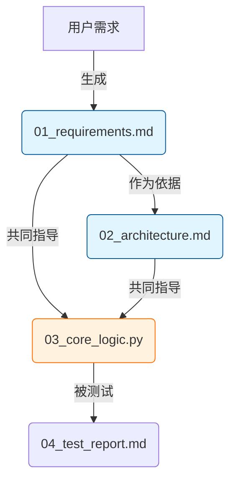
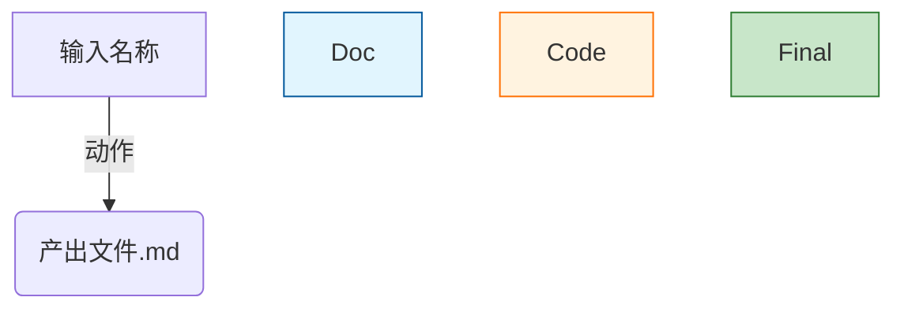
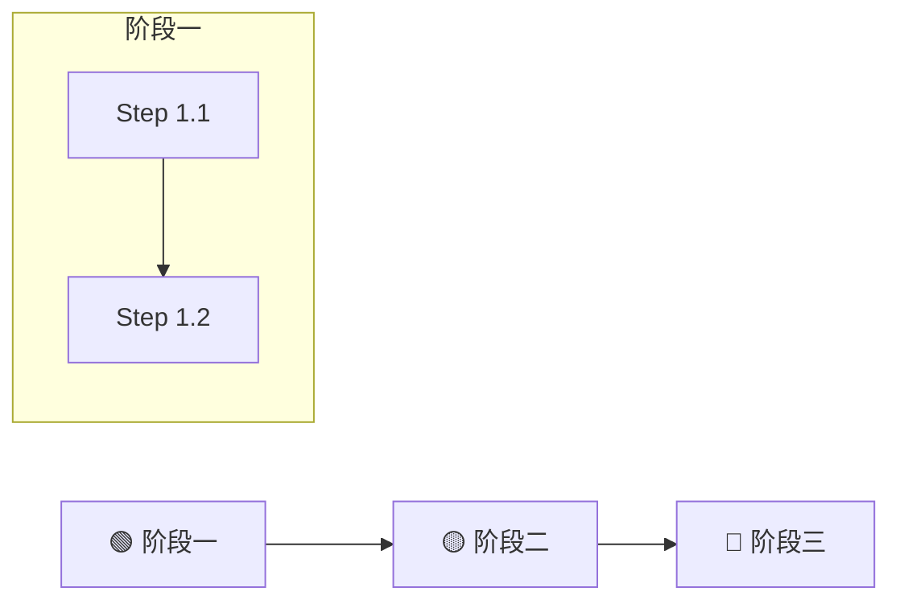

# 产物驱动型流程架构技能	

## 概述	

此技能专门用于项目计划制定、任务拆解和计划书编写。核心理念是构建"产物依赖链（Artifact Chain）"，确保AI在执行每一步时，都明确知道要读取之前的哪些文件作为上下文，实现"上一步的输出 = 下一步的输入"的严格约束。	

## 适用场景	

当用户提出以下类型的请求时，**必须**使用此技能：	
1. "帮我制定一个XX项目的计划"	
2. "请拆解这个任务"	
3. "编写一份项目计划书"	
4. "设计项目执行流程"	
5. "建立项目的产物依赖链"	
6. 任何涉及多步骤、多产物的复杂项目规划	

---

## 核心能力	

### Skill 1: I/O流设计	
精确定义每个任务的 Input（依赖文件）和 Output（交付产物）。	

### Skill 2: 上下文锚定	
在Prompt中显式引用具体文件名，防止AI产生幻觉。	

### Skill 3: 全链路闭环	
确保最终产物可以追溯到最初的输入，中间没有断链。	

### Skill 4: Mermaid数据流图	
绘制不仅展示步骤，更展示"产物如何流转"的图表。	

---

## 执行规则	

> [!IMPORTANT]
> **以下规则必须严格遵守**	

### 规则 1: 文件实体化	
所有的"输出"必须是具体的文件名（如 `01_requirements.md`），不能是抽象的"设计方案"。	

### 规则 2: 依赖显性化	
每个步骤必须列出它需要读取的**具体前序文件**。如果某步骤需要依据步骤1和步骤2的结果，必须在Input中明确列出。	

### 规则 3: 指令参数化	
在生成的AI指令中，使用 `{filename}` 占位符指代具体文件，强制后续AI读取。	

### 规则 4: 无中生有禁止	
除了第一步（通常依赖用户输入），后续步骤的Input必须来自于前序步骤的Output。	

---

## 执行工作流	

### 步骤 1：初始化	
确认项目目标与核心交付物。	

**需要确认的信息**：	
- 项目名称和目标	
- 最终要交付的核心产物	
- 已有的输入资料	
- 输出目录位置（默认：`output_LLM/计划书/`）	

### 步骤 2：目录规划	
建立标准化的文件命名系统。	

**命名规范**：	
- 使用数字前缀进行排序：`00_`, `01_`, `02_`...	
- 阶段划分：`00_context/`, `01_planning/`, `02_execution/`, `03_delivery/`	
- 文件名使用中文描述 + 版本号	

### 步骤 3：依赖推演	
采用倒推法：为了得到C，需要B；为了得到B，需要A。	

### 步骤 4：编写计划书	
按照下方模板生成包含I/O细节的Markdown文档。	

---

## 输出格式模板	

### 计划书完整模板	

```markdown
# ⛓️ 项目全链路执行手册：{Project_Name}

> **版本**: v1.0	
> **创建日期**: {日期}	
> **项目目标**: {目标描述}	

## 1. 产物目录结构 (File System)

*项目所有产出将严格按照以下结构归档：*

```text
project_root/
├── 00_context/          # 原始输入、背景资料
│   └── project_brief.md # 项目立项书
├── 01_planning/         # 规划阶段产物
│   ├── 01_requirements.md
│   └── 02_architecture.md
├── 02_execution/        # 执行阶段产物
│   ├── ...
└── 03_delivery/         # 最终交付
    └── final_report.md
```

## 2. 产物依赖流 (Artifact Flow)

> *箭头表示数据的流向：前一个文件的内容是生成后一个文件的必要条件。*



## 3. 分步执行链 (Execution Chain)

### 🟢 阶段一：定义与设计

*此阶段建立项目的"真理来源 (Source of Truth)"。*

- [ ] **Step 1.1: 需求固化**
    - 📥 **Input (依赖)**: 用户初始对话描述 / `00_context/project_brief.md`
    - 📤 **Output (产出)**: `01_planning/01_requirements.md`
    - 💡 **执行逻辑**: 将模糊需求转化为结构化文档。
    - > **🤖 AI指令**: 请读取用户的项目描述，生成 `01_planning/01_requirements.md`。该文档需包含：核心目标、用户画像、功能列表（MoSCoW法则）及非功能需求。

- [ ] **Step 1.2: 架构/方案设计**
    - 📥 **Input (依赖)**: `01_planning/01_requirements.md` (必须读取)
    - 📤 **Output (产出)**: `01_planning/02_architecture.md`
    - 💡 **执行逻辑**: **严禁脱离需求文档设计**。必须基于Step 1.1的约束。
    - > **🤖 AI指令**: 请**详细阅读** `01_planning/01_requirements.md`。基于其中的功能列表，设计系统架构/实施方案，并输出为 `01_planning/02_architecture.md`。包含：模块划分、关键流程图(Mermaid)、技术/策略选型理由。

### 🟡 阶段二：核心落地 (内容/代码生产)

- [ ] **Step 2.1: 核心模块开发/撰写**
    - 📥 **Input (依赖)**: 
        - `01_planning/01_requirements.md` (核对目标)
        - `01_planning/02_architecture.md` (遵循设计)
    - 📤 **Output (产出)**: `02_execution/core_module.md` (或代码文件)
    - > **🤖 AI指令**: 结合 `01_requirements.md` 的目标和 `02_architecture.md` 的设计规范，编写核心模块内容到 `02_execution/core_module.md`。**注意：结构必须与架构文档中的定义保持一致。**

- [ ] **Step 2.2: 关联模块开发**
    - 📥 **Input (依赖)**: `02_execution/core_module.md` (依赖核心模块的接口/内容)
    - 📤 **Output (产出)**: `02_execution/sub_module.md`
    - > **🤖 AI指令**: 读取 `core_module.md`，确保接口/逻辑兼容，编写...

### 🔴 阶段三：整合与交付

- [ ] **Step 3.1: 验证与测试**
    - 📥 **Input (依赖)**: 所有执行阶段产物
    - 📤 **Output (产出)**: `03_delivery/验证报告.md`
    - > **🤖 AI指令**: 检验所有产物的一致性和完整性...

- [ ] **Step 3.2: 最终交付**
    - 📥 **Input (依赖)**: 验证报告 + 所有核心产物
    - 📤 **Output (产出)**: `03_delivery/final_report.md`
    - > **🤖 AI指令**: 汇总所有成果，生成最终交付报告...

## 4. 版本记录

| 版本 | 日期 | 更新内容 |
|------|------|----------|
| v1.0 | {日期} | 初始版本 |
```

---

## Step格式组件	

每个Step必须包含以下组件：	

```markdown
- [ ] **Step X.X: {步骤名称}**
    - 📥 **Input (依赖)**: {具体文件路径列表}
    - 📤 **Output (产出)**: {具体文件路径}
    - 💡 **执行逻辑**: {简述为什么需要这一步}
    - > **🤖 AI指令**: {具体的执行指令，包含文件引用}
```

**图标含义**：	
- 📥 输入/依赖	
- 📤 输出/产出	
- 💡 执行逻辑说明	
- 🤖 AI执行指令	

---

## Mermaid图表规范	

### 产物依赖流图	



### 阶段进度图	



---

## 质量检查清单	

计划书完成后，执行以下检查：	

- [ ] **依赖完整性**: 每个非首步骤的Input都来自前序Output	
- [ ] **产物具体化**: 所有Output都是具体文件名	
- [ ] **指令可执行**: 每个🤖指令都包含具体文件引用	
- [ ] **流程连贯性**: Mermaid图展示了完整的产物流转	
- [ ] **目录合理性**: 文件命名有序，目录结构清晰	
- [ ] **版本管理**: 遵循版本命名规范（_vX.X）	

---

## 版本管理提醒	

> [!IMPORTANT]
> 计划书本身也需要遵循版本管理规则	

生成计划书时，文件命名应为：	
```
00_项目计划书_{项目名称}_v1.0.md
```

修改计划书时：	
1. 复制原文件为新版本	
2. 更新版本号	
3. 移动原文件到 `过期文件/`	

---

## 示例调用	

**用户输入**：	
```
请帮我制定一个"数据仓库建模"项目的计划
```

**预期行为**：	
1. 确认项目目标和最终交付物	
2. 确认已有的输入资料	
3. 使用本技能模板生成完整的产物驱动型计划书	
4. 输出到 `output_LLM/计划书/00_项目计划书_数据仓库建模_v1.0.md`	

---

## 注意事项	

> [!CAUTION]
> 严禁跳过依赖推演步骤，每个产物必须有明确的来源	

> [!TIP]
> 复杂项目可以先绘制Mermaid依赖图，再补充Step详情	

> [!WARNING]
> 如果发现某步骤缺少Input来源，需要回溯补充前序步骤	

