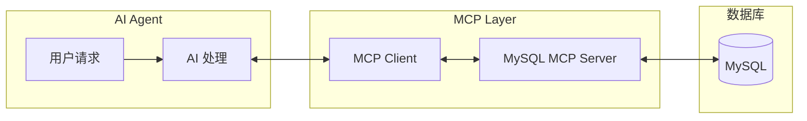

# MCP MySQL Server 使用指南

---
**文档版本**: v1.0  
**创建日期**: 2026-01-20  
---

## 一、项目概述

本项目是一个 MCP (Model Context Protocol) MySQL Server 演示，让 AI 能够通过 MCP 协议连接和查询 MySQL 数据库。

### 1.1 项目结构

```text
mcp_mysql_demo/
├── 00_context/                    # 原始输入、背景资料
│   └── project_brief.md           # 项目立项书
├── 02_src/                        # 源代码
│   ├── server.py                  # MCP Server 主文件
│   ├── config.py                  # 配置文件
│   └── requirements.txt           # Python 依赖包
├── 03_config/                     # 配置文件
│   └── mcp_settings.json          # MCP Client 配置示例
├── 04_docs/                       # 文档
│   └── usage_guide.md             # 使用指南（本文档）
└── 05_examples/                   # 调用示例
    ├── test_connection.py         # 连接测试脚本
    └── demo_queries.py            # 查询演示脚本
```

---

## 二、环境准备

### 2.1 系统要求

- Python 3.10 或更高版本
- 能够访问 MySQL 数据库服务器

### 2.2 安装依赖

```bash
cd output_LLM/mcp_mysql_demo/02_src
pip install -r requirements.txt
```

依赖包说明：

| 包名 | 版本 | 用途 |
|------|------|------|
| mcp | >=1.0.0 | MCP 核心库 |
| mysql-connector-python | >=8.0.0 | MySQL 数据库连接器 |
| python-dotenv | >=1.0.0 | 环境变量管理 |

---

## 三、配置方法

### 3.1 环境变量配置

可以通过以下两种方式配置数据库连接信息：

**方式一：创建 .env 文件**

在 `02_src` 目录下创建 `.env` 文件：

```env
MYSQL_HOST=172.17.1.141
MYSQL_PORT=3307
MYSQL_USER=test_ai
MYSQL_PASSWORD=EB1FF34BA2C33780
MYSQL_DATABASE=test_ai
```

**方式二：设置系统环境变量**

```bash
# Windows (PowerShell)
$env:MYSQL_HOST = "172.17.1.141"
$env:MYSQL_PORT = "3307"
$env:MYSQL_USER = "test_ai"
$env:MYSQL_PASSWORD = "EB1FF34BA2C33780"
$env:MYSQL_DATABASE = "test_ai"

# Linux/macOS
export MYSQL_HOST=172.17.1.141
export MYSQL_PORT=3307
export MYSQL_USER=test_ai
export MYSQL_PASSWORD=EB1FF34BA2C33780
export MYSQL_DATABASE=test_ai
```

### 3.2 MCP Client 配置

将 `03_config/mcp_settings.json` 的内容添加到 AI Agent 的配置文件中：

**Windows**：`%APPDATA%\Claude\claude_desktop_config.json`  
**macOS**：`~/Library/Application Support/Claude/claude_desktop_config.json`

```json
{
  "mcpServers": {
    "mysql": {
      "command": "python",
      "args": ["D:/path/to/server.py"],
      "env": {
        "MYSQL_HOST": "172.17.1.141",
        "MYSQL_PORT": "3307",
        "MYSQL_USER": "test_ai",
        "MYSQL_PASSWORD": "EB1FF34BA2C33780",
        "MYSQL_DATABASE": "test_ai"
      }
    }
  }
}
```

---

## 四、功能说明

### 4.1 Resources（资源）

| URI | 名称 | 说明 |
|-----|------|------|
| `mysql://tables` | 数据库表列表 | 获取数据库中所有表的列表 |
| `mysql://schema/{table_name}` | 表结构 | 获取指定表的结构信息 |

### 4.2 Tools（工具）

| 工具名 | 说明 | 参数 |
|--------|------|------|
| `query` | 执行 SQL 查询 | `sql`: SQL 语句, `limit`: 最大行数 |
| `execute` | 执行 SQL 修改 | `sql`: SQL 语句 |

### 4.3 安全限制

- `query` 工具只允许 SELECT 和 SHOW 语句
- `execute` 工具禁止 DROP、TRUNCATE、ALTER 操作
- 最大返回行数限制为 1000 条

---

## 五、测试验证

### 5.1 测试数据库连接

```bash
cd output_LLM/mcp_mysql_demo/02_src
python ../05_examples/test_connection.py
```

预期输出：
```
🚀 开始数据库连接测试...

==================================================
MySQL 连接测试
==================================================

连接信息：
  Host: 172.17.1.141
  Port: 3307
  Database: test_ai
  User: test_ai

正在连接...
✅ 连接成功！

MySQL 版本: 8.0.x
...
```

### 5.2 运行查询演示

```bash
cd output_LLM/mcp_mysql_demo/02_src
python ../05_examples/demo_queries.py
```

### 5.3 手动测试连接

```bash
python -c "import mysql.connector; conn = mysql.connector.connect(host='172.17.1.141', port=3307, user='test_ai', password='EB1FF34BA2C33780', database='test_ai'); print('连接成功'); conn.close()"
```

---

## 六、常见问题

### Q1: 连接超时或拒绝

**可能原因**：
- 网络不可达：确保能 ping 通 172.17.1.141
- 端口被防火墙阻止：检查 3307 端口是否开放
- 账号密码错误：核对连接信息

**解决方法**：
```bash
# 测试网络连通性
ping 172.17.1.141

# 测试端口连通性 (Windows)
Test-NetConnection -ComputerName 172.17.1.141 -Port 3307
```

### Q2: 模块导入错误

**可能原因**：依赖包未安装

**解决方法**：
```bash
pip install -r requirements.txt
```

### Q3: MCP Server 启动失败

**可能原因**：Python 路径或文件路径错误

**解决方法**：
- 确保 `mcp_settings.json` 中的 `args` 路径正确
- 使用绝对路径

---

## 七、架构说明



### 工作流程

1. **用户** 向 AI 发送自然语言请求
2. **AI** 理解意图，决定需要查询数据库
3. **MCP Client** 调用 MySQL MCP Server
4. **MCP Server** 执行 SQL 并返回结果
5. **AI** 将结果格式化后回复用户

---

## 版本记录

| 版本 | 日期 | 修改人 | 修改内容 |
|------|------|--------|----------|
| v1.0 | 2026-01-20 | AI Assistant | 初始创建 |
