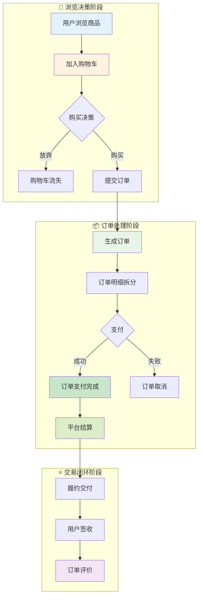

# 交易域业务流程梳理	

> **数据域**: 交易域 (trd)	
> **版本**: v1.0	
> **创建日期**: 2026-01-19	
> **目的**: 梳理交易域业务过程的内在逻辑和时序关系	

---

## 1. 交易域业务全景	

交易域是电商业务的**核心枢纽**，涵盖从用户产生购买意向到订单完成结算的**完整交易生命周期**。其核心是**"商品从货架到购物车到订单完成的全过程"**。	

---

## 2. 业务流程图	



---

## 3. 业务过程时序关系	

### 3.1 交易主流程	

<table>
    <thead>
        <tr>
            <th>阶段</th>
            <th>序号</th>
            <th>业务过程</th>
            <th>触发条件</th>
            <th>产出结果</th>
        </tr>
    </thead>
    <tbody>
        <tr>
            <td rowspan="2">一、浏览决策</td>
            <td>1</td>
            <td>购物车 (cart)</td>
            <td>用户点击"加入购物车"</td>
            <td>购物车商品记录</td>
        </tr>
        <tr>
            <td>2</td>
            <td>订单 (order)</td>
            <td>用户提交购物车结算</td>
            <td>订单主记录创建</td>
        </tr>
        <tr>
            <td rowspan="2">二、订单处理</td>
            <td>3</td>
            <td>订单明细 (order_detail)</td>
            <td>订单创建时自动生成</td>
            <td>订单行项目拆分</td>
        </tr>
        <tr>
            <td>4</td>
            <td>支付 (payment)</td>
            <td>用户完成付款操作</td>
            <td>支付凭证、订单状态更新</td>
        </tr>
        <tr>
            <td rowspan="2">三、交易闭环</td>
            <td>5</td>
            <td>结算 (settlement)</td>
            <td>订单完成后平台结算</td>
            <td>商家应收款项确认</td>
        </tr>
        <tr>
            <td>6</td>
            <td>订单评价 (order_review)</td>
            <td>用户签收后评价</td>
            <td>评价记录、评分</td>
        </tr>
    </tbody>
</table>

---

## 4. 交易主线解读	

### 4.1 正向交易流：用户 → 商家	

```
用户浏览 → 加入购物车 → 提交订单 → 订单明细拆分 → 支付 → 结算 → 签收 → 评价
```

**关键说明**：	
- **购物车**：是交易的起点，记录用户的购买意向，是转化分析的关键节点	
- **订单**：是交易的核心载体，承载所有交易信息	
- **订单明细**：一个订单可能包含多个SKU，每个SKU一条明细记录	
- **支付**：是订单生效的关键节点，支付成功才进入履约流程	
- **结算**：是商家收款的环节，通常有账期（T+N）	
- **订单评价**：是交易闭环的最后一环，影响店铺权重和转化率	

### 4.2 业务过程关系图	

```
        ┌──────────────────────────────────────────────────────┐
        │                    交易全流程                         │
        ├──────────────────────────────────────────────────────┤
        │                                                      │
        │   购物车 ─────→ 订单 ─────→ 订单明细                 │
        │      │           │            │                      │
        │      │           ↓            │                      │
        │      │         支付 ◄─────────┘                      │
        │      │           │                                   │
        │      │           ↓                                   │
        │      │         结算                                  │
        │      │           │                                   │
        │      │           ↓                                   │
        │      │       订单评价                                │
        │      │                                               │
        │      ↓                                               │
        │   购物车流失（未转化）                               │
        │                                                      │
        └──────────────────────────────────────────────────────┘
```

---

## 5. 业务过程顺序汇总表	

| 主线 | 顺序 | 业务过程 | 前置条件 | 后续影响 |	
|------|------|----------|----------|----------|	
| 交易 | 1️⃣ | 购物车 | 用户浏览商品 | 产生购买意向 |	
| 交易 | 2️⃣ | 订单 | 用户提交购物车 | 订单记录创建 |	
| 交易 | 2️⃣ | 订单明细 | 订单创建 | SKU级别拆分 |	
| 交易 | 3️⃣ | 支付 | 订单创建 | 订单生效、触发履约 |	
| 交易 | 4️⃣ | 结算 | 订单完成 | 商家收款 |	
| 交易 | 5️⃣ | 订单评价 | 用户签收 | 影响店铺权重 |	

---

## 6. 理解难点说明	

### 6.1 订单 vs 订单明细	
- **订单 (order)**：是交易的主记录，包含买家信息、收货地址、支付总金额等**订单头**信息	
- **订单明细 (order_detail)**：是订单的子记录，每个SKU一条记录，包含商品信息、数量、单价等**订单行**信息	
- 关系：一个订单可以有**多条**订单明细（1:N 关系）	

### 6.2 支付 vs 结算	
- **支付 (payment)**：是**买家 → 平台**的资金流动，发生在订单确认时	
- **结算 (settlement)**：是**平台 → 商家**的资金流动，发生在订单完成后，通常有账期	
- 时间差：支付是即时的，结算是延后的（如 T+14）	

### 6.3 订单评价的时机	
- 订单评价不是必须的业务过程，但对平台生态至关重要	
- 发生在用户签收之后，属于交易的**闭环环节**	
- 评价数据是运营分析和市场域的重要输入	

---

## 更新记录	

| 版本 | 日期 | 更新内容 |	
|------|------|----------|	
| v1.0 | 2026-01-19 | 初始版本，梳理交易域业务流程逻辑 |	
