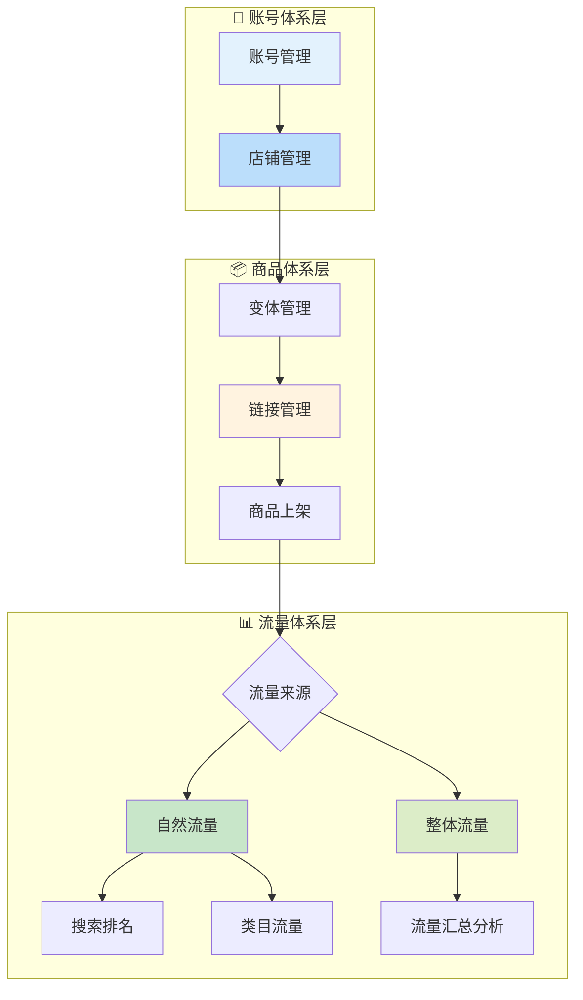

# 运营域业务流程梳理	

> **数据域**: 运营域 (op)	
> **版本**: v1.0	
> **创建日期**: 2026-01-19	
> **目的**: 梳理运营域业务过程的内在逻辑和时序关系	

---

## 1. 运营域业务全景	

运营域是电商平台的**运营管理中枢**，涵盖从账号体系到店铺管理、商品链接运营、流量获取的**平台运营全链路**。其核心是**"平台资产的管理与流量的获取"**。	

---

## 2. 业务流程图	



---

## 3. 业务过程时序关系	

### 3.1 运营主流程	

<table>
    <thead>
        <tr>
            <th>阶段</th>
            <th>序号</th>
            <th>业务过程</th>
            <th>触发条件</th>
            <th>产出结果</th>
        </tr>
    </thead>
    <tbody>
        <tr>
            <td rowspan="2">一、账号店铺</td>
            <td>1</td>
            <td>账号管理 (account)</td>
            <td>企业注册/账号创建</td>
            <td>账号权限、资质认证</td>
        </tr>
        <tr>
            <td>2</td>
            <td>店铺管理 (store)</td>
            <td>账号创建后开店</td>
            <td>店铺配置、类目设置</td>
        </tr>
        <tr>
            <td rowspan="2">二、商品管理</td>
            <td>3</td>
            <td>变体管理 (variant)</td>
            <td>商品创建时</td>
            <td>SKU变体关系建立</td>
        </tr>
        <tr>
            <td>4</td>
            <td>链接管理 (listing)</td>
            <td>变体配置完成</td>
            <td>商品链接发布上架</td>
        </tr>
        <tr>
            <td rowspan="2">三、流量获取</td>
            <td>5</td>
            <td>自然流量 (organic_traffic)</td>
            <td>商品上架后</td>
            <td>搜索曝光、类目曝光</td>
        </tr>
        <tr>
            <td>6</td>
            <td>整体流量 (total_traffic)</td>
            <td>持续运营</td>
            <td>流量汇总、来源分析</td>
        </tr>
    </tbody>
</table>

---

## 4. 运营主线解读	

### 4.1 纵向管理线：账号 → 商品 → 流量	

```
账号管理 → 店铺管理 → 变体管理 → 链接管理 → 自然流量/整体流量
    │          │          │           │              │
    ↓          ↓          ↓           ↓              ↓
  主体资质   店铺配置   SKU关系   商品展示        曝光转化
```

**关键说明**：	
- **账号管理**：是运营的基础，管理卖家账号、权限、资质	
- **店铺管理**：是账号下的经营实体，管理店铺信息、类目、评分	
- **变体管理**：管理同一父体下不同SKU的颜色、尺寸等变体关系	
- **链接管理**：管理商品Listing的标题、图片、五点描述、A+页面等	
- **自然流量**：无需付费的流量，来自搜索排名、类目浏览	
- **整体流量**：所有流量来源的汇总，包括自然流量和付费流量	

### 4.2 层级关系图	

```
                    ┌─────────────────────┐
                    │      账号管理        │
                    │  (Account Level)     │
                    └──────────┬──────────┘
                               │
                    ┌──────────▼──────────┐
                    │      店铺管理        │
                    │   (Store Level)      │
                    └──────────┬──────────┘
                               │
              ┌────────────────┼────────────────┐
              │                │                │
    ┌─────────▼─────────┐     │    ┌───────────▼───────────┐
    │    变体管理        │     │    │      链接管理          │
    │  (Variant)         │◄────┘    │    (Listing)           │
    └───────────────────┘          └───────────┬───────────┘
                                               │
                               ┌───────────────┼───────────────┐
                               │                               │
                    ┌──────────▼──────────┐       ┌────────────▼────────────┐
                    │     自然流量         │       │       整体流量          │
                    │  (Organic Traffic)   │       │   (Total Traffic)       │
                    └─────────────────────┘       └─────────────────────────┘
```

---

## 5. 业务过程顺序汇总表	

| 主线 | 顺序 | 业务过程 | 前置条件 | 后续影响 |	
|------|------|----------|----------|----------|	
| 运营 | 1️⃣ | 账号管理 | 企业注册 | 获得卖家资质 |	
| 运营 | 2️⃣ | 店铺管理 | 账号创建 | 店铺可运营 |	
| 运营 | 3️⃣ | 变体管理 | 商品创建 | SKU结构确定 |	
| 运营 | 4️⃣ | 链接管理 | 变体配置 | 商品可展示 |	
| 运营 | 5️⃣ | 自然流量 | 商品上架 | 免费曝光 |	
| 运营 | 5️⃣ | 整体流量 | 持续运营 | 流量分析 |	

---

## 6. 理解难点说明	

### 6.1 账号 vs 店铺	
- **账号 (account)**：是卖家的主体身份，一个公司可以有多个账号	
- **店铺 (store)**：是账号下的经营单元，一个账号可以在多个站点开店	
- 关系：账号 : 店铺 = 1 : N	

### 6.2 变体 vs 链接	
- **变体 (variant)**：是同一商品的不同规格，如颜色、尺寸	
- **链接 (listing)**：是商品的展示页面，一个链接可以包含多个变体	
- 关系：链接 : 变体 = 1 : N，同时变体也有父子关系	

### 6.3 自然流量 vs 整体流量	
- **自然流量**：仅统计无需付费的流量，如搜索、类目浏览	
- **整体流量**：是所有流量来源的汇总，包括：	
  - 自然流量（搜索、类目）	
  - 付费流量（广告、促销）	
  - 站外流量（社媒、Deal站）	
- 整体流量 ⊇ 自然流量	

### 6.4 与其他域的关联	
- **与交易域**：流量最终目标是转化为订单（运营 → 交易）	
- **与广告域**：付费流量来自广告投放（广告 → 运营.整体流量）	
- **与促销域**：促销活动会带来额外流量（促销 → 运营.整体流量）	

---

## 更新记录	

| 版本 | 日期 | 更新内容 |	
|------|------|----------|	
| v1.0 | 2026-01-19 | 初始版本，梳理运营域业务流程逻辑 |	
