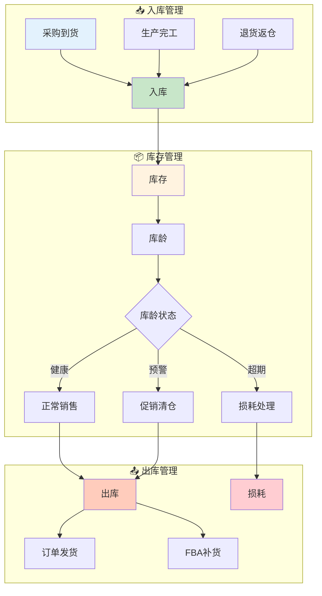

# 库存域业务流程梳理	

> **数据域**: 库存域 (inv)	
> **版本**: v1.0	
> **创建日期**: 2026-01-19	
> **目的**: 梳理库存域业务过程的内在逻辑和时序关系	

---

## 1. 库存域业务全景	

库存域是供应链的**核心资产管理中枢**，涵盖从货物入仓到出仓、库存监控、库龄管理到损耗处理的**库存全生命周期管理**。其核心是**"货物的存储状态和流动轨迹"**。	

---

## 2. 业务流程图	



---

## 3. 业务过程时序关系	

### 3.1 库存主流程	

<table>
    <thead>
        <tr>
            <th>阶段</th>
            <th>序号</th>
            <th>业务过程</th>
            <th>触发条件</th>
            <th>产出结果</th>
        </tr>
    </thead>
    <tbody>
        <tr>
            <td>一、入库</td>
            <td>1</td>
            <td>入库 (inbound)</td>
            <td>采购到货/生产完工/退货返仓</td>
            <td>库存数量增加</td>
        </tr>
        <tr>
            <td rowspan="2">二、库存监控</td>
            <td>2</td>
            <td>库存 (inventory)</td>
            <td>入库完成后持续</td>
            <td>实时库存状态</td>
        </tr>
        <tr>
            <td>3</td>
            <td>库龄 (inventory_age)</td>
            <td>库存存放期间</td>
            <td>库龄分布、预警</td>
        </tr>
        <tr>
            <td rowspan="2">三、出库</td>
            <td>4</td>
            <td>出库 (outbound)</td>
            <td>订单发货/FBA补货</td>
            <td>库存数量减少</td>
        </tr>
        <tr>
            <td>5</td>
            <td>损耗 (loss)</td>
            <td>库龄超期/破损/丢失</td>
            <td>库存核销记录</td>
        </tr>
    </tbody>
</table>

---

## 4. 库存主线解读	

### 4.1 库存生命周期：入库 → 存储 → 出库/损耗	

```
采购到货 ─┐
生产完工 ─┼─→ 入库 → 库存 → 库龄监控 ─┬─→ 出库 → 订单发货/FBA补货
退货返仓 ─┘                          │
                                     └─→ 损耗 → 核销处理
```

**关键说明**：	
- **入库**：是库存增加的唯一入口，来源包括采购、生产、退货	
- **库存**：是库存状态的实时快照，反映可用库存数量	
- **库龄**：是库存健康度的核心指标，直接影响周转效率	
- **出库**：是库存减少的主要方式，对应销售和调拨	
- **损耗**：是库存的非正常减少，需要财务核销	

### 4.2 库存流转关系图	

```
        ┌─────────────────────────────────────────────────────┐
        │                   库存生命周期                       │
        ├─────────────────────────────────────────────────────┤
        │                                                     │
        │   ┌─────────┐                                       │
        │   │  入 库   │ ─────────────┐                       │
        │   └─────────┘               │                       │
        │                             ↓                       │
        │                      ┌─────────────┐                │
        │                      │   库 存     │                │
        │                      │  (Stock)    │                │
        │                      └──────┬──────┘                │
        │                             │                       │
        │                      ┌──────▼──────┐                │
        │                      │   库 龄     │                │
        │                      │   监控      │                │
        │                      └──────┬──────┘                │
        │                             │                       │
        │               ┌─────────────┼─────────────┐         │
        │               │                           │         │
        │        ┌──────▼──────┐             ┌──────▼──────┐  │
        │        │   出 库     │             │   损 耗     │  │
        │        │  (正常)     │             │  (异常)     │  │
        │        └─────────────┘             └─────────────┘  │
        │                                                     │
        └─────────────────────────────────────────────────────┘
```

---

## 5. 业务过程顺序汇总表	

| 主线 | 顺序 | 业务过程 | 前置条件 | 后续影响 |	
|------|------|----------|----------|----------|	
| 库存 | 1️⃣ | 入库 | 采购/生产/退货 | 库存增加 |	
| 库存 | 2️⃣ | 库存 | 入库完成 | 可销售数量 |	
| 库存 | 3️⃣ | 库龄 | 持续存储 | 健康度监控 |	
| 库存 | 4️⃣ | 出库 | 订单/调拨 | 库存减少 |	
| 库存 | 4️⃣ | 损耗 | 超期/破损 | 库存核销 |	

---

## 6. 理解难点说明	

### 6.1 入库的多种来源	
- **采购入库**：外部采购的商品到货入仓	
- **生产入库**：自有工厂生产完工的成品入仓	
- **退货入库**：买家退回的商品经检验后返仓	
- 三者都会增加库存，但来源不同，需要分别统计	

### 6.2 库存 vs 库龄	
- **库存 (inventory)**：关注"有多少"，是数量维度	
- **库龄 (inventory_age)**：关注"放了多久"，是时间维度	
- 关系：库存是静态快照，库龄是动态累计	

### 6.3 出库 vs 损耗	
- **出库**：正常的库存减少，对应销售或调拨	
- **损耗**：非正常的库存减少，包括：	
  - 库龄超期报废	
  - 运输破损	
  - 盘点差异（丢失）	
- 出库产生收入，损耗产生成本	

### 6.4 与履约域的关联	
- **出库 → 发货配送**：出库是履约的起点	
- **退货返仓 → 入库**：逆向物流最终回到库存	
- 库存域与履约域是**紧密耦合**的关系	

---

## 更新记录	

| 版本 | 日期 | 更新内容 |	
|------|------|----------|	
| v1.0 | 2026-01-19 | 初始版本，梳理库存域业务流程逻辑 |	
