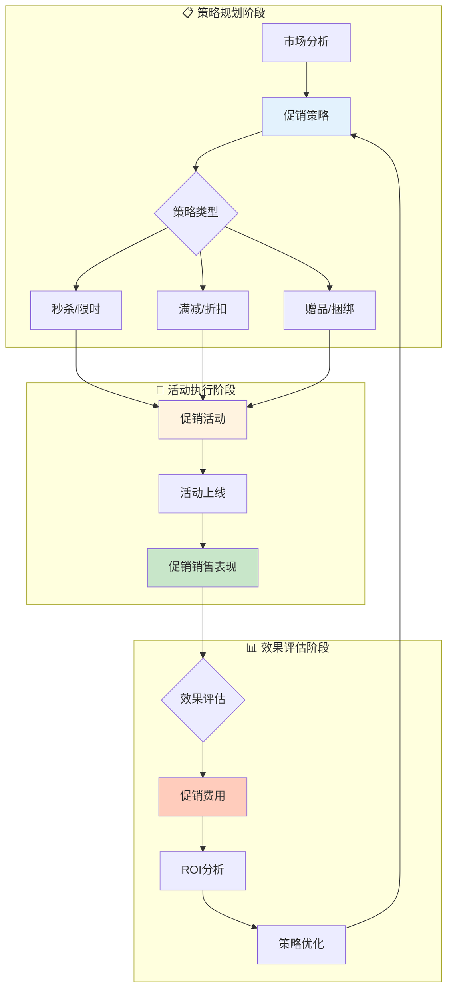

# 促销域业务流程梳理	

> **数据域**: 促销域 (prm)	
> **版本**: v1.0	
> **创建日期**: 2026-01-19	
> **目的**: 梳理促销域业务过程的内在逻辑和时序关系	

---

## 1. 促销域业务全景	

促销域是电商的**营销活动管理中枢**，涵盖从促销策略制定、活动创建、销售表现监控到费用结算的**促销全链路管理**。其核心是**"通过优惠活动促进销售转化"**。	

---

## 2. 业务流程图	



---

## 3. 业务过程时序关系	

### 3.1 促销主流程	

<table>
    <thead>
        <tr>
            <th>阶段</th>
            <th>序号</th>
            <th>业务过程</th>
            <th>触发条件</th>
            <th>产出结果</th>
        </tr>
    </thead>
    <tbody>
        <tr>
            <td>一、策略规划</td>
            <td>1</td>
            <td>促销策略 (promo_strategy)</td>
            <td>营销目标驱动</td>
            <td>促销方案确定</td>
        </tr>
        <tr>
            <td rowspan="2">二、活动执行</td>
            <td>2</td>
            <td>促销活动 (promo_campaign)</td>
            <td>策略落地执行</td>
            <td>活动创建上线</td>
        </tr>
        <tr>
            <td>3</td>
            <td>促销销售表现 (promo_performance)</td>
            <td>活动进行中</td>
            <td>销售数据统计</td>
        </tr>
        <tr>
            <td>三、效果评估</td>
            <td>4</td>
            <td>促销费用 (promo_cost)</td>
            <td>活动结束后</td>
            <td>费用结算、ROI</td>
        </tr>
    </tbody>
</table>

---

## 4. 促销主线解读	

### 4.1 促销闭环：策略 → 活动 → 表现 → 费用 → 策略优化	

```
促销策略 → 促销活动 → 促销销售表现 → 促销费用 → ROI分析 → 策略优化
    ↑                                                        │
    └────────────────────── 反馈循环 ─────────────────────────┘
```

**关键说明**：	
- **促销策略**：是促销的顶层设计，决定促销目标、方式和预算	
- **促销活动**：是策略的具体执行，包括活动配置、商品选择、价格设置	
- **促销销售表现**：是活动效果的实时监控，包括曝光、点击、转化	
- **促销费用**：是促销成本的结算，包括折扣让利、平台服务费	

### 4.2 促销类型矩阵	

```
        ┌───────────────────────────────────────────────────┐
        │                  促销类型矩阵                      │
        ├───────────────────────────────────────────────────┤
        │                                                   │
        │   ┌─────────────┐  ┌─────────────┐  ┌───────────┐│
        │   │ 秒杀/限时   │  │ 满减/折扣   │  │ 赠品/捆绑 ││
        │   │ Lightning   │  │ Coupon      │  │ Bundle    ││
        │   │ Deal        │  │ Discount    │  │ BOGO      ││
        │   └─────────────┘  └─────────────┘  └───────────┘│
        │         │                │                │       │
        │         └────────────────┼────────────────┘       │
        │                          ↓                        │
        │                   促销活动创建                     │
        │                          │                        │
        │                          ↓                        │
        │                   销售表现监控                     │
        │                          │                        │
        │                          ↓                        │
        │                    费用结算                        │
        │                                                   │
        └───────────────────────────────────────────────────┘
```

---

## 5. 业务过程顺序汇总表	

| 主线 | 顺序 | 业务过程 | 前置条件 | 后续影响 |	
|------|------|----------|----------|----------|	
| 促销 | 1️⃣ | 促销策略 | 营销目标 | 活动方案 |	
| 促销 | 2️⃣ | 促销活动 | 策略确定 | 活动执行 |	
| 促销 | 3️⃣ | 促销销售表现 | 活动进行 | 效果数据 |	
| 促销 | 4️⃣ | 促销费用 | 活动结束 | 成本结算 |	

---

## 6. 理解难点说明	

### 6.1 促销策略 vs 促销活动	
- **促销策略 (strategy)**：是"为什么做"和"怎么做"的规划	
- **促销活动 (campaign)**：是策略的具体实例化执行	
- 关系：策略 : 活动 = 1 : N，一个策略可以创建多个活动	

### 6.2 促销销售表现的维度	
促销销售表现需要从多个维度评估：	
- **曝光量**：活动页面被查看次数	
- **点击率**：曝光到点击的转化	
- **转化率**：点击到下单的转化	
- **销售额**：活动带来的总销售	
- **客单价**：活动期间的平均订单金额	

### 6.3 促销费用的构成	
- **折扣让利**：直接价格折扣的成本	
- **平台服务费**：参加平台活动的固定费用	
- **秒杀坑位费**：Lightning Deal等需要竞拍坑位	
- **赠品成本**：BOGO等赠品活动的额外成本	

### 6.4 与其他域的关联	
- **与交易域**：促销最终目标是产生订单（促销 → 交易）	
- **与运营域**：促销带来流量（促销 → 运营.整体流量）	
- **与广告域**：促销和广告常配合使用（广告引流 + 促销转化）	

---

## 更新记录	

| 版本 | 日期 | 更新内容 |	
|------|------|----------|	
| v1.0 | 2026-01-19 | 初始版本，梳理促销域业务流程逻辑 |	
