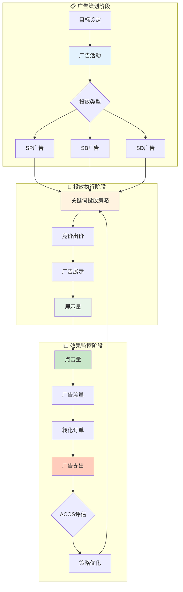

# 广告域业务流程梳理	

> **数据域**: 广告域 (ads)	
> **版本**: v1.0	
> **创建日期**: 2026-01-19	
> **目的**: 梳理广告域业务过程的内在逻辑和时序关系	

---

## 1. 广告域业务全景	

广告域是电商的**付费流量获取中枢**，涵盖从广告活动策划、关键词投放、效果监控到费用优化的**广告投放全链路管理**。其核心是**"通过付费推广获取精准流量"**。	

---

## 2. 业务流程图	



---

## 3. 业务过程时序关系	

### 3.1 广告主流程	

<table>
    <thead>
        <tr>
            <th>阶段</th>
            <th>序号</th>
            <th>业务过程</th>
            <th>触发条件</th>
            <th>产出结果</th>
        </tr>
    </thead>
    <tbody>
        <tr>
            <td rowspan="2">一、广告策划</td>
            <td>1</td>
            <td>广告活动 (ad_campaign)</td>
            <td>营销目标驱动</td>
            <td>广告组创建</td>
        </tr>
        <tr>
            <td>2</td>
            <td>关键词投放策略 (keyword_strategy)</td>
            <td>广告组设置</td>
            <td>关键词列表、匹配方式</td>
        </tr>
        <tr>
            <td rowspan="2">二、效果监控</td>
            <td>3</td>
            <td>展示量 (impressions)</td>
            <td>广告投放中</td>
            <td>曝光数据</td>
        </tr>
        <tr>
            <td>4</td>
            <td>点击量 (clicks)</td>
            <td>用户点击广告</td>
            <td>点击数据、CTR</td>
        </tr>
        <tr>
            <td rowspan="2">三、成本核算</td>
            <td>5</td>
            <td>广告支出 (ad_spend)</td>
            <td>点击产生费用</td>
            <td>广告成本</td>
        </tr>
        <tr>
            <td>6</td>
            <td>广告流量 (ad_traffic)</td>
            <td>持续投放</td>
            <td>流量汇总、归因</td>
        </tr>
    </tbody>
</table>

---

## 4. 广告主线解读	

### 4.1 广告漏斗：活动 → 展示 → 点击 → 转化	

```
广告活动 → 关键词策略 → 展示量 → 点击量 → 广告流量 → 转化订单
                                    │
                                    ↓
                              广告支出 → ACOS分析 → 策略优化
                                                        │
                                    ←─────────────────←┘
```

**关键说明**：	
- **广告活动**：是广告的顶层容器，管理预算、投放时间、目标	
- **关键词投放策略**：是广告的核心，决定广告何时展示	
- **展示量**：是广告被展示的次数，是漏斗顶端	
- **点击量**：是用户点击广告的次数，产生费用	
- **广告支出**：是广告的成本，按CPC计费	
- **广告流量**：是广告带来的流量汇总，需要归因分析	

### 4.2 广告类型对比	

```
        ┌─────────────────────────────────────────────────────┐
        │                 亚马逊广告类型                       │
        ├─────────────────────────────────────────────────────┤
        │                                                     │
        │   ┌───────────────┐                                 │
        │   │ SP (Sponsored │  搜索结果页展示                 │
        │   │   Products)   │  按关键词竞价                   │
        │   └───────────────┘                                 │
        │                                                     │
        │   ┌───────────────┐                                 │
        │   │ SB (Sponsored │  搜索顶部横幅                   │
        │   │   Brands)     │  品牌展示+多商品                │
        │   └───────────────┘                                 │
        │                                                     │
        │   ┌───────────────┐                                 │
        │   │ SD (Sponsored │  站内外展示                     │
        │   │   Display)    │  再营销/受众定向                │
        │   └───────────────┘                                 │
        │                                                     │
        └─────────────────────────────────────────────────────┘
```

---

## 5. 业务过程顺序汇总表	

| 主线 | 顺序 | 业务过程 | 前置条件 | 后续影响 |	
|------|------|----------|----------|----------|	
| 广告 | 1️⃣ | 广告活动 | 营销目标 | 广告组创建 |	
| 广告 | 2️⃣ | 关键词投放策略 | 广告组设置 | 投放规则 |	
| 广告 | 3️⃣ | 展示量 | 广告投放 | 曝光数据 |	
| 广告 | 4️⃣ | 点击量 | 用户点击 | CTR、费用 |	
| 广告 | 5️⃣ | 广告支出 | 点击产生 | 成本核算 |	
| 广告 | 5️⃣ | 广告流量 | 持续投放 | 流量归因 |	

---

## 6. 理解难点说明	

### 6.1 关键词匹配方式	
- **精准匹配 (Exact)**：搜索词完全一致才展示	
- **词组匹配 (Phrase)**：包含该词组即展示	
- **广泛匹配 (Broad)**：语义相关即展示	
- 精准度：Exact > Phrase > Broad	
- 流量：Broad > Phrase > Exact	

### 6.2 广告核心指标	
- **Impressions**：展示量，广告被展示次数	
- **Clicks**：点击量，广告被点击次数	
- **CTR**：点击率 = Clicks / Impressions	
- **Spend**：广告支出，按CPC计费	
- **ACOS**：广告销售成本比 = Spend / Sales	
- **ROAS**：广告投资回报 = Sales / Spend = 1/ACOS	

### 6.3 广告支出 vs 广告流量	
- **广告支出**：关注"花了多少钱"，是成本维度	
- **广告流量**：关注"带来多少流量"，是效果维度	
- 两者结合计算 CPC = Spend / Clicks	

### 6.4 与其他域的关联	
- **与交易域**：广告最终目标是产生订单（广告 → 交易）	
- **与运营域**：广告流量汇入整体流量（广告 → 运营.整体流量）	
- **与促销域**：广告+促销组合提升转化（广告引流 + 促销转化）	

---

## 更新记录	

| 版本 | 日期 | 更新内容 |	
|------|------|----------|	
| v1.0 | 2026-01-19 | 初始版本，梳理广告域业务流程逻辑 |	
