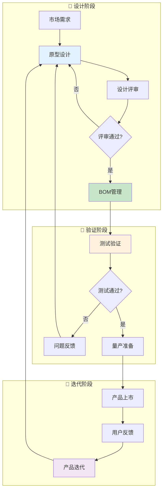

# 研发域业务流程梳理	

> **数据域**: 研发域 (rd)	
> **版本**: v1.0	
> **创建日期**: 2026-01-19	
> **目的**: 梳理研发域业务过程的内在逻辑和时序关系	

---

## 1. 研发域业务全景	

研发域是产品的**创新与迭代中枢**，涵盖从原型设计、测试验证到产品迭代、BOM管理的**产品全生命周期研发**。其核心是**"将创意转化为可销售产品"**。	

---

## 2. 业务流程图	



---

## 3. 业务过程时序关系	

### 3.1 研发主流程	

<table>
    <thead>
        <tr>
            <th>阶段</th>
            <th>序号</th>
            <th>业务过程</th>
            <th>触发条件</th>
            <th>产出结果</th>
        </tr>
    </thead>
    <tbody>
        <tr>
            <td rowspan="2">一、设计验证</td>
            <td>1</td>
            <td>原型设计 (prototype)</td>
            <td>市场需求驱动</td>
            <td>产品原型、设计图</td>
        </tr>
        <tr>
            <td>2</td>
            <td>测试验证 (test)</td>
            <td>原型完成后</td>
            <td>测试报告、问题清单</td>
        </tr>
        <tr>
            <td rowspan="2">二、生产准备</td>
            <td>3</td>
            <td>产品迭代 (iteration)</td>
            <td>测试反馈/用户反馈</td>
            <td>迭代版本、改进方案</td>
        </tr>
        <tr>
            <td>4</td>
            <td>BOM管理 (bom)</td>
            <td>设计定稿</td>
            <td>物料清单、成本估算</td>
        </tr>
    </tbody>
</table>

---

## 4. 研发主线解读	

### 4.1 研发闭环：设计 → 验证 → 量产 → 迭代	

```
原型设计 → 测试验证 → BOM管理 → 量产
    ↑                           │
    │                           ↓
    └──── 产品迭代 ◄──── 用户反馈
```

**关键说明**：	
- **原型设计**：是研发的起点，将创意转化为可视化原型	
- **测试验证**：是质量关卡，确保产品符合标准	
- **产品迭代**：是持续改进的过程，基于反馈优化	
- **BOM管理**：是生产的桥梁，输出物料需求	

---

## 5. 业务过程顺序汇总表	

| 主线 | 顺序 | 业务过程 | 前置条件 | 后续影响 |	
|------|------|----------|----------|----------|	
| 研发 | 1️⃣ | 原型设计 | 市场需求 | 设计方案 |	
| 研发 | 2️⃣ | 测试验证 | 原型完成 | 问题清单 |	
| 研发 | 3️⃣ | 产品迭代 | 反馈收集 | 改进版本 |	
| 研发 | 3️⃣ | BOM管理 | 设计定稿 | 物料清单 |	

---

## 6. 理解难点说明	

### 6.1 原型设计 vs 产品迭代	
- **原型设计**：从0到1，创建新产品	
- **产品迭代**：从1到N，改进现有产品	

### 6.2 BOM管理的重要性	
BOM (Bill of Materials) 是连接研发和生产的核心：	
- 定义产品由哪些物料组成	
- 确定物料数量和规格	
- 支撑采购计划和成本核算	

---

## 更新记录	

| 版本 | 日期 | 更新内容 |	
|------|------|----------|	
| v1.0 | 2026-01-19 | 初始版本，梳理研发域业务流程逻辑 |	
