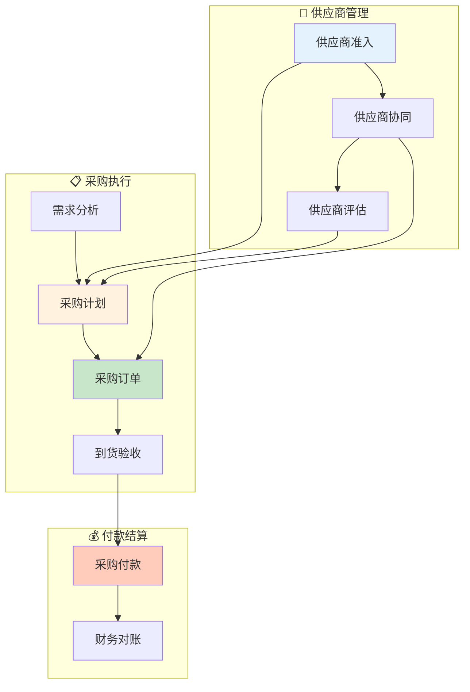

# 供采域业务流程梳理	

> **数据域**: 供采域 (sup)	
> **版本**: v1.0	
> **创建日期**: 2026-01-19	
> **目的**: 梳理供采域业务过程的内在逻辑和时序关系	

---

## 1. 供采域业务全景	

供采域是供应链的**采购与供应商管理中枢**，涵盖从采购计划、订单执行、付款结算到供应商管理的**供采全链路**。其核心是**"确保物料及时、保质、低成本供应"**。	

---

## 2. 业务流程图	



---

## 3. 业务过程时序关系	

### 3.1 供采主流程	

<table>
    <thead>
        <tr>
            <th>阶段</th>
            <th>序号</th>
            <th>业务过程</th>
            <th>触发条件</th>
            <th>产出结果</th>
        </tr>
    </thead>
    <tbody>
        <tr>
            <td rowspan="2">一、供应商管理</td>
            <td>1</td>
            <td>供应商准入 (supplier_onboard)</td>
            <td>新供应商开发</td>
            <td>合格供应商名录</td>
        </tr>
        <tr>
            <td>2</td>
            <td>供应商协同 (supplier_collab)</td>
            <td>日常业务往来</td>
            <td>协同效率、问题处理</td>
        </tr>
        <tr>
            <td rowspan="2">二、采购执行</td>
            <td>3</td>
            <td>采购计划 (purchase_plan)</td>
            <td>库存/生产需求</td>
            <td>采购需求清单</td>
        </tr>
        <tr>
            <td>4</td>
            <td>采购订单 (purchase_order)</td>
            <td>计划审批通过</td>
            <td>采购合同确认</td>
        </tr>
        <tr>
            <td>三、付款结算</td>
            <td>5</td>
            <td>采购付款 (purchase_payment)</td>
            <td>到货验收通过</td>
            <td>付款凭证</td>
        </tr>
    </tbody>
</table>

---

## 4. 供采主线解读	

### 4.1 采购主线：计划 → 订单 → 付款	

```
采购计划 → 采购订单 → 到货验收 → 采购付款
    ↑          ↑
    │          │
供应商准入 ─→ 供应商协同
```

**关键说明**：	
- **供应商准入**：是供采的前提，管理合格供应商	
- **供应商协同**：是日常运营，确保供应顺畅	
- **采购计划**：是采购的起点，基于需求预测	
- **采购订单**：是合同约定，确定数量价格交期	
- **采购付款**：是采购的闭环，完成资金结算	

---

## 5. 业务过程顺序汇总表	

| 主线 | 顺序 | 业务过程 | 前置条件 | 后续影响 |	
|------|------|----------|----------|----------|	
| 供采 | 0️⃣ | 供应商准入 | 开发需求 | 供应商库 |	
| 供采 | 0️⃣ | 供应商协同 | 日常运营 | 协同效率 |	
| 供采 | 1️⃣ | 采购计划 | 需求驱动 | 采购需求 |	
| 供采 | 2️⃣ | 采购订单 | 计划审批 | 合同确认 |	
| 供采 | 3️⃣ | 采购付款 | 验收通过 | 资金结算 |	

---

## 6. 理解难点说明	

### 6.1 供应商准入 vs 供应商协同	
- **供应商准入**：一次性事件，资质审核后入库	
- **供应商协同**：持续过程，日常沟通与协作	

### 6.2 与其他域的关联	
- **与库存域**：采购到货 → 入库	
- **与生产域**：采购满足生产物料需求	
- **与财务域**：采购付款 → 应付账款	

---

## 更新记录	

| 版本 | 日期 | 更新内容 |	
|------|------|----------|	
| v1.0 | 2026-01-19 | 初始版本，梳理供采域业务流程逻辑 |	
