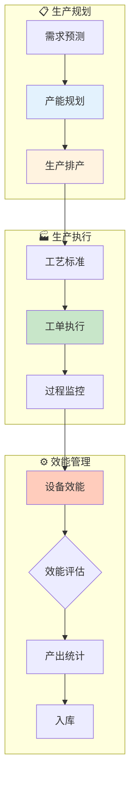

# 生产域业务流程梳理	

> **数据域**: 生产域 (mfg)	
> **版本**: v1.0	
> **创建日期**: 2026-01-19	
> **目的**: 梳理生产域业务过程的内在逻辑和时序关系	

---

## 1. 生产域业务全景	

生产域是制造的**生产执行中枢**，涵盖从产能规划、生产排产、工艺标准到工单执行、设备效能的**生产制造全过程**。其核心是**"将原材料转化为成品"**。	

---

## 2. 业务流程图	



---

## 3. 业务过程时序关系	

### 3.1 生产主流程	

<table>
    <thead>
        <tr>
            <th>阶段</th>
            <th>序号</th>
            <th>业务过程</th>
            <th>触发条件</th>
            <th>产出结果</th>
        </tr>
    </thead>
    <tbody>
        <tr>
            <td rowspan="2">一、生产规划</td>
            <td>1</td>
            <td>产能规划 (capacity)</td>
            <td>需求预测</td>
            <td>产能计划</td>
        </tr>
        <tr>
            <td>2</td>
            <td>生产排产 (scheduling)</td>
            <td>产能确定</td>
            <td>生产计划排程</td>
        </tr>
        <tr>
            <td rowspan="2">二、生产执行</td>
            <td>3</td>
            <td>工艺标准 (process)</td>
            <td>产品定义</td>
            <td>工艺路线</td>
        </tr>
        <tr>
            <td>4</td>
            <td>工单执行 (work_order)</td>
            <td>排产下达</td>
            <td>生产进度</td>
        </tr>
        <tr>
            <td>三、效能管理</td>
            <td>5</td>
            <td>设备效能 (oee)</td>
            <td>生产进行中</td>
            <td>OEE指标</td>
        </tr>
    </tbody>
</table>

---

## 4. 生产主线解读	

### 4.1 生产主线：规划 → 排产 → 执行 → 产出	

```
产能规划 → 生产排产 → 工艺标准 → 工单执行 → 设备效能 → 成品入库
                                              │
                                              ↓
                                          效能分析 → 改进优化
```

**关键说明**：	
- **产能规划**：确定能生产多少	
- **生产排产**：确定何时生产什么	
- **工艺标准**：确定如何生产	
- **工单执行**：执行生产任务	
- **设备效能**：监控生产效率	

---

## 5. 业务过程顺序汇总表	

| 主线 | 顺序 | 业务过程 | 前置条件 | 后续影响 |	
|------|------|----------|----------|----------|	
| 生产 | 1️⃣ | 产能规划 | 需求预测 | 产能上限 |	
| 生产 | 2️⃣ | 生产排产 | 产能规划 | 生产计划 |	
| 生产 | 2️⃣ | 工艺标准 | 产品研发 | 工艺路线 |	
| 生产 | 3️⃣ | 工单执行 | 排产下达 | 生产进度 |	
| 生产 | 4️⃣ | 设备效能 | 生产进行 | OEE指标 |	

---

## 6. 理解难点说明	

### 6.1 设备效能 (OEE)	
OEE = 可用率 × 性能率 × 良品率	
- **可用率**：设备运行时间 / 计划生产时间	
- **性能率**：实际产出 / 理论产出	
- **良品率**：良品数 / 总产出	

### 6.2 与其他域的关联	
- **与研发域**：BOM → 生产物料需求	
- **与供采域**：物料采购 → 生产	
- **与库存域**：生产完工 → 入库	
- **与品控域**：生产过程 → 质量检验	

---

## 更新记录	

| 版本 | 日期 | 更新内容 |	
|------|------|----------|	
| v1.0 | 2026-01-19 | 初始版本，梳理生产域业务流程逻辑 |	
