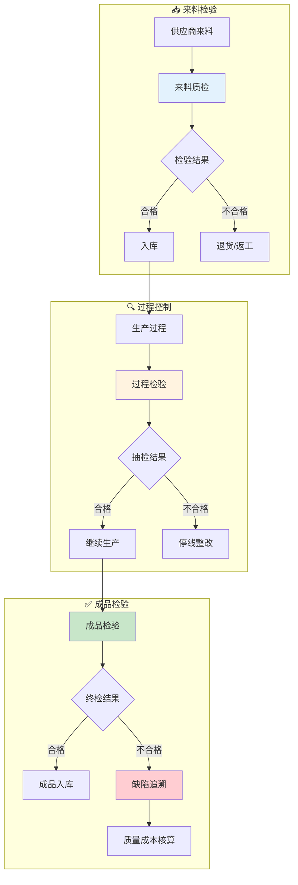

# 品控域业务流程梳理	

> **数据域**: 品控域 (qc)	
> **版本**: v1.0	
> **创建日期**: 2026-01-19	
> **目的**: 梳理品控域业务过程的内在逻辑和时序关系	

---

## 1. 品控域业务全景	

品控域是质量管理的**全链路质量保障中枢**，涵盖从来料质检、过程检验、成品检验到缺陷追溯、质量成本核算的**全链路质量管控**。其核心是**"确保产品质量合格"**。	

---

## 2. 业务流程图	



---

## 3. 业务过程时序关系	

### 3.1 品控主流程	

<table>
    <thead>
        <tr>
            <th>阶段</th>
            <th>序号</th>
            <th>业务过程</th>
            <th>触发条件</th>
            <th>产出结果</th>
        </tr>
    </thead>
    <tbody>
        <tr>
            <td>一、来料</td>
            <td>1</td>
            <td>来料质检 (iqc)</td>
            <td>供应商来料</td>
            <td>质检报告</td>
        </tr>
        <tr>
            <td>二、过程</td>
            <td>2</td>
            <td>过程检验 (ipqc)</td>
            <td>生产进行中</td>
            <td>过程质量数据</td>
        </tr>
        <tr>
            <td>三、成品</td>
            <td>3</td>
            <td>成品检验 (oqc)</td>
            <td>生产完工</td>
            <td>终检报告</td>
        </tr>
        <tr>
            <td rowspan="2">四、分析</td>
            <td>4</td>
            <td>缺陷追溯 (defect)</td>
            <td>发现质量问题</td>
            <td>问题根因</td>
        </tr>
        <tr>
            <td>5</td>
            <td>质量成本核算 (coq)</td>
            <td>质量问题处理</td>
            <td>质量成本</td>
        </tr>
    </tbody>
</table>

---

## 4. 品控主线解读	

### 4.1 品控三道关卡：IQC → IPQC → OQC	

```
来料质检(IQC) → 过程检验(IPQC) → 成品检验(OQC)
      │               │               │
      ↓               ↓               ↓
  来料把关        过程把关        出货把关
                                      │
                                      ↓
                     缺陷追溯 → 质量成本核算
```

**关键说明**：	
- **来料质检 (IQC)**：Incoming Quality Control，把守入口	
- **过程检验 (IPQC)**：In-Process QC，过程监控	
- **成品检验 (OQC)**：Outgoing QC，把守出口	
- **缺陷追溯**：查找问题根因	
- **质量成本核算**：量化质量损失	

---

## 5. 业务过程顺序汇总表	

| 主线 | 顺序 | 业务过程 | 前置条件 | 后续影响 |	
|------|------|----------|----------|----------|	
| 品控 | 1️⃣ | 来料质检 | 供应商来料 | 入库/退货 |	
| 品控 | 2️⃣ | 过程检验 | 生产进行 | 继续/停线 |	
| 品控 | 3️⃣ | 成品检验 | 生产完工 | 入库/返工 |	
| 品控 | 4️⃣ | 缺陷追溯 | 发现问题 | 根因分析 |	
| 品控 | 4️⃣ | 质量成本核算 | 问题处理 | 成本统计 |	

---

## 6. 理解难点说明	

### 6.1 质量成本构成 (COQ)	
- **预防成本**：培训、体系建设	
- **鉴定成本**：检验、测试设备	
- **内部失败成本**：返工、报废	
- **外部失败成本**：退货、索赔	

### 6.2 与其他域的关联	
- **与供采域**：来料质检影响供应商评估	
- **与生产域**：过程检验嵌入生产流程	
- **与履约域**：成品质量影响客户退货	

---

## 更新记录	

| 版本 | 日期 | 更新内容 |	
|------|------|----------|	
| v1.0 | 2026-01-19 | 初始版本，梳理品控域业务流程逻辑 |	
