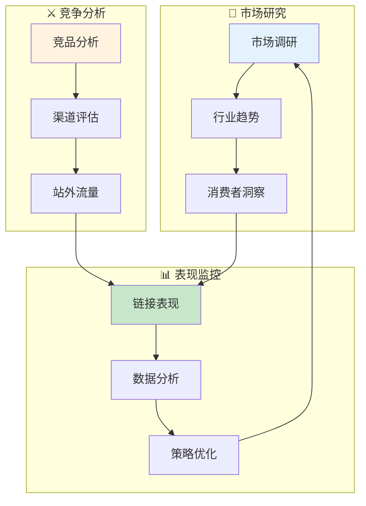

# 市场域业务流程梳理	

> **数据域**: 市场域 (mkt)	
> **版本**: v1.0	
> **创建日期**: 2026-01-19	
> **目的**: 梳理市场域业务过程的内在逻辑和时序关系	

---

## 1. 市场域业务全景	

市场域是商业决策的**市场洞察中枢**，涵盖市场调研、行业趋势、消费者洞察、链接表现、竞品分析、渠道评估、站外流量的**市场动态监测与竞争策略制定**。其核心是**"了解市场，指导决策"**。	

---

## 2. 业务流程图	



---

## 3. 业务过程时序关系	

### 3.1 市场主流程	

<table>
    <thead>
        <tr>
            <th>阶段</th>
            <th>序号</th>
            <th>业务过程</th>
            <th>触发条件</th>
            <th>产出结果</th>
        </tr>
    </thead>
    <tbody>
        <tr>
            <td rowspan="3">一、市场研究</td>
            <td>1</td>
            <td>市场调研 (research)</td>
            <td>新品/新市场</td>
            <td>调研报告</td>
        </tr>
        <tr>
            <td>2</td>
            <td>行业趋势 (trend)</td>
            <td>持续监测</td>
            <td>趋势分析</td>
        </tr>
        <tr>
            <td>3</td>
            <td>消费者洞察 (insight)</td>
            <td>用户研究</td>
            <td>用户画像</td>
        </tr>
        <tr>
            <td rowspan="3">二、竞争分析</td>
            <td>4</td>
            <td>竞品分析 (competitor)</td>
            <td>竞争监测</td>
            <td>竞品报告</td>
        </tr>
        <tr>
            <td>5</td>
            <td>渠道评估 (channel)</td>
            <td>渠道拓展</td>
            <td>渠道策略</td>
        </tr>
        <tr>
            <td>6</td>
            <td>站外流量 (external)</td>
            <td>流量拓展</td>
            <td>引流数据</td>
        </tr>
        <tr>
            <td>三、表现监控</td>
            <td>7</td>
            <td>链接表现 (listing_perf)</td>
            <td>持续监控</td>
            <td>表现指标</td>
        </tr>
    </tbody>
</table>

---

## 4. 市场主线解读	

### 4.1 市场洞察闭环	

```
市场调研 ─→ 行业趋势 ─→ 消费者洞察
              ↓
         竞品分析 ─→ 渠道评估 ─→ 站外流量
              ↓
         链接表现 ─→ 策略优化 ─→ 市场调研
```

---

## 5. 业务过程顺序汇总表	

| 主线 | 顺序 | 业务过程 | 前置条件 | 后续影响 |	
|------|------|----------|----------|----------|	
| 市场 | 1️⃣ | 市场调研 | 新品/新市场 | 市场判断 |	
| 市场 | 1️⃣ | 行业趋势 | 持续监测 | 趋势洞察 |	
| 市场 | 1️⃣ | 消费者洞察 | 用户研究 | 需求理解 |	
| 市场 | 2️⃣ | 竞品分析 | 竞争监测 | 策略调整 |	
| 市场 | 2️⃣ | 渠道评估 | 渠道拓展 | 渠道决策 |	
| 市场 | 2️⃣ | 站外流量 | 流量拓展 | 引流效果 |	
| 市场 | 3️⃣ | 链接表现 | 持续监控 | 运营优化 |	

---

## 6. 理解难点说明	

### 6.1 链接表现监控的维度	
- **曝光量**：商品被展示次数	
- **点击率**：曝光到点击的转化	
- **转化率**：点击到购买的转化	
- **排名变化**：关键词搜索排名	
- **Review/Rating**：评价数量和评分	

### 6.2 与其他域的关联	
- **与运营域**：链接表现 → 运营优化	
- **与广告域**：竞品分析 → 广告策略	
- **与研发域**：消费者洞察 → 产品设计	

---

## 更新记录	

| 版本 | 日期 | 更新内容 |	
|------|------|----------|	
| v1.0 | 2026-01-19 | 初始版本，梳理市场域业务流程逻辑 |	
