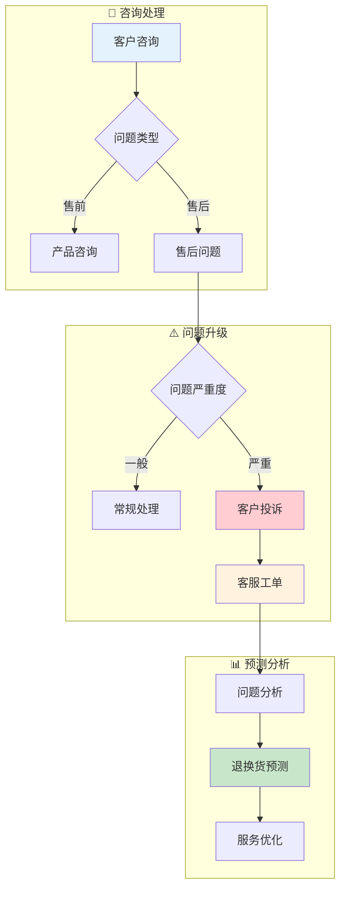

# 客服域业务流程梳理	

> **数据域**: 客服域 (cs)	
> **版本**: v1.0	
> **创建日期**: 2026-01-19	
> **目的**: 梳理客服域业务过程的内在逻辑和时序关系	

---

## 1. 客服域业务全景	

客服域是客户体验的**服务保障中枢**，涵盖客户咨询、客户投诉、客服工单、退换货预测的**客户服务与体验管理**。其核心是**"解决客户问题，提升满意度"**。	

---

## 2. 业务流程图	



---

## 3. 业务过程时序关系	

### 3.1 客服主流程	

<table>
    <thead>
        <tr>
            <th>阶段</th>
            <th>序号</th>
            <th>业务过程</th>
            <th>触发条件</th>
            <th>产出结果</th>
        </tr>
    </thead>
    <tbody>
        <tr>
            <td>一、咨询</td>
            <td>1</td>
            <td>客户咨询 (inquiry)</td>
            <td>客户发起</td>
            <td>咨询记录</td>
        </tr>
        <tr>
            <td rowspan="2">二、问题处理</td>
            <td>2</td>
            <td>客户投诉 (complaint)</td>
            <td>问题升级</td>
            <td>投诉记录</td>
        </tr>
        <tr>
            <td>3</td>
            <td>客服工单 (ticket)</td>
            <td>需跟进处理</td>
            <td>工单闭环</td>
        </tr>
        <tr>
            <td>三、分析预测</td>
            <td>4</td>
            <td>退换货预测 (return_pred)</td>
            <td>数据分析</td>
            <td>预测模型</td>
        </tr>
    </tbody>
</table>

---

## 4. 客服主线解读	

### 4.1 客服处理流程	

```
客户咨询 ─→ 问题分类 ─→ 常规处理 / 客户投诉
                              │
                              ↓
                         客服工单 ─→ 问题解决
                              │
                              ↓
                       退换货预测 ─→ 服务优化
```

---

## 5. 业务过程顺序汇总表	

| 主线 | 顺序 | 业务过程 | 前置条件 | 后续影响 |	
|------|------|----------|----------|----------|	
| 客服 | 1️⃣ | 客户咨询 | 客户发起 | 问题记录 |	
| 客服 | 2️⃣ | 客户投诉 | 问题升级 | 投诉处理 |	
| 客服 | 3️⃣ | 客服工单 | 需跟进 | 工单闭环 |	
| 客服 | 4️⃣ | 退换货预测 | 数据分析 | 预防措施 |	

---

## 6. 理解难点说明	

### 6.1 客户咨询 vs 客户投诉	
- **客户咨询**：中性，寻求帮助或信息	
- **客户投诉**：负面，表达不满	

### 6.2 退换货预测的价值	
- 提前识别高退货风险产品	
- 优化供应链备货	
- 改进产品质量	

### 6.3 与其他域的关联	
- **与交易域**：咨询促进转化	
- **与履约域**：投诉触发退换货	
- **与品控域**：问题反馈改进质量	

---

## 更新记录	

| 版本 | 日期 | 更新内容 |	
|------|------|----------|	
| v1.0 | 2026-01-19 | 初始版本，梳理客服域业务流程逻辑 |	
