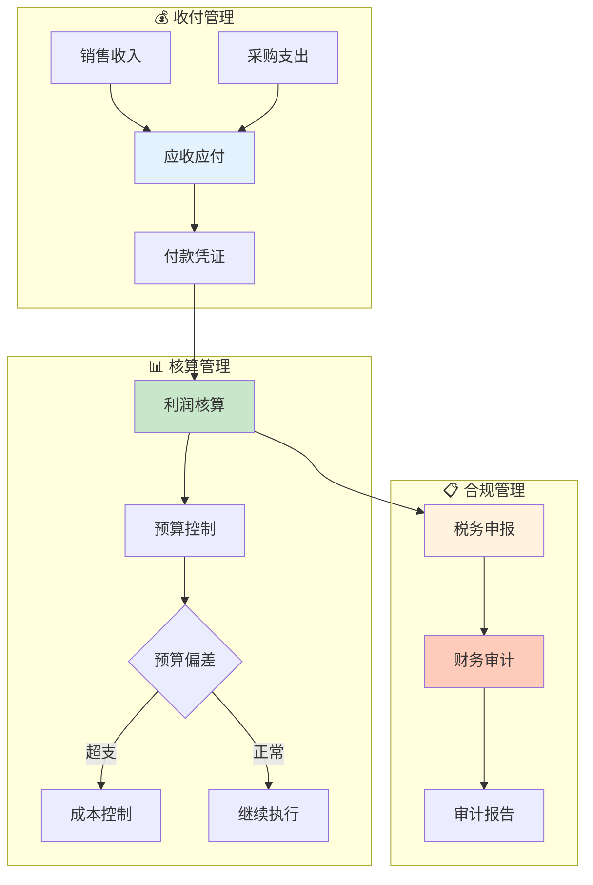

# 财务域业务流程梳理	

> **数据域**: 财务域 (fin)	
> **版本**: v1.0	
> **创建日期**: 2026-01-19	
> **目的**: 梳理财务域业务过程的内在逻辑和时序关系	

---

## 1. 财务域业务全景	

财务域是企业的**财务管理中枢**，涵盖应收应付、付款凭证、税务申报、财务审计、利润核算、预算控制的**财务资产与管理**。其核心是**"管理资金流动，确保财务健康"**。	

---

## 2. 业务流程图	



---

## 3. 业务过程时序关系	

### 3.1 财务主流程	

<table>
    <thead>
        <tr>
            <th>阶段</th>
            <th>序号</th>
            <th>业务过程</th>
            <th>触发条件</th>
            <th>产出结果</th>
        </tr>
    </thead>
    <tbody>
        <tr>
            <td rowspan="2">一、收付</td>
            <td>1</td>
            <td>应收应付 (ar_ap)</td>
            <td>交易/采购</td>
            <td>往来账款</td>
        </tr>
        <tr>
            <td>2</td>
            <td>付款凭证 (voucher)</td>
            <td>付款操作</td>
            <td>资金流水</td>
        </tr>
        <tr>
            <td rowspan="2">二、核算</td>
            <td>3</td>
            <td>利润核算 (profit)</td>
            <td>期末结算</td>
            <td>利润报表</td>
        </tr>
        <tr>
            <td>4</td>
            <td>预算控制 (budget)</td>
            <td>预算周期</td>
            <td>预算执行</td>
        </tr>
        <tr>
            <td rowspan="2">三、合规</td>
            <td>5</td>
            <td>税务申报 (tax)</td>
            <td>申报周期</td>
            <td>税务报表</td>
        </tr>
        <tr>
            <td>6</td>
            <td>财务审计 (audit)</td>
            <td>审计周期</td>
            <td>审计报告</td>
        </tr>
    </tbody>
</table>

---

## 4. 财务主线解读	

### 4.1 财务闭环	

```
应收应付 → 付款凭证 → 利润核算 → 预算控制
                ↓
          税务申报 → 财务审计
```

---

## 5. 业务过程顺序汇总表	

| 主线 | 顺序 | 业务过程 | 前置条件 | 后续影响 |	
|------|------|----------|----------|----------|	
| 财务 | 1️⃣ | 应收应付 | 交易/采购 | 往来账款 |	
| 财务 | 2️⃣ | 付款凭证 | 付款操作 | 资金流水 |	
| 财务 | 3️⃣ | 利润核算 | 期末结算 | 利润数据 |	
| 财务 | 3️⃣ | 预算控制 | 预算周期 | 成本管理 |	
| 财务 | 4️⃣ | 税务申报 | 申报周期 | 合规完成 |	
| 财务 | 5️⃣ | 财务审计 | 审计周期 | 合规确认 |	

---

## 6. 理解难点说明	

### 6.1 应收 vs 应付	
- **应收账款 (AR)**：客户欠公司的钱	
- **应付账款 (AP)**：公司欠供应商的钱	

### 6.2 与其他域的关联	
- **与交易域**：订单收款 → 应收	
- **与供采域**：采购付款 → 应付	
- **与促销域/广告域**：费用 → 成本	

---

## 更新记录	

| 版本 | 日期 | 更新内容 |	
|------|------|----------|	
| v1.0 | 2026-01-19 | 初始版本，梳理财务域业务流程逻辑 |	
