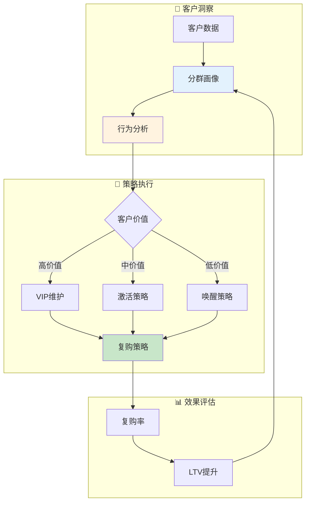

# 客户域业务流程梳理	

> **数据域**: 客户域 (cst)	
> **版本**: v1.0	
> **创建日期**: 2026-01-19	
> **目的**: 梳理客户域业务过程的内在逻辑和时序关系	

---

## 1. 客户域业务全景	

客户域是客户运营的**客户资产管理中枢**，涵盖分群画像、行为分析、复购策略的**客户全生命周期管理**。其核心是**"理解客户，提升价值"**。	

---

## 2. 业务流程图	



---

## 3. 业务过程时序关系	

### 3.1 客户主流程	

<table>
    <thead>
        <tr>
            <th>阶段</th>
            <th>序号</th>
            <th>业务过程</th>
            <th>触发条件</th>
            <th>产出结果</th>
        </tr>
    </thead>
    <tbody>
        <tr>
            <td rowspan="2">一、客户洞察</td>
            <td>1</td>
            <td>分群画像 (segmentation)</td>
            <td>客户数据</td>
            <td>客户分群</td>
        </tr>
        <tr>
            <td>2</td>
            <td>行为分析 (behavior)</td>
            <td>行为数据</td>
            <td>行为特征</td>
        </tr>
        <tr>
            <td>二、策略执行</td>
            <td>3</td>
            <td>复购策略 (retention)</td>
            <td>分析结果</td>
            <td>策略执行</td>
        </tr>
    </tbody>
</table>

---

## 4. 客户主线解读	

### 4.1 客户运营闭环	

```
分群画像 → 行为分析 → 复购策略 → 效果评估 → 画像更新
```

---

## 5. 业务过程顺序汇总表	

| 主线 | 顺序 | 业务过程 | 前置条件 | 后续影响 |	
|------|------|----------|----------|----------|	
| 客户 | 1️⃣ | 分群画像 | 客户数据 | 客户分层 |	
| 客户 | 2️⃣ | 行为分析 | 行为数据 | 行为洞察 |	
| 客户 | 3️⃣ | 复购策略 | 分析结果 | LTV提升 |	

---

## 6. 理解难点说明	

### 6.1 RFM模型	
- **R (Recency)**：最近一次购买时间	
- **F (Frequency)**：购买频率	
- **M (Monetary)**：消费金额	

### 6.2 与其他域的关联	
- **与交易域**：订单数据 → 行为分析	
- **与促销域**：复购策略 → 促销活动	
- **与客服域**：服务体验 → 客户满意度	

---

## 更新记录	

| 版本 | 日期 | 更新内容 |	
|------|------|----------|	
| v1.0 | 2026-01-19 | 初始版本，梳理客户域业务流程逻辑 |	
