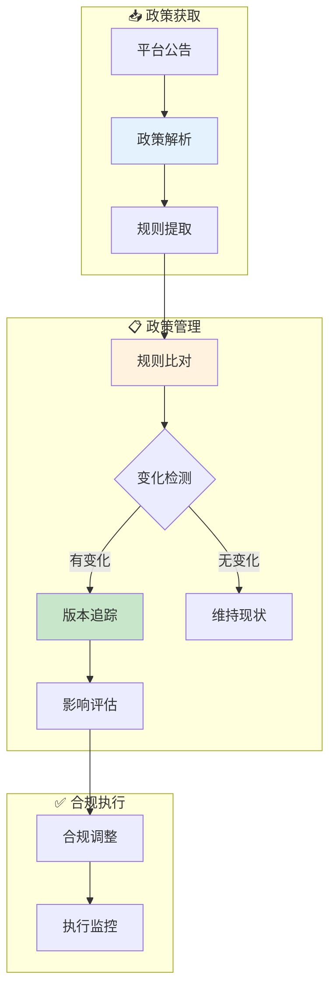

# 政策域业务流程梳理	

> **数据域**: 政策域 (pol)	
> **版本**: v1.0	
> **创建日期**: 2026-01-19	
> **目的**: 梳理政策域业务过程的内在逻辑和时序关系	

---

## 1. 政策域业务全景	

政策域是合规运营的**政策管理中枢**，涵盖政策解析、规则比对、版本追踪的**各类平台政策管理**。其核心是**"理解规则，规避风险"**。	

---

## 2. 业务流程图	



---

## 3. 业务过程时序关系	

### 3.1 政策主流程	

<table>
    <thead>
        <tr>
            <th>阶段</th>
            <th>序号</th>
            <th>业务过程</th>
            <th>触发条件</th>
            <th>产出结果</th>
        </tr>
    </thead>
    <tbody>
        <tr>
            <td>一、解析</td>
            <td>1</td>
            <td>政策解析 (parse)</td>
            <td>平台政策更新</td>
            <td>规则清单</td>
        </tr>
        <tr>
            <td>二、比对</td>
            <td>2</td>
            <td>规则比对 (compare)</td>
            <td>新旧版本</td>
            <td>变化点</td>
        </tr>
        <tr>
            <td>三、追踪</td>
            <td>3</td>
            <td>版本追踪 (version)</td>
            <td>规则变化</td>
            <td>版本历史</td>
        </tr>
    </tbody>
</table>

---

## 4. 政策主线解读	

### 4.1 政策管理闭环	

```
政策解析 → 规则比对 → 版本追踪 → 影响评估 → 合规调整
```

---

## 5. 业务过程顺序汇总表	

| 主线 | 顺序 | 业务过程 | 前置条件 | 后续影响 |	
|------|------|----------|----------|----------|	
| 政策 | 1️⃣ | 政策解析 | 政策更新 | 规则清单 |	
| 政策 | 2️⃣ | 规则比对 | 新旧版本 | 变化识别 |	
| 政策 | 3️⃣ | 版本追踪 | 规则变化 | 历史记录 |	

---

## 6. 理解难点说明	

### 6.1 亚马逊政策类型	
- **销售政策**：商品准入、禁售清单	
- **物流政策**：FBA要求、配送时效	
- **广告政策**：广告内容审核规则	
- **知识产权**：品牌保护、侵权处理	

### 6.2 与其他域的关联	
- **与运营域**：政策影响商品上架	
- **与广告域**：广告政策影响投放	
- **与履约域**：物流政策影响配送	

---

## 更新记录	

| 版本 | 日期 | 更新内容 |	
|------|------|----------|	
| v1.0 | 2026-01-19 | 初始版本，梳理政策域业务流程逻辑 |	
