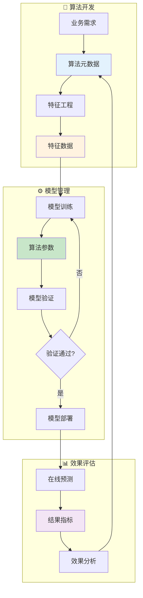

# 算法域业务流程梳理	

> **数据域**: 算法域 (ma)	
> **版本**: v1.0	
> **创建日期**: 2026-01-19	
> **目的**: 梳理算法域业务过程的内在逻辑和时序关系	

---

## 1. 算法域业务全景	

算法域是数据智能的**算法资产管理中枢**，涵盖算法元数据、算法参数、特征数据、结果指标的**算法资产管理与智能决策支持**。其核心是**"用算法驱动业务决策"**。	

---

## 2. 业务流程图	



---

## 3. 业务过程时序关系	

### 3.1 算法主流程	

<table>
    <thead>
        <tr>
            <th>阶段</th>
            <th>序号</th>
            <th>业务过程</th>
            <th>触发条件</th>
            <th>产出结果</th>
        </tr>
    </thead>
    <tbody>
        <tr>
            <td rowspan="2">一、开发</td>
            <td>1</td>
            <td>算法元数据 (metadata)</td>
            <td>业务需求</td>
            <td>算法定义</td>
        </tr>
        <tr>
            <td>2</td>
            <td>特征数据 (feature)</td>
            <td>特征工程</td>
            <td>特征集</td>
        </tr>
        <tr>
            <td>二、训练</td>
            <td>3</td>
            <td>算法参数 (parameter)</td>
            <td>模型训练</td>
            <td>最优参数</td>
        </tr>
        <tr>
            <td>三、评估</td>
            <td>4</td>
            <td>结果指标 (metric)</td>
            <td>模型预测</td>
            <td>效果指标</td>
        </tr>
    </tbody>
</table>

---

## 4. 算法主线解读	

### 4.1 MLOps 生命周期	

```
算法元数据 → 特征数据 → 模型训练 → 算法参数 → 模型部署 → 结果指标
                                                        │
                                                        ↓
                                              效果反馈 → 迭代优化
```

---

## 5. 业务过程顺序汇总表	

| 主线 | 顺序 | 业务过程 | 前置条件 | 后续影响 |	
|------|------|----------|----------|----------|	
| 算法 | 1️⃣ | 算法元数据 | 业务需求 | 算法定义 |	
| 算法 | 2️⃣ | 特征数据 | 特征工程 | 模型输入 |	
| 算法 | 3️⃣ | 算法参数 | 模型训练 | 模型配置 |	
| 算法 | 4️⃣ | 结果指标 | 模型预测 | 效果评估 |	

---

## 6. 理解难点说明	

### 6.1 算法域的应用场景	
- **需求预测**：预测销量、库存补货	
- **定价优化**：动态定价、促销定价	
- **推荐系统**：商品推荐、关联推荐	
- **风险识别**：欺诈检测、异常预警	

### 6.2 与其他域的关联	
- **与交易域**：订单数据 → 需求预测	
- **与库存域**：预测结果 → 补货建议	
- **与客户域**：分群模型 → 精准营销	

---

## 更新记录	

| 版本 | 日期 | 更新内容 |	
|------|------|----------|	
| v1.0 | 2026-01-19 | 初始版本，梳理算法域业务流程逻辑 |	
