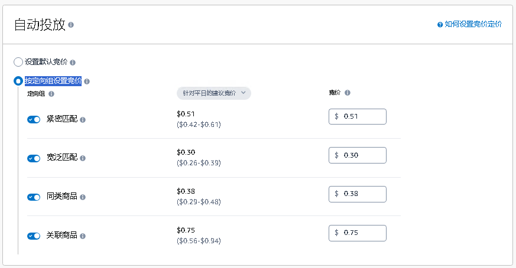
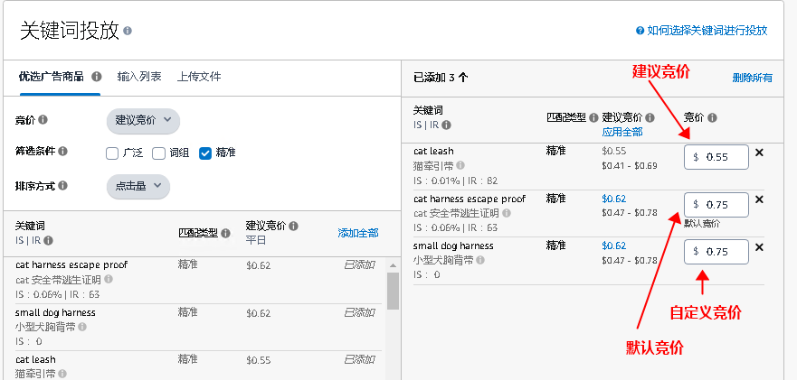
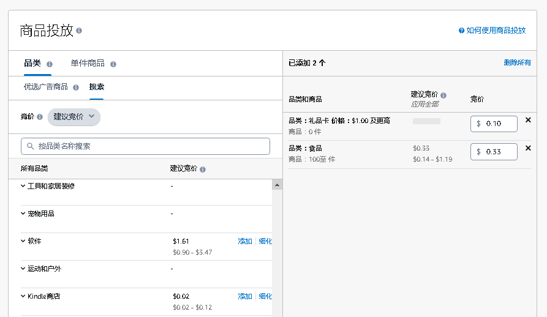
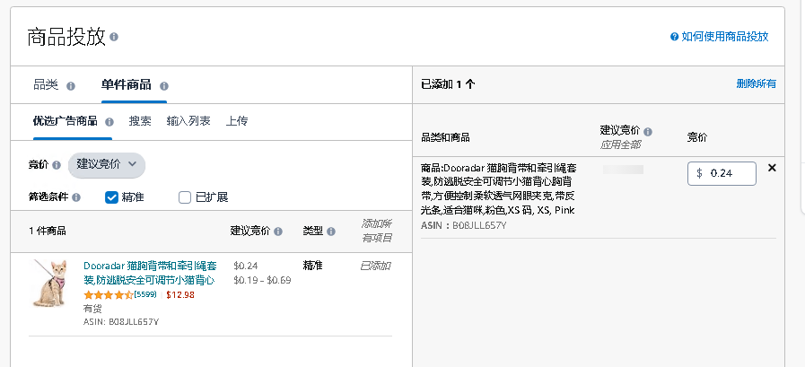
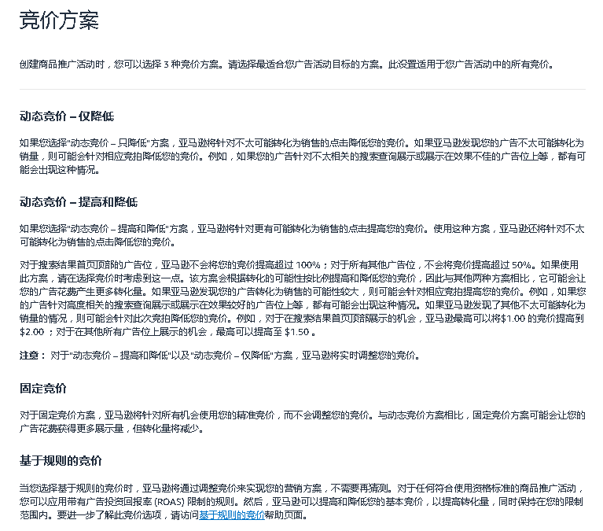

# 创建SP广告活动[隐藏]  

> 来源: 广告业务流程-创建 / 创建SP广告活动  

### 创建SP广告活动 [隐藏]  

### 图片内容  

  

  

  

  

  

  

  

  

  

  

  

  

  

  

  

  

  

  

  

  

  

  

  

  

  

> ⚠️ **注意**：上述图片需要根据 `图片识别.md` 的规则进行进一步识别处理。  

| 1、SP广告 |
|---|
| 广告组 |
| 1.1 广告组设置：广告组名称 |
|  |
|  |
|  |
|  |
|  |
|  |
|  |
|  |
|  |
|  |
|  |
|  |
|  |
|  |
|  |
| 1.2 添加商品 |
|  |
|  |
|  |
|  |
|  |
|  |
|  |
|  |
|  |
|  |
|  |
|  |
|  |
|  |
|  |
|  |
|  |
|  |
|  |
|  |
|  |
|  |
|  |
|  |
|  |
|  |
|  |
|  |
|  |
|  |
| 1.3 定向策略 |
|  |
|  |
|  |
|  |
|  |
|  |
|  |
|  |
|  |
|  |
|  |
| 1.3.1  定向策略：自动投放 |
|  |
| 1.3.1.1 自动投放：设置默认竞价（注：四种方式全开） |
|               |
|  |
|  |
|  |
|  |
|  |
|  |
|  |
|  |
|  |
|  |
|  |
|  |
|  |
|  |
| 1.3.1.1 自动投放：按定向组设置竞价 |
|  |
|  |
|  |
|  |
|  |
|  |
|  |
|  |
|  |
|  |
|  |
|  |
|  |
|  |
|  |
|  |
|  |
|  |
|  |
|  |
|  |
|  |
|  |
|  |
|  |
|  |
| 1.3.2  定向策略：手动投放 |
|  |
|  |
|  |
|  |
|  |
|  |
|  |
|  |
|  |
|  |
|  |
|  |
|  |
|  |
|  |
| 1.3.2.1  手动投放：关键词投放 |
|  |
|  |
|  |
|  |
|  |
|  |
|  |
|  |
|  |
|  |
|  |
|  |
|  |
|  |
|  |
|  |
|  |
|  |
|  |
|  |
|  |
|  |
|  |
|  |
|  |
|  |
|  |
|  |
|  |
| 1.3.2.1.1 关键词投放：竞价 |
|  |
|  |
|  |
|  |
|  |
|  |
|  |
|  |
|  |
|  |
|  |
|  |
|  |
|  |
|  |
|  |
|  |
|  |
|  |
|  |
|  |
|  |
|  |
|  |
|  |
|  |
| 1.3.2.1.2 关键词投放：匹配类型 |
|  |
|  |
|  |
|  |
|  |
|  |
|  |
|  |
|  |
|  |
|  |
|  |
|  |
|  |
|  |
|  |
|  |
|  |
|  |
|  |
|  |
|  |
|  |
|  |
|  |
|  |
| 1.3.2.1.3 关键词投放：添加关键词 |
|  |
| 1.3.2.2 手动投放：商品投放 |
|  |
|  |
|  |
|  |
|  |
|  |
|  |
|  |
|  |
|  |
|  |
|  |
|  |
|  |
|  |
|  |
|  |
|  |
|  |
|  |
|  |
|  |
|  |
|  |
|  |
|  |
|  |
|  |
|  |
|  |
|  |
|  |
|  |
| 1.3.2.2.1 商品投放：品类 |
|               商品投放：竞价 |
|               商品投放：添加品类（可细化品类） |
|  |
|  |
|  |
|  |
|  |
|  |
|  |
|  |
|  |
|  |
|  |
|  |
|  |
|  |
|  |
|  |
|  |
|  |
|  |
|  |
|  |
|  |
|  |
|  |
|  |
|  |
|  |
|  |
|  |
|  |
|  |
|  |
|  |
| 1.3.2.2.2 商品投放：单件商品 |
|               商品投放：竞价 |
|               商品投放：添加商品 |
|  |
|  |
|  |
|  |
|  |
|  |
|  |
|  |
|  |
|  |
|  |
|  |
|  |
|  |
|  |
|  |
|  |
|  |
|  |
|  |
|  |
|  |
|  |
|  |
| 1.4  否定关键词投放 |
| 1.4.1 否定关键词投放：匹配类型 |
| 1.4.2 否定关键词投放：添加关键词 |
| 注：自动投放 和 手动投放中的 关键词投放  有 该选项 |
|  |
|  |
|  |
|  |
|  |
|  |
|  |
|  |
|  |
|  |
|  |
|  |
|  |
|  |
|  |
|  |
|  |
|  |
|  |
|  |
|  |
|  |
| 1.5  否定商品定向 |
| 1.5.2（1） 自动投放：否定商品定向：添加商品 |
|  |
|  |
|  |
|  |
|  |
|  |
|  |
|  |
|  |
|  |
|  |
|  |
|  |
|  |
|  |
|  |
|  |
|  |
|  |
|  |
|  |
|  |
| 1.5.2（2） 手动投放：商品投放：否定商品定向：添加品牌和商品 |
|  |
|  |
|  |
|  |
|  |
|  |
|  |
|  |
|  |
|  |
|  |
|  |
|  |
|  |
|  |
|  |
|  |
|  |
|  |
| 广告组 |
| 2.1 广告活动竞价策略 |
|  |
|  |
|  |
|  |
|  |
|  |
|  |
|  |
|  |
|  |
|  |
|  |
|  |
|  |
|  |
|  |
|  |
|  |
|  |
|  |
|  |
|  |
|  |
|  |
|  |
|  |
|  |
|  |
|  |
|  |
|  |
|  |
| 2.2 设置 |
| 广告活动名称 |
| 组合（可选择） |
| 开始日期-结束日期 |
| 每日预算 |
|  |
|  |
|  |
|  |
|  |
|  |
|  |
|  |
|  |
|  |
|  |
|  |
|  |
|  |
|  |
|  |
|  |
|  |
|  |
|  |
|  |
|  |
|  |
|  |
|  |
|  |
| 2.3 在其他国家/地区启动其他广告活动 |

