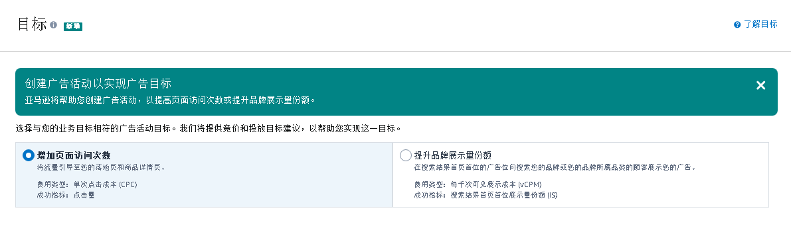

# SB广告-焦点模式商品投放  

> 来源: 广告业务流程-创建 / SB广告-焦点模式商品投放  

### SB广告-焦点模式商品投放  

### 图片内容  

  

  

  

  

  

  

  

  

  

  

  

  

  

  

> ⚠️ **注意**：上述图片需要根据 `图片识别.md` 的规则进行进一步识别处理。  

<table>
  <thead>
    <tr>
      <th>创建SB广告活动</th>
      <th></th>
      <th></th>
      <th></th>
      <th></th>
      <th></th>
      <th></th>
      <th></th>
      <th></th>
      <th></th>
      <th></th>
      <th></th>
      <th></th>
    </tr>
  </thead>
  <tbody>
    <tr>
      <td colspan="2">编辑主题</td>
      <td>入口</td>
      <td colspan="3">广告活动</td>
      <td colspan="6">广告组</td>
      <td>创建广告</td>
    </tr>
    <tr>
      <td colspan="2">步骤</td>
      <td>创建入口</td>
      <td>1、设置</td>
      <td>2、目标</td>
      <td>3、自动竞价开关</td>
      <td>4、 广告组设置</td>
      <td>5、广告格式</td>
      <td>6、着陆页</td>
      <td>7、定向策略</td>
      <td>8、商品投放</td>
      <td>9、否定商品投放</td>
      <td>10、增添广告素材</td>
    </tr>
    <tr>
      <td colspan="2">步骤描述</td>
      <td>广告活动管理 → 单个国家/地区 → 创建广告活动 → 品牌推广</td>
      <td>（1）填写广告活动名称 （2）选择广告组合 （3）选择活动开始日期和结束日期 （4）填写广告活动预算 （5）选择品牌</td>
      <td>选择推广目标： （1）增加页面访问次数 （2）提升品牌展示量份额</td>
      <td>是否打开非顶部位置自动竞价  </td>
      <td>填写广告组名称</td>
      <td>选择 品牌旗舰店焦点模式</td>
      <td>选择需要投放的品牌店铺</td>
      <td>选择需要投放的类型</td>
      <td>（1）选择品类或商品 （2）选择竞价生成的方式（可忽略） （3）添加品类（有细化选项） （3）添加商品  （5）修改竞价</td>
      <td>（1）添加品牌 （2）添加商品</td>
      <td>（1）命名广告素材集 （2）添加广告素材</td>
    </tr>
    <tr>
      <td colspan="2">图片</td>
      <td></td>
      <td></td>
      <td></td>
      <td></td>
      <td></td>
      <td></td>
      <td></td>
      <td></td>
      <td></td>
      <td></td>
      <td></td>
    </tr>
    <tr>
      <td rowspan="14">涉及数据</td>
      <td>字段名称</td>
      <td>广告活动类型 campaignType</td>
      <td>广告活动 campaignName</td>
      <td>目标 goals</td>
      <td></td>
      <td>广告组名称 adGroupName</td>
      <td>广告格式 Ad format</td>
      <td>着陆页 Landing page</td>
      <td>投放 targeting</td>
      <td>投放 targeting</td>
      <td>否定商品 negativeProduct</td>
      <td>徽标 Logo</td>
    </tr>
    <tr>
      <td>值</td>
      <td>商品推广Sponsored Products 品牌推广Sponsored Brands 展示推广Sponsored Display Sponsored TV （简写 SP、SB、SD、STV）</td>
      <td>text</td>
      <td>增加页面访问次数 Drive page visits 提升品牌展示量份额 Grow brand impression share</td>
      <td></td>
      <td>text</td>
      <td>商品集 Product collection 品牌旗舰店焦点模式 Store spotlight 视频 Video</td>
      <td>亚马逊品牌旗舰店</td>
      <td>关键词投放 Keyword targeting 商品投放 Product targeting</td>
      <td>文本开头为 "asin=" 及</td>
      <td>text</td>
      <td>图片</td>
    </tr>
    <tr>
      <td>字段名称</td>
      <td></td>
      <td>广告组合 portfolioName</td>
      <td></td>
      <td></td>
      <td></td>
      <td></td>
      <td></td>
      <td></td>
      <td>建议竞价  suggestedBid</td>
      <td></td>
      <td>品牌名称 Brand name</td>
    </tr>
    <tr>
      <td>值</td>
      <td></td>
      <td>text</td>
      <td></td>
      <td></td>
      <td></td>
      <td></td>
      <td></td>
      <td></td>
      <td>竞价 bid</td>
      <td></td>
      <td>text</td>
    </tr>
    <tr>
      <td>字段名称</td>
      <td></td>
      <td>startDate&endDate 开始日期和结束日期</td>
      <td></td>
      <td></td>
      <td></td>
      <td></td>
      <td></td>
      <td></td>
      <td>number</td>
      <td></td>
      <td>标题 Headline</td>
    </tr>
    <tr>
      <td>值</td>
      <td></td>
      <td>date</td>
      <td></td>
      <td></td>
      <td></td>
      <td></td>
      <td></td>
      <td></td>
      <td></td>
      <td></td>
      <td>text</td>
    </tr>
    <tr>
      <td>字段名称</td>
      <td></td>
      <td>国家 Country</td>
      <td></td>
      <td></td>
      <td></td>
      <td></td>
      <td></td>
      <td></td>
      <td></td>
      <td></td>
      <td>品牌旗舰店页面 Store Page</td>
    </tr>
    <tr>
      <td>值</td>
      <td></td>
      <td>text</td>
      <td></td>
      <td></td>
      <td></td>
      <td></td>
      <td></td>
      <td></td>
      <td></td>
      <td></td>
      <td>图片、text</td>
    </tr>
    <tr>
      <td>字段名称</td>
      <td></td>
      <td>广告活动预算 campaignBudgetAmount</td>
      <td></td>
      <td></td>
      <td></td>
      <td></td>
      <td></td>
      <td></td>
      <td></td>
      <td></td>
      <td>广告名称 Ad name</td>
    </tr>
    <tr>
      <td>值</td>
      <td></td>
      <td>number</td>
      <td></td>
      <td></td>
      <td></td>
      <td></td>
      <td></td>
      <td></td>
      <td></td>
      <td></td>
      <td>text</td>
    </tr>
    <tr>
      <td>字段名称</td>
      <td></td>
      <td>广告活动预算类型 campaignBudgetType</td>
      <td></td>
      <td></td>
      <td></td>
      <td></td>
      <td></td>
      <td></td>
      <td></td>
      <td></td>
      <td></td>
    </tr>
    <tr>
      <td>值</td>
      <td></td>
      <td>默认值：Daily</td>
      <td></td>
      <td></td>
      <td></td>
      <td></td>
      <td></td>
      <td></td>
      <td></td>
      <td></td>
      <td></td>
    </tr>
    <tr>
      <td>字段名称</td>
      <td></td>
      <td>品牌 Brand</td>
      <td></td>
      <td></td>
      <td></td>
      <td></td>
      <td></td>
      <td></td>
      <td></td>
      <td></td>
      <td></td>
    </tr>
    <tr>
      <td>值</td>
      <td></td>
      <td>text</td>
      <td></td>
      <td></td>
      <td></td>
      <td></td>
      <td></td>
      <td></td>
      <td></td>
      <td></td>
      <td></td>
    </tr>
  </tbody>
</table>

