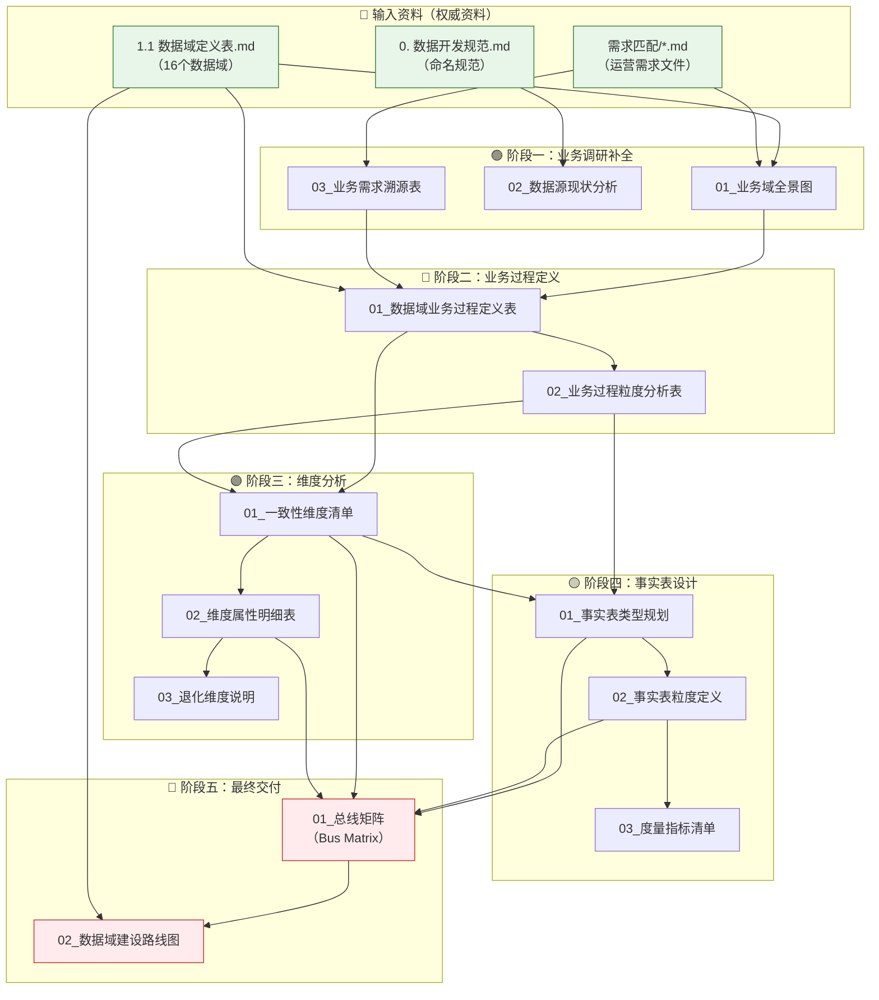

# ⛓️ 项目全链路执行手册：总线矩阵构建项目	

## 1. 项目背景与目标	

### 1.1 项目背景	

| 维度 | 说明 |	
|------|------|	
| **公司性质** | 跨境电商公司 |	
| **行业领域** | 宠物行业 |	
| **销售平台** | 亚马逊平台 |	
| **当前状态** | 数据域已定义完成（16个数据域），数据源待切换 |	
| **工作基础** | 前任已完成业务调研、数据源盘点、数据域划分，但未留下业务材料 |	
| **现有资料** | 仅有技术文档（数据开发规范与最佳实践） |	

### 1.2 项目目标	

构建完整的**数据仓库总线矩阵**，同时补全中间过程文档，形成完整的数据仓库规划交付物链。	

### 1.3 核心交付物	

> **最终目标**：输出总线矩阵（Bus Matrix）	

---

## 2. 产物目录结构 (File System)	

*项目所有产出将严格按照以下结构归档：*	

```text
总线矩阵构建项目/
├── 00_项目计划书_v1.0.md           # 本文档 - 项目立项书与执行手册
├── 01_业务调研/                     # 第一阶段：业务调研与补全
│   ├── 01_业务域全景图_v1.0.md      # 业务全貌梳理
│   ├── 02_数据源现状分析_v1.0.md    # 数据源盘点与评估
│   └── 03_业务需求溯源表_v1.0.md    # 需求到业务的映射
├── 02_业务过程定义/                 # 第二阶段：业务过程梳理
│   ├── 01_数据域业务过程定义表_v1.0.md  # 16个数据域的业务过程
│   └── 02_业务过程粒度分析表_v1.0.md    # 各业务过程的粒度定义
├── 03_维度分析/                     # 第三阶段：维度模型设计
│   ├── 01_一致性维度清单_v1.0.md    # 通用维度定义
│   ├── 02_维度属性明细表_v1.0.md    # 维度详细属性
│   └── 03_退化维度说明_v1.0.md      # 退化维度处理
├── 04_事实表设计/                   # 第四阶段：事实表设计
│   ├── 01_事实表类型规划_v1.0.md    # 事务/周期/累积快照
│   ├── 02_事实表粒度定义_v1.0.md    # 各事实表粒度
│   └── 03_度量指标清单_v1.0.md      # 核心度量指标
└── 05_总线矩阵/                     # 第五阶段：最终产物
    ├── 01_总线矩阵_v1.0.md          # 完整的Bus Matrix
    └── 02_数据域建设路线图_v1.0.md   # 按优先级的实施路线
```

---

## 3. 产物依赖流 (Artifact Flow)	

> *箭头表示数据的流向：前一个文件的内容是生成后一个文件的必要条件。*	



---

## 4. 数据域清单	

根据权威资料 `1.1 数据域定义表.md`，以下16个数据域**已确定且不可修改**。	

> [!NOTE]	
> **业务过程状态说明**：下表中的「业务过程概览」仅为初步参考，**尚未最终确定**。各数据域的具体业务过程将在后续执行链路中，依据数据源分析、业务调研等相关依赖逐步明确和完善，属于**可修改内容**。	

### 4.1 P0级 - 核心域（最高优先级）	

| 数据域 | 数据库编码 | 业务过程概览 |	
|--------|-----------|-------------|	
| **交易域** | `trd` | 购物车、订单、订单明细、订单评价、支付、结算 |	
| **运营域** | `op` | 账号管理、店铺管理、变体管理、链接管理、整体流量、自然流量 |	

### 4.2 P1级 - 重要域	

| 数据域 | 数据库编码 | 业务过程概览 |	
|--------|-----------|-------------|	
| **库存域** | `inv` | 入库、出库、库龄、库存、损耗 |	
| **履约域** | `fl` | 物流、FBA、退换货 |	
| **促销域** | `prm` | 促销活动、促销策略、促销销售表现、促销费用 |	
| **广告域** | `ads` | 广告活动、关键词投放策略、展示量、点击量、广告支出、广告流量 |	

### 4.3 P2级 - 一般域	

| 数据域 | 数据库编码 | 业务过程概览 |	
|--------|-----------|-------------|	
| **研发域** | `rd` | 原型设计、测试验证、产品迭代、BOM管理 |	
| **供采域** | `sup` | 采购计划、采购订单、采购付款、供应商准入、供应商协同 |	
| **生产域** | `mfg` | 产能规划、生产排产、工艺标准、工单执行、设备效能 |	
| **品控域** | `qc` | 来料质检、过程检验、成品检验、缺陷追溯、质量成本核算 |	

### 4.4 P3级 - 辅助域	

| 数据域 | 数据库编码 | 业务过程概览 |	
|--------|-----------|-------------|	
| **市场域** | `mkt` | 市场调研、行业趋势、消费者洞察、链接表现、竞品分析、渠道评估、站外流量 |	
| **客服域** | `cs` | 客户咨询、客户投诉、客服工单、退换货预测 |	
| **财务域** | `fin` | 应收应付、付款凭证、税务申报、财务审计、利润核算、预算控制 |	
| **客户域** | `cst` | 分群画像、行为分析、复购策略 |	
| **政策域** | `pol` | 政策解析、规则比对、版本追踪 |	
| **算法域** | `ma` | 算法元数据、算法参数、特征数据、结果指标 |	

---

## 5. 分步执行链 (Execution Chain)	

### 🟢 阶段一：业务调研补全	
*此阶段基于现有需求文档，反向推理业务全貌，补全前任遗留的业务调研空白。*	

- [ ] **Step 1.1: 业务域全景图绘制**	
    - 📥 **Input (依赖)**: 	
        - `权威资料/1 项目背景/1.0 业务域信息表_v1.0.md` **(业务单元与来源系统)**	
        - `权威资料/1 项目背景/1.1 数据域定义表.md`	
        - `权威资料/1 项目背景/需求匹配/*.md` (所有需求文件)	
    - 📤 **Output (产出)**: `01_业务调研/01_业务域全景图_v1.0.md`	
    - 💡 **执行逻辑**: 	
        1. 明确本项目聚焦于「跨境电商」业务域	
        2. 从需求文件中提取业务场景关键词	
        3. 按数据域分类整理业务活动	
        4. 绘制跨境电商业务流程全景图	
    - > **🤖 AI指令**: 请读取 `1.0 业务域信息表_v1.0.md`、`1.1 数据域定义表.md` 和 `需求匹配/` 目录下的所有需求文件，从运营需求反推业务流程，生成业务域全景图，输出到 `01_业务调研/01_业务域全景图_v1.0.md`。需包含：核心业务流程、关键业务活动、数据域与业务的对应关系。	

- [ ] **Step 1.2: 数据源现状分析**	
    - 📥 **Input (依赖)**: 	
        - `01_业务调研/01_业务域全景图_v1.0.md` (必须读取)	
        - `权威资料/1 项目背景/1.0 业务域信息表_v1.0.md` **(已知来源系统参考)**	
        - `权威资料/0 数据规范/0. 数据开发规范与最佳实践.md`	
        - `output_LLM/CK数据模型字段信息.md` **(现有数据模型参考)**	
    - 📤 **Output (产出)**: `01_业务调研/02_数据源现状分析_v1.0.md`	
    - 💡 **执行逻辑**: 	
        1. 结合CK数据模型字段信息，梳理现有数据模型覆盖范围	
        2. 参考业务域信息表中的已知来源系统（OMS、SCP、SRM、QMS、WMS、TMS、金蝶等）	
        3. 根据业务全景图识别潜在数据源类型	
        4. 按数据域分析可能的数据来源	
        5. 标记待定数据源（因数据源切换）	
    - ⚠️ **来源系统说明**：业务域信息表中列出的来源系统（OMS、WMS等）**并非闭环清单**。实际数据源还可能包括：亚马逊后台数据、领星ERP、其他第三方平台API等。分析时应保持开放性，预留扩展空间。\t\r\n    - > **🤖 AI指令**: 请读取 `01_业务域全景图_v1.0.md`、`1.0 业务域信息表_v1.0.md` 和 `CK数据模型字段信息.md`，基于现有数据模型现状和亚马逊电商业务特点，分析各数据域的数据源覆盖情况和潜在数据源类型，输出为 `01_业务调研/02_数据源现状分析_v1.0.md`。需包含：现有数据模型盘点、已知来源系统梳理（注明非闭环）、数据源类型分类、数据域覆盖度分析、数据采集方式、数据源待定标记。\t

- [ ] **Step 1.3: 业务需求溯源映射**	
    - 📥 **Input (依赖)**: 	
        - `权威资料/1 项目背景/需求匹配/*.md`	
        - `01_业务调研/01_业务域全景图_v1.0.md`	
    - 📤 **Output (产出)**: `01_业务调研/03_业务需求溯源表_v1.0.md`	
    - 💡 **执行逻辑**: 	
        1. 提取所有需求模块（59个需求点）	
        2. 映射需求到数据域	
        3. 识别业务过程关键词	
    - > **🤖 AI指令**: 请读取 `需求匹配/` 下的需求文件和 `01_业务域全景图_v1.0.md`，建立"需求→业务过程→数据域"的完整映射关系，输出为 `01_业务调研/03_业务需求溯源表_v1.0.md`。	

---

### 🔵 阶段二：业务过程定义	
*此阶段将数据域细化为可量化的业务过程，遵循Kimball方法论。*	

- [ ] **Step 2.1: 数据域业务过程定义**	
    - 📥 **Input (依赖)**: 	
        - `权威资料/1 项目背景/1.1 数据域定义表.md`	
        - `01_业务调研/01_业务域全景图_v1.0.md`	
        - `01_业务调研/03_业务需求溯源表_v1.0.md`	
    - 📤 **Output (产出)**: `02_业务过程定义/01_数据域业务过程定义表_v1.0.md`	
    - 💡 **执行逻辑**: 	
        1. 以数据域为单位	
        2. 识别每个域的核心业务过程	
        3. 确保业务过程具有可度量性	
    - > **🤖 AI指令**: 请详细阅读 `1.1 数据域定义表.md`、`01_业务域全景图_v1.0.md` 和 `03_业务需求溯源表_v1.0.md`，为16个数据域定义完整的业务过程清单，输出为 `02_业务过程定义/01_数据域业务过程定义表_v1.0.md`。业务过程需遵循：动词+名词格式、可度量原则。	

- [ ] **Step 2.2: 业务过程粒度分析**	
    - 📥 **Input (依赖)**: 	
        - `02_业务过程定义/01_数据域业务过程定义表_v1.0.md` (必须读取)	
    - 📤 **Output (产出)**: `02_业务过程定义/02_业务过程粒度分析表_v1.0.md`	
    - 💡 **执行逻辑**: 	
        1. 为每个业务过程确定最细粒度	
        2. 识别主键组成	
        3. 确定粒度声明	
    - > **🤖 AI指令**: 请读取 `01_数据域业务过程定义表_v1.0.md`，为每个业务过程定义其最细粒度（谁、什么时候、做了什么），输出为 `02_业务过程定义/02_业务过程粒度分析表_v1.0.md`。	

---

### 🟣 阶段三：维度分析	
*此阶段识别和定义一致性维度，为总线矩阵提供列元素。*	

- [ ] **Step 3.1: 一致性维度清单**	
    - 📥 **Input (依赖)**: 	
        - `02_业务过程定义/01_数据域业务过程定义表_v1.0.md`	
        - `02_业务过程定义/02_业务过程粒度分析表_v1.0.md`	
    - 📤 **Output (产出)**: `03_维度分析/01_一致性维度清单_v1.0.md`	
    - 💡 **执行逻辑**: 	
        1. 从业务过程中提取共享维度	
        2. 识别跨域一致性维度	
        3. 按维度类型分类（时间、地点、产品等）	
    - > **🤖 AI指令**: 请读取 `01_数据域业务过程定义表_v1.0.md` 和 `02_业务过程粒度分析表_v1.0.md`，识别可被多个业务过程共享的一致性维度，输出为 `03_维度分析/01_一致性维度清单_v1.0.md`。需涵盖：时间维度、产品维度、地理维度、账号维度等。	

- [ ] **Step 3.2: 维度属性明细**	
    - 📥 **Input (依赖)**: 	
        - `03_维度分析/01_一致性维度清单_v1.0.md` (必须读取)	
        - `权威资料/0 数据规范/0. 数据开发规范与最佳实践.md`	
    - 📤 **Output (产出)**: `03_维度分析/02_维度属性明细表_v1.0.md`	
    - 💡 **执行逻辑**: 	
        1. 为每个维度设计属性列表	
        2. 遵循命名规范	
        3. 识别层级关系	
    - > **🤖 AI指令**: 请读取 `01_一致性维度清单_v1.0.md` 和开发规范文档，为每个一致性维度设计详细的属性列表，输出为 `03_维度分析/02_维度属性明细表_v1.0.md`。属性需遵循字段命名规范。	

- [ ] **Step 3.3: 退化维度说明**	
    - 📥 **Input (依赖)**: 	
        - `03_维度分析/02_维度属性明细表_v1.0.md` (必须读取)	
    - 📤 **Output (产出)**: `03_维度分析/03_退化维度说明_v1.0.md`	
    - 💡 **执行逻辑**: 	
        1. 识别无需独立维度表的属性	
        2. 说明退化维度处理方式	
        3. 典型案例：订单号、交易号	
    - > **🤖 AI指令**: 请读取 `02_维度属性明细表_v1.0.md`，识别并说明哪些维度属性无需独立建表（退化维度），输出为 `03_维度分析/03_退化维度说明_v1.0.md`。	

---

### 🟡 阶段四：事实表设计	
*此阶段设计事实表结构，为总线矩阵提供行元素。*	

- [ ] **Step 4.1: 事实表类型规划**	
    - 📥 **Input (依赖)**: 	
        - `02_业务过程定义/02_业务过程粒度分析表_v1.0.md`	
        - `03_维度分析/01_一致性维度清单_v1.0.md`	
    - 📤 **Output (产出)**: `04_事实表设计/01_事实表类型规划_v1.0.md`	
    - 💡 **执行逻辑**: 	
        1. 根据业务过程特点选择事实表类型	
        2. 事务事实表：记录单次事件	
        3. 周期快照：定期状态	
        4. 累积快照：生命周期	
    - > **🤖 AI指令**: 请读取 `02_业务过程粒度分析表_v1.0.md` 和 `01_一致性维度清单_v1.0.md`，为每个核心业务过程确定事实表类型（事务/周期快照/累积快照），输出为 `04_事实表设计/01_事实表类型规划_v1.0.md`。	

- [ ] **Step 4.2: 事实表粒度定义**	
    - 📥 **Input (依赖)**: 	
        - `04_事实表设计/01_事实表类型规划_v1.0.md` (必须读取)	
    - 📤 **Output (产出)**: `04_事实表设计/02_事实表粒度定义_v1.0.md`	
    - 💡 **执行逻辑**: 	
        1. 明确每张事实表的粒度	
        2. 定义主键组成	
        3. 确定关联的维度外键	
    - > **🤖 AI指令**: 请读取 `01_事实表类型规划_v1.0.md`，为每张事实表定义其粒度和主键结构，输出为 `04_事实表设计/02_事实表粒度定义_v1.0.md`。	

- [ ] **Step 4.3: 度量指标清单**	
    - 📥 **Input (依赖)**: 	
        - `04_事实表设计/02_事实表粒度定义_v1.0.md` (必须读取)	
        - `01_业务调研/03_业务需求溯源表_v1.0.md`	
    - 📤 **Output (产出)**: `04_事实表设计/03_度量指标清单_v1.0.md`	
    - 💡 **执行逻辑**: 	
        1. 从业务需求中提取度量指标	
        2. 按事实表分配指标	
        3. 区分可加、半可加、不可加指标	
    - > **🤖 AI指令**: 请读取 `02_事实表粒度定义_v1.0.md` 和 `03_业务需求溯源表_v1.0.md`，为每张事实表定义度量指标清单，输出为 `04_事实表设计/03_度量指标清单_v1.0.md`。	

---

### 🔴 阶段五：最终交付	
*此阶段整合所有中间产物，输出总线矩阵和建设路线图。*	

- [ ] **Step 5.1: 总线矩阵生成**	
    - 📥 **Input (依赖)**: 	
        - `03_维度分析/01_一致性维度清单_v1.0.md`	
        - `03_维度分析/02_维度属性明细表_v1.0.md`	
        - `04_事实表设计/01_事实表类型规划_v1.0.md`	
        - `04_事实表设计/02_事实表粒度定义_v1.0.md`	
    - 📤 **Output (产出)**: `05_总线矩阵/01_总线矩阵_v1.0.md`	
    - 💡 **执行逻辑**: 	
        1. 行：业务过程/事实表	
        2. 列：一致性维度	
        3. 矩阵元素：关联标记	
    - > **🤖 AI指令**: 请综合读取维度分析和事实表设计的全部产出文件，生成完整的总线矩阵（Bus Matrix），输出为 `05_总线矩阵/01_总线矩阵_v1.0.md`。矩阵需清晰展示业务过程与维度的对应关系。	

- [ ] **Step 5.2: 数据域建设路线图**	
    - 📥 **Input (依赖)**: 	
        - `05_总线矩阵/01_总线矩阵_v1.0.md` (必须读取)	
        - `权威资料/1 项目背景/1.1 数据域定义表.md`	
    - 📤 **Output (产出)**: `05_总线矩阵/02_数据域建设路线图_v1.0.md`	
    - 💡 **执行逻辑**: 	
        1. 按P0→P1→P2→P3优先级排序	
        2. 识别跨域依赖关系	
        3. 制定分阶段实施计划	
    - > **🤖 AI指令**: 请读取 `01_总线矩阵_v1.0.md` 和 `1.1 数据域定义表.md`，根据数据域优先级和维度共享关系，制定数据域建设路线图，输出为 `05_总线矩阵/02_数据域建设路线图_v1.0.md`。	

---

## 6. 执行注意事项	

### 6.1 数据源待定说明	

> [!IMPORTANT]	
> 当前数据源处于切换状态，新数据源尚未确定。本项目所有涉及具体数据源的内容均标记为**待定**，后续待数据源确定后进行补充。	

### 6.2 命名规范遵循	

所有输出产物中涉及的表名、字段名务必遵循 `0. 数据开发规范与最佳实践.md` 中的命名规范：	

- 表名格式：`层级_域缩写_业务对象_粒度_刷新周期`	
- 示例：`dwd_trd_order_main_dd`	

### 6.3 版本管理	

- 所有文档采用 `_v1.0` 后缀进行版本管理	
- 内容结构变更 → 大版本号递增（v1.0 → v2.0）	
- 内容微调补充 → 小版本号递增（v1.0 → v1.1）	

---

## 7. 参考资料索引	

| 资料类型 | 文件路径 | 用途 |	
|----------|----------|------|	
| 业务域信息 | `权威资料/1 项目背景/1.0 业务域信息表_v1.0.md` | 业务单元划分与已知来源系统（非闭环） |	
| 数据域定义 | `权威资料/1 项目背景/1.1 数据域定义表.md` | 16个数据域清单与优先级 |	
| 技术规范 | `权威资料/0 数据规范/0. 数据开发规范与最佳实践.md` | 命名规范与开发标准 |	
| 需求资料 | `权威资料/1 项目背景/需求匹配/*.md` | 运营需求与业务场景 |	

---

## 8. 更新记录	

| 日期 | 版本 | 更新内容 | 更新人 |	
|------|------|----------|--------|	
| 2026-01-14 | v1.0 | 初始版本，建立项目全链路执行手册 | AI架构师 |	
| 2026-01-14 | v1.1 | 修复mermaid和text代码块内的行尾Tab字符导致的语法错误 | AI架构师 |	
| 2026-01-15 | v1.2 | ①数据源现状分析步骤增加 `CK数据模型字段信息.md` 依赖 ②优化数据域清单描述，明确业务过程为待定可修改内容 | AI架构师 |	
| 2026-01-15 | v1.3 | 增加 `1.0 业务域信息表_v1.0.md` 依赖，明确来源系统为非闭环清单（可能包含亚马逊后台、领星ERP等） | AI架构师 |	

---

*本文档由产物驱动型流程架构师生成，遵循"输入→输出"严格依赖链原则。*	
