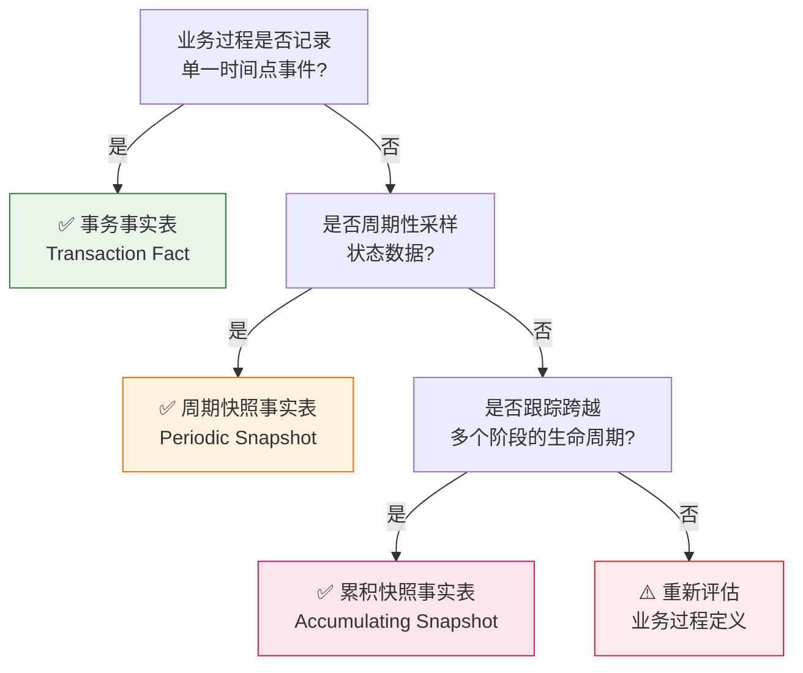

# 数据域业务过程定义表	

> **文档版本**: v1.1	
> **创建日期**: 2026-01-15	
> **依赖文件**: `1.1 数据域定义表.md`, `01_业务域全景图_v1.0.md`, `03_业务需求溯源表_v1.0.md`	

---

## 1. 业务过程定义标准	

### 1.1 定义原则	

根据 Kimball 方法论，业务过程需满足以下条件：	
1. **可度量**：业务过程产生可量化的度量指标	
2. **可追溯**：业务过程有明确的时间点或时间范围	
3. **原子性**：业务过程代表一次不可分割的业务事件	

### 1.2 命名规范	

业务过程命名采用「**动词+名词**」格式：	
- ✅ 正确示例：创建订单、支付订单、发布广告	
- ❌ 错误示例：订单、广告、库存	

### 1.3 事实表类型分类	

根据 Kimball 数据仓库方法论，事实表分为**三种类型**：	

| 类型 | 英文名称 | 核心特征 | 典型场景 | 数据特性 |	
|------|----------|----------|----------|----------|	
| **事务事实表** | Transaction Fact | 记录业务事件**发生时刻**的原子级事实 | 订单、支付、入库、出库 | 事件发生后数据**不再变化** |	
| **周期快照事实表** | Periodic Snapshot | 按**固定时间间隔**记录状态快照 | 库存余额、日流量、广告效果 | 定期拍摄状态，度量**半可加** |	
| **累积快照事实表** | Accumulating Snapshot | 跟踪业务过程的**完整生命周期** | 订单履约全流程、物流配送全程 | 数据**持续更新**直到流程结束 |	

#### 1.3.1 事务事实表 (Transaction Fact)	

- **特点**：每行对应一个业务事件，事件发生后数据不再变化	
- **粒度**：最细粒度，一行 = 一次事件	
- **度量**：完全可加的事务度量（金额、数量）	
- **示例**：订单事实表（每行=一笔订单）、支付事实表（每行=一次支付）	

#### 1.3.2 周期快照事实表 (Periodic Snapshot)	

- **特点**：按固定周期（日/周/月）拍摄业务状态快照	
- **粒度**：周期粒度，一行 = 某时点某对象的状态	
- **度量**：半可加度量（不能跨时间求和，如库存余额）	
- **示例**：库存日快照（每行=某天某SKU的库存余额）、流量日快照（每行=某天某链接的访问数据）	

#### 1.3.3 累积快照事实表 (Accumulating Snapshot)	

- **特点**：跟踪业务流程的多个里程碑，数据持续更新直到流程结束	
- **粒度**：业务实体粒度，一行 = 一个实体的完整生命周期	
- **度量**：多个里程碑时间字段 + 时长计算	
- **示例**：订单履约累积快照（跟踪 创建→支付→发货→签收→评价 全流程）	

### 1.4 事实表类型选择决策	

根据以下决策树判断业务过程对应的事实表类型：	

**决策要点**：	

| 判断问题 | 是 | 否 |	
|----------|----|----|	
| 业务事件是单一时间点发生的？ | → 事务事实表 | → 继续判断 |	
| 需要周期性采样状态数据？ | → 周期快照表 | → 继续判断 |	
| 需要跟踪跨多阶段的生命周期？ | → 累积快照表 | → 重新评估 |	

---

## 2. P0级 - 核心域业务过程	

### 2.1 交易域 (trd) - 交易全流程	

<table>
    <thead>
        <tr>
            <th>序号</th>
            <th>业务过程</th>
            <th>英文名称</th>
            <th>业务过程描述</th>
            <th>典型度量指标</th>
            <th>事实表类型</th>
        </tr>
    </thead>
    <tbody>
        <tr>
            <td>1</td>
            <td>加入购物车</td>
            <td>add_to_cart</td>
            <td>用户将商品加入购物车的行为</td>
            <td>加购数量、加购金额</td>
            <td>事务事实</td>
        </tr>
        <tr>
            <td>2</td>
            <td>创建订单</td>
            <td>create_order</td>
            <td>用户提交订单的行为</td>
            <td>订单数、订单金额</td>
            <td>事务事实</td>
        </tr>
        <tr>
            <td>3</td>
            <td>订单明细</td>
            <td>order_detail</td>
            <td>订单中每个商品明细</td>
            <td>商品数量、商品金额</td>
            <td>事务事实</td>
        </tr>
        <tr>
            <td>4</td>
            <td>支付订单</td>
            <td>pay_order</td>
            <td>用户完成订单支付</td>
            <td>支付金额、支付笔数</td>
            <td>事务事实</td>
        </tr>
        <tr>
            <td>5</td>
            <td>结算订单</td>
            <td>settle_order</td>
            <td>平台完成订单结算</td>
            <td>结算金额、平台费用</td>
            <td>事务事实</td>
        </tr>
        <tr>
            <td>6</td>
            <td>发布评价</td>
            <td>submit_review</td>
            <td>用户对订单发表评价</td>
            <td>评价数、平均评分</td>
            <td>事务事实</td>
        </tr>
    </tbody>
</table>

### 2.2 运营域 (op) - 平台店铺运营	

<table>
    <thead>
        <tr>
            <th>序号</th>
            <th>业务过程</th>
            <th>英文名称</th>
            <th>业务过程描述</th>
            <th>典型度量指标</th>
            <th>事实表类型</th>
        </tr>
    </thead>
    <tbody>
        <tr>
            <td>7</td>
            <td>注册账号</td>
            <td>register_account</td>
            <td>创建亚马逊卖家账号</td>
            <td>账号数</td>
            <td>事务事实</td>
        </tr>
        <tr>
            <td>8</td>
            <td>创建店铺</td>
            <td>create_store</td>
            <td>在平台创建店铺</td>
            <td>店铺数</td>
            <td>事务事实</td>
        </tr>
        <tr>
            <td>9</td>
            <td>创建变体</td>
            <td>create_variant</td>
            <td>创建产品变体（颜色、尺寸等）</td>
            <td>变体数</td>
            <td>事务事实</td>
        </tr>
        <tr>
            <td>10</td>
            <td>上架链接</td>
            <td>publish_listing</td>
            <td>将产品链接上架到平台</td>
            <td>链接数、上架成功率</td>
            <td>事务事实</td>
        </tr>
        <tr>
            <td>11</td>
            <td>监控流量</td>
            <td>monitor_traffic</td>
            <td>监控店铺/链接整体流量</td>
            <td>会话数、页面浏览量</td>
            <td>周期快照</td>
        </tr>
        <tr>
            <td>12</td>
            <td>分析自然流量</td>
            <td>analyze_organic</td>
            <td>分析自然搜索流量来源</td>
            <td>自然流量占比、关键词排名</td>
            <td>周期快照</td>
        </tr>
    </tbody>
</table>

---

## 3. P1级 - 重要域业务过程	

### 3.1 库存域 (inv) - 库存运营与优化	

<table>
    <thead>
        <tr>
            <th>序号</th>
            <th>业务过程</th>
            <th>英文名称</th>
            <th>业务过程描述</th>
            <th>典型度量指标</th>
            <th>事实表类型</th>
        </tr>
    </thead>
    <tbody>
        <tr>
            <td>13</td>
            <td>商品入库</td>
            <td>stock_in</td>
            <td>商品入库到仓库</td>
            <td>入库数量、入库金额</td>
            <td>事务事实</td>
        </tr>
        <tr>
            <td>14</td>
            <td>商品出库</td>
            <td>stock_out</td>
            <td>商品从仓库出库</td>
            <td>出库数量、出库金额</td>
            <td>事务事实</td>
        </tr>
        <tr>
            <td>15</td>
            <td>库存盘点</td>
            <td>stock_check</td>
            <td>定期盘点库存状态</td>
            <td>库存数量、库存金额</td>
            <td>周期快照</td>
        </tr>
        <tr>
            <td>16</td>
            <td>库龄分析</td>
            <td>inventory_aging</td>
            <td>分析库存周转和库龄分布</td>
            <td>库龄天数、滞销率</td>
            <td>周期快照</td>
        </tr>
        <tr>
            <td>17</td>
            <td>库存损耗</td>
            <td>stock_loss</td>
            <td>记录库存损耗</td>
            <td>损耗数量、损耗金额</td>
            <td>事务事实</td>
        </tr>
    </tbody>
</table>

### 3.2 履约域 (fl) - 订单交付与逆向物流	

<table>
    <thead>
        <tr>
            <th>序号</th>
            <th>业务过程</th>
            <th>英文名称</th>
            <th>业务过程描述</th>
            <th>典型度量指标</th>
            <th>事实表类型</th>
        </tr>
    </thead>
    <tbody>
        <tr>
            <td>18</td>
            <td>发货配送</td>
            <td>ship_order</td>
            <td>订单发货配送到买家</td>
            <td>发货数量、运费</td>
            <td>事务事实</td>
        </tr>
        <tr>
            <td>19</td>
            <td>FBA入仓</td>
            <td>fba_inbound</td>
            <td>商品入库到FBA仓库</td>
            <td>入仓数量、入仓费用</td>
            <td>事务事实</td>
        </tr>
        <tr>
            <td>20</td>
            <td>处理退货</td>
            <td>process_return</td>
            <td>处理买家退货申请</td>
            <td>退货数量、退货金额</td>
            <td>事务事实</td>
        </tr>
        <tr>
            <td>21</td>
            <td>处理换货</td>
            <td>process_exchange</td>
            <td>处理买家换货申请</td>
            <td>换货数量</td>
            <td>事务事实</td>
        </tr>
    </tbody>
</table>

### 3.3 促销域 (prm) - 促销活动	

<table>
    <thead>
        <tr>
            <th>序号</th>
            <th>业务过程</th>
            <th>英文名称</th>
            <th>业务过程描述</th>
            <th>典型度量指标</th>
            <th>事实表类型</th>
        </tr>
    </thead>
    <tbody>
        <tr>
            <td>22</td>
            <td>创建促销活动</td>
            <td>create_promotion</td>
            <td>创建促销活动</td>
            <td>活动数</td>
            <td>事务事实</td>
        </tr>
        <tr>
            <td>23</td>
            <td>制定促销策略</td>
            <td>set_promo_strategy</td>
            <td>制定促销价格和规则</td>
            <td>折扣力度</td>
            <td>事务事实</td>
        </tr>
        <tr>
            <td>24</td>
            <td>记录促销销售</td>
            <td>track_promo_sales</td>
            <td>记录促销期间销售表现</td>
            <td>促销销量、促销销售额</td>
            <td>事务事实</td>
        </tr>
        <tr>
            <td>25</td>
            <td>核算促销费用</td>
            <td>calc_promo_cost</td>
            <td>核算促销活动费用</td>
            <td>促销费用、ROI</td>
            <td>事务事实</td>
        </tr>
    </tbody>
</table>

### 3.4 广告域 (ads) - 广告投放管理	

<table>
    <thead>
        <tr>
            <th>序号</th>
            <th>业务过程</th>
            <th>英文名称</th>
            <th>业务过程描述</th>
            <th>典型度量指标</th>
            <th>事实表类型</th>
        </tr>
    </thead>
    <tbody>
        <tr>
            <td>26</td>
            <td>创建广告活动</td>
            <td>create_campaign</td>
            <td>创建广告活动</td>
            <td>活动数</td>
            <td>事务事实</td>
        </tr>
        <tr>
            <td>27</td>
            <td>投放关键词</td>
            <td>bid_keyword</td>
            <td>设置关键词竞价投放</td>
            <td>关键词数、竞价金额</td>
            <td>事务事实</td>
        </tr>
        <tr>
            <td>28</td>
            <td>记录广告展示</td>
            <td>log_impression</td>
            <td>记录广告展示次数</td>
            <td>展示量</td>
            <td>事务事实</td>
        </tr>
        <tr>
            <td>29</td>
            <td>记录广告点击</td>
            <td>log_click</td>
            <td>记录广告点击次数</td>
            <td>点击量、点击率</td>
            <td>事务事实</td>
        </tr>
        <tr>
            <td>30</td>
            <td>核算广告支出</td>
            <td>calc_ad_spend</td>
            <td>核算广告花费</td>
            <td>广告支出、ACOS</td>
            <td>事务事实</td>
        </tr>
        <tr>
            <td>31</td>
            <td>分析广告流量</td>
            <td>analyze_ad_traffic</td>
            <td>分析广告带来的流量</td>
            <td>广告流量、转化率</td>
            <td>周期快照</td>
        </tr>
    </tbody>
</table>

---

## 4. P2级 - 一般域业务过程	

### 4.1 研发域 (rd) - 产品全生命周期研发	

<table>
    <thead>
        <tr>
            <th>序号</th>
            <th>业务过程</th>
            <th>英文名称</th>
            <th>业务过程描述</th>
            <th>典型度量指标</th>
            <th>事实表类型</th>
        </tr>
    </thead>
    <tbody>
        <tr>
            <td>32</td>
            <td>提交原型设计</td>
            <td>submit_prototype</td>
            <td>完成产品原型设计</td>
            <td>原型数、设计周期</td>
            <td>事务事实</td>
        </tr>
        <tr>
            <td>33</td>
            <td>执行测试验证</td>
            <td>run_test</td>
            <td>对产品进行测试验证</td>
            <td>测试数、通过率</td>
            <td>事务事实</td>
        </tr>
        <tr>
            <td>34</td>
            <td>发布产品迭代</td>
            <td>release_iteration</td>
            <td>发布产品新版本</td>
            <td>迭代数</td>
            <td>事务事实</td>
        </tr>
        <tr>
            <td>35</td>
            <td>维护BOM</td>
            <td>maintain_bom</td>
            <td>维护物料清单</td>
            <td>BOM更新次数</td>
            <td>事务事实</td>
        </tr>
    </tbody>
</table>

### 4.2 供采域 (sup) - 供应链协同与采购执行	

<table>
    <thead>
        <tr>
            <th>序号</th>
            <th>业务过程</th>
            <th>英文名称</th>
            <th>业务过程描述</th>
            <th>典型度量指标</th>
            <th>事实表类型</th>
        </tr>
    </thead>
    <tbody>
        <tr>
            <td>36</td>
            <td>制定采购计划</td>
            <td>create_pr_plan</td>
            <td>制定采购需求计划</td>
            <td>计划数量、计划金额</td>
            <td>事务事实</td>
        </tr>
        <tr>
            <td>37</td>
            <td>下达采购订单</td>
            <td>create_po</td>
            <td>向供应商下达采购订单</td>
            <td>订单数、订单金额</td>
            <td>事务事实</td>
        </tr>
        <tr>
            <td>38</td>
            <td>执行采购付款</td>
            <td>pay_po</td>
            <td>完成采购付款</td>
            <td>付款金额</td>
            <td>事务事实</td>
        </tr>
        <tr>
            <td>39</td>
            <td>供应商准入</td>
            <td>qualify_supplier</td>
            <td>评估并引入新供应商</td>
            <td>供应商数、准入率</td>
            <td>事务事实</td>
        </tr>
        <tr>
            <td>40</td>
            <td>供应商协同</td>
            <td>collaborate_supplier</td>
            <td>与供应商协同沟通</td>
            <td>协同次数</td>
            <td>事务事实</td>
        </tr>
    </tbody>
</table>

### 4.3 生产域 (mfg) - 生产制造全过程	

<table>
    <thead>
        <tr>
            <th>序号</th>
            <th>业务过程</th>
            <th>英文名称</th>
            <th>业务过程描述</th>
            <th>典型度量指标</th>
            <th>事实表类型</th>
        </tr>
    </thead>
    <tbody>
        <tr>
            <td>41</td>
            <td>规划产能</td>
            <td>plan_capacity</td>
            <td>规划生产产能</td>
            <td>产能数量</td>
            <td>周期快照</td>
        </tr>
        <tr>
            <td>42</td>
            <td>安排生产排产</td>
            <td>schedule_production</td>
            <td>安排生产计划</td>
            <td>排产数量</td>
            <td>事务事实</td>
        </tr>
        <tr>
            <td>43</td>
            <td>制定工艺标准</td>
            <td>set_process_std</td>
            <td>制定生产工艺标准</td>
            <td>标准数</td>
            <td>事务事实</td>
        </tr>
        <tr>
            <td>44</td>
            <td>执行工单</td>
            <td>execute_work_order</td>
            <td>执行生产工单</td>
            <td>完工数量、工时</td>
            <td>事务事实</td>
        </tr>
        <tr>
            <td>45</td>
            <td>分析设备效能</td>
            <td>analyze_oee</td>
            <td>分析设备综合效能</td>
            <td>OEE、稼动率</td>
            <td>周期快照</td>
        </tr>
    </tbody>
</table>

### 4.4 品控域 (qc) - 全链路质量	

<table>
    <thead>
        <tr>
            <th>序号</th>
            <th>业务过程</th>
            <th>英文名称</th>
            <th>业务过程描述</th>
            <th>典型度量指标</th>
            <th>事实表类型</th>
        </tr>
    </thead>
    <tbody>
        <tr>
            <td>46</td>
            <td>来料质检</td>
            <td>iqc_check</td>
            <td>对来料进行进货检验</td>
            <td>检验数量、合格率</td>
            <td>事务事实</td>
        </tr>
        <tr>
            <td>47</td>
            <td>过程检验</td>
            <td>ipqc_check</td>
            <td>生产过程中质量检验</td>
            <td>检验数量、不良率</td>
            <td>事务事实</td>
        </tr>
        <tr>
            <td>48</td>
            <td>成品检验</td>
            <td>oqc_check</td>
            <td>成品出货前检验</td>
            <td>检验数量、合格率</td>
            <td>事务事实</td>
        </tr>
        <tr>
            <td>49</td>
            <td>缺陷追溯</td>
            <td>trace_defect</td>
            <td>追溯质量缺陷原因</td>
            <td>缺陷数、追溯完成率</td>
            <td>事务事实</td>
        </tr>
        <tr>
            <td>50</td>
            <td>核算质量成本</td>
            <td>calc_quality_cost</td>
            <td>核算质量相关成本</td>
            <td>质量成本</td>
            <td>周期快照</td>
        </tr>
    </tbody>
</table>

---

## 5. P3级 - 辅助域业务过程	

### 5.1 市场域 (mkt) - 市场动态监测	

<table>
    <thead>
        <tr>
            <th>序号</th>
            <th>业务过程</th>
            <th>英文名称</th>
            <th>业务过程描述</th>
            <th>典型度量指标</th>
            <th>事实表类型</th>
        </tr>
    </thead>
    <tbody>
        <tr>
            <td>51</td>
            <td>开展市场调研</td>
            <td>conduct_research</td>
            <td>开展市场调研活动</td>
            <td>调研数</td>
            <td>事务事实</td>
        </tr>
        <tr>
            <td>52</td>
            <td>分析行业趋势</td>
            <td>analyze_trend</td>
            <td>分析行业发展趋势</td>
            <td>趋势指数</td>
            <td>周期快照</td>
        </tr>
        <tr>
            <td>53</td>
            <td>洞察消费者</td>
            <td>consumer_insight</td>
            <td>分析消费者偏好</td>
            <td>样本数</td>
            <td>周期快照</td>
        </tr>
        <tr>
            <td>54</td>
            <td>监控链接表现</td>
            <td>monitor_listing</td>
            <td>监控链接销售表现</td>
            <td>BSR排名、销量</td>
            <td>周期快照</td>
        </tr>
        <tr>
            <td>55</td>
            <td>监控竞品</td>
            <td>monitor_competitor</td>
            <td>监控竞品动态</td>
            <td>竞品数</td>
            <td>周期快照</td>
        </tr>
        <tr>
            <td>56</td>
            <td>评估渠道</td>
            <td>evaluate_channel</td>
            <td>评估销售渠道表现</td>
            <td>渠道ROI</td>
            <td>周期快照</td>
        </tr>
        <tr>
            <td>57</td>
            <td>分析站外流量</td>
            <td>analyze_offsite</td>
            <td>分析站外引流效果</td>
            <td>站外流量、转化率</td>
            <td>周期快照</td>
        </tr>
    </tbody>
</table>

### 5.2 客服域 (cs) - 客户服务与体验	

<table>
    <thead>
        <tr>
            <th>序号</th>
            <th>业务过程</th>
            <th>英文名称</th>
            <th>业务过程描述</th>
            <th>典型度量指标</th>
            <th>事实表类型</th>
        </tr>
    </thead>
    <tbody>
        <tr>
            <td>58</td>
            <td>处理客户咨询</td>
            <td>handle_inquiry</td>
            <td>处理客户咨询问题</td>
            <td>咨询数、响应时长</td>
            <td>事务事实</td>
        </tr>
        <tr>
            <td>59</td>
            <td>处理客户投诉</td>
            <td>handle_complaint</td>
            <td>处理客户投诉</td>
            <td>投诉数、解决率</td>
            <td>事务事实</td>
        </tr>
        <tr>
            <td>60</td>
            <td>创建客服工单</td>
            <td>create_ticket</td>
            <td>创建客服工单</td>
            <td>工单数、处理时长</td>
            <td>事务事实</td>
        </tr>
        <tr>
            <td>61</td>
            <td>预测退换货</td>
            <td>predict_return</td>
            <td>预测产品退换货概率</td>
            <td>预测准确率</td>
            <td>周期快照</td>
        </tr>
    </tbody>
</table>

### 5.3 财务域 (fin) - 财务资产与管理	

<table>
    <thead>
        <tr>
            <th>序号</th>
            <th>业务过程</th>
            <th>英文名称</th>
            <th>业务过程描述</th>
            <th>典型度量指标</th>
            <th>事实表类型</th>
        </tr>
    </thead>
    <tbody>
        <tr>
            <td>62</td>
            <td>记录应收账款</td>
            <td>record_ar</td>
            <td>记录应收账款</td>
            <td>应收金额</td>
            <td>事务事实</td>
        </tr>
        <tr>
            <td>63</td>
            <td>记录应付账款</td>
            <td>record_ap</td>
            <td>记录应付账款</td>
            <td>应付金额</td>
            <td>事务事实</td>
        </tr>
        <tr>
            <td>64</td>
            <td>生成付款凭证</td>
            <td>create_payment_voucher</td>
            <td>生成付款凭证</td>
            <td>凭证数、金额</td>
            <td>事务事实</td>
        </tr>
        <tr>
            <td>65</td>
            <td>申报税务</td>
            <td>file_tax</td>
            <td>完成税务申报</td>
            <td>税额</td>
            <td>事务事实</td>
        </tr>
        <tr>
            <td>66</td>
            <td>执行财务审计</td>
            <td>conduct_audit</td>
            <td>执行财务审计</td>
            <td>审计发现数</td>
            <td>事务事实</td>
        </tr>
        <tr>
            <td>67</td>
            <td>核算利润</td>
            <td>calc_profit</td>
            <td>核算产品/店铺利润</td>
            <td>利润额、利润率</td>
            <td>周期快照</td>
        </tr>
        <tr>
            <td>68</td>
            <td>控制预算</td>
            <td>control_budget</td>
            <td>执行预算管控</td>
            <td>预算完成率</td>
            <td>周期快照</td>
        </tr>
    </tbody>
</table>

### 5.4 客户域 (cst) - 客户全生命周期	

<table>
    <thead>
        <tr>
            <th>序号</th>
            <th>业务过程</th>
            <th>英文名称</th>
            <th>业务过程描述</th>
            <th>典型度量指标</th>
            <th>事实表类型</th>
        </tr>
    </thead>
    <tbody>
        <tr>
            <td>69</td>
            <td>客户分群</td>
            <td>segment_customer</td>
            <td>对客户进行分群</td>
            <td>分群数、客户数</td>
            <td>周期快照</td>
        </tr>
        <tr>
            <td>70</td>
            <td>分析客户行为</td>
            <td>analyze_behavior</td>
            <td>分析客户行为特征</td>
            <td>行为指标</td>
            <td>周期快照</td>
        </tr>
        <tr>
            <td>71</td>
            <td>制定复购策略</td>
            <td>set_repurchase_plan</td>
            <td>制定客户复购策略</td>
            <td>复购率</td>
            <td>事务事实</td>
        </tr>
    </tbody>
</table>

### 5.5 政策域 (pol) - 各类平台政策	

<table>
    <thead>
        <tr>
            <th>序号</th>
            <th>业务过程</th>
            <th>英文名称</th>
            <th>业务过程描述</th>
            <th>典型度量指标</th>
            <th>事实表类型</th>
        </tr>
    </thead>
    <tbody>
        <tr>
            <td>72</td>
            <td>解析政策</td>
            <td>parse_policy</td>
            <td>解析平台政策内容</td>
            <td>政策数</td>
            <td>事务事实</td>
        </tr>
        <tr>
            <td>73</td>
            <td>比对规则</td>
            <td>compare_rule</td>
            <td>比对政策规则差异</td>
            <td>差异项数</td>
            <td>事务事实</td>
        </tr>
        <tr>
            <td>74</td>
            <td>追踪版本</td>
            <td>track_version</td>
            <td>追踪政策版本变化</td>
            <td>版本数</td>
            <td>事务事实</td>
        </tr>
    </tbody>
</table>

### 5.6 算法域 (ma) - 算法资产管理	

<table>
    <thead>
        <tr>
            <th>序号</th>
            <th>业务过程</th>
            <th>英文名称</th>
            <th>业务过程描述</th>
            <th>典型度量指标</th>
            <th>事实表类型</th>
        </tr>
    </thead>
    <tbody>
        <tr>
            <td>75</td>
            <td>管理算法元数据</td>
            <td>manage_algo_meta</td>
            <td>管理算法元数据</td>
            <td>算法数</td>
            <td>事务事实</td>
        </tr>
        <tr>
            <td>76</td>
            <td>配置算法参数</td>
            <td>set_algo_params</td>
            <td>配置算法运行参数</td>
            <td>参数数</td>
            <td>事务事实</td>
        </tr>
        <tr>
            <td>77</td>
            <td>生成特征数据</td>
            <td>generate_features</td>
            <td>生成算法特征数据</td>
            <td>特征数</td>
            <td>事务事实</td>
        </tr>
        <tr>
            <td>78</td>
            <td>评估结果指标</td>
            <td>evaluate_metrics</td>
            <td>评估算法结果指标</td>
            <td>准确率、召回率</td>
            <td>周期快照</td>
        </tr>
    </tbody>
</table>

---

## 6. 业务过程汇总统计	

| 数据域 | 优先级 | 业务过程数 | 事务事实 | 周期快照 | 累积快照 |	
|--------|--------|-----------|----------|----------|----------|	
| 交易域 | P0 | 6 | 6 | 0 | 0 |	
| 运营域 | P0 | 6 | 4 | 2 | 0 |	
| 库存域 | P1 | 5 | 3 | 2 | 0 |	
| 履约域 | P1 | 4 | 4 | 0 | 0 |	
| 促销域 | P1 | 4 | 4 | 0 | 0 |	
| 广告域 | P1 | 6 | 5 | 1 | 0 |	
| 研发域 | P2 | 4 | 4 | 0 | 0 |	
| 供采域 | P2 | 5 | 5 | 0 | 0 |	
| 生产域 | P2 | 5 | 3 | 2 | 0 |	
| 品控域 | P2 | 5 | 4 | 1 | 0 |	
| 市场域 | P3 | 7 | 1 | 6 | 0 |	
| 客服域 | P3 | 4 | 3 | 1 | 0 |	
| 财务域 | P3 | 7 | 5 | 2 | 0 |	
| 客户域 | P3 | 3 | 1 | 2 | 0 |	
| 政策域 | P3 | 3 | 3 | 0 | 0 |	
| 算法域 | P3 | 4 | 3 | 1 | 0 |	
| **合计** | - | **78** | **58** | **20** | **0** |	

---

## 更新记录	

| 日期 | 版本 | 更新内容 | 更新人 |	
|------|------|----------|--------|	
| 2026-01-15 | v1.0 | 初始版本，为16个数据域定义78个业务过程 | AI架构师 |	
