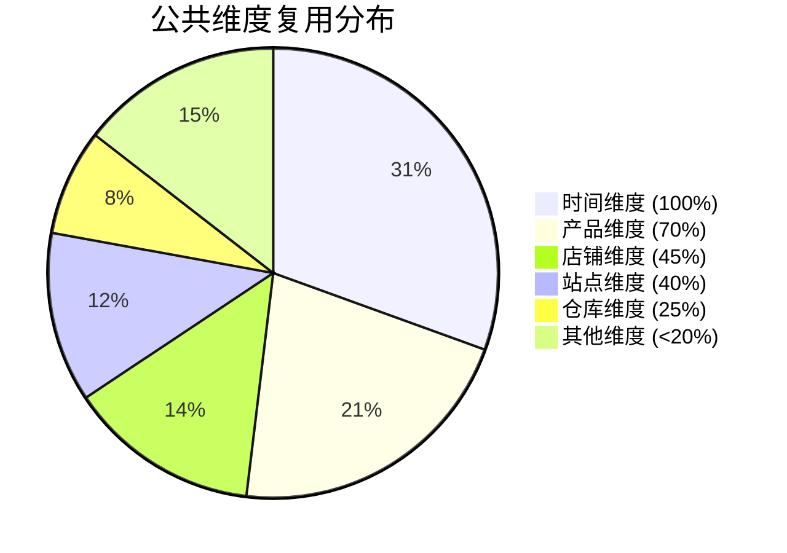
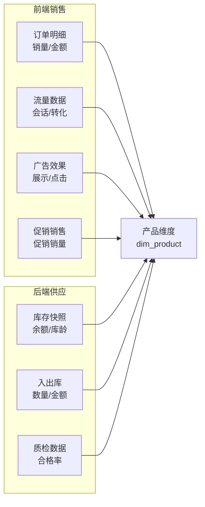
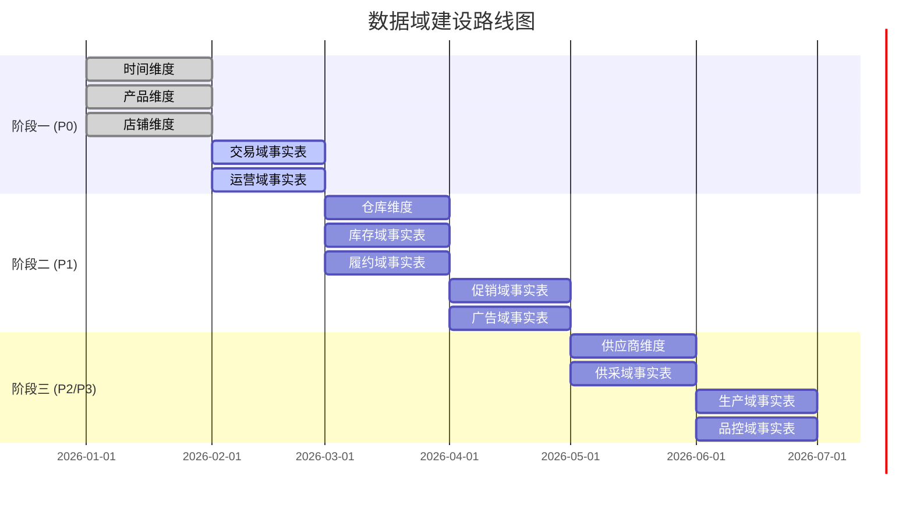

# 总线矩阵（Bus Matrix）	

> **文档版本**: v1.0	
> **创建日期**: 2026-01-15	
> **依赖文件**: `01_一致性维度清单_v1.0.md`, `02_维度属性明细表_v1.0.md`, `01_事实表类型规划_v1.0.md`, `02_事实表粒度定义_v1.0.md`	

---

## 1. 总线矩阵概述	

### 1.1 什么是总线矩阵	

总线矩阵（Bus Matrix）是 Kimball 数据仓库架构的核心设计工具，用于展示：	
- **行**：业务过程（对应事实表）	
- **列**：一致性维度（对应维度表）	
- **交叉点**：表示该业务过程是否使用该维度	

### 1.2 设计价值	

| 价值 | 说明 |	
|------|------|	
| **识别共享维度** | 发现跨业务过程共享的一致性维度 |	
| **规划建设顺序** | 基于维度复用程度确定开发优先级 |	
| **保证数据一致** | 确保相同维度在不同事实表中定义一致 |	
| **支持跨域分析** | 通过共享维度实现跨域钻取分析 |	

---

## 2. 核心总线矩阵	

### 2.1 P0/P1级核心业务过程 × 公共维度	

<table>
    <thead>
        <tr>
            <th>数据域</th>
            <th>业务过程</th>
            <th>事实表</th>
            <th>时间</th>
            <th>产品</th>
            <th>变体</th>
            <th>店铺</th>
            <th>站点</th>
            <th>仓库</th>
            <th>供应商</th>
            <th>类目</th>
        </tr>
    </thead>
    <tbody>
        <tr>
            <td rowspan="6">交易域</td>
            <td>创建订单</td>
            <td>fct_trd_order</td>
            <td>✓</td>
            <td></td>
            <td></td>
            <td>✓</td>
            <td>✓</td>
            <td></td>
            <td></td>
            <td></td>
        </tr>
        <tr>
            <td>订单明细</td>
            <td>fct_trd_order_detail</td>
            <td>✓</td>
            <td>✓</td>
            <td>✓</td>
            <td>✓</td>
            <td>✓</td>
            <td></td>
            <td></td>
            <td>✓</td>
        </tr>
        <tr>
            <td>支付订单</td>
            <td>fct_trd_payment</td>
            <td>✓</td>
            <td></td>
            <td></td>
            <td>✓</td>
            <td>✓</td>
            <td></td>
            <td></td>
            <td></td>
        </tr>
        <tr>
            <td>结算订单</td>
            <td>fct_trd_settlement</td>
            <td>✓</td>
            <td></td>
            <td></td>
            <td>✓</td>
            <td>✓</td>
            <td></td>
            <td></td>
            <td></td>
        </tr>
        <tr>
            <td>发布评价</td>
            <td>fct_trd_review</td>
            <td>✓</td>
            <td>✓</td>
            <td></td>
            <td></td>
            <td>✓</td>
            <td></td>
            <td></td>
            <td></td>
        </tr>
        <tr>
            <td>订单履约</td>
            <td>fct_trd_order_fulfillment</td>
            <td>✓</td>
            <td>✓</td>
            <td></td>
            <td>✓</td>
            <td>✓</td>
            <td>✓</td>
            <td></td>
            <td></td>
        </tr>
        <tr>
            <td rowspan="3">运营域</td>
            <td>上架链接</td>
            <td>fct_op_listing</td>
            <td>✓</td>
            <td>✓</td>
            <td></td>
            <td>✓</td>
            <td>✓</td>
            <td></td>
            <td></td>
            <td>✓</td>
        </tr>
        <tr>
            <td>监控流量</td>
            <td>fct_op_traffic_daily</td>
            <td>✓</td>
            <td>✓</td>
            <td></td>
            <td>✓</td>
            <td>✓</td>
            <td></td>
            <td></td>
            <td></td>
        </tr>
        <tr>
            <td>自然流量</td>
            <td>fct_op_organic_daily</td>
            <td>✓</td>
            <td>✓</td>
            <td></td>
            <td></td>
            <td>✓</td>
            <td></td>
            <td></td>
            <td></td>
        </tr>
        <tr>
            <td rowspan="4">库存域</td>
            <td>商品入库</td>
            <td>fct_inv_stock_in</td>
            <td>✓</td>
            <td>✓</td>
            <td></td>
            <td></td>
            <td></td>
            <td>✓</td>
            <td>✓</td>
            <td></td>
        </tr>
        <tr>
            <td>商品出库</td>
            <td>fct_inv_stock_out</td>
            <td>✓</td>
            <td>✓</td>
            <td></td>
            <td></td>
            <td></td>
            <td>✓</td>
            <td></td>
            <td></td>
        </tr>
        <tr>
            <td>库存盘点</td>
            <td>fct_inv_stock_daily</td>
            <td>✓</td>
            <td>✓</td>
            <td></td>
            <td></td>
            <td></td>
            <td>✓</td>
            <td></td>
            <td></td>
        </tr>
        <tr>
            <td>库龄分析</td>
            <td>fct_inv_aging_daily</td>
            <td>✓</td>
            <td>✓</td>
            <td></td>
            <td></td>
            <td></td>
            <td>✓</td>
            <td></td>
            <td></td>
        </tr>
        <tr>
            <td rowspan="4">履约域</td>
            <td>发货配送</td>
            <td>fct_fl_shipment</td>
            <td>✓</td>
            <td>✓</td>
            <td></td>
            <td></td>
            <td></td>
            <td>✓</td>
            <td></td>
            <td></td>
        </tr>
        <tr>
            <td>FBA入仓</td>
            <td>fct_fl_fba_inbound</td>
            <td>✓</td>
            <td>✓</td>
            <td></td>
            <td></td>
            <td></td>
            <td>✓</td>
            <td></td>
            <td></td>
        </tr>
        <tr>
            <td>处理退货</td>
            <td>fct_fl_return</td>
            <td>✓</td>
            <td>✓</td>
            <td></td>
            <td></td>
            <td></td>
            <td></td>
            <td></td>
            <td></td>
        </tr>
        <tr>
            <td>物流履约</td>
            <td>fct_fl_delivery_snapshot</td>
            <td>✓</td>
            <td></td>
            <td></td>
            <td></td>
            <td></td>
            <td>✓</td>
            <td></td>
            <td></td>
        </tr>
        <tr>
            <td rowspan="3">促销域</td>
            <td>促销活动</td>
            <td>fct_prm_promotion</td>
            <td>✓</td>
            <td></td>
            <td></td>
            <td>✓</td>
            <td>✓</td>
            <td></td>
            <td></td>
            <td></td>
        </tr>
        <tr>
            <td>促销销售</td>
            <td>fct_prm_sales_daily</td>
            <td>✓</td>
            <td>✓</td>
            <td></td>
            <td>✓</td>
            <td>✓</td>
            <td></td>
            <td></td>
            <td></td>
        </tr>
        <tr>
            <td>促销费用</td>
            <td>fct_prm_cost</td>
            <td>✓</td>
            <td></td>
            <td></td>
            <td></td>
            <td></td>
            <td></td>
            <td></td>
            <td></td>
        </tr>
        <tr>
            <td rowspan="4">广告域</td>
            <td>广告活动</td>
            <td>fct_ads_campaign</td>
            <td>✓</td>
            <td></td>
            <td></td>
            <td>✓</td>
            <td>✓</td>
            <td></td>
            <td></td>
            <td></td>
        </tr>
        <tr>
            <td>关键词投放</td>
            <td>fct_ads_keyword</td>
            <td>✓</td>
            <td>✓</td>
            <td></td>
            <td></td>
            <td></td>
            <td></td>
            <td></td>
            <td></td>
        </tr>
        <tr>
            <td>广告效果</td>
            <td>fct_ads_performance_daily</td>
            <td>✓</td>
            <td>✓</td>
            <td></td>
            <td>✓</td>
            <td>✓</td>
            <td></td>
            <td></td>
            <td></td>
        </tr>
        <tr>
            <td>关键词效果</td>
            <td>fct_ads_keyword_daily</td>
            <td>✓</td>
            <td>✓</td>
            <td></td>
            <td></td>
            <td>✓</td>
            <td></td>
            <td></td>
            <td></td>
        </tr>
    </tbody>
</table>

---

## 3. 完整总线矩阵（含专属维度）	

### 3.1 交易域完整矩阵	

| 业务过程 | 时间 | 产品 | 店铺 | 站点 | 支付方式 | 订单状态 | 评价等级 |	
|----------|------|------|------|------|----------|----------|----------|	
| 创建订单 | ✓ | | ✓ | ✓ | | ✓ | |	
| 订单明细 | ✓ | ✓ | ✓ | ✓ | | ✓ | |	
| 支付订单 | ✓ | | ✓ | ✓ | ✓ | | |	
| 结算订单 | ✓ | | ✓ | ✓ | | | |	
| 发布评价 | ✓ | ✓ | | ✓ | | | ✓ |	

### 3.2 广告域完整矩阵	

| 业务过程 | 时间 | 产品 | 店铺 | 广告类型 | 匹配类型 | 广告位 | 关键词 |	
|----------|------|------|------|----------|----------|--------|--------|	
| 广告活动 | ✓ | | ✓ | ✓ | | | |	
| 关键词投放 | ✓ | ✓ | | | ✓ | | ✓ |	
| 广告效果 | ✓ | ✓ | ✓ | ✓ | | ✓ | |	
| 关键词效果 | ✓ | ✓ | | | ✓ | | ✓ |	

### 3.3 库存域完整矩阵	

| 业务过程 | 时间 | 产品 | 仓库 | 库存状态 | 库龄区间 | 仓库类型 |	
|----------|------|------|------|----------|----------|----------|	
| 商品入库 | ✓ | ✓ | ✓ | | | ✓ |	
| 商品出库 | ✓ | ✓ | ✓ | | | ✓ |	
| 库存盘点 | ✓ | ✓ | ✓ | ✓ | | ✓ |	
| 库龄分析 | ✓ | ✓ | ✓ | | ✓ | ✓ |	

### 3.4 品控域完整矩阵	

| 业务过程 | 时间 | 产品 | 供应商 | 检验类型 | 缺陷类型 | 质量等级 |	
|----------|------|------|--------|----------|----------|----------|	
| 来料质检 | ✓ | ✓ | ✓ | ✓ | ✓ | ✓ |	
| 过程检验 | ✓ | ✓ | | ✓ | ✓ | ✓ |	
| 成品检验 | ✓ | ✓ | | ✓ | ✓ | ✓ |	

---

## 4. 维度复用度分析	

### 4.1 公共维度复用统计	

| 排名 | 维度 | 覆盖事实表数 | 复用率 |	
|------|------|-------------|--------|	
| 1 | 时间维度 | 40 | 100% |	
| 2 | 产品维度 | 28 | 70% |	
| 3 | 店铺维度 | 18 | 45% |	
| 4 | 站点维度 | 16 | 40% |	
| 5 | 仓库维度 | 10 | 25% |	
| 6 | 类目维度 | 8 | 20% |	
| 7 | 供应商维度 | 6 | 15% |	
| 8 | 变体维度 | 5 | 12.5% |	

### 4.2 维度复用可视化	

---

## 5. 跨域分析路径	

### 5.1 基于产品维度的跨域分析	

通过产品维度可关联分析：	

### 5.2 基于店铺+时间的分析场景	

| 分析场景 | 涉及事实表 | 分析价值 |	
|----------|-----------|----------|	
| 店铺日销售分析 | 订单明细 + 流量 | 销售额、转化率趋势 |	
| 店铺广告ROI | 广告效果 + 订单明细 | 广告投入产出分析 |	
| 店铺促销效果 | 促销销售 + 订单明细 | 促销前后对比 |	
| 店铺利润分析 | 结算 + 利润月快照 | 盈利能力分析 |	

---

## 6. 建设路线图建议	

### 6.1 分阶段建设顺序	

### 6.2 优先级建议	

| 优先级 | 待建设内容 | 依赖 | 预计时间 |	
|--------|-----------|------|----------|	
| P0-高 | 时间、产品、店铺维度 | 无 | 2周 |	
| P0-高 | 交易域事实表 | P0维度 | 3周 |	
| P0-高 | 运营域事实表 | P0维度 | 2周 |	
| P1-中 | 库存、履约域 | 仓库维度 | 4周 |	
| P1-中 | 促销、广告域 | P0维度 | 4周 |	
| P2-低 | 供采、生产、品控域 | 供应商维度 | 6周 |	

---

## 7. 总结	

### 7.1 核心数据	

| 指标 | 数值 |	
|------|------|	
| 数据域总数 | 16 |	
| 业务过程总数 | 78 |	
| 事实表总数 | 40 |	
| 维度表总数 | 46 |	
| 度量指标总数 | 54 |	
| 公共维度数 | 10 |	
| 最高复用维度 | 时间维度 (100%) |	

### 7.2 设计特点	

1. **一致性维度**：定义了10个跨域共享的公共维度	
2. **完整覆盖**：覆盖16个数据域的核心业务过程	
3. **可扩展性**：预留了专属维度扩展空间	
4. **分阶段建设**：按P0→P1→P2/P3顺序递进建设	

---

## 更新记录	

| 日期 | 版本 | 更新内容 | 更新人 |	
|------|------|----------|--------|	
| 2026-01-15 | v1.0 | 初始版本，生成完整总线矩阵 | AI架构师 |	
