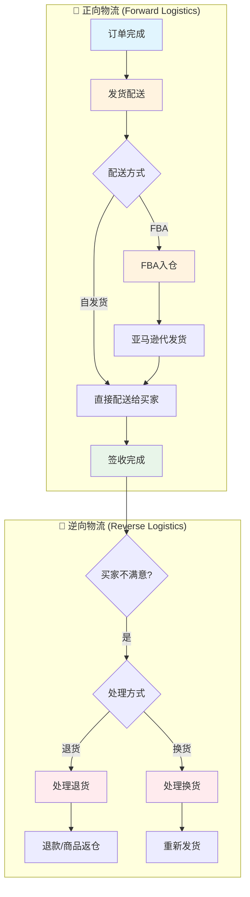

# 履约域业务流程梳理	

> **数据域**: 履约域 (fl)	
> **版本**: v1.0	
> **创建日期**: 2026-01-19	
> **目的**: 梳理履约域业务过程的内在逻辑和时序关系	

---

## 1. 履约域业务全景	

履约域的核心是**"货物从卖家到买家的全过程"**，涵盖**正向物流**和**逆向物流**两大主线。	

---

## 2. 业务流程图	



---

## 3. 业务过程时序关系	

### 3.1 正向物流流程	

<table>
    <thead>
        <tr>
            <th>阶段</th>
            <th>序号</th>
            <th>业务过程</th>
            <th>触发条件</th>
            <th>产出结果</th>
        </tr>
    </thead>
    <tbody>
        <tr>
            <td rowspan="2">一、备货发货</td>
            <td>1</td>
            <td>发货配送 (ship_order)</td>
            <td>订单支付完成后</td>
            <td>包裹交付物流商</td>
        </tr>
        <tr>
            <td>2</td>
            <td>FBA入仓 (fba_inbound)</td>
            <td>商家选择FBA模式时</td>
            <td>商品入库到亚马逊仓库</td>
        </tr>
        <tr>
            <td>二、配送签收</td>
            <td>3</td>
            <td>（累积快照跟踪）</td>
            <td>发货后持续跟踪</td>
            <td>买家签收确认</td>
        </tr>
    </tbody>
</table>

### 3.2 逆向物流流程	

<table>
    <thead>
        <tr>
            <th>阶段</th>
            <th>序号</th>
            <th>业务过程</th>
            <th>触发条件</th>
            <th>产出结果</th>
        </tr>
    </thead>
    <tbody>
        <tr>
            <td rowspan="2">三、售后处理</td>
            <td>4</td>
            <td>处理退货 (process_return)</td>
            <td>买家申请退货</td>
            <td>退款+商品返仓或弃置</td>
        </tr>
        <tr>
            <td>5</td>
            <td>处理换货 (process_exchange)</td>
            <td>买家申请换货</td>
            <td>重新发货新商品</td>
        </tr>
    </tbody>
</table>

---

## 4. 两条业务主线解读	

### 4.1 正向物流：卖家 → 买家	

```
订单完成 → 发货配送 → [头程运输] → [中转] → [尾程配送] → 签收
                ↓
           (可选分支)
                ↓
           FBA入仓 → 亚马逊代发货 → 签收
```

**关键说明**：	
- **发货配送**：是正向物流的起点，记录每个包裹的发货事件	
- **FBA入仓**：是亚马逊FBA模式的前置步骤，商品先入仓，订单产生时由亚马逊发货	
- 两者是**并列关系**，取决于商家的履约模式选择	

### 4.2 逆向物流：买家 → 卖家	

```
签收完成 → 买家不满意 → 申请退货 → 处理退货 → 退款/返仓
                    ↓
                申请换货 → 处理换货 → 重新发货
```

**关键说明**：	
- **处理退货** 和 **处理换货** 是**互斥关系**，买家只能二选一	
- 两者都发生在签收之后，属于售后环节	

---

## 5. 业务过程顺序汇总表	

| 主线 | 顺序 | 业务过程 | 前置条件 | 后续影响 |	
|------|------|----------|----------|----------|	
| 正向 | 1️⃣ | 发货配送 | 订单支付完成 | 触发物流跟踪 |	
| 正向 | 1️⃣ | FBA入仓 | 商家选择FBA模式 | 库存入亚马逊仓 |	
| 正向 | 2️⃣ | （物流跟踪） | 发货后 | 最终签收 |	
| 逆向 | 3️⃣ | 处理退货 | 买家申请退货 | 退款、库存变动 |	
| 逆向 | 3️⃣ | 处理换货 | 买家申请换货 | 重新发货 |	

---

## 6. 为什么原文档"看不懂顺序"	

原文档按**序号18-21**排列，但这个序号是**全局业务过程编号**（跨所有数据域），而非履约域内部的逻辑顺序。	

**原编号的含义**：	
- 18-21 只是在整个数据仓库中的唯一标识（类似ID）	
- 与业务发生的先后顺序无关	

**正确的理解方式**：	
- 按**正向/逆向物流**两条主线理解	
- 发货配送、FBA入仓是**并列**的（选一种履约方式）	
- 处理退货、处理换货是**并列**的（选一种售后方式）	

---

## 更新记录	

| 版本 | 日期 | 更新内容 |	
|------|------|----------|	
| v1.0 | 2026-01-19 | 初始版本，梳理履约域业务流程逻辑 |	
