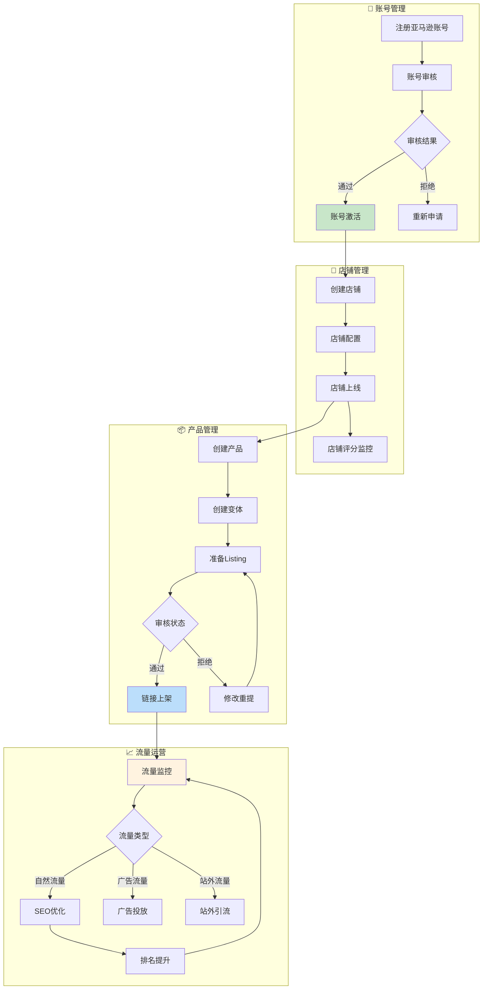

# 运营域完整梳理文档	

> **数据域**: 运营域 (op)	
> **优先级**: P0（核心域）	
> **版本**: v2.0	
> **创建日期**: 2026-01-20	
> **负责人**: 徐恬	
> **分析部门**: 增长分析	

---

## 1. 域定义与业务全景	

### 1.1 域定义	

运营域覆盖亚马逊平台**店铺运营的全流程数据**，包括账号管理、店铺管理、变体管理、链接管理以及流量监控等核心运营活动。是驱动电商增长的**核心业务引擎**。	

### 1.2 业务范围	

```
运营域核心：电商平台运营管理全链路
├── 账号层级
│   ├── 账号注册
│   ├── 账号健康度监控
│   └── 账号权限管理
├── 店铺层级
│   ├── 店铺创建
│   ├── 店铺评分
│   └── 店铺运营状态
├── 产品层级
│   ├── 产品主体(Parent ASIN)
│   ├── 变体管理(Child ASIN)
│   └── 链接上下架
└── 流量层级
    ├── 整体流量(Session/PageViews)
    ├── 自然流量(Organic Traffic)
    ├── 广告流量 → 广告域负责
    └── 站外流量
```

### 1.3 与其他域的边界澄清	

| 业务场景 | 运营域职责 | 其他域职责 |
|----------|-----------|-----------|
| 广告流量分析 | 提供总流量数据作为基准 | 广告域负责广告流量的归因和分析 |
| 链接转化率 | 提供会话数、页面浏览量 | 交易域提供订单数据计算转化 |
| 促销链接表现 | 提供链接级流量数据 | 促销域负责促销活动效果分析 |
| 库存预警 | 提供链接销量预测依据 | 库存域负责实际库存管理 |

> **关键澄清**：运营域管理**链接资产和流量入口**，具体的交易转化、广告投放由专属数据域负责。	

---

## 2. 业务流程图	



---

## 3. 业务过程定义	

### 3.1 业务流程→业务过程映射	

> **推导逻辑**：业务流程中的每个**可度量的关键事件节点**成为一个业务过程	

| 业务流程阶段 | 业务过程 | 英文名称 | 为什么是业务过程 |
|-------------|---------|----------|------------------|
| 账号管理 | 注册账号 | register_account | 账号创建是一个可度量事件，有唯一账号ID |
| 店铺管理 | 创建店铺 | create_store | 店铺创建是一个可度量事件，有唯一店铺ID |
| 产品管理 | 创建变体 | create_variant | 变体创建是一个可度量事件，有ASIN+变体ID |
| 产品管理 | 上架链接 | publish_listing | 链接上架是一个可度量事件，有上架时间 |
| 流量监控 | 监控流量 | monitor_traffic | 流量是持续度量的周期快照数据 |
| 流量监控 | 分析自然流量 | analyze_organic | 自然流量按关键词细分的周期快照 |

### 3.2 业务过程详细定义	

<table>
    <thead>
        <tr>
            <th>序号</th>
            <th>业务过程</th>
            <th>英文名称</th>
            <th>描述</th>
            <th>事实表类型</th>
            <th>粒度声明</th>
            <th>主键组成</th>
        </tr>
    </thead>
    <tbody>
        <tr>
            <td>1</td>
            <td>注册账号</td>
            <td>register_account</td>
            <td>创建亚马逊卖家账号</td>
            <td>事务事实</td>
            <td>每一行代表一个卖家账号的注册事件</td>
            <td>账号ID</td>
        </tr>
        <tr>
            <td>2</td>
            <td>创建店铺</td>
            <td>create_store</td>
            <td>在平台创建店铺</td>
            <td>事务事实</td>
            <td>每一行代表一个店铺的创建事件</td>
            <td>店铺ID</td>
        </tr>
        <tr>
            <td>3</td>
            <td>创建变体</td>
            <td>create_variant</td>
            <td>创建产品变体（颜色、尺寸等）</td>
            <td>事务事实</td>
            <td>每一行代表一个产品变体的创建事件</td>
            <td>ASIN + 变体ID</td>
        </tr>
        <tr>
            <td>4</td>
            <td>上架链接</td>
            <td>publish_listing</td>
            <td>将产品链接上架到平台</td>
            <td>事务事实</td>
            <td>每一行代表一个产品链接的上架事件</td>
            <td>ASIN</td>
        </tr>
        <tr>
            <td>5</td>
            <td>监控流量</td>
            <td>monitor_traffic</td>
            <td>监控店铺/链接整体流量</td>
            <td>周期快照</td>
            <td>每一行代表某天某链接的流量快照</td>
            <td>ASIN + 日期</td>
        </tr>
        <tr>
            <td>6</td>
            <td>分析自然流量</td>
            <td>analyze_organic</td>
            <td>分析自然搜索流量来源</td>
            <td>周期快照</td>
            <td>每一行代表某天某链接某关键词的自然流量</td>
            <td>ASIN + 关键词 + 日期</td>
        </tr>
    </tbody>
</table>

---

## 4. 维度设计	

### 4.1 维度推导逻辑	

> **推导原则**：维度来源于回答"谁/什么/何时/何地/为何"等分析问题	

| 分析问题 | 对应维度 | 维度类型 |
|----------|---------|----------|
| 什么时候创建/上架？ | 时间维度 | 公共维度 |
| 什么产品/链接？ | 产品维度 | 公共维度 |
| 什么变体？ | 变体维度 | 公共维度 |
| 哪个店铺？ | 店铺维度 | 公共维度 |
| 哪个站点市场？ | 站点维度 | 公共维度 |
| 哪个账号？ | 账号维度 | 公共维度 |
| 哪个类目？ | 类目维度 | 公共维度 |
| 链接当前状态？ | 链接状态维度 | 专属维度 |
| 流量来自哪里？ | 流量来源维度 | 专属维度 |
| 什么关键词？ | 关键词维度 | 专属维度 |
| 店铺健康状态？ | 店铺健康维度 | 专属维度 |

### 4.2 维度清单	

#### 公共维度	

| 维度 | 英文名称 | 使用场景 |
|------|----------|----------|
| ✓ 时间维度 | dim_date | 所有业务过程 |
| ✓ 产品维度 | dim_product | 链接、流量分析 |
| ✓ 变体维度 | dim_variant | 变体管理 |
| ✓ 店铺维度 | dim_store | 店铺管理、流量 |
| ✓ 站点维度 | dim_marketplace | 链接、流量 |
| ✓ 账号维度 | dim_account | 账号管理 |
| ✓ 类目维度 | dim_category | 链接分类 |

#### 专属维度	

| 编号 | 维度名称 | 英文名称 | 主键 | 说明 |
|------|----------|----------|------|------|
| DIM-06 | 链接状态维度 | dim_listing_status | listing_status_key | 在售、下架、审核中、抑制、缺货 |
| DIM-07 | 流量来源维度 | dim_traffic_source | traffic_source_key | 自然搜索、广告、站外、推荐位、品牌搜索 |
| DIM-08 | 关键词维度 | dim_keyword | keyword_key | 搜索关键词及其属性（主词、长尾词） |
| DIM-09 | 店铺健康维度 | dim_store_health | store_health_key | 正常、警告、受限、暂停 |
| DIM-10 | 账号类型维度 | dim_account_type | account_type_key | 个人卖家、专业卖家、品牌注册 |

---

## 5. 事实表设计	

### 5.1 事实表清单	

| 编号 | 事实表名称 | 英文表名 | 类型 | 更新频率 | 说明 |
|------|-----------|----------|------|----------|------|
| FCT-08 | 账号事实表 | fct_op_account | 事务事实 | 日 | 记录账号注册和状态变更 |
| FCT-09 | 店铺事实表 | fct_op_store | 事务事实 | 日 | 记录店铺创建和状态变更 |
| FCT-10 | 链接上架事实表 | fct_op_listing | 事务事实 | 日 | 记录链接上架事件 |
| FCT-11 | 链接日快照表 | fct_op_listing_daily | 周期快照 | 日 | 每日链接状态和排名快照 |
| FCT-12 | 流量日快照表 | fct_op_traffic_daily | 周期快照 | 日 | 每日链接级流量快照 |
| FCT-13 | 自然流量日快照表 | fct_op_organic_daily | 周期快照 | 日 | 每日关键词级自然流量快照 |
| FCT-14 | 店铺健康日快照 | fct_op_store_health_daily | 周期快照 | 日 | 每日店铺健康指标快照 |

### 5.2 度量指标	

| 指标名称 | 指标说明 | 聚合方式 | 来源事实表 |
|----------|----------|----------|-----------|
| 链接数 | 链接总数 | SUM | fct_op_listing |
| 在售链接数 | 在售状态的链接数 | SUM | fct_op_listing_daily |
| 上架成功率 | 上架成功/提交数 | AVG | fct_op_listing |
| 会话数 | 页面会话总数(Session) | SUM | fct_op_traffic_daily |
| 页面浏览量 | 页面浏览总数(PageViews) | SUM | fct_op_traffic_daily |
| 单次会话浏览量 | 页面浏览量/会话数 | AVG | fct_op_traffic_daily |
| 转化率 | 订单数/会话数 | AVG | fct_op_traffic_daily + fct_trd_order |
| 自然流量占比 | 自然流量/总流量 | AVG | fct_op_organic_daily |
| 关键词排名 | 搜索结果排名 | AVG | fct_op_organic_daily |
| Buy Box占比 | 获得Buy Box的时间占比 | AVG | fct_op_listing_daily |
| 店铺评分 | 店铺卖家评分 | AVG | fct_op_store_health_daily |
| ODR率 | 订单缺陷率 | AVG | fct_op_store_health_daily |

---

## 6. 总线矩阵	

### 6.1 总线矩阵推导逻辑	

> **推导过程**：对每个业务过程，判断哪些维度可以用于分析	

```
业务过程 + 维度 = 分析视角
例如：流量监控 + 时间 = 按时间分析流量趋势
      流量监控 + 流量来源 = 按来源分析流量结构
      自然流量 + 关键词 = 按关键词分析搜索排名
```

### 6.2 运营域总线矩阵	

| 业务过程 | 时间 | 产品 | 变体 | 店铺 | 站点 | 账号 | 类目 | 链接状态 | 流量来源 | 关键词 | 店铺健康 |
|----------|------|------|------|------|------|------|------|----------|----------|--------|----------|
| 注册账号 | ✓ | | | | ✓ | ✓ | | | | | |
| 创建店铺 | ✓ | | | ✓ | ✓ | ✓ | | | | | ✓ |
| 创建变体 | ✓ | ✓ | ✓ | ✓ | ✓ | | ✓ | | | | |
| 上架链接 | ✓ | ✓ | | ✓ | ✓ | | ✓ | ✓ | | | |
| 监控流量 | ✓ | ✓ | | ✓ | ✓ | | | | ✓ | | |
| 分析自然流量 | ✓ | ✓ | | | ✓ | | | | ✓ | ✓ | |

### 6.3 总线矩阵解读	

- **时间维度**：所有业务过程都需要按时间分析趋势	
- **产品维度**：变体创建、链接上架和流量监控需要知道哪个产品	
- **店铺/站点维度**：大部分业务过程需要区分店铺和站点，支持多店铺多站点运营分析	
- **账号维度**：仅用于账号和店铺管理，区分账号主体	
- **链接状态维度**：仅用于上架链接，跟踪链接生命周期	
- **流量来源维度**：用于流量监控，区分自然/广告/站外流量	
- **关键词维度**：仅用于自然流量分析，关联关键词搜索排名	
- **店铺健康维度**：用于店铺管理，监控店铺健康状态	

---

## 7. 跨域关联说明	

### 7.1 与交易域的关联	

| 运营域事件 | 关联交易域事件 | 关联方式 |
|-----------|---------------|----------|
| 链接流量 | 订单转化 | ASIN关联，计算流量转化率 |
| 会话数 | 订单数 | ASIN + 日期关联 |
| Buy Box占比 | 订单份额 | ASIN + 日期关联 |

### 7.2 与广告域的关联	

| 运营域事件 | 关联广告域事件 | 关联方式 |
|-----------|---------------|----------|
| 总流量 | 广告流量 | ASIN + 日期关联 |
| 自然流量 | 自然流量 = 总流量 - 广告流量 | 差值计算 |
| 关键词排名 | 广告关键词 | 关键词维度共享 |

### 7.3 与促销域的关联	

| 运营域事件 | 关联促销域事件 | 关联方式 |
|-----------|---------------|----------|
| 链接流量 | 促销流量 | ASIN + 促销ID关联 |
| 会话提升 | 促销效果 | 活动期间流量对比 |

### 7.4 与库存域的关联	

| 运营域事件 | 关联库存域事件 | 关联方式 |
|-----------|---------------|----------|
| 链接状态(缺货) | FBA库存 | ASIN关联 |
| 销售预测 | 补货建议 | 历史销量 + 库存数据 |

---

## 更新记录	

| 版本 | 日期 | 更新内容 |
|------|------|----------|
| v1.0 | 2026-01-15 | 初始版本，简单梳理 |
| v1.1 | 2026-01-16 | 合并业务过程清单与粒度定义表格，添加负责人信息 |
| v2.0 | 2026-01-20 | 完整梳理版本，新增业务全景、业务流程图、维度推导逻辑、总线矩阵解读、跨域关联说明 |
