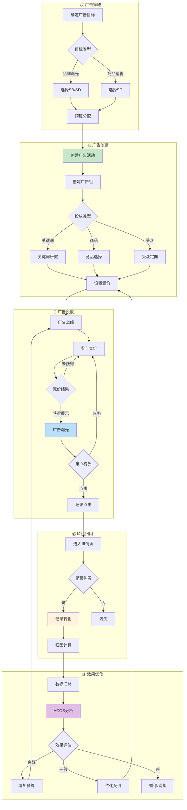

# 广告域完整梳理文档	

> **数据域**: 广告域 (ads)	
> **优先级**: P1（重要域）	
> **版本**: v2.0	
> **创建日期**: 2026-01-20	
> **负责人**: 徐恬	
> **分析部门**: 增长分析	

---

## 1. 域定义与业务全景	

### 1.1 域定义	

广告域覆盖亚马逊平台**广告投放的全流程数据**，包括广告活动创建、关键词投放、效果监控和广告流量分析，是获取付费流量的核心渠道。	

### 1.2 业务范围	

```
广告域核心：付费广告的投放与效果管理
├── 广告类型
│   ├── SP (Sponsored Products) 商品推广
│   ├── SB (Sponsored Brands) 品牌推广
│   ├── SD (Sponsored Display) 展示广告
│   └── DSP (Demand Side Platform) 程序化广告
├── 广告层级
│   ├── 广告活动 (Campaign)
│   ├── 广告组 (Ad Group)
│   └── 广告/关键词 (Ad/Keyword)
├── 投放策略
│   ├── 关键词投放 (Keyword Targeting)
│   ├── 商品投放 (Product Targeting)
│   ├── 受众投放 (Audience Targeting)
│   └── 类目投放 (Category Targeting)
└── 效果指标
    ├── 曝光 (Impressions)
    ├── 点击 (Clicks)
    ├── 转化 (Conversions)
    └── ACOS/ROAS
```

### 1.3 与相关域的边界澄清	

| 业务场景 | 广告域职责 | 其他域职责 |
|----------|-----------|-----------|
| 广告转化订单 | 广告归因、ACOS计算 | 交易域负责订单本身 |
| 广告流量 | 记录广告带来的流量 | 运营域负责总流量和自然流量 |
| 广告关键词 | 广告关键词竞价 | 运营域负责自然排名关键词 |
| 广告支出 | 记录广告花费 | 财务域负责成本核算 |

> **关键澄清**：广告域关注**付费流量的获取和转化效率**，订单、自然流量、财务核算由专属域负责。	

---

## 2. 业务流程图	



---

## 3. 业务过程定义	

### 3.1 业务流程→业务过程映射	

> **推导逻辑**：业务流程中的每个**可度量的关键事件节点**成为一个业务过程	

| 业务流程阶段 | 业务过程 | 英文名称 | 为什么是业务过程 |
|-------------|---------|----------|------------------|
| 广告创建 | 创建广告活动 | create_campaign | 活动创建是可度量事件，有唯一广告活动ID |
| 广告创建 | 投放关键词 | bid_keyword | 每个关键词竞价设置是可独立度量的 |
| 广告投放 | 记录广告展示 | log_impression | 展示是可度量的曝光事件 |
| 广告投放 | 记录广告点击 | log_click | 点击是可度量的用户行为 |
| 转化归因 | 核算广告支出 | calc_ad_spend | 支出是可度量的财务数据 |
| 转化归因 | 分析广告流量 | analyze_ad_traffic | 广告流量是持续度量的快照数据 |

### 3.2 业务过程详细定义	

<table>
    <thead>
        <tr>
            <th>序号</th>
            <th>业务过程</th>
            <th>英文名称</th>
            <th>描述</th>
            <th>事实表类型</th>
            <th>粒度声明</th>
            <th>主键组成</th>
        </tr>
    </thead>
    <tbody>
        <tr>
            <td>1</td>
            <td>创建广告活动</td>
            <td>create_campaign</td>
            <td>创建广告活动</td>
            <td>事务事实</td>
            <td>每一行代表一个广告活动的创建事件</td>
            <td>广告活动ID</td>
        </tr>
        <tr>
            <td>2</td>
            <td>投放关键词</td>
            <td>bid_keyword</td>
            <td>设置关键词竞价投放</td>
            <td>事务事实</td>
            <td>每一行代表一个广告活动中的一个关键词竞价设置</td>
            <td>广告活动ID + 广告组ID + 关键词ID</td>
        </tr>
        <tr>
            <td>3</td>
            <td>记录广告展示</td>
            <td>log_impression</td>
            <td>记录广告展示次数</td>
            <td>周期快照</td>
            <td>每一行代表某天某广告某关键词的展示数据</td>
            <td>广告活动ID + 关键词ID + 日期</td>
        </tr>
        <tr>
            <td>4</td>
            <td>记录广告点击</td>
            <td>log_click</td>
            <td>记录广告点击次数</td>
            <td>周期快照</td>
            <td>每一行代表某天某广告某关键词的点击数据</td>
            <td>广告活动ID + 关键词ID + 日期</td>
        </tr>
        <tr>
            <td>5</td>
            <td>核算广告支出</td>
            <td>calc_ad_spend</td>
            <td>核算广告花费</td>
            <td>周期快照</td>
            <td>每一行代表某天某广告活动的花费记录</td>
            <td>广告活动ID + 日期</td>
        </tr>
        <tr>
            <td>6</td>
            <td>分析广告流量</td>
            <td>analyze_ad_traffic</td>
            <td>分析广告带来的流量</td>
            <td>周期快照</td>
            <td>每一行代表某天某链接的广告流量快照</td>
            <td>ASIN + 日期</td>
        </tr>
    </tbody>
</table>

---

## 4. 维度设计	

### 4.1 维度推导逻辑	

> **推导原则**：维度来源于回答"谁/什么/何时/何地/为何"等分析问题	

| 分析问题 | 对应维度 | 维度类型 |
|----------|---------|----------|
| 什么时候投放？ | 时间维度 | 公共维度 |
| 什么时段投放？ | 时段维度 | 公共维度 |
| 推广什么产品？ | 产品维度 | 公共维度 |
| 哪个店铺投放？ | 店铺维度 | 公共维度 |
| 哪个站点投放？ | 站点维度 | 公共维度 |
| 什么广告类型？ | 广告类型维度 | 专属维度 |
| 什么匹配方式？ | 匹配类型维度 | 专属维度 |
| 什么广告位？ | 广告位维度 | 专属维度 |
| 投放什么关键词？ | 关键词维度 | 共享维度 |

### 4.2 维度清单	

#### 公共维度	

| 维度 | 英文名称 | 使用场景 |
|------|----------|----------|
| ✓ 时间维度 | dim_date | 所有业务过程 |
| ✓ 时段维度 | dim_time_period | 分时段投放分析 |
| ✓ 产品维度 | dim_product | 广告投放商品 |
| ✓ 变体维度 | dim_variant | 变体级别投放 |
| ✓ 店铺维度 | dim_store | 广告活动 |
| ✓ 站点维度 | dim_marketplace | 广告投放 |

#### 专属维度	

| 编号 | 维度名称 | 英文名称 | 主键 | 说明 |
|------|----------|----------|------|------|
| DIM-15 | 广告类型维度 | dim_ad_type | ad_type_key | SP(商品推广)、SB(品牌推广)、SD(展示广告)、DSP |
| DIM-16 | 匹配类型维度 | dim_match_type | match_type_key | 精确匹配、短语匹配、广泛匹配、自动投放 |
| DIM-17 | 广告位维度 | dim_ad_placement | placement_key | 搜索顶部、搜索其他、商品详情页、站外 |
| DIM-18 | 广告目标维度 | dim_ad_targeting | targeting_key | 关键词投放、商品投放、受众投放、类目投放 |
| DIM-08 | 关键词维度 | dim_keyword | keyword_key | 搜索关键词（与运营域共享） |
| DIM-19 | 广告状态维度 | dim_ad_status | ad_status_key | 启用、暂停、已归档、已结束 |

---

## 5. 事实表设计	

### 5.1 事实表清单	

| 编号 | 事实表名称 | 英文表名 | 类型 | 更新频率 | 说明 |
|------|-----------|----------|------|----------|------|
| FCT-19 | 广告活动事实表 | fct_ads_campaign | 事务事实 | 日 | 记录广告活动创建及状态变更 |
| FCT-20 | 广告组事实表 | fct_ads_adgroup | 事务事实 | 日 | 记录广告组设置 |
| FCT-21 | 关键词投放事实表 | fct_ads_keyword | 事务事实 | 日 | 记录关键词竞价设置 |
| FCT-22 | 广告效果日快照 | fct_ads_performance_daily | 周期快照 | 日 | 每日广告展示/点击/花费/转化 |
| FCT-23 | 关键词效果日快照 | fct_ads_keyword_daily | 周期快照 | 日 | 每日关键词级表现 |
| FCT-24 | 广告位效果日快照 | fct_ads_placement_daily | 周期快照 | 日 | 每日广告位级表现 |
| FCT-25 | 搜索词报告事实表 | fct_ads_search_term | 周期快照 | 日 | 实际触发搜索词数据 |

### 5.2 度量指标	

| 指标名称 | 指标说明 | 聚合方式 | 来源事实表 |
|----------|----------|----------|-----------|
| 活动数 | 广告活动总数 | SUM | fct_ads_campaign |
| 广告组数 | 广告组总数 | SUM | fct_ads_adgroup |
| 关键词数 | 投放关键词总数 | SUM | fct_ads_keyword |
| 竞价金额 | 关键词竞价设置 | AVG | fct_ads_keyword |
| 展示量 | 广告展示次数 | SUM | fct_ads_performance_daily |
| 点击量 | 广告点击次数 | SUM | fct_ads_performance_daily |
| 点击率(CTR) | 点击量/展示量 | CALC | 计算指标 |
| 广告支出 | 广告花费总额 | SUM | fct_ads_performance_daily |
| 广告订单数 | 广告归因订单数 | SUM | fct_ads_performance_daily |
| 广告销售额 | 广告归因销售额 | SUM | fct_ads_performance_daily |
| ACOS | 广告支出/广告销售额 | CALC | 计算指标 |
| ROAS | 广告销售额/广告支出 | CALC | 计算指标 |
| 转化率(CVR) | 订单数/点击量 | CALC | 计算指标 |
| CPC | 广告支出/点击量 | CALC | 计算指标 |
| CPM | 广告支出/展示量*1000 | CALC | 计算指标 |

---

## 6. 总线矩阵	

### 6.1 总线矩阵推导逻辑	

> **推导过程**：对每个业务过程，判断哪些维度可以用于分析	

```
业务过程 + 维度 = 分析视角
例如：广告活动 + 广告类型 = 按SP/SB/SD分析活动表现
      广告效果 + 广告位 = 按广告位分析转化率
      关键词效果 + 匹配类型 = 按匹配类型优化投放
```

### 6.2 广告域总线矩阵	

| 业务过程 | 时间 | 时段 | 产品 | 店铺 | 站点 | 广告类型 | 匹配类型 | 广告位 | 广告目标 | 关键词 | 广告状态 |
|----------|------|------|------|------|------|----------|----------|--------|----------|--------|----------|
| 创建广告活动 | ✓ | | | ✓ | ✓ | ✓ | | | ✓ | | ✓ |
| 投放关键词 | ✓ | | ✓ | | | ✓ | ✓ | | | ✓ | |
| 记录广告展示 | ✓ | ✓ | ✓ | ✓ | ✓ | ✓ | | ✓ | | | |
| 记录广告点击 | ✓ | ✓ | ✓ | ✓ | ✓ | ✓ | ✓ | ✓ | | ✓ | |
| 核算广告支出 | ✓ | | ✓ | ✓ | ✓ | ✓ | | | | | |
| 分析广告流量 | ✓ | | ✓ | ✓ | ✓ | | | | | | |

### 6.3 总线矩阵解读	

- **时间维度**：所有业务过程都需要按时间分析趋势	
- **时段维度**：用于展示和点击，分析分时段投放效果，优化投放时间	
- **广告类型维度**：核心分析维度，区分SP/SB/SD的投放效果	
- **匹配类型维度**：用于关键词投放，优化精确/广泛匹配策略	
- **广告位维度**：用于展示和点击，分析不同广告位的转化差异	
- **关键词维度**：用于关键词投放和点击，是SEM优化的核心	
- **广告目标维度**：区分关键词/商品/受众投放，优化投放策略	

---

## 7. 跨域关联说明	

### 7.1 与交易域的关联	

| 广告域事件 | 关联交易域事件 | 关联方式 |
|-----------|---------------|----------|
| 广告点击 | 订单创建 | 点击归因窗口(7天/14天) |
| 广告归因 | 订单金额 | 计算广告销售额 |
| 广告ACOS | 订单利润 | 判断广告盈亏 |

### 7.2 与运营域的关联	

| 广告域事件 | 关联运营域事件 | 关联方式 |
|-----------|---------------|----------|
| 广告流量 | 总流量 | ASIN + 日期关联 |
| 广告关键词 | 自然排名关键词 | 关键词维度共享 |
| 广告曝光 | 链接曝光 | 付费vs自然对比 |

### 7.3 与促销域的关联	

| 广告域事件 | 关联促销域事件 | 关联方式 |
|-----------|---------------|----------|
| 广告投放 | 促销活动 | 促销期间广告配合 |
| 广告效果 | 促销效果 | A+B联合归因 |

### 7.4 与财务域的关联	

| 广告域事件 | 关联财务域事件 | 关联方式 |
|-----------|---------------|----------|
| 广告支出 | 营销费用 | 费用入账 |
| ACOS | 利润率 | 广告成本影响利润 |

---

## 更新记录	

| 版本 | 日期 | 更新内容 |
|------|------|----------|
| v1.0 | 2026-01-15 | 初始版本，简单梳理 |
| v1.1 | 2026-01-16 | 合并业务过程清单与粒度定义表格，添加负责人信息 |
| v2.0 | 2026-01-20 | 完整梳理版本，新增业务全景、业务流程图、维度推导逻辑、总线矩阵解读、跨域关联说明 |
