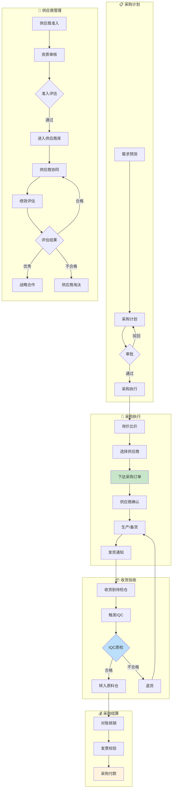

# 供采域完整梳理文档	

> **数据域**: 供采域 (sup)	
> **优先级**: P2（一般域）	
> **版本**: v2.1	
> **创建日期**: 2026-01-20	
> **负责人**: 王苗苗	
> **分析部门**: 流通分析	

---

## 1. 域定义与业务全景	

### 1.1 域定义	

供采域覆盖**供应链协同与采购执行的全流程数据**，包括采购计划、采购订单、采购付款和供应商管理，是保障生产和库存的关键环节。	

### 1.2 业务范围	

```
供采域核心：采购全流程与供应商管理
├── 采购计划
│   ├── 需求预测
│   ├── 采购计划单
│   └── 审批流程
├── 采购执行
│   ├── 询价比价
│   ├── 采购订单
│   ├── 订单跟踪
│   └── 收货验收
├── 采购结算
│   ├── 对账核销
│   ├── 采购付款
│   └── 发票管理
└── 供应商管理
    ├── 供应商准入
    ├── 供应商评估
    ├── 供应商协同
    └── 供应商淘汰
```

### 1.3 与相关域的边界澄清	

| 业务场景 | 供采域职责 | 其他域职责 |
|----------|-----------|-----------|
| 物料入库 | 完成采购收货（送达待检仓） | 库存域负责待检仓入库登记 |
| 来料质检 | 触发质检需求 | 品控域负责检验执行 |
| 生产物料 | 按BOM采购物料 | 研发域提供BOM清单 |
| 采购成本 | 记录采购价格 | 财务域负责成本核算 |

> **关键澄清**：供采域关注**采购过程和供应商关系**，物料的入库、质检、使用由专属域负责。	

---

## 2. 业务流程图	



---

## 3. 业务过程定义	

### 3.1 业务流程→业务过程映射	

> **推导逻辑**：业务流程中的每个**可度量的关键事件节点**成为一个业务过程	

| 业务流程阶段 | 业务过程 | 英文名称 | 为什么是业务过程 |
|-------------|---------|----------|------------------|
| 采购计划 | 制定采购计划 | create_pr_plan | 计划是可度量事件，有计划单号和物料明细 |
| 采购执行 | 下达采购订单 | create_po | 订单是可度量事件，有订单号和金额 |
| 采购结算 | 执行采购付款 | pay_po | 付款是可度量事件，有付款金额和时间 |
| 供应商管理 | 供应商准入 | qualify_supplier | 准入是可度量事件，有评估结果 |
| 供应商管理 | 供应商协同 | collaborate_supplier | 协同是可度量事件，有记录ID |

### 3.2 业务过程详细定义	

<table>
    <thead>
        <tr>
            <th>序号</th>
            <th>业务过程</th>
            <th>英文名称</th>
            <th>描述</th>
            <th>事实表类型</th>
            <th>粒度声明</th>
            <th>主键组成</th>
        </tr>
    </thead>
    <tbody>
        <tr>
            <td>1</td>
            <td>制定采购计划</td>
            <td>create_pr_plan</td>
            <td>制定采购需求计划</td>
            <td>事务事实</td>
            <td>每一行代表一个采购计划中的一个物料需求</td>
            <td>计划单号 + 物料编码</td>
        </tr>
        <tr>
            <td>2</td>
            <td>下达采购订单</td>
            <td>create_po</td>
            <td>向供应商下达采购订单</td>
            <td>事务事实</td>
            <td>每一行代表一个采购订单中的一个物料明细</td>
            <td>采购订单号 + 行号</td>
        </tr>
        <tr>
            <td>3</td>
            <td>执行采购付款</td>
            <td>pay_po</td>
            <td>完成采购付款</td>
            <td>事务事实</td>
            <td>每一行代表一笔采购付款记录</td>
            <td>付款单号</td>
        </tr>
        <tr>
            <td>4</td>
            <td>供应商准入</td>
            <td>qualify_supplier</td>
            <td>评估并引入新供应商</td>
            <td>事务事实</td>
            <td>每一行代表一个供应商的准入评估记录</td>
            <td>供应商ID + 评估ID</td>
        </tr>
        <tr>
            <td>5</td>
            <td>供应商协同</td>
            <td>collaborate_supplier</td>
            <td>与供应商协同沟通</td>
            <td>事务事实</td>
            <td>每一行代表一次与供应商的协同沟通记录</td>
            <td>协同记录ID</td>
        </tr>
    </tbody>
</table>

---

## 4. 维度设计	

### 4.1 维度推导逻辑	

> **推导原则**：维度来源于回答"谁/什么/何时/何地/为何"等分析问题	

| 分析问题 | 对应维度 | 维度类型 |
|----------|---------|----------|
| 什么时候采购/付款？ | 时间维度 | 公共维度 |
| 向谁采购？ | 供应商维度 | 公共维度 |
| 采购什么？ | 物料维度 | 专属维度 |
| 什么采购类型？ | 采购类型维度 | 专属维度 |
| 付款方式？ | 付款方式维度 | 专属维度 |
| 供应商等级？ | 供应商等级维度 | 专属维度 |

### 4.2 维度清单	

#### 公共维度	

| 维度 | 英文名称 | 使用场景 |
|------|----------|----------|
| ✓ 时间维度 | dim_date | 所有业务过程 |
| ✓ 供应商维度 | dim_supplier | 所有业务过程 |
| ✓ 仓库维度 | dim_warehouse | 收货入库 |

#### 专属维度	

| 编号 | 维度名称 | 英文名称 | 主键 | 说明 |
|------|----------|----------|------|------|
| DIM-24 | 物料维度 | dim_material | material_key | 原材料/零部件/包装材料 |
| DIM-25 | 采购类型维度 | dim_purchase_type | purchase_type_key | 正常采购、紧急采购、补单采购 |
| DIM-26 | 付款方式维度 | dim_payment_term | payment_term_key | 预付、货到付款、月结、分期 |
| DIM-27 | 供应商等级维度 | dim_supplier_level | supplier_level_key | 战略、优选、合格、观察 |
| DIM-28 | 订单状态维度 | dim_po_status | po_status_key | 待确认、已确认、部分收货、已完成、已取消 |

---

## 5. 事实表设计	

### 5.1 事实表清单	

| 编号 | 事实表名称 | 英文表名 | 类型 | 更新频率 | 说明 |
|------|-----------|----------|------|----------|------|
| FCT-31 | 采购计划事实表 | fct_sup_pr_plan | 事务事实 | 日 | 记录采购计划 |
| FCT-32 | 采购订单事实表 | fct_sup_purchase_order | 事务事实 | 日 | 记录采购订单 |
| FCT-33 | 采购付款事实表 | fct_sup_payment | 事务事实 | 日 | 记录采购付款 |
| FCT-34 | 供应商评估事实表 | fct_sup_supplier_eval | 事务事实 | 月 | 记录供应商评估 |
| FCT-35 | 供应商协同事实表 | fct_sup_collaboration | 事务事实 | 日 | 记录供应商协同 |

### 5.2 度量指标	

| 指标名称 | 指标说明 | 聚合方式 | 来源事实表 |
|----------|----------|----------|-----------|
| 计划数量 | 采购计划物料数量 | SUM | fct_sup_pr_plan |
| 计划金额 | 采购计划金额 | SUM | fct_sup_pr_plan |
| 订单数 | 采购订单总数 | SUM | fct_sup_purchase_order |
| 订单金额 | 采购订单总金额 | SUM | fct_sup_purchase_order |
| 收货数量 | 实际收货数量 | SUM | fct_sup_purchase_order |
| 交付及时率 | 按时交付订单比例 | AVG | fct_sup_purchase_order |
| 付款金额 | 采购付款总额 | SUM | fct_sup_payment |
| 供应商数 | 活跃供应商总数 | SUM | fct_sup_supplier_eval |
| 准入通过率 | 供应商准入通过比例 | AVG | fct_sup_supplier_eval |
| 供应商评分 | 平均供应商评分 | AVG | fct_sup_supplier_eval |

---

## 6. 总线矩阵	

### 6.1 总线矩阵推导逻辑	

> **推导过程**：对每个业务过程，判断哪些维度可以用于分析	

### 6.2 供采域总线矩阵	

| 业务过程 | 时间 | 供应商 | 仓库 | 物料 | 采购类型 | 付款方式 | 供应商等级 | 订单状态 |
|----------|------|--------|------|------|----------|----------|------------|----------|
| 制定采购计划 | ✓ | | | ✓ | ✓ | | | |
| 下达采购订单 | ✓ | ✓ | ✓ | ✓ | ✓ | ✓ | ✓ | ✓ |
| 执行采购付款 | ✓ | ✓ | | | | ✓ | | |
| 供应商准入 | ✓ | ✓ | | | | | ✓ | |
| 供应商协同 | ✓ | ✓ | | | | | ✓ | |

### 6.3 总线矩阵解读	

- **时间维度**：所有业务过程都需要按时间分析采购趋势	
- **供应商维度**：核心分析维度，所有采购活动都围绕供应商	
- **物料维度**：用于计划和订单，分析物料采购情况	
- **采购类型维度**：区分正常/紧急采购，分析采购结构	
- **供应商等级维度**：分析不同等级供应商的表现	

---

## 7. 跨域关联说明	

### 7.1 与库存域的关联	

| 供采域事件 | 关联库存域事件 | 关联方式 |
|-----------|---------------|----------|
| 采购收货 | 待检仓入库 | 采购订单号关联 |
| 收货数量 | 入库数量 | 物料编码 + 数量 |

### 7.2 与品控域的关联	

| 供采域事件 | 关联品控域事件 | 关联方式 |
|-----------|---------------|----------|
| 采购收货 | 来料质检(IQC) | 收货单号关联 |
| 质检结果 | 供应商评估 | 合格率影响评分 |

### 7.3 与研发域的关联	

| 供采域事件 | 关联研发域事件 | 关联方式 |
|-----------|---------------|----------|
| 采购计划 | BOM物料清单 | 物料编码关联 |
| 新物料采购 | BOM变更 | 物料需求传递 |

### 7.4 与财务域的关联	

| 供采域事件 | 关联财务域事件 | 关联方式 |
|-----------|---------------|----------|
| 采购付款 | 应付账款 | 付款单号关联 |
| 采购成本 | 成本核算 | 采购单价 × 数量 |

---

## 更新记录	

| 版本 | 日期 | 更新内容 |
|------|------|----------|
| v1.0 | 2026-01-15 | 初始版本，简单梳理 |
| v1.1 | 2026-01-16 | 合并业务过程清单与粒度定义表格，添加负责人信息 |
| v2.0 | 2026-01-20 | 完整梳理版本，新增业务全景、业务流程图、维度推导逻辑、总线矩阵解读、跨域关联说明 |
| v2.1 | 2026-01-20 | 明确采购收货地点为"待检仓"，更新收货验收流程图，更新与库存域关联 |
