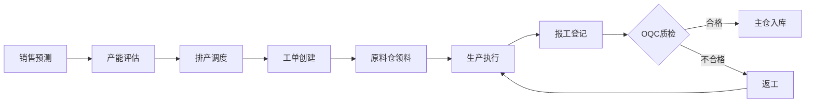

# 生产域完整梳理文档	

> **数据域**: 生产域 (mfg)	
> **优先级**: P2（一般域）	
> **版本**: v2.1	
> **创建日期**: 2026-01-20	
> **负责人**: 王苗苗	
> **分析部门**: 流通分析	

---

## 1. 域定义与业务全景	

### 1.1 域定义	

生产域覆盖**生产制造全过程的数据**，包括产能规划、生产排产、工艺标准、工单执行和设备效能分析。	

### 1.2 业务范围	

```
生产域核心：生产制造全过程管理
├── 产能规划（产能评估、分配、调整）
├── 生产计划（MPS、MRP、排产调度）
├── 工艺管理（工艺路线、标准、工时定额）
├── 工单执行（下发、报工、完工、异常）
└── 设备管理（台账、OEE、维护、故障）
```

### 1.3 与相关域的边界澄清	

| 业务场景 | 生产域职责 | 其他域职责 |
|----------|-----------|-----------|
| 物料领用 | 记录生产用料需求（从原料仓领料） | 库存域负责原料仓出库 |
| 成品入库 | 完工报工（触发OQC） | 品控域负责OQC检验，库存域负责主仓入库 |
| 过程质检 | 触发质检需求 | 品控域负责IPQC检验执行 |

---

## 2. 业务流程图	



---

## 3. 业务过程定义	

<table>
    <thead>
        <tr><th>序号</th><th>业务过程</th><th>英文名称</th><th>描述</th><th>事实表类型</th><th>粒度声明</th><th>主键组成</th></tr>
    </thead>
    <tbody>
        <tr><td>1</td><td>规划产能</td><td>plan_capacity</td><td>规划生产产能</td><td>周期快照</td><td>某车间某月的产能计划</td><td>车间ID + 年月</td></tr>
        <tr><td>2</td><td>安排生产排产</td><td>schedule_production</td><td>安排生产计划</td><td>事务事实</td><td>一个生产订单的排产记录</td><td>生产订单号</td></tr>
        <tr><td>3</td><td>制定工艺标准</td><td>set_process_std</td><td>制定生产工艺标准</td><td>事务事实</td><td>一个产品的工艺标准版本</td><td>产品ID + 工艺版本号</td></tr>
        <tr><td>4</td><td>执行工单</td><td>execute_work_order</td><td>执行生产工单</td><td>事务事实</td><td>一个生产工单的执行记录</td><td>工单号</td></tr>
        <tr><td>5</td><td>分析设备效能</td><td>analyze_oee</td><td>分析设备综合效能</td><td>周期快照</td><td>某设备某天的效能数据</td><td>设备ID + 日期</td></tr>
    </tbody>
</table>

---

## 4. 维度设计	

#### 公共维度	
| 维度 | 英文名称 | 使用场景 |
|------|----------|----------|
| ✓ 时间维度 | dim_date | 所有业务过程 |
| ✓ 产品维度 | dim_product | 工单、工艺 |
| ✓ 仓库维度 | dim_warehouse | 产能规划 |

#### 专属维度	
| 编号 | 维度名称 | 英文名称 | 说明 |
|------|----------|----------|------|
| DIM-29 | 车间维度 | dim_workshop | 生产车间 |
| DIM-30 | 设备维度 | dim_equipment | 生产设备 |
| DIM-31 | 工序维度 | dim_process | 工艺工序 |
| DIM-32 | 班次维度 | dim_shift | 生产班次 |

---

## 5. 事实表设计	

| 编号 | 事实表名称 | 英文表名 | 类型 | 说明 |
|------|-----------|----------|------|------|
| FCT-36 | 产能月快照表 | fct_mfg_capacity_monthly | 周期快照 | 每月产能状态 |
| FCT-37 | 生产工单事实表 | fct_mfg_work_order | 事务事实 | 记录工单执行 |
| FCT-38 | 设备效能日快照 | fct_mfg_oee_daily | 周期快照 | 每日设备效能 |

### 度量指标	
| 指标名称 | 聚合方式 | 来源事实表 |
|----------|----------|-----------|
| 产能数量 | SUM | fct_mfg_capacity_monthly |
| 完工数量 | SUM | fct_mfg_work_order |
| OEE | AVG | fct_mfg_oee_daily |
| 稼动率 | AVG | fct_mfg_oee_daily |

---

## 6. 总线矩阵	

| 业务过程 | 时间 | 产品 | 仓库 | 车间 | 设备 | 工序 | 班次 |
|----------|------|------|------|------|------|------|------|
| 规划产能 | ✓ | | ✓ | ✓ | ✓ | | |
| 安排排产 | ✓ | ✓ | | ✓ | | | |
| 执行工单 | ✓ | ✓ | ✓ | ✓ | ✓ | ✓ | ✓ |
| 分析OEE | ✓ | | | ✓ | ✓ | | ✓ |

---

## 7. 跨域关联说明	

| 生产域事件 | 关联域 | 关联事件 | 关联方式 |
|-----------|-------|----------|----------|
| 物料领用 | 库存域 | 原料仓出库 | 工单号 |
| 完工入库 | 库存域 | 主仓入库 | 工单号 |
| 工序完成 | 品控域 | IPQC过程检验 | 工单号+工序号 |
| 完工报工 | 品控域 | OQC成品检验 | 工单号 |
| 工艺标准 | 研发域 | 产品设计 | 产品ID |

---

## 更新记录	

| 版本 | 日期 | 更新内容 |
|------|------|----------|
| v1.0 | 2026-01-15 | 初始版本 |
| v1.1 | 2026-01-16 | 合并表格，添加负责人 |
| v2.0 | 2026-01-20 | 完整梳理版本 |
| v2.1 | 2026-01-20 | 明确原料来源为"原料仓"，成品去向为"OQC→主仓"，更新业务流程图和跨域关联 |
