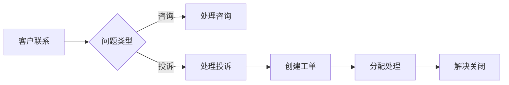

# 客服域完整梳理文档	

> **数据域**: 客服域 (cs)	
> **优先级**: P3（辅助域）	
> **版本**: v2.0	
> **创建日期**: 2026-01-20	
> **负责人**: 徐恬	
> **分析部门**: 增长分析	

---

## 1. 域定义与业务全景	

### 1.1 域定义	

客服域覆盖**客户服务与体验管理的数据**，包括客户咨询、客户投诉、客服工单和退换货预测。	

### 1.2 业务范围	

```
客服域核心：客户服务全流程管理
├── 客户咨询（售前咨询、使用咨询）
├── 客户投诉（产品投诉、服务投诉）
├── 客服工单（工单创建、分配、处理、关闭）
└── 退换货预测（退货预测、换货预测）
```

---

## 2. 业务流程图	



---

## 3. 业务过程定义	

<table>
    <thead>
        <tr><th>序号</th><th>业务过程</th><th>英文名称</th><th>描述</th><th>事实表类型</th><th>粒度声明</th><th>主键组成</th></tr>
    </thead>
    <tbody>
        <tr><td>1</td><td>处理客户咨询</td><td>handle_inquiry</td><td>处理客户咨询问题</td><td>事务事实</td><td>一次客户咨询记录</td><td>咨询ID</td></tr>
        <tr><td>2</td><td>处理客户投诉</td><td>handle_complaint</td><td>处理客户投诉</td><td>事务事实</td><td>一次客户投诉记录</td><td>投诉ID</td></tr>
        <tr><td>3</td><td>创建客服工单</td><td>create_ticket</td><td>创建客服工单</td><td>事务事实</td><td>一个客服工单</td><td>工单ID</td></tr>
        <tr><td>4</td><td>预测退换货</td><td>predict_return</td><td>预测产品退换货概率</td><td>周期快照</td><td>某产品某周期的退货预测</td><td>ASIN + 预测周期</td></tr>
    </tbody>
</table>

---

## 4. 维度设计	

#### 公共维度	
| 维度 | 英文名称 | 使用场景 |
|------|----------|----------|
| ✓ 时间维度 | dim_date | 所有业务过程 |
| ✓ 产品维度 | dim_product | 退换货预测 |
| ✓ 店铺维度 | dim_store | 客服工单 |

#### 专属维度	
| 编号 | 维度名称 | 英文名称 | 说明 |
|------|----------|----------|------|
| DIM-38 | 客诉类型维度 | dim_complaint_type | 客诉类型分类 |
| DIM-39 | 工单状态维度 | dim_ticket_status | 工单状态 |
| DIM-40 | 咨询渠道维度 | dim_inquiry_channel | 咨询渠道(邮件/电话/在线) |

---

## 5. 事实表设计	

| 编号 | 事实表名称 | 英文表名 | 类型 | 说明 |
|------|-----------|----------|------|------|
| FCT-46 | 客户咨询事实表 | fct_cs_inquiry | 事务事实 | 记录客户咨询 |
| FCT-47 | 客诉事实表 | fct_cs_complaint | 事务事实 | 记录客户投诉 |
| FCT-48 | 客服工单事实表 | fct_cs_ticket | 事务事实 | 记录客服工单 |

### 度量指标	
| 指标名称 | 聚合方式 | 来源事实表 |
|----------|----------|-----------|
| 咨询数 | SUM | fct_cs_inquiry |
| 响应时长 | AVG | fct_cs_inquiry |
| 投诉数 | SUM | fct_cs_complaint |
| 解决率 | AVG | fct_cs_complaint |
| 工单数 | SUM | fct_cs_ticket |
| 处理时长 | AVG | fct_cs_ticket |

---

## 6. 总线矩阵	

| 业务过程 | 时间 | 产品 | 店铺 | 客诉类型 | 工单状态 | 咨询渠道 |
|----------|------|------|------|----------|----------|----------|
| 处理咨询 | ✓ | ✓ | ✓ | | | ✓ |
| 处理投诉 | ✓ | ✓ | ✓ | ✓ | | |
| 创建工单 | ✓ | ✓ | ✓ | ✓ | ✓ | |
| 预测退货 | ✓ | ✓ | | | | |

---

## 7. 跨域关联说明	

| 客服域事件 | 关联域 | 关联事件 | 关联方式 |
|-----------|-------|----------|----------|
| 客户投诉 | 交易域 | 订单信息 | 订单号关联 |
| 退货预测 | 履约域 | 退货处理 | ASIN关联 |
| 产品问题 | 品控域 | 缺陷追溯 | 产品ID关联 |

---

## 更新记录	

| 版本 | 日期 | 更新内容 |
|------|------|----------|
| v1.0 | 2026-01-15 | 初始版本 |
| v1.1 | 2026-01-16 | 合并表格，添加负责人 |
| v2.0 | 2026-01-20 | 完整梳理版本 |
