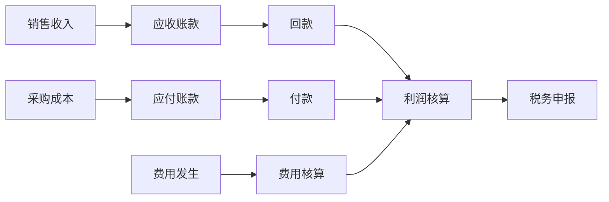

# 财务域完整梳理文档	

> **数据域**: 财务域 (fin)	
> **优先级**: P3（辅助域）	
> **版本**: v2.0	
> **创建日期**: 2026-01-20	
> **负责人**: 应乐乐	
> **分析部门**: 价值分析	

---

## 1. 域定义与业务全景	

### 1.1 域定义	

财务域覆盖**财务资产与管理的数据**，包括应收应付、付款凭证、税务申报、财务审计、利润核算和预算控制。	

### 1.2 业务范围	

```
财务域核心：财务管理全流程
├── 应收应付（销售回款、采购付款）
├── 付款凭证（凭证生成、凭证审核）
├── 税务申报（增值税、企业所得税、关税）
├── 财务审计（内审、外审）
├── 利润核算（产品利润、店铺利润）
└── 预算控制（预算编制、执行监控）
```

---

## 2. 业务流程图	



---

## 3. 业务过程定义	

<table>
    <thead>
        <tr><th>序号</th><th>业务过程</th><th>英文名称</th><th>描述</th><th>事实表类型</th><th>粒度声明</th><th>主键组成</th></tr>
    </thead>
    <tbody>
        <tr><td>1</td><td>记录应收账款</td><td>record_ar</td><td>记录应收账款</td><td>事务事实</td><td>一笔应收账款记录</td><td>应收单号</td></tr>
        <tr><td>2</td><td>记录应付账款</td><td>record_ap</td><td>记录应付账款</td><td>事务事实</td><td>一笔应付账款记录</td><td>应付单号</td></tr>
        <tr><td>3</td><td>生成付款凭证</td><td>create_payment_voucher</td><td>生成付款凭证</td><td>事务事实</td><td>一张付款凭证</td><td>凭证号</td></tr>
        <tr><td>4</td><td>申报税务</td><td>file_tax</td><td>税务申报</td><td>事务事实</td><td>一次税务申报记录</td><td>申报ID</td></tr>
        <tr><td>5</td><td>核算利润</td><td>calc_profit</td><td>利润核算</td><td>周期快照</td><td>某月某店铺/产品的利润</td><td>店铺ID/ASIN + 年月</td></tr>
        <tr><td>6</td><td>控制预算</td><td>control_budget</td><td>预算控制</td><td>周期快照</td><td>某月某部门的预算执行</td><td>部门ID + 年月</td></tr>
    </tbody>
</table>

---

## 4. 维度设计	

#### 公共维度	
| 维度 | 英文名称 | 使用场景 |
|------|----------|----------|
| ✓ 时间维度 | dim_date | 所有业务过程 |
| ✓ 产品维度 | dim_product | 利润核算 |
| ✓ 店铺维度 | dim_store | 利润核算 |
| ✓ 账号维度 | dim_account | 财务核算 |

#### 专属维度	
| 编号 | 维度名称 | 英文名称 | 说明 |
|------|----------|----------|------|
| DIM-41 | 科目维度 | dim_account_subject | 会计科目 |
| DIM-42 | 币种维度 | dim_currency | 币种 |
| DIM-43 | 部门维度 | dim_department | 组织部门 |

---

## 5. 事实表设计	

| 编号 | 事实表名称 | 英文表名 | 类型 | 说明 |
|------|-----------|----------|------|------|
| FCT-49 | 应收应付事实表 | fct_fin_ar_ap | 事务事实 | 记录应收应付 |
| FCT-50 | 凭证事实表 | fct_fin_voucher | 事务事实 | 记录付款凭证 |
| FCT-51 | 利润月快照表 | fct_fin_profit_monthly | 周期快照 | 每月利润核算 |
| FCT-52 | 预算月快照表 | fct_fin_budget_monthly | 周期快照 | 每月预算执行 |

### 度量指标	
| 指标名称 | 聚合方式 | 来源事实表 |
|----------|----------|-----------|
| 应收金额 | SUM | fct_fin_ar_ap |
| 应付金额 | SUM | fct_fin_ar_ap |
| 收入 | SUM | fct_fin_profit_monthly |
| 成本 | SUM | fct_fin_profit_monthly |
| 利润 | SUM | fct_fin_profit_monthly |
| 利润率 | CALC | 计算指标 |
| 预算执行率 | CALC | 计算指标 |

---

## 6. 总线矩阵	

| 业务过程 | 时间 | 产品 | 店铺 | 科目 | 币种 | 部门 |
|----------|------|------|------|------|------|------|
| 应收账款 | ✓ | | ✓ | ✓ | ✓ | |
| 应付账款 | ✓ | | | ✓ | ✓ | |
| 核算利润 | ✓ | ✓ | ✓ | ✓ | ✓ | |
| 控制预算 | ✓ | | | ✓ | ✓ | ✓ |

---

## 7. 跨域关联说明	

| 财务域事件 | 关联域 | 关联事件 | 关联方式 |
|-----------|-------|----------|----------|
| 应收账款 | 交易域 | 订单结算 | 订单号关联 |
| 应付账款 | 供采域 | 采购付款 | 采购订单号 |
| 广告费用 | 广告域 | 广告支出 | 费用归集 |
| 促销费用 | 促销域 | 促销费用 | 费用归集 |

---

## 更新记录	

| 版本 | 日期 | 更新内容 |
|------|------|----------|
| v1.0 | 2026-01-15 | 初始版本 |
| v1.1 | 2026-01-16 | 合并表格，添加负责人 |
| v2.0 | 2026-01-20 | 完整梳理版本 |
