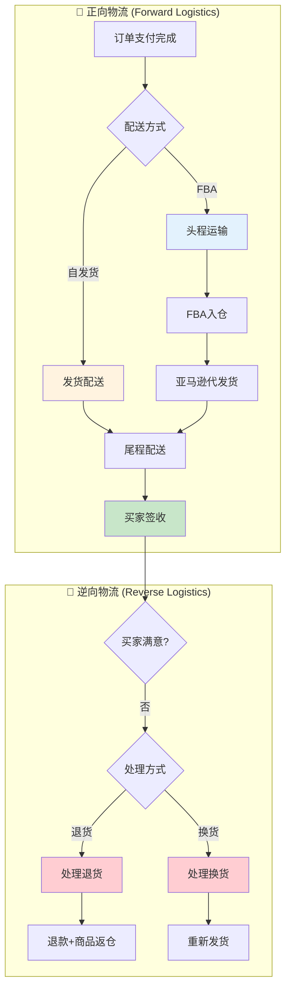

# 履约域完整梳理文档	

> **数据域**: 履约域 (fl)	
> **优先级**: P1（重要域）	
> **版本**: v2.0	
> **创建日期**: 2026-01-19	
> **负责人**: 王苗苗	
> **分析部门**: 流通分析	

---

## 1. 域定义与业务全景	

### 1.1 域定义	

履约域覆盖订单从发货到签收的**物流运输全过程**，包括正向物流（发货配送）和逆向物流（退换货处理）。其核心职责是**物流过程跟踪**，而非库存状态管理。	

### 1.2 业务范围	

```
履约域核心：货物从卖家到买家的运输过程
├── 正向物流（卖家→买家）
│   ├── 自发货：国内仓直发→买家
│   ├── FBA头程：国内仓→FBA仓（运输过程）
│   └── FBA尾程：FBA仓→买家（亚马逊代发货）
└── 逆向物流（买家→卖家）
    ├── 退货：买家退回商品
    └── 换货：换发新商品
```

### 1.3 与库存域的边界澄清	

| 业务事件 | 履约域职责 | 库存域职责 |
|----------|-----------|-----------|
| 头程运输 | 跟踪运输状态（在途、到港、清关） | 记录出库（发货仓）→入库（到达仓） |
| 尾程配送 | 跟踪配送状态（已发货、派送中、已签收） | 记录出库 |
| 退货处理 | 跟踪退货物流、处理退款 | 记录入库（返仓） |

> **关键澄清**：履约域关注的是**运输过程**（时间、状态、物流商），库存域关注的是**库存变化**（数量、金额）。两者通过订单号/物流单号关联。	

---

## 2. 业务流程图	



---

## 3. 业务过程定义	

### 3.1 业务流程→业务过程映射	

> **推导逻辑**：业务流程中的每个**可度量的关键物流事件节点**成为一个业务过程	

| 业务流程阶段 | 业务过程 | 英文名称 | 为什么是业务过程 |
|-------------|---------|----------|------------------|
| 正向物流-发货 | 发货配送 | ship_order | 发货是一个可度量事件，记录物流单号、发货时间 |
| 正向物流-运输 | 头程运输 | first_mile | 头程是可跟踪的运输阶段（国内→海外仓） |
| 正向物流-签收 | 物流履约 | delivery | 累积快照，跟踪从发货到签收的全过程 |
| 逆向物流-退货 | 处理退货 | process_return | 退货是一个可度量事件，有退货原因、处理结果 |
| 逆向物流-换货 | 处理换货 | process_exchange | 换货是一个可度量事件，有换货原因、新发货单 |

### 3.2 业务过程详细定义	

<table>
    <thead>
        <tr>
            <th>序号</th>
            <th>业务过程</th>
            <th>英文名称</th>
            <th>描述</th>
            <th>事实表类型</th>
            <th>粒度声明</th>
            <th>主键组成</th>
        </tr>
    </thead>
    <tbody>
        <tr>
            <td>1</td>
            <td>发货配送</td>
            <td>ship_order</td>
            <td>订单发货，交付物流商</td>
            <td>事务事实</td>
            <td>每一行代表一个包裹的发货记录</td>
            <td>物流单号</td>
        </tr>
        <tr>
            <td>2</td>
            <td>头程运输</td>
            <td>first_mile</td>
            <td>头程运输（国内→海外仓/买家）</td>
            <td>累积快照</td>
            <td>每一行代表一个头程运输任务</td>
            <td>头程单号</td>
        </tr>
        <tr>
            <td>3</td>
            <td>物流履约</td>
            <td>delivery</td>
            <td>全程物流跟踪（发货→签收）</td>
            <td>累积快照</td>
            <td>每一行代表一个订单的履约全过程</td>
            <td>订单号</td>
        </tr>
        <tr>
            <td>4</td>
            <td>处理退货</td>
            <td>process_return</td>
            <td>处理买家退货申请</td>
            <td>事务事实</td>
            <td>每一行代表一笔退货申请记录</td>
            <td>退货单号</td>
        </tr>
        <tr>
            <td>5</td>
            <td>处理换货</td>
            <td>process_exchange</td>
            <td>处理买家换货申请</td>
            <td>事务事实</td>
            <td>每一行代表一笔换货申请记录</td>
            <td>换货单号</td>
        </tr>
    </tbody>
</table>

### 3.3 累积快照事实表说明	

**物流履约累积快照** - 跟踪物流全流程里程碑：	

```
发货 → 头程揽收 → 中转 → 清关 → 尾程派送 → 签收
  │         │        │       │         │        │
  ↓         ↓        ↓       ↓         ↓        ↓
ship_time first_mile transit customs last_mile deliver_time
```

每个里程碑对应一个时间字段，可计算各阶段耗时。	

---

## 4. 维度设计	

### 4.1 维度推导逻辑	

> **推导原则**：维度来源于回答"谁/什么/何时/何地/为何/如何"等分析问题	

| 分析问题 | 对应维度 | 维度类型 |
|----------|---------|----------|
| 什么时候发货/签收？ | 时间维度 | 公共维度 |
| 什么商品？ | 产品维度 | 公共维度 |
| 从哪个仓库发货？ | 仓库维度 | 公共维度 |
| 用什么物流渠道？ | 物流渠道维度 | 专属维度 |
| 当前物流状态？ | 物流状态维度 | 专属维度 |
| 为什么退货？ | 退货原因维度 | 专属维度 |
| 为什么换货？ | 换货原因维度 | 专属维度 |

### 4.2 维度清单	

#### 公共维度	

| 维度 | 英文名称 | 使用场景 |
|------|----------|----------|
| ✓ 时间维度 | dim_date | 所有业务过程 |
| ✓ 产品维度 | dim_product | 发货、退换货 |
| ✓ 仓库维度 | dim_warehouse | 发货、头程运输 |

#### 专属维度	

| 编号 | 维度名称 | 英文名称 | 主键 | 典型值 |
|------|----------|----------|------|--------|
| DIM-22 | 物流渠道维度 | dim_logistics_channel | channel_key | 头程（海运/空运/快递）、尾程（FBA/自配送） |
| DIM-23 | 物流状态维度 | dim_shipment_status | status_key | 已发货、运输中、已到港、清关中、派送中、已签收 |
| DIM-24 | 退货原因维度 | dim_return_reason | reason_key | 质量问题、尺寸不符、不想要了、描述不符 |
| DIM-25 | 换货原因维度 | dim_exchange_reason | reason_key | 尺寸换货、颜色换货、商品损坏 |
| DIM-26 | 物流商维度 | dim_carrier | carrier_key | DHL、UPS、FedEx、亚马逊物流 |

---

## 5. 事实表设计	

### 5.1 事实表清单	

| 编号 | 事实表名称 | 英文表名 | 类型 | 更新频率 | 说明 |
|------|-----------|----------|------|----------|------|
| FCT-15 | 发货事实表 | fct_fl_shipment | 事务事实 | 日 | 记录每笔发货事件 |
| FCT-16 | 头程运输事实表 | fct_fl_first_mile | 累积快照 | 日 | 跟踪头程运输里程碑 |
| FCT-17 | 物流履约事实表 | fct_fl_delivery | 累积快照 | 日 | 跟踪订单从发货到签收全流程 |
| FCT-18 | 退货事实表 | fct_fl_return | 事务事实 | 日 | 记录退货事件 |
| FCT-19 | 换货事实表 | fct_fl_exchange | 事务事实 | 日 | 记录换货事件 |

### 5.2 度量指标	

| 指标名称 | 指标说明 | 聚合方式 | 来源事实表 |
|----------|----------|----------|-----------|
| 发货数量 | 发货包裹总数 | SUM | fct_fl_shipment |
| 运费 | 物流费用总额 | SUM | fct_fl_shipment |
| 履约时效 | 从发货到签收的平均天数 | AVG | fct_fl_delivery |
| 妥投率 | 成功签收的订单占比 | AVG | fct_fl_delivery |
| 头程时效 | 头程运输平均天数 | AVG | fct_fl_first_mile |
| 退货数量 | 退货商品总数 | SUM | fct_fl_return |
| 退货金额 | 退货金额总额 | SUM | fct_fl_return |
| 退货率 | 退货订单占比 | AVG | fct_fl_return |
| 换货数量 | 换货商品总数 | SUM | fct_fl_exchange |

---

## 6. 总线矩阵	

### 6.1 总线矩阵推导逻辑	

> **推导过程**：对每个业务过程，判断哪些维度可以用于分析	

```
业务过程 + 维度 = 分析视角
例如：发货配送 + 物流渠道 = 按渠道分析发货量
      处理退货 + 退货原因 = 按原因分析退货分布
```

### 6.2 履约域总线矩阵	

| 业务过程 | 时间 | 产品 | 仓库 | 物流渠道 | 物流状态 | 物流商 | 退货原因 | 换货原因 |
|----------|------|------|------|----------|----------|--------|----------|----------|
| 发货配送 | ✓ | ✓ | ✓ | ✓ | ✓ | ✓ | | |
| 头程运输 | ✓ | ✓ | ✓ | ✓ | ✓ | ✓ | | |
| 物流履约 | ✓ | | ✓ | ✓ | ✓ | ✓ | | |
| 处理退货 | ✓ | ✓ | ✓ | | | | ✓ | |
| 处理换货 | ✓ | ✓ | ✓ | | | | | ✓ |

### 6.3 总线矩阵解读	

- **时间维度**：所有业务过程都需要按时间分析趋势	
- **物流渠道维度**：区分头程、尾程、自发货、FBA发货	
- **物流状态维度**：用于物流跟踪类业务过程	
- **物流商维度**：分析不同物流商的时效和成本	
- **退货/换货原因维度**：仅用于逆向物流分析	

---

## 7. 跨域关联说明	

### 7.1 与库存域的关联	

| 履约域事件 | 关联库存域事件 | 关联方式 |
|-----------|---------------|----------|
| 发货配送 | 商品出库 | 同一批货物，关联物流单号 |
| 头程运输完成（FBA入仓） | 入库（FBA仓） | ShipmentID 关联 |
| 处理退货完成 | 退货返仓入库 | 退货单号关联 |

### 7.2 与交易域的关联	

| 履约域事件 | 关联交易域事件 | 关联方式 |
|-----------|---------------|----------|
| 物流履约签收 | 订单完成 | 订单号关联 |
| 处理退货 | 订单退款 | 订单号关联 |
| 处理换货 | 新订单创建 | 原订单号关联 |

---

## 8. 业务过程顺序汇总	

| 主线 | 顺序 | 业务过程 | 前置条件 | 后续影响 |
|------|------|----------|----------|----------|
| 正向 | 1️⃣ | 发货配送 | 订单支付完成 | 触发物流跟踪 |
| 正向 | 2️⃣ | 头程运输 | 发货后 | 商品到达目标仓/国家 |
| 正向 | 3️⃣ | 物流履约（签收） | 尾程配送 | 订单完成 |
| 逆向 | 4️⃣ | 处理退货 | 买家申请退货 | 退款、库存变动 |
| 逆向 | 4️⃣ | 处理换货 | 买家申请换货 | 重新发货 |

---

## 更新记录	

| 版本 | 日期 | 更新内容 |
|------|------|----------|
| v1.0 | 2026-01-19 | 初始版本，整合业务流程、业务过程、维度、指标、总线矩阵设计 |
