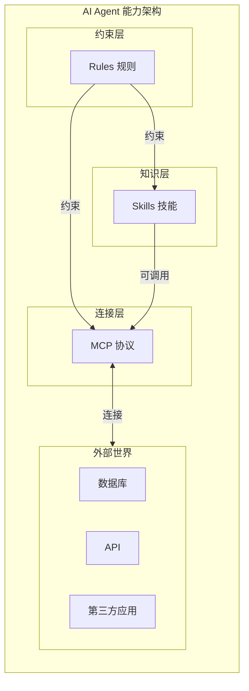
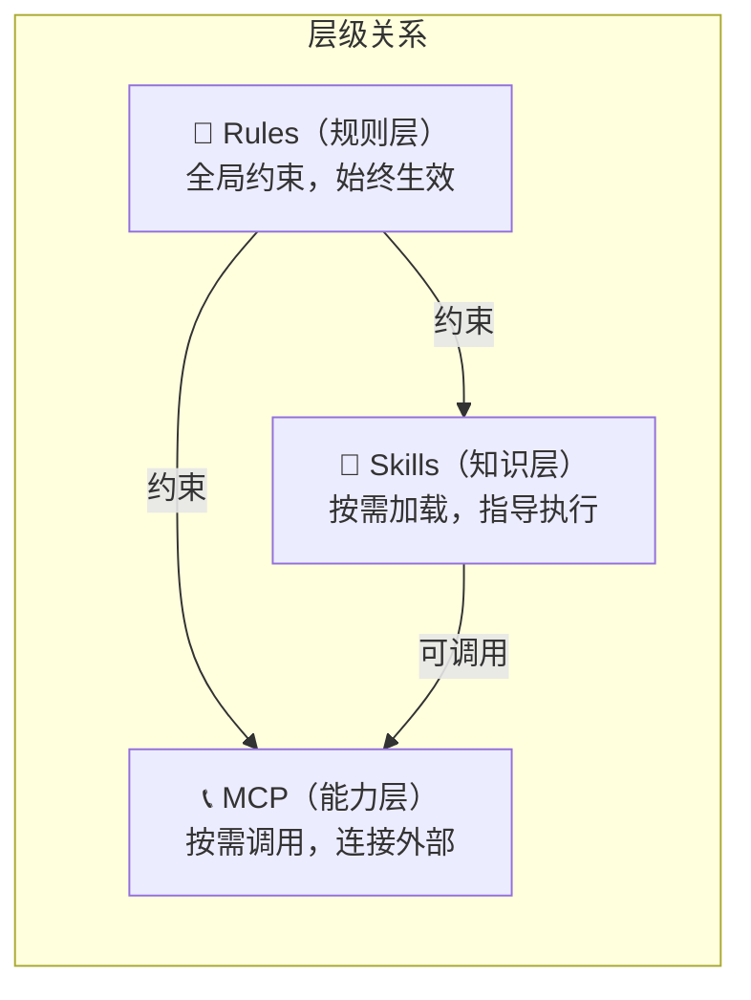
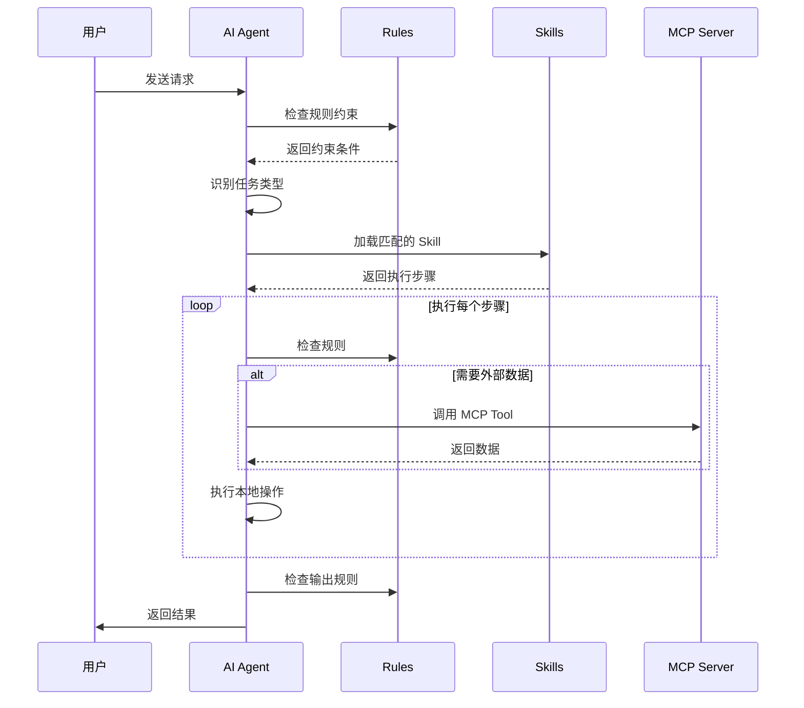
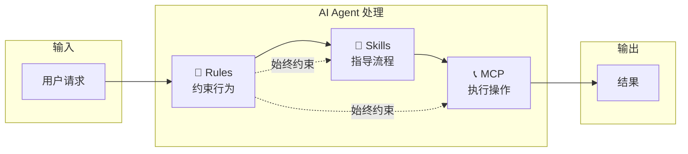

# AI Agent 三大扩展机制综合对比

---
**文档版本**: v1.0  
**创建日期**: 2026-01-20  
**作者**: AI Assistant  
---

## 一、概述

AI Agent（智能代理）的能力由三大核心扩展机制构成：

| 机制 | 一句话定义 | 形象比喻 |
|------|-----------|----------|
| **Rules** | 定义 AI 必须遵守的规则 | 🚦 交通规则 |
| **Skills** | 定义 AI 如何执行特定任务 | 📖 操作手册 |
| **MCP** | 让 AI 连接外部服务 | 📞 电话线路 |



---

## 二、三大机制详解

### 2.1 Rules（规则）

> **定义**：一组全局性的约束条件，AI 在执行任何任务时都必须遵守。

| 特征 | 说明 |
|------|------|
| **作用范围** | 全局生效，始终约束 AI 行为 |
| **触发方式** | 自动应用，无需显式调用 |
| **存储位置** | `.agent/rules/` |
| **文件格式** | Markdown 文件 |

**当前项目示例**：
```
.agent/rules/
├── direction-rules.md     # 路径使用规则
├── filename-rules.md      # 文件命名规则
├── mdtable-rules.md       # 表格格式规则
├── mdtabledoc-rules.md    # 文档表格规则
└── version-control-rules.md # 版本管理规则
```

### 2.2 Skills（技能）

> **定义**：模块化的任务执行指令，教 AI 如何完成特定类型的复杂任务。

| 特征 | 说明 |
|------|------|
| **作用范围** | 按需加载，仅在匹配场景时使用 |
| **触发方式** | AI 识别意图后主动加载 |
| **存储位置** | `.agent/skills/<skill-name>/` |
| **文件格式** | SKILL.md + 模板/示例/脚本 |

**当前项目示例**：
```
.agent/skills/data-domain-analysis/
├── SKILL.md                    # 主指令文件
├── examples/
│   └── sample_analysis.md      # 示例报告
└── resources/
    ├── analysis_template.md    # 分析模板
    └── report_template.md      # 报告模板
```

### 2.3 MCP（模型上下文协议）

> **定义**：标准化通信协议，让 AI 能够连接和操作外部服务和数据源。

| 特征 | 说明 |
|------|------|
| **作用范围** | 连接外部系统，执行实际操作 |
| **触发方式** | AI 调用对应的 Tool |
| **运行方式** | 独立进程（Server） |
| **配置位置** | 系统配置文件 |

**典型 MCP Server**：
```
MCP Servers:
├── database-server      # 数据库查询
├── github-server        # GitHub 操作
├── slack-server         # Slack 消息
└── filesystem-server    # 文件系统操作
```

---

## 三、核心区别对比

### 3.1 多维度对比表

<table>
    <thead>
        <tr>
            <th>对比维度</th>
            <th>Rules（规则）</th>
            <th>Skills（技能）</th>
            <th>MCP（协议）</th>
        </tr>
    </thead>
    <tbody>
        <tr>
            <td><strong>本质</strong></td>
            <td>约束条件</td>
            <td>执行指令</td>
            <td>通信协议</td>
        </tr>
        <tr>
            <td><strong>作用</strong></td>
            <td>规定"不能做什么"和"必须怎样做"</td>
            <td>指导"如何一步步完成"</td>
            <td>提供"能做到什么"</td>
        </tr>
        <tr>
            <td><strong>生效范围</strong></td>
            <td>全局始终生效</td>
            <td>按需加载</td>
            <td>按需调用</td>
        </tr>
        <tr>
            <td><strong>存储形式</strong></td>
            <td>静态 Markdown 文件</td>
            <td>静态文件夹（含模板）</td>
            <td>运行中的服务进程</td>
        </tr>
        <tr>
            <td><strong>技术门槛</strong></td>
            <td>低（写规则文档）</td>
            <td>低（写指令文档）</td>
            <td>高（编写服务代码）</td>
        </tr>
        <tr>
            <td><strong>维护成本</strong></td>
            <td>低</td>
            <td>低</td>
            <td>中-高</td>
        </tr>
        <tr>
            <td><strong>实时性</strong></td>
            <td>不适用</td>
            <td>无（使用本地资源）</td>
            <td>有（连接实时数据）</td>
        </tr>
    </tbody>
</table>

### 3.2 层级关系图



**层级说明**：
1. **Rules 是最高层**：约束所有行为，Skills 和 MCP 都必须遵守
2. **Skills 是中间层**：定义任务流程，可以调用 MCP
3. **MCP 是底层**：提供具体能力，被上层调用

---

## 四、协作关系

### 4.1 三者如何协同工作



### 4.2 实际场景示例

**场景**：用户请求"帮我分析库存域并生成报告"

| 步骤 | 涉及机制 | 具体行为 |
|------|----------|----------|
| 1 | Rules | 检查输出路径规则、版本管理规则 |
| 2 | Skills | 加载"数据域分析技能"，获取执行步骤 |
| 3 | Skills | 使用分析模板进行分析 |
| 4 | MCP（如有） | 调用数据库获取实时数据 |
| 5 | Skills | 使用报告模板生成报告 |
| 6 | Rules | 检查文件命名规则，添加版本号 |
| 7 | Rules | 按版本管理规则处理旧版本 |

---

## 五、适用场景对比

### 5.1 何时使用 Rules

- ✅ 需要全局统一的行为规范
- ✅ 定义必须遵守的约束条件
- ✅ 规范输出格式、命名规则等

**示例规则**：
- 所有文件必须带版本号
- 输出必须使用中文
- 表格必须使用特定格式

### 5.2 何时使用 Skills

- ✅ 需要标准化的任务执行流程
- ✅ 任务可复用且有固定模式
- ✅ 需要使用模板和示例

**示例技能**：
- 数据域分析技能
- 文档生成技能
- 代码审查技能

### 5.3 何时使用 MCP

- ✅ 需要连接外部数据库
- ✅ 需要调用外部 API
- ✅ 需要与第三方应用交互

**示例 MCP**：
- 数据库查询 Server
- GitHub 操作 Server
- Slack 消息 Server

---

## 六、总结对比

### 6.1 一图总结



### 6.2 速查表

| 问题 | 答案 |
|------|------|
| 想让 AI 遵守某些规范？ | 使用 **Rules** |
| 想让 AI 学会某类任务？ | 使用 **Skills** |
| 想让 AI 连接外部系统？ | 使用 **MCP** |
| 三者可以同时使用吗？ | ✅ 可以，且推荐结合使用 |
| 哪个技术门槛最低？ | Rules 和 Skills（只需写 Markdown） |
| 哪个提供实时能力？ | MCP（连接外部数据源） |

### 6.3 最佳实践

> [!TIP]
> **推荐的使用方式**：
> 1. 先定义 **Rules** 规范全局行为
> 2. 再创建 **Skills** 标准化常见任务
> 3. 按需配置 **MCP** 连接外部服务

---

## 版本记录

| 版本 | 日期 | 修改人 | 修改内容 |
|------|------|--------|----------|
| v1.0 | 2026-01-20 | AI Assistant | 初始创建 |
