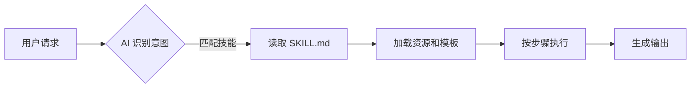
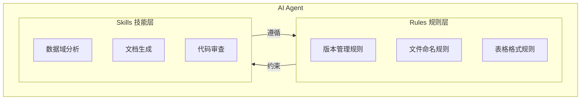
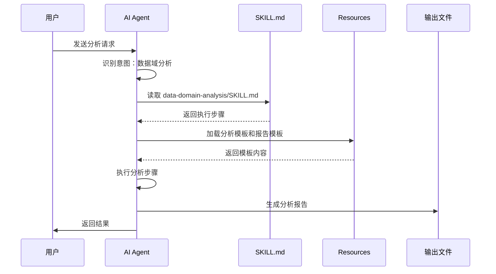

# Agent Skills 原理说明文档

---
**文档版本**: v1.0  
**创建日期**: 2026-01-20  
**作者**: AI Assistant  
---

## 一、什么是 Agent Skills

Agent Skills（代理技能）是一种**模块化的能力扩展机制**，用于让 AI 代理（Agent）学习和执行特定领域的复杂任务。	

简单来说，它是一个**包含指令、脚本和资源的文件夹**，通过结构化的方式告诉 AI：
- 什么时候应该使用这个技能
- 如何一步步执行任务
- 使用什么模板和资源

---

## 二、工作原理

### 2.1 核心机制



### 2.2 原理详解

| 阶段 | 说明 |
|------|------|
| **1. 意图识别** | AI 分析用户请求，判断是否与某个技能相关 |
| **2. 技能加载** | 如果匹配，AI 读取 `SKILL.md` 文件获取执行指令 |
| **3. 资源准备** | 加载技能目录下的模板、脚本等资源 |
| **4. 步骤执行** | 按照 `SKILL.md` 中定义的步骤逐一执行 |
| **5. 结果输出** | 使用模板生成标准化的输出 |

### 2.3 关键点

> [!IMPORTANT]
> Skills 的核心价值在于**标准化**和**可复用**。  
> 一次定义，多次使用，确保每次执行的一致性。

---

## 三、技能文件结构

### 3.1 标准目录结构

```
.agent/skills/<skill-name>/
├── SKILL.md              # [必需] 主指令文件
├── scripts/              # [可选] 辅助脚本
│   └── helper.py
├── examples/             # [可选] 示例文件
│   └── sample.md
└── resources/            # [可选] 模板和资源
    └── template.md
```

### 3.2 各组件作用

<table>
    <thead>
        <tr>
            <th>组件</th>
            <th>必需</th>
            <th>作用</th>
        </tr>
    </thead>
    <tbody>
        <tr>
            <td><code>SKILL.md</code></td>
            <td>✅ 是</td>
            <td>定义技能名称、描述、触发条件和执行步骤</td>
        </tr>
        <tr>
            <td><code>scripts/</code></td>
            <td>❌ 否</td>
            <td>存放辅助脚本，扩展 AI 的执行能力</td>
        </tr>
        <tr>
            <td><code>examples/</code></td>
            <td>❌ 否</td>
            <td>提供参考实现，帮助 AI 理解预期输出</td>
        </tr>
        <tr>
            <td><code>resources/</code></td>
            <td>❌ 否</td>
            <td>存放模板、配置等静态资源</td>
        </tr>
    </tbody>
</table>

---

## 四、SKILL.md 文件规范

### 4.1 文件格式

`SKILL.md` 文件由两部分组成：

1. **YAML 前置元数据**：定义技能的基本信息
2. **Markdown 正文**：详细的执行指令

### 4.2 格式示例

```markdown
---
name: 技能名称
description: 技能的简短描述
version: 1.0
---

# 技能名称

## 概述
技能的详细说明...

## 使用场景
什么时候应该使用这个技能...

## 执行步骤
### 步骤 1：...
### 步骤 2：...

## 注意事项
执行时需要注意的事项...
```

### 4.3 关键元素说明

| 元素 | 说明 |
|------|------|
| `name` | 技能的唯一标识名称 |
| `description` | 简短描述，用于 AI 快速判断是否匹配 |
| `使用场景` | 明确列出触发此技能的典型请求 |
| `执行步骤` | 详细的分步指令，AI 会严格遵循 |
| `注意事项` | 特殊规则或约束条件 |

---

## 五、Skills 与 Rules 的区别

系统中还存在 `.agent/rules/` 目录，其中的规则文件与 Skills 有本质区别：

| 对比维度 | Skills（技能） | Rules（规则） |
|----------|---------------|--------------|
| **目的** | 定义"如何做某事" | 定义"必须遵守什么" |
| **性质** | 能力扩展 | 行为约束 |
| **触发方式** | 按需加载，匹配特定任务 | 始终生效，全局约束 |
| **示例** | 数据域分析技能 | 版本管理规则、文件命名规则 |

### 关系图



> [!TIP]
> Skills 在执行时必须遵循 Rules 的约束。  
> 例如：数据域分析技能生成的报告必须遵循版本管理规则。

---

## 六、实际应用示例

### 6.1 当前项目中的技能

本项目已创建的技能：

| 技能名称 | 路径 | 用途 |
|----------|------|------|
| 数据域分析技能 | `.agent/skills/data-domain-analysis/` | 分析数据域的业务过程、粒度和维度指标 |

### 6.2 使用流程演示

**用户请求**：
```
帮我分析库存域和履约域的业务过程差异
```

**AI 执行流程**：



---

## 七、如何创建新技能

### 7.1 创建步骤

1. **确定技能范围**：明确技能要解决的问题类型
2. **设计目录结构**：在 `.agent/skills/` 下创建技能目录
3. **编写 SKILL.md**：定义元数据和执行步骤
4. **准备资源**：创建必要的模板和示例
5. **测试验证**：通过实际请求测试技能效果

### 7.2 最佳实践

> [!TIP]
> - 技能名称应清晰表达用途
> - 执行步骤要具体、可操作
> - 提供示例帮助 AI 理解预期输出
> - 引用项目中的规则保持一致性

---

## 八、总结

Agent Skills 是一种强大的能力扩展机制，通过结构化的指令和资源，让 AI 能够执行复杂的、标准化的任务。	

**核心优势**：
- ✅ **标准化**：确保每次执行的一致性
- ✅ **可复用**：一次定义，多次使用
- ✅ **可扩展**：轻松添加新技能
- ✅ **可维护**：独立管理，互不影响

---

## 版本记录

| 版本 | 日期 | 修改人 | 修改内容 |
|------|------|--------|----------|
| v1.0 | 2026-01-20 | AI Assistant | 初始创建 |
