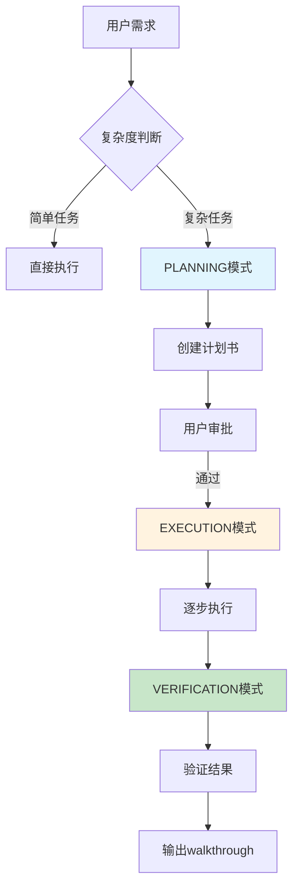

# Antigravity 文档梳理工作流程  

> **版本**: v1.0  
> **创建日期**: 2026-01-27  
> **适用场景**: 使用 Antigravity 进行数据仓库文档梳理的完整工作流程  

---

## 1. 概述  

本文档记录了如何使用 **Antigravity**（Google 的 AI 编程助手）完成数据仓库文档梳理工作的完整流程。通过建立 **项目规则 + 技能体系 + 标准化工作流**，实现了高效、可复制的文档生产能力。  

---

## 2. 核心工作模式  



Antigravity 的工作遵循三阶段模式：  
1. **PLANNING**：规划阶段 - 理解需求、设计方案、创建计划书  
2. **EXECUTION**：执行阶段 - 按计划逐步实施  
3. **VERIFICATION**：验证阶段 - 检查成果、生成报告  

---

## 3. 项目配置体系  

### 3.1 规则体系（.agent/rules/）  

规则是对 AI 行为的**全局约束**，确保输出一致性。  

| 规则文件                                                                                                                     | 作用     | 实际效果                                   |
| ---------------------------------------------------------------------------------------------------------------------------- | -------- | ------------------------------------------ |
| [direction-rules.md](file:///d:/GoogleAntigravityProjects/datacenter%20document/.agent/rules/direction-rules.md)             | 路径规范 | 输出必须在 `output_LLM/`，权威资料不可修改 |
| [filename-rules.md](file:///d:/GoogleAntigravityProjects/datacenter%20document/.agent/rules/filename-rules.md)               | 命名规范 | 中文名称 + 版本后缀（如 `xxx_v1.0.md`）    |
| [version-control-rules.md](file:///d:/GoogleAntigravityProjects/datacenter%20document/.agent/rules/version-control-rules.md) | 版本管理 | 修改前复制、老版本归档到 `过期文件/`       |
| [mdtable-rules.md](file:///d:/GoogleAntigravityProjects/datacenter%20document/.agent/rules/mdtable-rules.md)                 | 表格规范 | 简单表格用 Markdown，复杂合并用 HTML       |
| [mdtabledoc-rules.md](file:///d:/GoogleAntigravityProjects/datacenter%20document/.agent/rules/mdtabledoc-rules.md)           | 文档规范 | 表格双重索引、正文行尾双空格               |

**示例：版本控制规则的实际应用**  
```
修改 库存域完整梳理_v1.0.md：
1. 复制为 库存域完整梳理_v2.0.md
2. 在新文件上修改
3. 将 v1.0 移到 过期文件/
```

### 3.2 技能体系（.agent/skills/）  

技能是针对特定任务的**完整工作指南**，包含执行步骤、输出模板和质量检查清单。  

| 技能名称                                                                                                                   | 触发场景               | 核心能力                             |
| -------------------------------------------------------------------------------------------------------------------------- | ---------------------- | ------------------------------------ |
| [产物驱动型流程架构](file:///d:/GoogleAntigravityProjects/datacenter%20document/.agent/skills/workflow-architect/SKILL.md) | 制定计划、任务拆解     | 构建产物依赖链，确保输入输出闭环     |
| [数据域修改](file:///d:/GoogleAntigravityProjects/datacenter%20document/.agent/skills/data-domain-modifier/SKILL.md)       | 修改数据域文档         | 标准化修改流程（10步），完整质量检查 |
| [数据域分析](file:///d:/GoogleAntigravityProjects/datacenter%20document/.agent/skills/data-domain-analysis/SKILL.md)       | 分析数据域差异         | 业务过程对比、维度矩阵检查           |
| [文件转换](file:///d:/GoogleAntigravityProjects/datacenter%20document/.agent/skills/file-converter/SKILL.md)               | Excel/HTML 转 Markdown | 脚本提取 + AI识别两阶段处理          |

---

## 4. 完整工作流程  

### 4.1 阶段一：项目初始化  

**1. 建立目录结构**  
```
项目根目录/
├── .agent/
│   ├── rules/          # 全局规则
│   └── skills/         # 技能库
├── 权威资料/           # 不可修改的输入资料
├── output_LLM/         # AI 唯一输出路径
│   ├── 数据域详情/    # 各域梳理文档
│   ├── 计划书/        # 项目计划
│   └── 过期文件/      # 历史版本归档
└── 常用任务/           # 常用提示词模板
```

**2. 配置核心规则**  
在用户规则或 `.agent/rules/` 中添加：  
- 输出路径限制  
- 版本管理要求  
- 表格格式规范  

### 4.2 阶段二：需求分析与计划  

**调用技能**：`产物驱动型流程架构技能`  

**示例对话**：  
```
用户：帮我制定一个完成16个数据域梳理的计划
```

**AI 行为**：  
1. 进入 PLANNING 模式  
2. 确认目标和已有资料  
3. 使用技能模板生成计划书  
4. 请求用户审批  

**产出物**：`output_LLM/计划书/00_项目计划书_数据域梳理_v1.0.md`  

**计划书关键结构**：  
```markdown
## 产物目录结构
（定义所有输出文件的位置）

## 产物依赖流
（Mermaid 图展示文件之间的依赖关系）

## 分步执行链
每个步骤包含：
- 📥 Input：需要读取的文件
- 📤 Output：产出的文件
- 🤖 AI指令：具体执行命令
```

### 4.3 阶段三：文档生产  

**调用技能**：`数据域修改技能`  

**标准化 10 步流程**：  
1. 版本管理（复制新版本）  
2. 更新元数据（版本号、日期）  
3. 修改域定义与业务全景  
4. 更新业务流程图（Mermaid）  
5. 更新业务过程定义  
6. 更新维度设计  
7. 更新事实表设计  
8. 更新总线矩阵  
9. 更新跨域关联  
10. 添加更新记录  

**产出物**：`output_LLM/数据域详情/XX域完整梳理_v2.0.md`  

**质量检查清单**：  
```markdown
- [ ] 版本号已更新
- [ ] 业务流程图与业务过程匹配
- [ ] 每个业务过程都有对应的事实表
- [ ] 维度覆盖所有分析需求
- [ ] 总线矩阵完整
- [ ] 原文件已移至过期文件夹
```

### 4.4 阶段四：文件转换（如有需要）  

**调用技能**：`文件转换技能`  

**两阶段处理**：  

| 阶段  | 处理方     | 工作内容                       |
| ----- | ---------- | ------------------------------ |
| 阶段1 | Python脚本 | 提取 Excel 内容、表格、图片    |
| 阶段2 | AI Agent   | 识别图片内容，流程图转 Mermaid |

**命令**：  
```powershell
python .agent\skills\file-converter\scripts\convert_excel_to_md.py "输入Excel" "输出目录"
```

---

## 5. 关键技巧与最佳实践  

### 5.1 有效利用权威资料  

将核心参考资料放入 `权威资料/` 目录，AI 会优先引用：  
```
权威资料/
├── 1.1 数据域定义表.md     # 域划分标准
├── 1.2 事实表分类.md       # 事实表类型说明
└── 模板/                    # 文档模板
```

### 5.2 技能的复用与扩展  

每个技能包含 `SKILL.md` 定义文件，结构如下：  
```yaml
---
name: 技能名称
description: 技能描述
triggers: [触发关键词列表]
---

# 技能标题
## 概述
## 执行步骤
## 输出模板
## 质量检查清单
```

**创建新技能**：  
1. 在 `.agent/skills/` 下创建文件夹  
2. 编写 `SKILL.md`  
3. 可选：添加 `scripts/`、`resources/` 子目录  

### 5.3 迭代优化文档  

利用 AI 的对话能力进行迭代：  
```
用户：帮我检查库存域和履约域的业务过程是否有重叠
AI：（调用数据域分析技能，生成对比报告）
用户：根据报告更新库存域文档
AI：（调用数据域修改技能，执行更新）
```

---

## 6. 典型任务示例  

### 6.1 示例1：创建新的数据域文档  

**对话流程**：  
```
用户：帮我创建广告域的完整梳理文档

AI行为：
1. 读取权威资料中的广告域定义
2. 参考已有数据域文档模板
3. 调用数据域修改技能
4. 生成 06_P1_广告域完整梳理_v1.0.md
5. 请求用户审批
```

### 6.2 示例2：Excel 业务文档转 Markdown  

**对话流程**：  
```
用户：帮我把广告业务流程.xlsx转成md文件

AI行为：
1. 调用文件转换技能
2. 运行Python脚本提取内容
3. 逐个识别图片，流程图转Mermaid
4. 输出完整的Markdown文档
```

### 6.3 示例3：批量更新多个数据域  

**对话流程**：  
```
用户：根据新的供应链流程更新库存域、履约域、质检域

AI行为：
1. 进入PLANNING模式
2. 创建包含产物依赖链的计划书
3. 请求用户审批
4. 批准后进入EXECUTION模式
5. 按计划顺序更新各域文档
6. 进入VERIFICATION模式，检查一致性
```

---

## 7. 项目成果展示  

### 7.1 输出目录结构  

```
output_LLM/
├── 数据域详情/           # 16个数据域的完整梳理文档
│   ├── 库存域完整梳理_v2.0.md
│   ├── 履约域完整梳理_v2.0.md
│   └── ...
├── 计划书/              # 各项目的执行计划
├── 业务流程梳理/        # 业务流程分析
├── 总线矩阵构建项目/    # 总线矩阵相关产物
└── 过期文件/            # 历史版本归档
```

### 7.2 单域文档结构  

每个数据域文档包含 7 个核心章节：  
1. 域定义与业务全景  
2. 业务流程图（Mermaid）  
3. 业务过程定义（映射表 + 详细定义）  
4. 维度设计（推导逻辑 + 维度清单）  
5. 事实表设计（事实表清单 + 度量指标）  
6. 总线矩阵（矩阵表 + 解读）  
7. 跨域关联说明  

---

## 8. 总结  

### 8.1 Antigravity 的核心价值  

| 传统方式           | Antigravity 方式              |
| ------------------ | ----------------------------- |
| 人工逐个编写文档   | 标准化模板 + AI 批量生产      |
| 格式不统一         | 规则约束 + 技能模板确保一致性 |
| 版本管理混乱       | 版本规则强制执行              |
| 跨文档关联难以维护 | 产物依赖链保证闭环            |

### 8.2 成功关键因素  

1. **规则先行**：在开始工作前配置好项目规则  
2. **技能复用**：将重复性任务封装为技能  
3. **产物驱动**：每一步都有明确的输入输出  
4. **迭代优化**：利用 AI 对话能力不断完善  

---

## 更新记录  

| 版本 | 日期       | 更新内容                   |
| ---- | ---------- | -------------------------- |
| v1.0 | 2026-01-27 | 初始版本，整理完整工作流程 |
