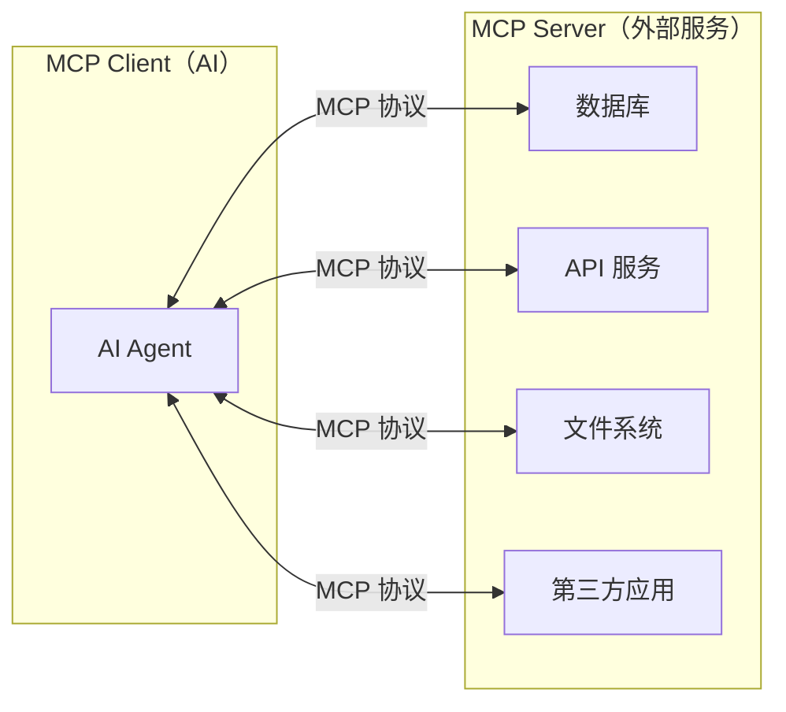
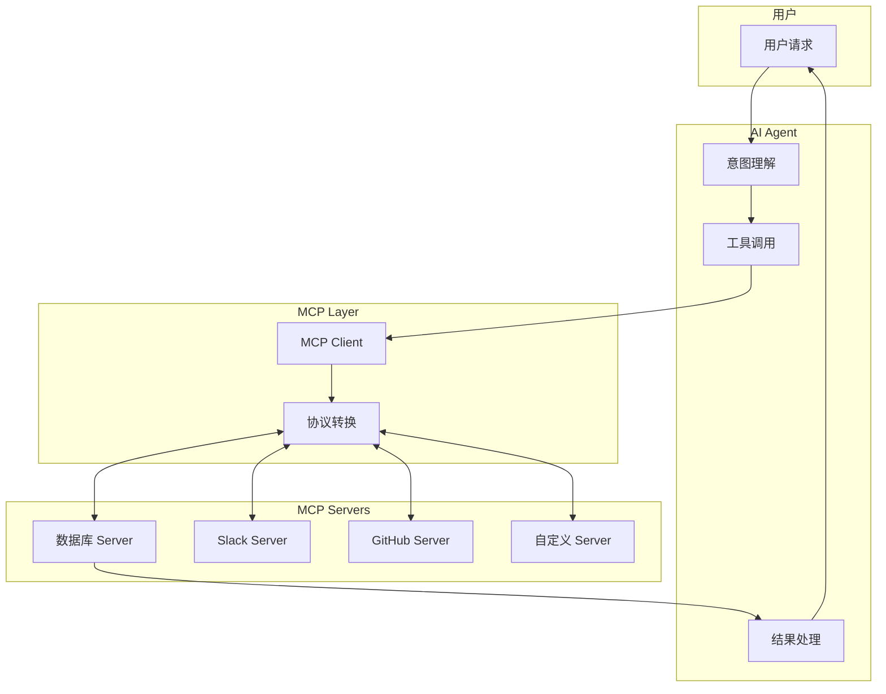
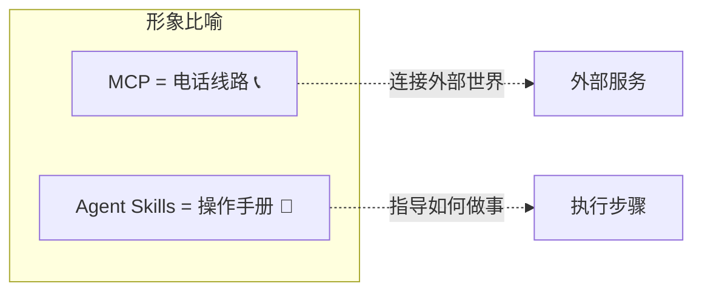
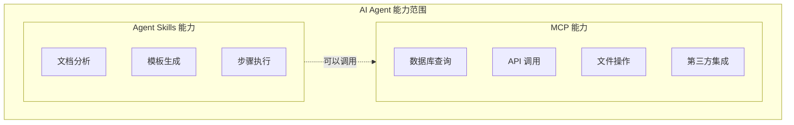
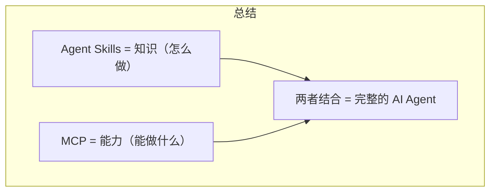

# MCP 与 Agent Skills 对比说明

---
**文档版本**: v1.0  
**创建日期**: 2026-01-20  
**作者**: AI Assistant  
---

## 一、什么是 MCP

### 1.1 定义

**MCP**（Model Context Protocol，模型上下文协议）是由 Anthropic 推出的一种**开放标准协议**，用于让 AI 模型与外部工具、服务和数据源进行标准化交互。	

> [!IMPORTANT]
> MCP 的核心理念：让 AI 能够**连接到外部世界**，而不仅仅依赖训练数据。

### 1.2 核心概念



MCP 定义了三种核心能力：

| 能力 | 说明 | 示例 |
|------|------|------|
| **Resources** | 读取外部数据资源 | 读取数据库表、获取 API 数据 |
| **Tools** | 执行外部操作 | 发送邮件、创建任务、调用服务 |
| **Prompts** | 获取预定义的提示模板 | 获取标准化的分析提示 |

---

## 二、MCP 工作原理

### 2.1 架构图



### 2.2 工作流程

1. **用户发送请求**：例如"查询今天的销售数据"
2. **AI 理解意图**：识别需要查询数据库
3. **调用 MCP 工具**：通过 MCP 协议调用数据库 Server
4. **Server 执行操作**：数据库 Server 执行 SQL 查询
5. **返回结果**：查询结果通过 MCP 协议返回给 AI
6. **AI 处理并响应**：AI 整理数据并回复用户

---

## 三、MCP 与 Agent Skills 对比

### 3.1 核心区别

<table>
    <thead>
        <tr>
            <th>对比维度</th>
            <th>MCP</th>
            <th>Agent Skills</th>
        </tr>
    </thead>
    <tbody>
        <tr>
            <td><strong>本质</strong></td>
            <td>通信协议（Protocol）</td>
            <td>指令文件（Instructions）</td>
        </tr>
        <tr>
            <td><strong>作用</strong></td>
            <td>连接外部服务和数据源</td>
            <td>定义任务执行步骤</td>
        </tr>
        <tr>
            <td><strong>能力来源</strong></td>
            <td>外部 Server 提供</td>
            <td>AI 自身能力 + 模板</td>
        </tr>
        <tr>
            <td><strong>运行位置</strong></td>
            <td>外部服务器（独立进程）</td>
            <td>本地文件（静态文件）</td>
        </tr>
        <tr>
            <td><strong>典型场景</strong></td>
            <td>调用 API、查询数据库、操作第三方应用</td>
            <td>执行复杂分析、生成标准化文档</td>
        </tr>
        <tr>
            <td><strong>需要开发</strong></td>
            <td>需要编写 Server 代码</td>
            <td>只需编写 Markdown 文件</td>
        </tr>
    </tbody>
</table>

### 3.2 形象比喻



- **MCP** 像是**电话线路**：让 AI 能够"打电话"给外部服务
- **Agent Skills** 像是**操作手册**：告诉 AI 遇到某类问题时应该怎么做

### 3.3 能力范围对比



---

## 四、实际示例对比

### 4.1 场景：生成销售报告

#### 使用 Agent Skills

```
用户请求：帮我生成本月销售报告

AI 执行：
1. 读取 SKILL.md 获取报告生成步骤
2. 使用模板生成报告框架
3. 填充已知数据
4. 输出报告文件

局限：只能使用本地已有的数据
```

#### 使用 MCP

```
用户请求：帮我生成本月销售报告

AI 执行：
1. 调用 MCP 数据库 Server 查询销售数据
2. 调用 MCP API Server 获取目标完成率
3. 处理和分析数据
4. 生成报告

优势：可以实时获取最新数据
```

#### 两者结合

```
用户请求：帮我生成本月销售报告

AI 执行：
1. 读取 SKILL.md 获取报告生成步骤（Skills）
2. 调用 MCP 数据库查询销售数据（MCP）
3. 调用 MCP API 获取目标数据（MCP）
4. 使用模板生成报告（Skills）
5. 输出标准化报告文件

结果：既有标准化流程，又有实时数据
```

### 4.2 对比表格

| 场景 | 仅用 Skills | 仅用 MCP | 两者结合 |
|------|------------|----------|----------|
| 数据来源 | 本地文件 | 实时查询 | 实时查询 |
| 流程标准化 | ✅ 有 | ❌ 无 | ✅ 有 |
| 可复用性 | ✅ 高 | ⚠️ 中 | ✅ 高 |
| 实时性 | ❌ 无 | ✅ 有 | ✅ 有 |

---

## 五、技术架构对比

### 5.1 Agent Skills 架构

```
.agent/skills/<skill-name>/
├── SKILL.md              # Markdown 指令文件
├── resources/            # 静态资源
└── examples/             # 示例文件

特点：纯静态文件，无需运行服务
```

### 5.2 MCP 架构

```
MCP Server（示例：Python）
├── server.py             # 服务入口
├── tools/                # 工具定义
│   ├── query_db.py      # 数据库查询工具
│   └── send_email.py    # 发送邮件工具
├── resources/            # 资源定义
│   └── tables.py        # 数据表资源
└── config.json           # 配置文件

特点：需要运行独立进程，持续监听请求
```

### 5.3 配置方式对比

#### Agent Skills 配置

```markdown
# SKILL.md
---
name: 数据分析技能
description: 分析数据并生成报告
---

## 执行步骤
1. 读取数据文件
2. 执行分析
3. 生成报告
```

#### MCP Server 配置

```json
{
  "mcpServers": {
    "database": {
      "command": "python",
      "args": ["mcp_server.py"],
      "env": {
        "DB_HOST": "localhost",
        "DB_PORT": "5432"
      }
    }
  }
}
```

---

## 六、适用场景总结

### 6.1 使用 Agent Skills 的场景

- ✅ 定义标准化的工作流程
- ✅ 创建可复用的模板和指令
- ✅ 不需要连接外部服务
- ✅ 快速扩展 AI 能力（无需编程）

### 6.2 使用 MCP 的场景

- ✅ 需要实时查询数据库
- ✅ 需要调用外部 API
- ✅ 需要与第三方应用集成（Slack、GitHub 等）
- ✅ 需要执行系统级操作

### 6.3 两者结合的场景

- ✅ 需要标准化流程 + 实时数据
- ✅ 复杂的端到端工作流
- ✅ 企业级 AI 应用

---

## 七、总结



| 维度 | Agent Skills | MCP |
|------|-------------|-----|
| 一句话总结 | 教 AI "怎么做" | 让 AI "能做到" |
| 核心价值 | 标准化、可复用 | 连接性、实时性 |
| 技术门槛 | 低（只需写 Markdown） | 高（需要编程） |
| 维护成本 | 低 | 中-高 |

---

## 版本记录

| 版本 | 日期 | 修改人 | 修改内容 |
|------|------|--------|----------|
| v1.0 | 2026-01-20 | AI Assistant | 初始创建 |
