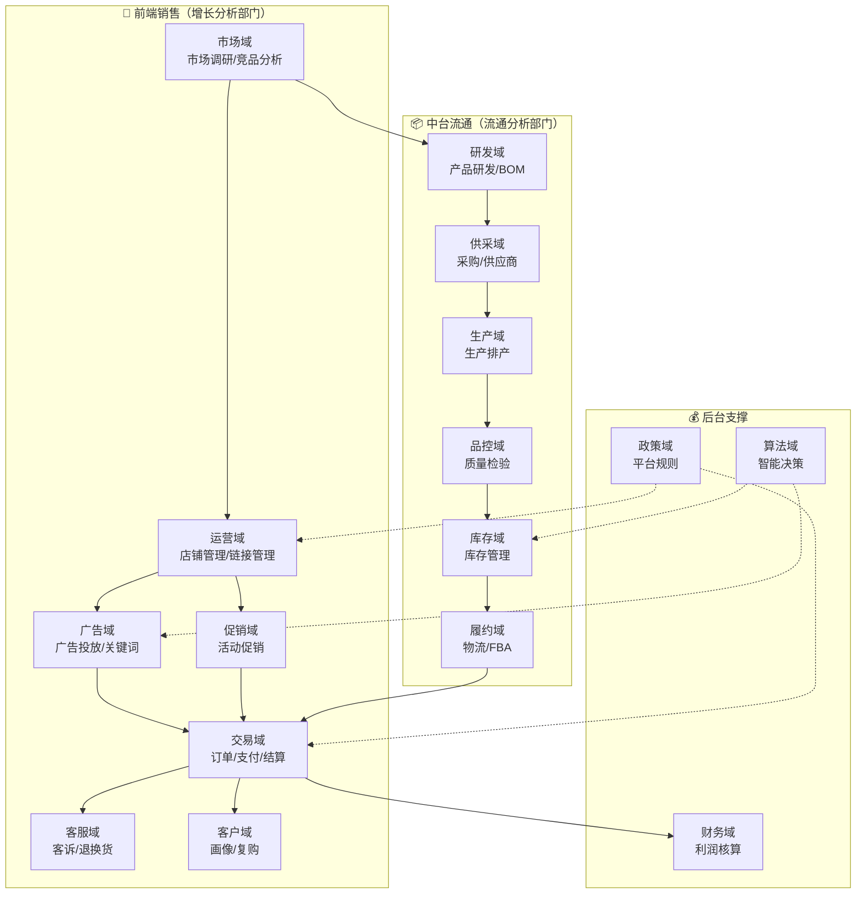
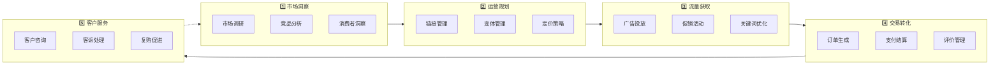

# 业务域全景图 - 跨境电商业务	

> **文档版本**: v1.0	
> **创建日期**: 2026-01-15	
> **依赖文件**: `1.0 业务域信息表_v1.0.md`, `1.1 数据域定义表.md`, `需求匹配/*.md`	

---

## 1. 业务域概览	

### 1.1 公司背景	

| 维度 | 说明 |	
|------|------|	
| **公司性质** | 跨境电商公司 |	
| **行业领域** | 宠物行业 |	
| **销售平台** | 亚马逊平台（主要） |	
| **核心业务域** | 跨境电商（聚焦业务） |	
| **来源系统** | OMS、SCP、SRM、QMS、WMS、TMS、金蝶、亚马逊后台、领星ERP |	

### 1.2 业务域定位	

本项目聚焦于**跨境电商业务域**（业务域编码: `cbebg`），为集团核心业务单元。	

---

## 2. 核心业务流程全景图	

---

## 3. 业务活动与数据域对应关系	

### 3.1 按部门分类的业务活动	

<table>
    <thead>
        <tr>
            <th>编号</th>
            <th>分析部门</th>
            <th>序号</th>
            <th>数据域</th>
            <th>核心业务活动</th>
            <th>优先级</th>
        </tr>
    </thead>
    <tbody>
        <tr>
            <td rowspan="7">一</td>
            <td rowspan="7">增长分析</td>
            <td>1</td>
            <td>交易域 (trd)</td>
            <td>订单处理、支付结算、订单评价、购物车管理</td>
            <td>P0</td>
        </tr>
        <tr>
            <td>2</td>
            <td>运营域 (op)</td>
            <td>账号管理、店铺管理、变体管理、链接管理、流量监控</td>
            <td>P0</td>
        </tr>
        <tr>
            <td>3</td>
            <td>促销域 (prm)</td>
            <td>促销活动策划、促销效果评估、促销费用管控</td>
            <td>P1</td>
        </tr>
        <tr>
            <td>4</td>
            <td>广告域 (ads)</td>
            <td>广告活动管理、关键词投放、广告效益分析</td>
            <td>P1</td>
        </tr>
        <tr>
            <td>5</td>
            <td>市场域 (mkt)</td>
            <td>市场调研、竞品分析、行业趋势、渠道评估</td>
            <td>P3</td>
        </tr>
        <tr>
            <td>6</td>
            <td>客服域 (cs)</td>
            <td>客户咨询、客户投诉、客服工单处理</td>
            <td>P3</td>
        </tr>
        <tr>
            <td>7</td>
            <td>客户域 (cst)</td>
            <td>客户画像、行为分析、复购策略</td>
            <td>P3</td>
        </tr>
        <tr>
            <td rowspan="6">二</td>
            <td rowspan="6">流通分析</td>
            <td>8</td>
            <td>库存域 (inv)</td>
            <td>入库管理、出库管理、库龄分析、库存盘点</td>
            <td>P1</td>
        </tr>
        <tr>
            <td>9</td>
            <td>履约域 (fl)</td>
            <td>物流配送、FBA管理、退换货处理</td>
            <td>P1</td>
        </tr>
        <tr>
            <td>10</td>
            <td>研发域 (rd)</td>
            <td>产品研发、BOM管理、产品迭代</td>
            <td>P2</td>
        </tr>
        <tr>
            <td>11</td>
            <td>供采域 (sup)</td>
            <td>采购计划、采购订单、供应商管理</td>
            <td>P2</td>
        </tr>
        <tr>
            <td>12</td>
            <td>生产域 (mfg)</td>
            <td>生产排产、工单执行、产能规划</td>
            <td>P2</td>
        </tr>
        <tr>
            <td>13</td>
            <td>品控域 (qc)</td>
            <td>来料质检、过程检验、成品检验</td>
            <td>P2</td>
        </tr>
        <tr>
            <td rowspan="2">三</td>
            <td rowspan="2">价值分析</td>
            <td>14</td>
            <td>财务域 (fin)</td>
            <td>利润核算、成本分析、预算控制</td>
            <td>P3</td>
        </tr>
        <tr>
            <td>15</td>
            <td>政策域 (pol)</td>
            <td>政策解析、规则监控、版本追踪</td>
            <td>P3</td>
        </tr>
        <tr>
            <td>四</td>
            <td>数据开发</td>
            <td>16</td>
            <td>算法域 (ma)</td>
            <td>算法模型管理、特征工程、结果评估</td>
            <td>P3</td>
        </tr>
    </tbody>
</table>

---

## 4. 需求场景与业务活动映射	

根据需求文件分析，运营数据资产建设涵盖16个模块、59个需求点。以下按模块归类业务场景：	

### 4.1 需求模块分布	

| 编号 | 模块 | 需求数 | 占比 | 关联数据域 |	
|------|------|--------|------|------------|	
| 1 | 促销 | 8 | 13.6% | 促销域 (prm) |	
| 2 | 竞品 | 6 | 10.2% | 市场域 (mkt) |	
| 3 | 库存 | 5 | 8.5% | 库存域 (inv) |	
| 4 | 价格 | 5 | 8.5% | 交易域 (trd) |	
| 5 | 广告 | 5 | 8.5% | 广告域 (ads) |	
| 6 | 订单 | 5 | 8.5% | 交易域 (trd) |	
| 7 | 销售毛利 | 4 | 6.8% | 财务域 (fin)、交易域 (trd) |	
| 8 | 客服 | 4 | 6.8% | 客服域 (cs) |	
| 9 | 关键词 | 4 | 6.8% | 广告域 (ads)、运营域 (op) |	
| 10 | 市场 | 3 | 5.1% | 市场域 (mkt) |	
| 11 | 转化 | 2 | 3.4% | 运营域 (op)、广告域 (ads) |	
| 12 | 流量 | 2 | 3.4% | 运营域 (op) |	
| 13 | 产品 | 2 | 3.4% | 运营域 (op)、研发域 (rd) |	
| 14 | 仓储 | 2 | 3.4% | 库存域 (inv)、履约域 (fl) |	
| 15 | 评分 | 1 | 1.7% | 客服域 (cs) |	
| 16 | 利润 | 1 | 1.7% | 财务域 (fin) |	

### 4.2 需求类型分布	

| 需求类型 | 数量 | 占比 | 典型场景 |	
|----------|------|------|----------|	
| 业务分析 | 11 | 34.4% | 客诉分析、活动复盘、广告复盘、单品分析 |	
| 常规业务 | 9 | 28.1% | 市场动态、库存管理、广告监控 |	
| 业务概览 | 7 | 21.9% | 周期数据、周期复盘、业绩目标 |	
| 业务规划 | 5 | 15.6% | 活动规划、定价机制、单品规划 |	

---

## 5. 业务流程详解	

### 5.1 销售侧业务流程（前端）	

### 5.2 供应侧业务流程（中台）	

```mermaid
flowchart LR
    subgraph 产品研发["1️⃣ 产品研发"]
        F1["原型设计"]
        F2["测试验证"]
        F3["BOM管理"]
    end

    subgraph 采购供应["2️⃣ 采购供应"]
        G1["采购计划"]
        G2["供应商协同"]
        G3["采购订单"]
    end

    subgraph 生产制造["3️⃣ 生产制造"]
        H1["生产排产"]
        H2["工单执行"]
        H3["产能规划"]
    end

    subgraph 品质管控["4️⃣ 品质管控"]
        I1["来料质检"]
        I2["过程检验"]
        I3["成品检验"]
    end

    subgraph 仓储物流["5️⃣ 仓储物流"]
        J1["入库管理"]
        J2["库存管理"]
        J3["出库配送"]
    end

    subgraph 履约交付["6️⃣ 履约交付"]
        K1["FBA发货"]
        K2["物流跟踪"]
        K3["退换货"]
    end

    产品研发 --> 采购供应
    采购供应 --> 生产制造
    生产制造 --> 品质管控
    品质管控 --> 仓储物流
    仓储物流 --> 履约交付
```

---

## 6. 数据域与业务活动详细对照	

### 6.1 P0级核心域	

<table>
    <thead>
        <tr>
            <th>数据域</th>
            <th>业务过程</th>
            <th>关键业务活动</th>
            <th>对应需求模块</th>
        </tr>
    </thead>
    <tbody>
        <tr>
            <td rowspan="3">交易域 (trd)</td>
            <td>订单管理</td>
            <td>订单生成、订单明细、订单状态跟踪</td>
            <td>订单、价格</td>
        </tr>
        <tr>
            <td>支付结算</td>
            <td>支付处理、结算对账</td>
            <td>销售毛利</td>
        </tr>
        <tr>
            <td>评价管理</td>
            <td>订单评价收集与分析</td>
            <td>客服、评分</td>
        </tr>
        <tr>
            <td rowspan="3">运营域 (op)</td>
            <td>店铺运营</td>
            <td>账号管理、店铺管理</td>
            <td>产品</td>
        </tr>
        <tr>
            <td>链接管理</td>
            <td>变体管理、链接优化</td>
            <td>产品</td>
        </tr>
        <tr>
            <td>流量分析</td>
            <td>整体流量、自然流量监控</td>
            <td>流量、转化</td>
        </tr>
    </tbody>
</table>

### 6.2 P1级重要域	

<table>
    <thead>
        <tr>
            <th>数据域</th>
            <th>业务过程</th>
            <th>关键业务活动</th>
            <th>对应需求模块</th>
        </tr>
    </thead>
    <tbody>
        <tr>
            <td rowspan="2">库存域 (inv)</td>
            <td>库存管理</td>
            <td>入库、出库、库龄分析</td>
            <td>库存</td>
        </tr>
        <tr>
            <td>FBA仓储</td>
            <td>FBA库存监控、仓储费用</td>
            <td>仓储</td>
        </tr>
        <tr>
            <td rowspan="2">履约域 (fl)</td>
            <td>物流配送</td>
            <td>FBA发货、物流跟踪</td>
            <td>仓储</td>
        </tr>
        <tr>
            <td>退换货</td>
            <td>退货处理、换货管理</td>
            <td>客服</td>
        </tr>
        <tr>
            <td rowspan="2">促销域 (prm)</td>
            <td>促销活动</td>
            <td>活动策划、活动执行</td>
            <td>促销</td>
        </tr>
        <tr>
            <td>促销效果</td>
            <td>效果分析、ROI评估</td>
            <td>促销</td>
        </tr>
        <tr>
            <td rowspan="2">广告域 (ads)</td>
            <td>广告投放</td>
            <td>广告活动、关键词竞价</td>
            <td>广告、关键词</td>
        </tr>
        <tr>
            <td>广告效益</td>
            <td>展示量、点击量、转化分析</td>
            <td>广告、转化</td>
        </tr>
    </tbody>
</table>

---

## 7. 业务关键词云	

从59个需求点中提取的高频业务关键词：	

| 领域 | 高频关键词 |	
|------|------------|	
| 促销活动 | 活动促销效益、活动促销效果、活动促销排期、活动促销费用、站外推广 |	
| 竞品分析 | 竞品价格结构、竞品广告结构、竞品运营动态、竞品产品布局 |	
| 库存管理 | FBA仓储、库存计划、发货销量预测、仓储费用预估 |	
| 广告投放 | 广告展示位、广告效益、广告跑时、关键词竞价、费用结构 |	
| 订单交易 | 变体订单结构、让利订单结构、订单来源结构 |	
| 财务分析 | 销售净额、成本费用、成本费率、单品利润测算 |	
| 客服质量 | 退货损失、客诉指标、客诉原因、单品评分 |	
| 市场趋势 | 我司趋势、款式趋势、大盘走势 |	

---

## 8. 总结	

### 8.1 业务域核心发现	

1. **聚焦跨境电商**：项目仅覆盖跨境电商业务域，其他业务域（大健康、科智农业等）不在范围内	
2. **亚马逊平台为主**：主要销售平台为亚马逊，数据域设计需考虑平台特性	
3. **运营需求驱动**：59个需求点中，促销、竞品、库存、广告占比最高，是业务核心关注点	
4. **前后端协同**：销售侧与供应侧业务流程紧密衔接，需要跨域维度支撑分析	

### 8.2 数据域建设优先级	

根据需求分布和业务重要性，建议按以下优先级建设：	

| 优先级 | 数据域 | 原因 |	
|--------|--------|------|	
| P0 | 交易域、运营域 | 核心业务数据，覆盖最多需求场景 |	
| P1 | 库存域、履约域、促销域、广告域 | 运营分析关键数据，需求占比高 |	
| P2 | 研发域、供采域、生产域、品控域 | 供应链数据，支撑成本分析 |	
| P3 | 市场域、客服域、财务域、客户域、政策域、算法域 | 辅助分析数据 |	

---

## 更新记录	

| 日期 | 版本 | 更新内容 | 更新人 |	
|------|------|----------|--------|	
| 2026-01-15 | v1.0 | 初始版本，基于业务调研生成业务域全景图 | AI架构师 |	
