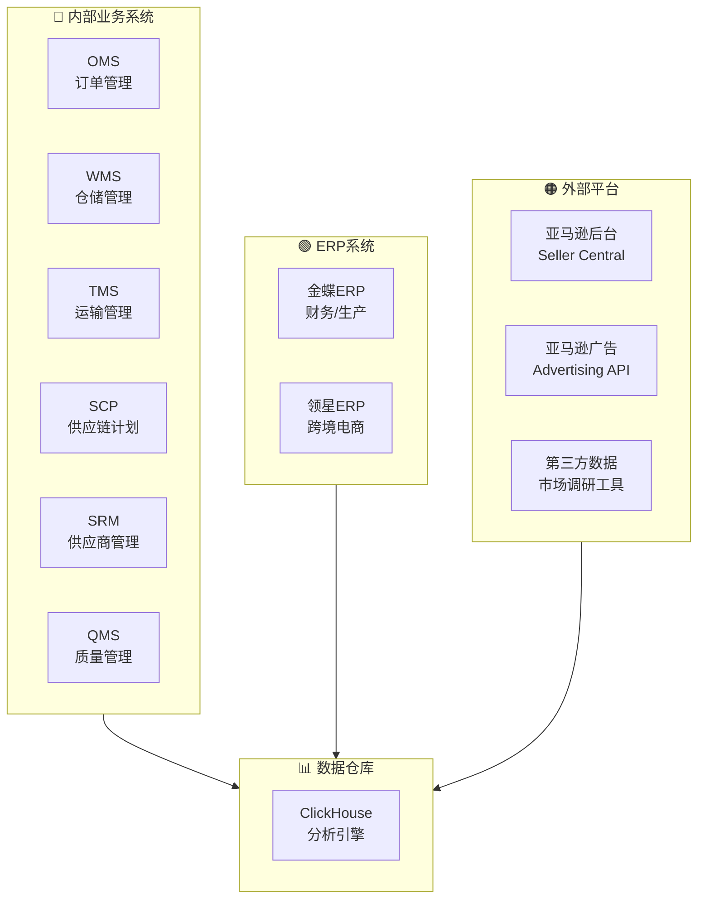
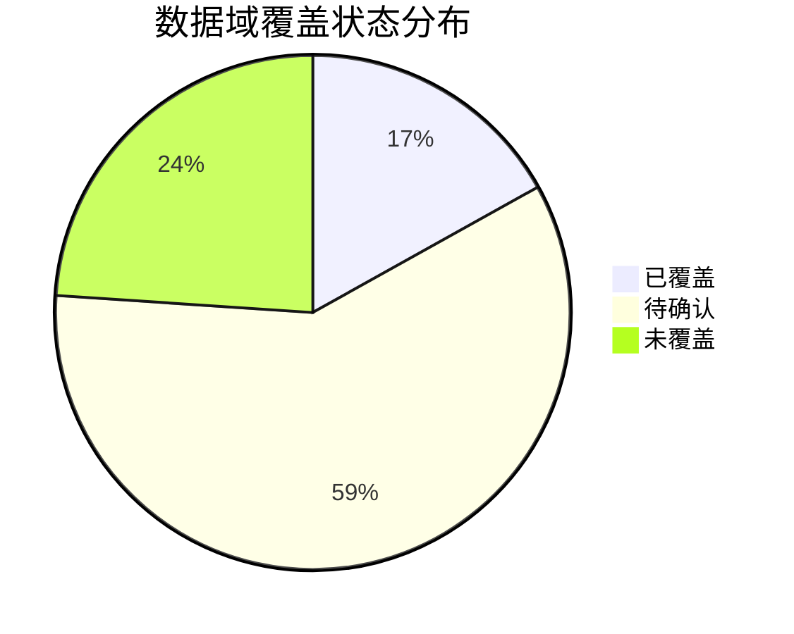

# 数据源现状分析 - 跨境电商业务	

> **文档版本**: v1.0	
> **创建日期**: 2026-01-15	
> **依赖文件**: `01_业务域全景图_v1.0.md`, `1.0 业务域信息表_v1.0.md`, `0. 数据开发规范与最佳实践.md`, `CK数据模型字段信息.md`	

---

## 1. 数据源概览	

### 1.1 已知来源系统	

> [!IMPORTANT]	
> 以下来源系统清单来自 `1.0 业务域信息表_v1.0.md`，**并非闭环清单**。实际数据源还可能包括亚马逊后台数据、领星ERP、其他第三方平台API等。	

| 来源系统 | 系统全称 | 系统类型 | 覆盖业务域 | 状态 |	
|----------|----------|----------|------------|------|	
| **OMS** | 订单管理系统 | 业务系统 | 交易域、运营域 | 已接入 |	
| **SCP** | 供应链计划系统 | 业务系统 | 供采域、库存域 | 已接入 |	
| **SRM** | 供应商关系管理 | 业务系统 | 供采域 | 已接入 |	
| **QMS** | 质量管理系统 | 业务系统 | 品控域 | 已接入 |	
| **WMS** | 仓储管理系统 | 业务系统 | 库存域、履约域 | 已接入 |	
| **TMS** | 运输管理系统 | 业务系统 | 履约域 | 已接入 |	
| **金蝶** | 金蝶ERP | ERP系统 | 财务域、生产域 | 已接入 |	
| **亚马逊后台** | Amazon Seller Central | 电商平台 | 交易域、运营域、广告域 | 待确认 |	
| **领星ERP** | 领星跨境电商ERP | ERP系统 | 运营域、交易域 | 待确认 |	

### 1.2 数据源类型分类	



---

## 2. 现有数据模型盘点	

基于 `CK数据模型字段信息.md` 分析，当前 ClickHouse 数据仓库已有以下数据模型：	

### 2.1 数据模型覆盖分布	

| 模型路径 | 数据域映射 | 典型表/模型 | 覆盖状态 |	
|----------|------------|-------------|----------|	
| 新兔科技/产品中心/产品信息 | 运营域 | dim_bottom_table_product（物料档案） | ✅ 已覆盖 |	
| 新兔科技/产品中心/实验室 | 品控域 | excel_8000_*（实验室测试数据） | ✅ 已覆盖 |	
| 新兔科技/供应链中心/仓储生产/仓储 | 库存域 | ods_kd_stock_allocation_detail（调拨单）、ods_kd_other_stock_out_detail（出库单） | ✅ 已覆盖 |	
| 新兔科技/供应链中心/仓储生产/生产 | 生产域 | ods_kd_produce_detail（生产订单）、ods_kd_pick_material_detail（领料单） | ✅ 已覆盖 |	
| 新兔科技/供应链中心/品控中心/出货检验 | 品控域 | excel_shipment_sampling_data（出货抽检）、excel_shipment_spot_check_quality_problem（质量问题） | ✅ 已覆盖 |	
| 新兔科技/供应链中心/品控中心/制程检验 | 品控域 | excel_pass_rateof_full_processInspection（制程合格率）、dws_process_inspect_qualify（质量分析） | ✅ 已覆盖 |	
| 新兔科技/供应链中心/品控中心/来料检验 | 品控域 | excel_incoming_material_sampling_data（来料抽检） | ✅ 已覆盖 |	
| 新兔科技/供应链中心/品控中心/品控客诉 | 客服域 | excel_customer_complaint_data_source（客诉数据） | ✅ 已覆盖 |	
| 新兔科技/供应链中心/国际物流/头程 | 履约域 | ods_logistics_fee_first（头程费用）、ods_logistics_costs_first（头程成本） | ✅ 已覆盖 |	
| 新兔科技/供应链中心/国际物流/业务管理 | 履约域 | excel_7000_*（无谓损失） | ✅ 已覆盖 |	

### 2.2 按数据域覆盖度分析	

<table>
    <thead>
        <tr>
            <th>编号</th>
            <th>数据域</th>
            <th>序号</th>
            <th>覆盖维度</th>
            <th>覆盖状态</th>
            <th>备注</th>
        </tr>
    </thead>
    <tbody>
        <tr>
            <td rowspan="3">一</td>
            <td rowspan="3">交易域 (trd)</td>
            <td>1</td>
            <td>订单数据</td>
            <td>⚠️ 待确认</td>
            <td>依赖OMS/亚马逊后台</td>
        </tr>
        <tr>
            <td>2</td>
            <td>支付数据</td>
            <td>⚠️ 待确认</td>
            <td>依赖亚马逊结算报告</td>
        </tr>
        <tr>
            <td>3</td>
            <td>评价数据</td>
            <td>⚠️ 待确认</td>
            <td>依赖亚马逊后台</td>
        </tr>
        <tr>
            <td rowspan="2">二</td>
            <td rowspan="2">运营域 (op)</td>
            <td>4</td>
            <td>产品信息</td>
            <td>✅ 已覆盖</td>
            <td>dim_bottom_table_product</td>
        </tr>
        <tr>
            <td>5</td>
            <td>流量数据</td>
            <td>⚠️ 待确认</td>
            <td>依赖亚马逊后台</td>
        </tr>
        <tr>
            <td rowspan="2">三</td>
            <td rowspan="2">库存域 (inv)</td>
            <td>6</td>
            <td>调拨数据</td>
            <td>✅ 已覆盖</td>
            <td>ods_kd_stock_allocation_detail</td>
        </tr>
        <tr>
            <td>7</td>
            <td>出入库数据</td>
            <td>✅ 已覆盖</td>
            <td>ods_kd_other_stock_out_detail</td>
        </tr>
        <tr>
            <td rowspan="2">四</td>
            <td rowspan="2">履约域 (fl)</td>
            <td>8</td>
            <td>头程物流</td>
            <td>✅ 已覆盖</td>
            <td>ods_logistics_fee_first</td>
        </tr>
        <tr>
            <td>9</td>
            <td>FBA数据</td>
            <td>⚠️ 待确认</td>
            <td>依赖亚马逊后台</td>
        </tr>
        <tr>
            <td>五</td>
            <td>促销域 (prm)</td>
            <td>10</td>
            <td>促销数据</td>
            <td>❌ 未覆盖</td>
            <td>需新增数据源</td>
        </tr>
        <tr>
            <td>六</td>
            <td>广告域 (ads)</td>
            <td>11</td>
            <td>广告数据</td>
            <td>❌ 未覆盖</td>
            <td>需接入亚马逊广告API</td>
        </tr>
        <tr>
            <td rowspan="4">七</td>
            <td rowspan="4">品控域 (qc)</td>
            <td>12</td>
            <td>来料检验</td>
            <td>✅ 已覆盖</td>
            <td>excel_incoming_material_sampling_data</td>
        </tr>
        <tr>
            <td>13</td>
            <td>制程检验</td>
            <td>✅ 已覆盖</td>
            <td>excel_pass_rateof_full_processInspection</td>
        </tr>
        <tr>
            <td>14</td>
            <td>出货检验</td>
            <td>✅ 已覆盖</td>
            <td>excel_shipment_sampling_data</td>
        </tr>
        <tr>
            <td>15</td>
            <td>质量问题</td>
            <td>✅ 已覆盖</td>
            <td>dws_quality_check_data_detail</td>
        </tr>
        <tr>
            <td rowspan="2">八</td>
            <td rowspan="2">生产域 (mfg)</td>
            <td>16</td>
            <td>生产订单</td>
            <td>✅ 已覆盖</td>
            <td>ods_kd_produce_detail</td>
        </tr>
        <tr>
            <td>17</td>
            <td>领料/退料</td>
            <td>✅ 已覆盖</td>
            <td>ods_kd_pick_material_detail</td>
        </tr>
        <tr>
            <td>九</td>
            <td>客服域 (cs)</td>
            <td>18</td>
            <td>客诉数据</td>
            <td>✅ 已覆盖</td>
            <td>excel_customer_complaint_data_source</td>
        </tr>
    </tbody>
</table>

---

## 3. 数据采集方式分析	

### 3.1 按采集方式分类	

| 采集方式 | 说明 | 适用数据源 | 技术方案 |	
|----------|------|------------|----------|	
| **API对接** | 通过系统API获取数据 | OMS、WMS、TMS、亚马逊API | REST API / Webhook |	
| **数据库同步** | 直接同步源数据库 | 金蝶ERP、内部业务系统 | CDC / ETL工具 |	
| **文件导入** | 通过Excel/CSV文件导入 | 手工数据、第三方报告 | 文件解析 + 入库 |	
| **爬虫采集** | 网页数据采集 | 市场调研数据、竞品数据 | 爬虫框架 |	

### 3.2 数据层级分布	

根据CK数据模型，当前数据按以下层级组织：	

| 数据层 | 数据库名 | 说明 | 典型表前缀 |	
|--------|----------|------|------------|	
| **ODS层** | ck_ods_db | 原始数据层 | ods_* |	
| **DIM层** | ck_dim_db | 维度表层 | dim_* |	
| **DWS层** | ck_dws_db | 汇总数据层 | dws_* |	
| **DC层** | ck_dc_db | 数据采集层（Excel导入） | excel_* |	

---

## 4. 数据域覆盖度评估	

### 4.1 覆盖度汇总	

| 数据域 | 优先级 | 核心业务过程数 | 已覆盖 | 待确认 | 未覆盖 | 覆盖率 |	
|--------|--------|----------------|--------|--------|--------|--------|	
| 交易域 | P0 | 6 | 0 | 6 | 0 | 0% |	
| 运营域 | P0 | 6 | 1 | 5 | 0 | 17% |	
| 库存域 | P1 | 5 | 2 | 3 | 0 | 40% |	
| 履约域 | P1 | 3 | 1 | 2 | 0 | 33% |	
| 促销域 | P1 | 4 | 0 | 0 | 4 | 0% |	
| 广告域 | P1 | 6 | 0 | 0 | 6 | 0% |	
| 品控域 | P2 | 5 | 5 | 0 | 0 | 100% |	
| 生产域 | P2 | 5 | 2 | 3 | 0 | 40% |	
| 供采域 | P2 | 5 | 0 | 5 | 0 | 0% |	
| 研发域 | P2 | 4 | 0 | 4 | 0 | 0% |	
| 客服域 | P3 | 4 | 1 | 3 | 0 | 25% |	
| 市场域 | P3 | 7 | 0 | 0 | 7 | 0% |	
| 财务域 | P3 | 6 | 0 | 6 | 0 | 0% |	
| 客户域 | P3 | 3 | 0 | 3 | 0 | 0% |	
| 政策域 | P3 | 3 | 0 | 3 | 0 | 0% |	
| 算法域 | P3 | 4 | 0 | 4 | 0 | 0% |	

### 4.2 覆盖度可视化	



---

## 5. 数据源待定说明	

> [!WARNING]	
> 当前数据源处于切换状态，新数据源尚未确定。以下内容均标记为**待定**，后续待数据源确定后进行补充。	

### 5.1 待确认数据源清单	

| 序号 | 数据域 | 待确认数据源 | 预期来源 | 优先级 |	
|------|--------|--------------|----------|--------|	
| 1 | 交易域 | 订单主数据 | 亚马逊后台 / OMS | P0 |	
| 2 | 交易域 | 支付结算数据 | 亚马逊结算报告 | P0 |	
| 3 | 运营域 | 店铺/链接数据 | 亚马逊后台 / 领星ERP | P0 |	
| 4 | 运营域 | 流量数据 | 亚马逊Business Report | P0 |	
| 5 | 广告域 | 广告投放数据 | 亚马逊广告API | P1 |	
| 6 | 促销域 | 促销活动数据 | 亚马逊后台 | P1 |	
| 7 | 库存域 | FBA库存数据 | 亚马逊FBA报告 | P1 |	
| 8 | 履约域 | FBA物流数据 | 亚马逊FBA报告 | P1 |	

### 5.2 数据源切换影响	

| 影响维度 | 说明 | 应对策略 |	
|----------|------|----------|	
| **数据断点** | 新旧数据源切换可能导致数据不连续 | 设计数据过渡方案 |	
| **字段映射** | 新数据源字段可能与现有模型不完全对齐 | 预留字段映射层 |	
| **数据质量** | 新数据源数据质量待验证 | 设计数据质量检查规则 |	
| **时效性** | 不同数据源更新频率可能不同 | 统一数据刷新调度 |	

---

## 6. 潜在数据源识别	

基于亚马逊电商业务特点，识别以下潜在数据源：	

### 6.1 亚马逊平台数据	

| 数据类型 | 来源 | 覆盖数据域 | 获取方式 |	
|----------|------|------------|----------|	
| 订单报告 | Amazon Seller Central | 交易域 | 报告下载 / SP-API |	
| 结算报告 | Amazon Seller Central | 交易域、财务域 | 报告下载 |	
| 流量报告 | Business Report | 运营域 | 报告下载 |	
| 广告报告 | Amazon Advertising | 广告域 | Advertising API |	
| FBA报告 | FBA Report | 库存域、履约域 | 报告下载 |	
| 评价数据 | Amazon Seller Central | 交易域、客服域 | SP-API |	
| 库存数据 | Inventory Report | 库存域 | 报告下载 / SP-API |	
| 促销数据 | Deals/Coupons | 促销域 | 报告下载 |	

### 6.2 第三方数据	

| 数据类型 | 来源示例 | 覆盖数据域 | 获取方式 |	
|----------|----------|------------|----------|	
| 市场数据 | 卖家精灵、Helium10 | 市场域 | API / 导出 |	
| 竞品数据 | Keepa、CamelCamelCamel | 市场域 | API / 爬虫 |	
| 关键词数据 | 亚马逊ASIN报告 | 广告域、运营域 | API / 导出 |	

---

## 7. 数据规范遵循	

根据 `0. 数据开发规范与最佳实践.md`，所有数据源接入需遵循以下规范：	

### 7.1 表命名规范	

```	
层级_域缩写_业务对象_粒度_刷新周期	
```	

**示例**：	
- `ods_trd_order_main_dd` - ODS层-交易域-订单主表-日刷新	
- `dwd_inv_stock_detail_dd` - DWD层-库存域-库存明细-日刷新	
- `dim_op_product` - DIM层-运营域-产品维度	

### 7.2 数据域编码对照	

| 数据域 | 编码 | 数据域 | 编码 |	
|--------|------|--------|------|	
| 交易域 | trd | 库存域 | inv |	
| 运营域 | op | 履约域 | fl |	
| 促销域 | prm | 品控域 | qc |	
| 广告域 | ads | 生产域 | mfg |	
| 市场域 | mkt | 供采域 | sup |	
| 客服域 | cs | 研发域 | rd |	
| 财务域 | fin | 政策域 | pol |	
| 客户域 | cst | 算法域 | ma |	

---

## 8. 总结与下一步建议	

### 8.1 现状总结	

1. **供应链数据较完善**：品控域、生产域、库存域的数据模型已较为完整	
2. **前端数据待补充**：交易域、运营域、广告域、促销域的数据覆盖率低	
3. **亚马逊数据是关键**：P0/P1级数据域大部分依赖亚马逊平台数据	
4. **数据源切换中**：新数据源尚未确定，需预留灵活性	

### 8.2 建议优先级	

| 优先级 | 行动项 | 依赖 |	
|--------|--------|------|	
| 第1步 | 确认亚马逊数据接入方案（SP-API / 报告下载） | 技术选型 |	
| 第2步 | 补全交易域、运营域核心数据模型 | 亚马逊数据 |	
| 第3步 | 接入广告域、促销域数据 | 亚马逊广告API |	
| 第4步 | 完善库存域、履约域FBA相关数据 | 亚马逊FBA报告 |	

---

## 更新记录	

| 日期 | 版本 | 更新内容 | 更新人 |	
|------|------|----------|--------|	
| 2026-01-15 | v1.0 | 初始版本，基于CK数据模型分析数据源现状 | AI架构师 |	
