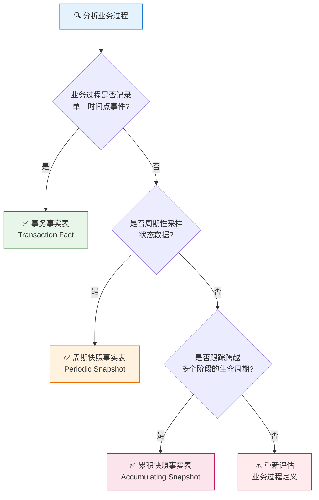

# 事实表类型分类  

> **文档版本**: v1.1  
> **创建日期**: 2026-01-15  
> **更新日期**: 2026-01-23  
> **文档说明**: 基于 Kimball 数据仓库方法论，定义事实表的三种类型及选择决策方法  

---

## 一、事实表类型概览  

根据 Kimball 数据仓库方法论，事实表分为以下**三种类型**：  

<table>
  <thead>
    <tr>
      <th>编号</th>
      <th>类型</th>
      <th>英文名称</th>
      <th>核心特征</th>
      <th>典型场景</th>
      <th>数据特性</th>
    </tr>
  </thead>
  <tbody>
    <tr>
      <td>1</td>
      <td><strong>事务事实表</strong></td>
      <td>Transaction Fact</td>
      <td>记录业务事件<strong>发生时刻</strong>的原子级事实</td>
      <td>订单、支付、入库、出库</td>
      <td>事件发生后数据<strong>不再变化</strong></td>
    </tr>
    <tr>
      <td>2</td>
      <td><strong>周期快照事实表</strong></td>
      <td>Periodic Snapshot</td>
      <td>按<strong>固定时间间隔</strong>记录状态快照</td>
      <td>库存余额、日流量、广告效果</td>
      <td>定期拍摄状态，度量<strong>半可加</strong></td>
    </tr>
    <tr>
      <td>3</td>
      <td><strong>累积快照事实表</strong></td>
      <td>Accumulating Snapshot</td>
      <td>跟踪业务过程的<strong>完整生命周期</strong></td>
      <td>订单履约全流程、物流配送全程</td>
      <td>数据<strong>持续更新</strong>直到流程结束</td>
    </tr>
  </tbody>
</table>

---

## 二、事实表类型详解  

### 2.1 事务事实表 (Transaction Fact)  

> [!NOTE]
> 最常见的事实表类型，适用于记录离散的业务事件  

<table>
  <thead>
    <tr>
      <th>维度</th>
      <th>说明</th>
    </tr>
  </thead>
  <tbody>
    <tr>
      <td><strong>核心特点</strong></td>
      <td>每行对应一个业务事件，事件发生后数据不再变化</td>
    </tr>
    <tr>
      <td><strong>粒度定义</strong></td>
      <td>最细粒度，一行 = 一次事件</td>
    </tr>
    <tr>
      <td><strong>度量特性</strong></td>
      <td>完全可加的事务度量（金额、数量）</td>
    </tr>
    <tr>
      <td><strong>典型示例</strong></td>
      <td>订单事实表（每行=一笔订单）、支付事实表（每行=一次支付）</td>
    </tr>
  </tbody>
</table>

**适用业务过程**：下单、支付、发货、入库、退款、评价等离散事件  

---

### 2.2 周期快照事实表 (Periodic Snapshot)  

> [!NOTE]
> 用于记录按固定时间周期采样的状态数据  

<table>
  <thead>
    <tr>
      <th>维度</th>
      <th>说明</th>
    </tr>
  </thead>
  <tbody>
    <tr>
      <td><strong>核心特点</strong></td>
      <td>按固定周期（日/周/月）拍摄业务状态快照</td>
    </tr>
    <tr>
      <td><strong>粒度定义</strong></td>
      <td>周期粒度，一行 = 某时点某对象的状态</td>
    </tr>
    <tr>
      <td><strong>度量特性</strong></td>
      <td>半可加度量（不能跨时间求和，如库存余额）</td>
    </tr>
    <tr>
      <td><strong>典型示例</strong></td>
      <td>库存日快照（每行=某天某SKU的库存余额）、流量日快照（每行=某天某链接的访问数据）</td>
    </tr>
  </tbody>
</table>

**适用业务过程**：库存余额统计、广告效果日报、账户余额快照等状态记录  

---

### 2.3 累积快照事实表 (Accumulating Snapshot)  

> [!NOTE]
> 用于跟踪具有多个里程碑阶段的完整业务流程  

<table>
  <thead>
    <tr>
      <th>维度</th>
      <th>说明</th>
    </tr>
  </thead>
  <tbody>
    <tr>
      <td><strong>核心特点</strong></td>
      <td>跟踪业务流程的多个里程碑，数据持续更新直到流程结束</td>
    </tr>
    <tr>
      <td><strong>粒度定义</strong></td>
      <td>业务实体粒度，一行 = 一个实体的完整生命周期</td>
    </tr>
    <tr>
      <td><strong>度量特性</strong></td>
      <td>多个里程碑时间字段 + 时长计算</td>
    </tr>
    <tr>
      <td><strong>典型示例</strong></td>
      <td>订单履约累积快照（跟踪 创建→支付→发货→签收→评价 全流程）</td>
    </tr>
  </tbody>
</table>

**适用业务过程**：订单履约跟踪、物流配送跟踪、工单处理跟踪等多阶段流程  

---

## 三、事实表类型选择决策  

根据以下决策树判断业务过程对应的事实表类型：  

### 3.1 决策要点速查  

<table>
  <thead>
    <tr>
      <th>序号</th>
      <th>判断问题</th>
      <th>是</th>
      <th>否</th>
    </tr>
  </thead>
  <tbody>
    <tr>
      <td>1</td>
      <td>业务事件是单一时间点发生的？</td>
      <td>→ <strong>事务事实表</strong></td>
      <td>→ 继续判断</td>
    </tr>
    <tr>
      <td>2</td>
      <td>需要周期性采样状态数据？</td>
      <td>→ <strong>周期快照表</strong></td>
      <td>→ 继续判断</td>
    </tr>
    <tr>
      <td>3</td>
      <td>需要跟踪跨多阶段的生命周期？</td>
      <td>→ <strong>累积快照表</strong></td>
      <td>→ 重新评估</td>
    </tr>
  </tbody>
</table>

### 3.2 三种事实表对比  

<table>
  <thead>
    <tr>
      <th>对比维度</th>
      <th>事务事实表</th>
      <th>周期快照事实表</th>
      <th>累积快照事实表</th>
    </tr>
  </thead>
  <tbody>
    <tr>
      <td><strong>数据更新</strong></td>
      <td>插入后不变</td>
      <td>按周期插入新记录</td>
      <td>持续更新直到完成</td>
    </tr>
    <tr>
      <td><strong>时间维度</strong></td>
      <td>事件发生时间</td>
      <td>快照时间点</td>
      <td>多个里程碑时间</td>
    </tr>
    <tr>
      <td><strong>度量可加性</strong></td>
      <td>完全可加</td>
      <td>半可加</td>
      <td>依场景而定</td>
    </tr>
    <tr>
      <td><strong>数据量增长</strong></td>
      <td>随事件数增长</td>
      <td>随时间×对象数增长</td>
      <td>随业务实体数增长</td>
    </tr>
    <tr>
      <td><strong>ETL复杂度</strong></td>
      <td>低（仅插入）</td>
      <td>中（定期批量）</td>
      <td>高（需更新逻辑）</td>
    </tr>
  </tbody>
</table>

---

## 更新记录  

| 日期       | 版本 | 更新内容                                                   | 更新人   |
| ---------- | ---- | ---------------------------------------------------------- | -------- |
| 2026-01-15 | v1.0 | 初始版本，定义三种事实表类型及选择决策                     | AI架构师 |
| 2026-01-23 | v1.1 | 重新整理文档结构：修正标题、调整章节编号、增加类型对比表格 | AI架构师 |
