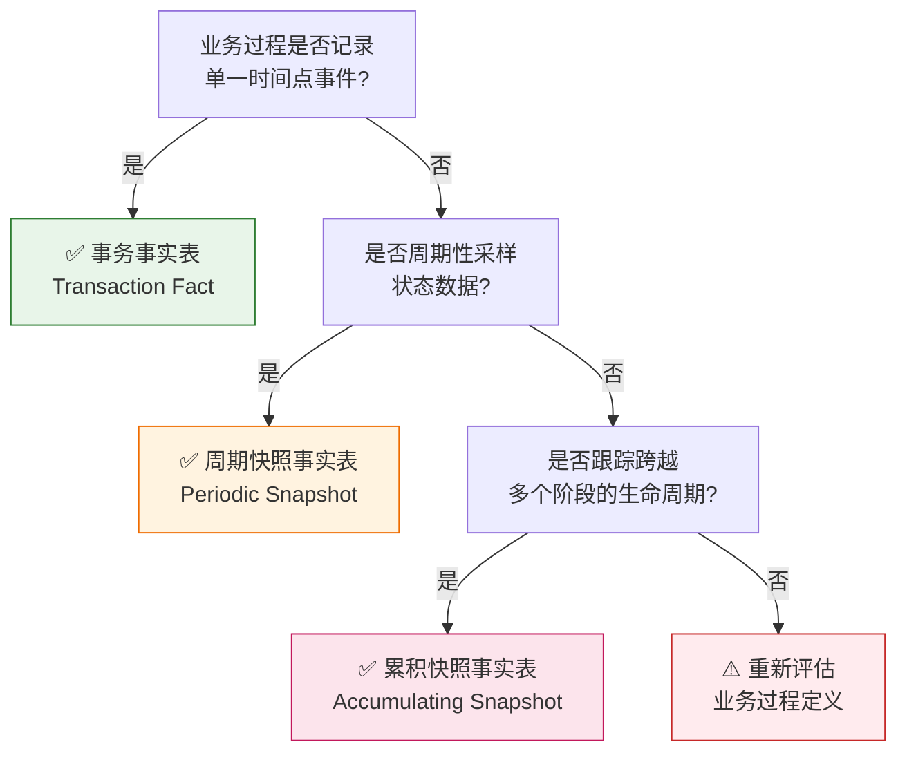

# 数据域业务过程定义表	

> **文档版本**: v1.1	
> **创建日期**: 2026-01-15	
> **依赖文件**: `1.1 数据域定义表.md`, `01_业务域全景图_v1.0.md`, `03_业务需求溯源表_v1.0.md`	

---

### 1.3 事实表类型分类	

根据 Kimball 数据仓库方法论，事实表分为**三种类型**：	

| 类型               | 英文名称              | 核心特征                             | 典型场景                     | 数据特性                     |
| ------------------ | --------------------- | ------------------------------------ | ---------------------------- | ---------------------------- |
| **事务事实表**     | Transaction Fact      | 记录业务事件**发生时刻**的原子级事实 | 订单、支付、入库、出库       | 事件发生后数据**不再变化**   |
| **周期快照事实表** | Periodic Snapshot     | 按**固定时间间隔**记录状态快照       | 库存余额、日流量、广告效果   | 定期拍摄状态，度量**半可加** |
| **累积快照事实表** | Accumulating Snapshot | 跟踪业务过程的**完整生命周期**       | 订单履约全流程、物流配送全程 | 数据**持续更新**直到流程结束 |

#### 1.3.1 事务事实表 (Transaction Fact)	

- **特点**：每行对应一个业务事件，事件发生后数据不再变化	
- **粒度**：最细粒度，一行 = 一次事件	
- **度量**：完全可加的事务度量（金额、数量）	
- **示例**：订单事实表（每行=一笔订单）、支付事实表（每行=一次支付）	

#### 1.3.2 周期快照事实表 (Periodic Snapshot)	

- **特点**：按固定周期（日/周/月）拍摄业务状态快照	
- **粒度**：周期粒度，一行 = 某时点某对象的状态	
- **度量**：半可加度量（不能跨时间求和，如库存余额）	
- **示例**：库存日快照（每行=某天某SKU的库存余额）、流量日快照（每行=某天某链接的访问数据）	

#### 1.3.3 累积快照事实表 (Accumulating Snapshot)	

- **特点**：跟踪业务流程的多个里程碑，数据持续更新直到流程结束	
- **粒度**：业务实体粒度，一行 = 一个实体的完整生命周期	
- **度量**：多个里程碑时间字段 + 时长计算	
- **示例**：订单履约累积快照（跟踪 创建→支付→发货→签收→评价 全流程）	

### 1.4 事实表类型选择决策	

根据以下决策树判断业务过程对应的事实表类型：	

**决策要点**：	

| 判断问题                     | 是           | 否         |
| ---------------------------- | ------------ | ---------- |
| 业务事件是单一时间点发生的？ | → 事务事实表 | → 继续判断 |
| 需要周期性采样状态数据？     | → 周期快照表 | → 继续判断 |
| 需要跟踪跨多阶段的生命周期？ | → 累积快照表 | → 重新评估 |

---

## 更新记录	

| 日期       | 版本 | 更新内容                               | 更新人   |
| ---------- | ---- | -------------------------------------- | -------- |
| 2026-01-15 | v1.0 | 初始版本，为16个数据域定义78个业务过程 | AI架构师 |
