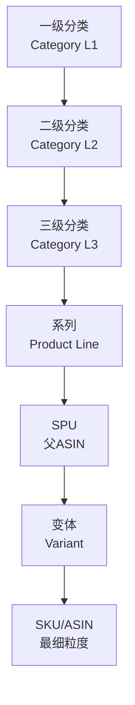
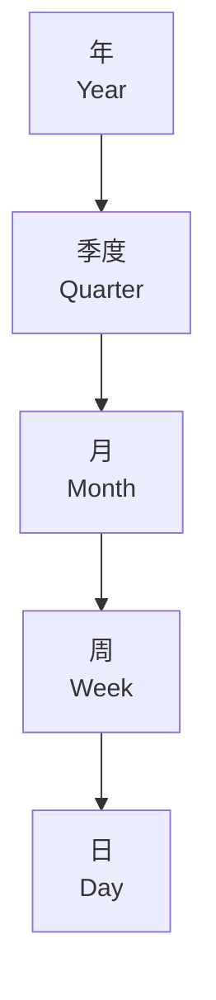
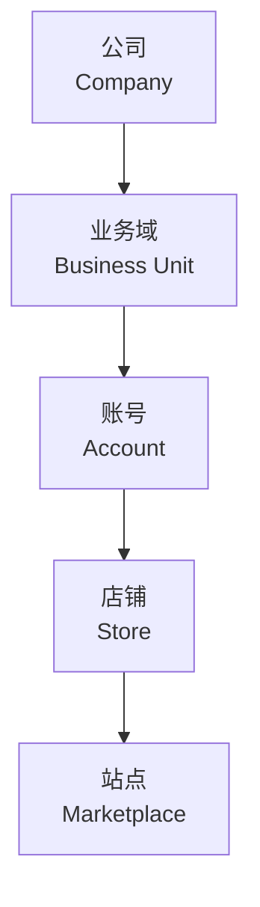
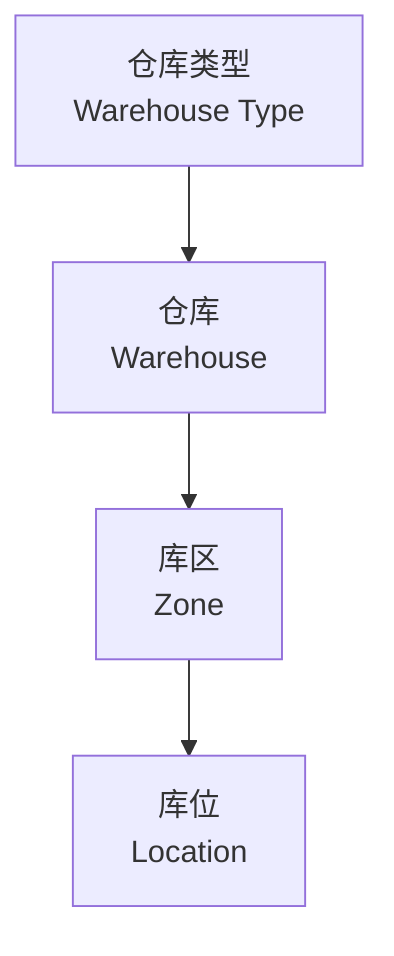

# 一致性维度清单	

> **文档版本**: v1.0	
> **创建日期**: 2026-01-15	
> **依赖文件**: `01_数据域业务过程定义表_v1.0.md`, `02_业务过程粒度分析表_v1.0.md`	

---

## 1. 维度定义标准	

### 1.1 一致性维度原则	

一致性维度是 Kimball 数据仓库的核心概念，要求：	
1. **统一定义**：相同维度在不同事实表中使用相同的定义和属性	
2. **共享复用**：维度表被多个事实表共享，避免重复建设	
3. **层级清晰**：维度属性之间存在明确的层级关系	

### 1.2 维度类型说明	

| 维度类型 | 说明 | 示例 |	
|----------|------|------|	
| **公共维度** | 跨多个数据域共享的维度 | 时间、产品、店铺 |	
| **数据域维度** | 仅在特定数据域内使用的维度 | 广告活动、促销活动 |	
| **退化维度** | 不单独建表，存放于事实表中 | 订单号、物流单号 |	

---

## 2. 公共维度清单	

> [!IMPORTANT]	
> 公共维度是被多个数据域共享的一致性维度，需优先建设并保持一致性。	

### 2.1 核心公共维度	

<table>
    <thead>
        <tr>
            <th>编号</th>
            <th>维度名称</th>
            <th>英文名称</th>
            <th>维度类型</th>
            <th>覆盖数据域</th>
            <th>主键</th>
            <th>说明</th>
        </tr>
    </thead>
    <tbody>
        <tr>
            <td>DIM-01</td>
            <td>时间维度</td>
            <td>dim_date</td>
            <td>公共维度</td>
            <td>全部16个数据域</td>
            <td>date_key</td>
            <td>日期维度，支持日/周/月/季/年层级</td>
        </tr>
        <tr>
            <td>DIM-02</td>
            <td>时段维度</td>
            <td>dim_time_period</td>
            <td>公共维度</td>
            <td>广告域、运营域</td>
            <td>time_period_key</td>
            <td>小时级时间段，用于广告投放分析</td>
        </tr>
        <tr>
            <td>DIM-03</td>
            <td>产品维度</td>
            <td>dim_product</td>
            <td>公共维度</td>
            <td>交易域、运营域、库存域、履约域、促销域、广告域、研发域、品控域</td>
            <td>product_key</td>
            <td>产品/SKU/ASIN维度，核心业务对象</td>
        </tr>
        <tr>
            <td>DIM-04</td>
            <td>变体维度</td>
            <td>dim_variant</td>
            <td>公共维度</td>
            <td>交易域、运营域、库存域</td>
            <td>variant_key</td>
            <td>产品变体（颜色、尺寸等）</td>
        </tr>
        <tr>
            <td>DIM-05</td>
            <td>店铺维度</td>
            <td>dim_store</td>
            <td>公共维度</td>
            <td>交易域、运营域、促销域、广告域、财务域</td>
            <td>store_key</td>
            <td>亚马逊店铺维度</td>
        </tr>
        <tr>
            <td>DIM-06</td>
            <td>账号维度</td>
            <td>dim_account</td>
            <td>公共维度</td>
            <td>运营域、财务域</td>
            <td>account_key</td>
            <td>卖家账号维度</td>
        </tr>
        <tr>
            <td>DIM-07</td>
            <td>站点维度</td>
            <td>dim_marketplace</td>
            <td>公共维度</td>
            <td>交易域、运营域、广告域、促销域</td>
            <td>marketplace_key</td>
            <td>亚马逊站点（US/UK/DE/JP等）</td>
        </tr>
        <tr>
            <td>DIM-08</td>
            <td>类目维度</td>
            <td>dim_category</td>
            <td>公共维度</td>
            <td>运营域、市场域、交易域</td>
            <td>category_key</td>
            <td>亚马逊类目层级</td>
        </tr>
        <tr>
            <td>DIM-09</td>
            <td>仓库维度</td>
            <td>dim_warehouse</td>
            <td>公共维度</td>
            <td>库存域、履约域、生产域</td>
            <td>warehouse_key</td>
            <td>仓库维度（自有仓/FBA仓）</td>
        </tr>
        <tr>
            <td>DIM-10</td>
            <td>供应商维度</td>
            <td>dim_supplier</td>
            <td>公共维度</td>
            <td>供采域、品控域、生产域</td>
            <td>supplier_key</td>
            <td>供应商信息</td>
        </tr>
    </tbody>
</table>

### 2.2 公共维度覆盖矩阵	

<table>
    <thead>
        <tr>
            <th>维度 \ 数据域</th>
            <th>交易</th>
            <th>运营</th>
            <th>库存</th>
            <th>履约</th>
            <th>促销</th>
            <th>广告</th>
            <th>研发</th>
            <th>供采</th>
            <th>生产</th>
            <th>品控</th>
            <th>市场</th>
            <th>客服</th>
            <th>财务</th>
            <th>客户</th>
            <th>政策</th>
            <th>算法</th>
        </tr>
    </thead>
    <tbody>
        <tr>
            <td>时间维度</td>
            <td>✓</td>
            <td>✓</td>
            <td>✓</td>
            <td>✓</td>
            <td>✓</td>
            <td>✓</td>
            <td>✓</td>
            <td>✓</td>
            <td>✓</td>
            <td>✓</td>
            <td>✓</td>
            <td>✓</td>
            <td>✓</td>
            <td>✓</td>
            <td>✓</td>
            <td>✓</td>
        </tr>
        <tr>
            <td>产品维度</td>
            <td>✓</td>
            <td>✓</td>
            <td>✓</td>
            <td>✓</td>
            <td>✓</td>
            <td>✓</td>
            <td>✓</td>
            <td>-</td>
            <td>✓</td>
            <td>✓</td>
            <td>✓</td>
            <td>✓</td>
            <td>✓</td>
            <td>-</td>
            <td>-</td>
            <td>-</td>
        </tr>
        <tr>
            <td>店铺维度</td>
            <td>✓</td>
            <td>✓</td>
            <td>-</td>
            <td>-</td>
            <td>✓</td>
            <td>✓</td>
            <td>-</td>
            <td>-</td>
            <td>-</td>
            <td>-</td>
            <td>-</td>
            <td>-</td>
            <td>✓</td>
            <td>-</td>
            <td>-</td>
            <td>-</td>
        </tr>
        <tr>
            <td>站点维度</td>
            <td>✓</td>
            <td>✓</td>
            <td>-</td>
            <td>-</td>
            <td>✓</td>
            <td>✓</td>
            <td>-</td>
            <td>-</td>
            <td>-</td>
            <td>-</td>
            <td>✓</td>
            <td>-</td>
            <td>-</td>
            <td>-</td>
            <td>-</td>
            <td>-</td>
        </tr>
        <tr>
            <td>仓库维度</td>
            <td>-</td>
            <td>-</td>
            <td>✓</td>
            <td>✓</td>
            <td>-</td>
            <td>-</td>
            <td>-</td>
            <td>-</td>
            <td>✓</td>
            <td>-</td>
            <td>-</td>
            <td>-</td>
            <td>-</td>
            <td>-</td>
            <td>-</td>
            <td>-</td>
        </tr>
        <tr>
            <td>供应商维度</td>
            <td>-</td>
            <td>-</td>
            <td>-</td>
            <td>-</td>
            <td>-</td>
            <td>-</td>
            <td>-</td>
            <td>✓</td>
            <td>✓</td>
            <td>✓</td>
            <td>-</td>
            <td>-</td>
            <td>-</td>
            <td>-</td>
            <td>-</td>
            <td>-</td>
        </tr>
    </tbody>
</table>

---

## 3. 数据域专属维度	

### 3.1 交易域维度	

| 编号 | 维度名称 | 英文名称 | 主键 | 说明 |	
|------|----------|----------|------|------|	
| DIM-11 | 支付方式维度 | dim_payment_method | payment_method_key | 支付方式（信用卡、礼品卡等） |	
| DIM-12 | 订单状态维度 | dim_order_status | order_status_key | 订单状态（待支付、已发货等） |	
| DIM-13 | 评价等级维度 | dim_review_rating | rating_key | 评价星级（1-5星） |	

### 3.2 运营域维度	

| 编号 | 维度名称 | 英文名称 | 主键 | 说明 |	
|------|----------|----------|------|------|	
| DIM-14 | 链接状态维度 | dim_listing_status | listing_status_key | 链接状态（在售、下架等） |	
| DIM-15 | 流量来源维度 | dim_traffic_source | traffic_source_key | 流量来源（自然、广告、站外等） |	
| DIM-16 | 关键词维度 | dim_keyword | keyword_key | 搜索关键词 |	

### 3.3 库存域维度	

| 编号 | 维度名称 | 英文名称 | 主键 | 说明 |	
|------|----------|----------|------|------|	
| DIM-17 | 库龄区间维度 | dim_inventory_age | age_bucket_key | 库龄区间（0-30天、31-60天等） |	
| DIM-18 | 库存状态维度 | dim_inventory_status | inv_status_key | 库存状态（可售、不可售等） |	
| DIM-19 | 仓库类型维度 | dim_warehouse_type | warehouse_type_key | 仓库类型（自有仓、FBA仓） |	

### 3.4 履约域维度	

| 编号 | 维度名称 | 英文名称 | 主键 | 说明 |	
|------|----------|----------|------|------|	
| DIM-20 | 物流渠道维度 | dim_logistics_channel | channel_key | 物流渠道（头程、尾程） |	
| DIM-21 | 物流状态维度 | dim_shipment_status | shipment_status_key | 物流状态（已发货、运输中等） |	
| DIM-22 | 退货原因维度 | dim_return_reason | return_reason_key | 退货原因分类 |	

### 3.5 促销域维度	

| 编号 | 维度名称 | 英文名称 | 主键 | 说明 |	
|------|----------|----------|------|------|	
| DIM-23 | 促销类型维度 | dim_promotion_type | promo_type_key | 促销类型（LD、7DD、Coupon等） |	
| DIM-24 | 费用类型维度 | dim_promo_fee_type | promo_fee_type_key | 促销费用类型 |	

### 3.6 广告域维度	

| 编号 | 维度名称 | 英文名称 | 主键 | 说明 |	
|------|----------|----------|------|------|	
| DIM-25 | 广告类型维度 | dim_ad_type | ad_type_key | 广告类型（SP/SB/SD） |	
| DIM-26 | 匹配类型维度 | dim_match_type | match_type_key | 关键词匹配类型（精准、广泛等） |	
| DIM-27 | 广告位维度 | dim_ad_placement | placement_key | 广告位（搜索顶部、商品详情等） |	
| DIM-28 | 广告目标维度 | dim_ad_targeting | targeting_key | 投放目标类型（关键词、商品） |	

### 3.7 品控域维度	

| 编号 | 维度名称 | 英文名称 | 主键 | 说明 |	
|------|----------|----------|------|------|	
| DIM-29 | 检验类型维度 | dim_inspection_type | inspection_type_key | 检验类型（IQC/IPQC/OQC） |	
| DIM-30 | 缺陷类型维度 | dim_defect_type | defect_type_key | 缺陷类型分类 |	
| DIM-31 | 质量等级维度 | dim_quality_level | quality_level_key | 质量等级（A/B/C） |	

### 3.8 生产域维度	

| 编号 | 维度名称 | 英文名称 | 主键 | 说明 |	
|------|----------|----------|------|------|	
| DIM-32 | 车间维度 | dim_workshop | workshop_key | 生产车间 |	
| DIM-33 | 设备维度 | dim_equipment | equipment_key | 生产设备 |	
| DIM-34 | 工序维度 | dim_process | process_key | 工艺工序 |	

### 3.9 供采域维度	

| 编号 | 维度名称 | 英文名称 | 主键 | 说明 |	
|------|----------|----------|------|------|	
| DIM-35 | 物料维度 | dim_material | material_key | 原材料/物料 |	
| DIM-36 | 采购类型维度 | dim_purchase_type | purchase_type_key | 采购类型（正常、紧急等） |	

### 3.10 市场域维度	

| 编号 | 维度名称 | 英文名称 | 主键 | 说明 |	
|------|----------|----------|------|------|	
| DIM-37 | 竞品维度 | dim_competitor | competitor_key | 竞品信息 |	
| DIM-38 | 渠道维度 | dim_channel | channel_key | 销售/流量渠道 |	

### 3.11 客服域维度	

| 编号 | 维度名称 | 英文名称 | 主键 | 说明 |	
|------|----------|----------|------|------|	
| DIM-39 | 客诉类型维度 | dim_complaint_type | complaint_type_key | 客诉类型分类 |	
| DIM-40 | 工单状态维度 | dim_ticket_status | ticket_status_key | 工单状态 |	

### 3.12 财务域维度	

| 编号 | 维度名称 | 英文名称 | 主键 | 说明 |	
|------|----------|----------|------|------|	
| DIM-41 | 科目维度 | dim_account_subject | subject_key | 会计科目 |	
| DIM-42 | 币种维度 | dim_currency | currency_key | 币种 |	
| DIM-43 | 部门维度 | dim_department | dept_key | 组织部门 |	

### 3.13 其他域维度	

| 编号 | 维度名称 | 英文名称 | 所属域 | 主键 | 说明 |	
|------|----------|----------|--------|------|------|	
| DIM-44 | 客群维度 | dim_customer_segment | 客户域 | segment_key | 客户分群 |	
| DIM-45 | 政策类型维度 | dim_policy_type | 政策域 | policy_type_key | 平台政策类型 |	
| DIM-46 | 算法模型维度 | dim_algorithm | 算法域 | algorithm_key | 算法模型信息 |	

---

## 4. 维度层级关系	

### 4.1 产品维度层级	

### 4.2 时间维度层级	

### 4.3 组织维度层级	

### 4.4 仓储维度层级	

---

## 5. 维度汇总统计	

| 维度类别 | 维度数量 | 占比 | 说明 |	
|----------|----------|------|------|	
| 公共维度 | 10 | 21.7% | 跨多数据域共享 |	
| 交易域维度 | 3 | 6.5% | 订单、支付相关 |	
| 运营域维度 | 3 | 6.5% | 链接、流量相关 |	
| 库存域维度 | 3 | 6.5% | 库存状态相关 |	
| 履约域维度 | 3 | 6.5% | 物流、退货相关 |	
| 促销域维度 | 2 | 4.3% | 促销活动相关 |	
| 广告域维度 | 4 | 8.7% | 广告投放相关 |	
| 品控域维度 | 3 | 6.5% | 质量检验相关 |	
| 生产域维度 | 3 | 6.5% | 生产制造相关 |	
| 供采域维度 | 2 | 4.3% | 采购物料相关 |	
| 其他域维度 | 10 | 21.7% | 市场/客服/财务等 |	
| **合计** | **46** | **100%** | - |	

---

## 更新记录	

| 日期 | 版本 | 更新内容 | 更新人 |	
|------|------|----------|--------|	
| 2026-01-15 | v1.0 | 初始版本，定义46个维度 | AI架构师 |	
