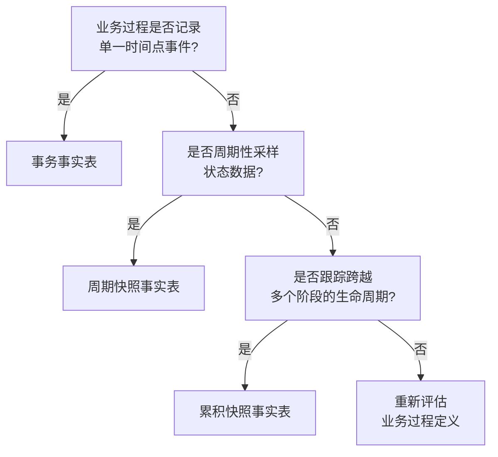

# 事实表类型规划	

> **文档版本**: v1.0	
> **创建日期**: 2026-01-15	
> **依赖文件**: `02_业务过程粒度分析表_v1.0.md`, `01_一致性维度清单_v1.0.md`	

---

## 1. 事实表类型概述	

### 1.1 事实表类型分类	

根据 Kimball 方法论，事实表分为三种类型：	

| 类型 | 英文名称 | 特征 | 典型场景 |	
|------|----------|------|----------|	
| **事务事实表** | Transaction Fact | 记录业务事件发生时刻的原子级事实 | 订单、支付、入库 |	
| **周期快照事实表** | Periodic Snapshot | 按固定时间间隔记录状态快照 | 库存余额、流量数据 |	
| **累积快照事实表** | Accumulating Snapshot | 跟踪业务过程的完整生命周期 | 订单履约全流程 |	

### 1.2 选择决策树	



---

## 2. 事实表类型规划明细	

### 2.1 P0级 - 核心域事实表	

#### 交易域 (trd)	

<table>
    <thead>
        <tr>
            <th>编号</th>
            <th>事实表名称</th>
            <th>英文表名</th>
            <th>事实表类型</th>
            <th>对应业务过程</th>
            <th>更新频率</th>
            <th>说明</th>
        </tr>
    </thead>
    <tbody>
        <tr>
            <td>FCT-01</td>
            <td>订单事实表</td>
            <td>fct_trd_order</td>
            <td>事务事实</td>
            <td>创建订单</td>
            <td>实时/日</td>
            <td>记录每笔订单创建事件</td>
        </tr>
        <tr>
            <td>FCT-02</td>
            <td>订单明细事实表</td>
            <td>fct_trd_order_detail</td>
            <td>事务事实</td>
            <td>订单明细</td>
            <td>实时/日</td>
            <td>记录订单中每个商品明细</td>
        </tr>
        <tr>
            <td>FCT-03</td>
            <td>支付事实表</td>
            <td>fct_trd_payment</td>
            <td>事务事实</td>
            <td>支付订单</td>
            <td>实时/日</td>
            <td>记录每笔支付事件</td>
        </tr>
        <tr>
            <td>FCT-04</td>
            <td>结算事实表</td>
            <td>fct_trd_settlement</td>
            <td>事务事实</td>
            <td>结算订单</td>
            <td>日</td>
            <td>记录平台结算记录</td>
        </tr>
        <tr>
            <td>FCT-05</td>
            <td>评价事实表</td>
            <td>fct_trd_review</td>
            <td>事务事实</td>
            <td>发布评价</td>
            <td>日</td>
            <td>记录用户评价</td>
        </tr>
        <tr>
            <td>FCT-06</td>
            <td>订单履约累积快照</td>
            <td>fct_trd_order_fulfillment</td>
            <td>累积快照</td>
            <td>订单全流程</td>
            <td>实时/日</td>
            <td>跟踪订单从创建到签收的全流程</td>
        </tr>
    </tbody>
</table>

#### 运营域 (op)	

<table>
    <thead>
        <tr>
            <th>编号</th>
            <th>事实表名称</th>
            <th>英文表名</th>
            <th>事实表类型</th>
            <th>对应业务过程</th>
            <th>更新频率</th>
            <th>说明</th>
        </tr>
    </thead>
    <tbody>
        <tr>
            <td>FCT-07</td>
            <td>链接上架事实表</td>
            <td>fct_op_listing</td>
            <td>事务事实</td>
            <td>上架链接</td>
            <td>日</td>
            <td>记录链接上架事件</td>
        </tr>
        <tr>
            <td>FCT-08</td>
            <td>流量日快照表</td>
            <td>fct_op_traffic_daily</td>
            <td>周期快照</td>
            <td>监控流量</td>
            <td>日</td>
            <td>每日链接级流量快照</td>
        </tr>
        <tr>
            <td>FCT-09</td>
            <td>自然流量日快照表</td>
            <td>fct_op_organic_daily</td>
            <td>周期快照</td>
            <td>分析自然流量</td>
            <td>日</td>
            <td>每日自然流量快照</td>
        </tr>
    </tbody>
</table>

### 2.2 P1级 - 重要域事实表	

#### 库存域 (inv)	

<table>
    <thead>
        <tr>
            <th>编号</th>
            <th>事实表名称</th>
            <th>英文表名</th>
            <th>事实表类型</th>
            <th>对应业务过程</th>
            <th>更新频率</th>
            <th>说明</th>
        </tr>
    </thead>
    <tbody>
        <tr>
            <td>FCT-10</td>
            <td>入库事实表</td>
            <td>fct_inv_stock_in</td>
            <td>事务事实</td>
            <td>商品入库</td>
            <td>日</td>
            <td>记录每笔入库事件</td>
        </tr>
        <tr>
            <td>FCT-11</td>
            <td>出库事实表</td>
            <td>fct_inv_stock_out</td>
            <td>事务事实</td>
            <td>商品出库</td>
            <td>日</td>
            <td>记录每笔出库事件</td>
        </tr>
        <tr>
            <td>FCT-12</td>
            <td>库存日快照表</td>
            <td>fct_inv_stock_daily</td>
            <td>周期快照</td>
            <td>库存盘点</td>
            <td>日</td>
            <td>每日库存余额快照</td>
        </tr>
        <tr>
            <td>FCT-13</td>
            <td>库龄日快照表</td>
            <td>fct_inv_aging_daily</td>
            <td>周期快照</td>
            <td>库龄分析</td>
            <td>日</td>
            <td>每日库龄分布快照</td>
        </tr>
    </tbody>
</table>

#### 履约域 (fl)	

<table>
    <thead>
        <tr>
            <th>编号</th>
            <th>事实表名称</th>
            <th>英文表名</th>
            <th>事实表类型</th>
            <th>对应业务过程</th>
            <th>更新频率</th>
            <th>说明</th>
        </tr>
    </thead>
    <tbody>
        <tr>
            <td>FCT-14</td>
            <td>发货事实表</td>
            <td>fct_fl_shipment</td>
            <td>事务事实</td>
            <td>发货配送</td>
            <td>日</td>
            <td>记录发货事件</td>
        </tr>
        <tr>
            <td>FCT-15</td>
            <td>FBA入仓事实表</td>
            <td>fct_fl_fba_inbound</td>
            <td>事务事实</td>
            <td>FBA入仓</td>
            <td>日</td>
            <td>记录FBA入仓事件</td>
        </tr>
        <tr>
            <td>FCT-16</td>
            <td>退货事实表</td>
            <td>fct_fl_return</td>
            <td>事务事实</td>
            <td>处理退货</td>
            <td>日</td>
            <td>记录退货事件</td>
        </tr>
        <tr>
            <td>FCT-17</td>
            <td>物流履约累积快照</td>
            <td>fct_fl_delivery_snapshot</td>
            <td>累积快照</td>
            <td>物流全流程</td>
            <td>日</td>
            <td>跟踪物流从发货到签收的全流程</td>
        </tr>
    </tbody>
</table>

#### 促销域 (prm)	

<table>
    <thead>
        <tr>
            <th>编号</th>
            <th>事实表名称</th>
            <th>英文表名</th>
            <th>事实表类型</th>
            <th>对应业务过程</th>
            <th>更新频率</th>
            <th>说明</th>
        </tr>
    </thead>
    <tbody>
        <tr>
            <td>FCT-18</td>
            <td>促销活动事实表</td>
            <td>fct_prm_promotion</td>
            <td>事务事实</td>
            <td>创建促销活动</td>
            <td>日</td>
            <td>记录促销活动创建</td>
        </tr>
        <tr>
            <td>FCT-19</td>
            <td>促销销售日快照</td>
            <td>fct_prm_sales_daily</td>
            <td>周期快照</td>
            <td>记录促销销售</td>
            <td>日</td>
            <td>每日促销销售表现</td>
        </tr>
        <tr>
            <td>FCT-20</td>
            <td>促销费用事实表</td>
            <td>fct_prm_cost</td>
            <td>事务事实</td>
            <td>核算促销费用</td>
            <td>日</td>
            <td>记录促销费用支出</td>
        </tr>
    </tbody>
</table>

#### 广告域 (ads)	

<table>
    <thead>
        <tr>
            <th>编号</th>
            <th>事实表名称</th>
            <th>英文表名</th>
            <th>事实表类型</th>
            <th>对应业务过程</th>
            <th>更新频率</th>
            <th>说明</th>
        </tr>
    </thead>
    <tbody>
        <tr>
            <td>FCT-21</td>
            <td>广告活动事实表</td>
            <td>fct_ads_campaign</td>
            <td>事务事实</td>
            <td>创建广告活动</td>
            <td>日</td>
            <td>记录广告活动创建</td>
        </tr>
        <tr>
            <td>FCT-22</td>
            <td>关键词投放事实表</td>
            <td>fct_ads_keyword</td>
            <td>事务事实</td>
            <td>投放关键词</td>
            <td>日</td>
            <td>记录关键词竞价设置</td>
        </tr>
        <tr>
            <td>FCT-23</td>
            <td>广告效果日快照</td>
            <td>fct_ads_performance_daily</td>
            <td>周期快照</td>
            <td>广告展示/点击</td>
            <td>日</td>
            <td>每日广告展示/点击/花费</td>
        </tr>
        <tr>
            <td>FCT-24</td>
            <td>广告关键词日快照</td>
            <td>fct_ads_keyword_daily</td>
            <td>周期快照</td>
            <td>关键词效果</td>
            <td>日</td>
            <td>每日关键词级表现</td>
        </tr>
    </tbody>
</table>

### 2.3 P2级 - 一般域事实表	

<table>
    <thead>
        <tr>
            <th>数据域</th>
            <th>编号</th>
            <th>事实表名称</th>
            <th>英文表名</th>
            <th>事实表类型</th>
            <th>更新频率</th>
        </tr>
    </thead>
    <tbody>
        <tr>
            <td rowspan="2">研发域</td>
            <td>FCT-25</td>
            <td>产品迭代事实表</td>
            <td>fct_rd_iteration</td>
            <td>事务事实</td>
            <td>日</td>
        </tr>
        <tr>
            <td>FCT-26</td>
            <td>BOM变更事实表</td>
            <td>fct_rd_bom_change</td>
            <td>事务事实</td>
            <td>日</td>
        </tr>
        <tr>
            <td rowspan="2">供采域</td>
            <td>FCT-27</td>
            <td>采购订单事实表</td>
            <td>fct_sup_purchase_order</td>
            <td>事务事实</td>
            <td>日</td>
        </tr>
        <tr>
            <td>FCT-28</td>
            <td>采购付款事实表</td>
            <td>fct_sup_payment</td>
            <td>事务事实</td>
            <td>日</td>
        </tr>
        <tr>
            <td rowspan="3">生产域</td>
            <td>FCT-29</td>
            <td>生产工单事实表</td>
            <td>fct_mfg_work_order</td>
            <td>事务事实</td>
            <td>日</td>
        </tr>
        <tr>
            <td>FCT-30</td>
            <td>产能日快照表</td>
            <td>fct_mfg_capacity_daily</td>
            <td>周期快照</td>
            <td>日</td>
        </tr>
        <tr>
            <td>FCT-31</td>
            <td>设备效能日快照</td>
            <td>fct_mfg_oee_daily</td>
            <td>周期快照</td>
            <td>日</td>
        </tr>
        <tr>
            <td rowspan="3">品控域</td>
            <td>FCT-32</td>
            <td>来料检验事实表</td>
            <td>fct_qc_iqc</td>
            <td>事务事实</td>
            <td>日</td>
        </tr>
        <tr>
            <td>FCT-33</td>
            <td>过程检验事实表</td>
            <td>fct_qc_ipqc</td>
            <td>事务事实</td>
            <td>日</td>
        </tr>
        <tr>
            <td>FCT-34</td>
            <td>成品检验事实表</td>
            <td>fct_qc_oqc</td>
            <td>事务事实</td>
            <td>日</td>
        </tr>
    </tbody>
</table>

### 2.4 P3级 - 辅助域事实表	

<table>
    <thead>
        <tr>
            <th>数据域</th>
            <th>编号</th>
            <th>事实表名称</th>
            <th>英文表名</th>
            <th>事实表类型</th>
            <th>更新频率</th>
        </tr>
    </thead>
    <tbody>
        <tr>
            <td rowspan="2">市场域</td>
            <td>FCT-35</td>
            <td>链接表现日快照</td>
            <td>fct_mkt_listing_daily</td>
            <td>周期快照</td>
            <td>日</td>
        </tr>
        <tr>
            <td>FCT-36</td>
            <td>竞品监控日快照</td>
            <td>fct_mkt_competitor_daily</td>
            <td>周期快照</td>
            <td>日</td>
        </tr>
        <tr>
            <td rowspan="2">客服域</td>
            <td>FCT-37</td>
            <td>客诉事实表</td>
            <td>fct_cs_complaint</td>
            <td>事务事实</td>
            <td>日</td>
        </tr>
        <tr>
            <td>FCT-38</td>
            <td>客服工单事实表</td>
            <td>fct_cs_ticket</td>
            <td>事务事实</td>
            <td>日</td>
        </tr>
        <tr>
            <td rowspan="2">财务域</td>
            <td>FCT-39</td>
            <td>应收应付事实表</td>
            <td>fct_fin_ar_ap</td>
            <td>事务事实</td>
            <td>日</td>
        </tr>
        <tr>
            <td>FCT-40</td>
            <td>利润月快照表</td>
            <td>fct_fin_profit_monthly</td>
            <td>周期快照</td>
            <td>月</td>
        </tr>
    </tbody>
</table>

---

## 3. 事实表类型统计	

### 3.1 按类型分布	

| 事实表类型 | 数量 | 占比 | 典型场景 |	
|------------|------|------|----------|	
| 事务事实表 | 28 | 70.0% | 订单、支付、入出库等事件记录 |	
| 周期快照表 | 10 | 25.0% | 库存、流量、广告效果等状态数据 |	
| 累积快照表 | 2 | 5.0% | 订单履约、物流履约全流程 |	
| **合计** | **40** | **100%** | - |	

### 3.2 按数据域分布	

| 数据域 | 优先级 | 事实表数 | 事务事实 | 周期快照 | 累积快照 |	
|--------|--------|----------|----------|----------|----------|	
| 交易域 | P0 | 6 | 5 | 0 | 1 |	
| 运营域 | P0 | 3 | 1 | 2 | 0 |	
| 库存域 | P1 | 4 | 2 | 2 | 0 |	
| 履约域 | P1 | 4 | 3 | 0 | 1 |	
| 促销域 | P1 | 3 | 2 | 1 | 0 |	
| 广告域 | P1 | 4 | 2 | 2 | 0 |	
| 研发域 | P2 | 2 | 2 | 0 | 0 |	
| 供采域 | P2 | 2 | 2 | 0 | 0 |	
| 生产域 | P2 | 3 | 1 | 2 | 0 |	
| 品控域 | P2 | 3 | 3 | 0 | 0 |	
| 市场域 | P3 | 2 | 0 | 2 | 0 |	
| 客服域 | P3 | 2 | 2 | 0 | 0 |	
| 财务域 | P3 | 2 | 1 | 1 | 0 |	

---

## 4. 累积快照事实表设计	

### 4.1 订单履约累积快照 (fct_trd_order_fulfillment)	

**跟踪阶段**：	
```	
创建订单 → 支付订单 → 发货 → 物流运输 → 签收 → 评价	
```	

**里程碑时间字段**：	
| 字段名 | 说明 |	
|--------|------|	
| order_create_time | 订单创建时间 |	
| payment_time | 支付完成时间 |	
| ship_time | 发货时间 |	
| deliver_time | 签收时间 |	
| review_time | 评价时间 |	

**时长计算**：	
| 字段名 | 说明 |	
|--------|------|	
| payment_duration | 创建到支付时长 |	
| ship_duration | 支付到发货时长 |	
| deliver_duration | 发货到签收时长 |	
| total_duration | 订单全程时长 |	

---

## 更新记录	

| 日期 | 版本 | 更新内容 | 更新人 |	
|------|------|----------|--------|	
| 2026-01-15 | v1.0 | 初始版本，规划40个事实表 | AI架构师 |	
