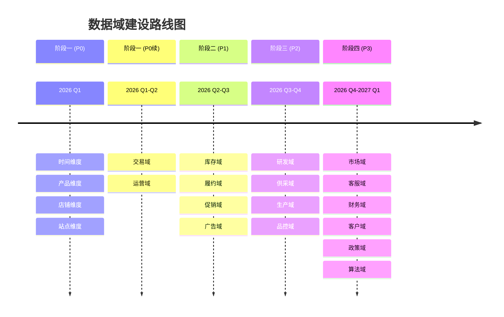
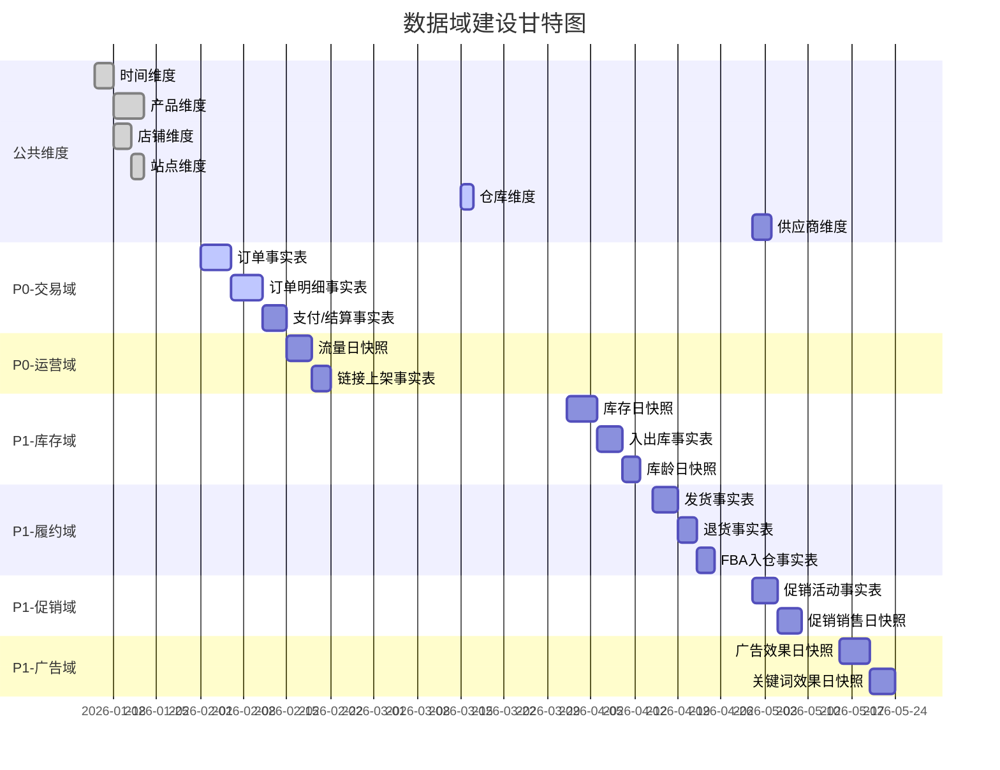
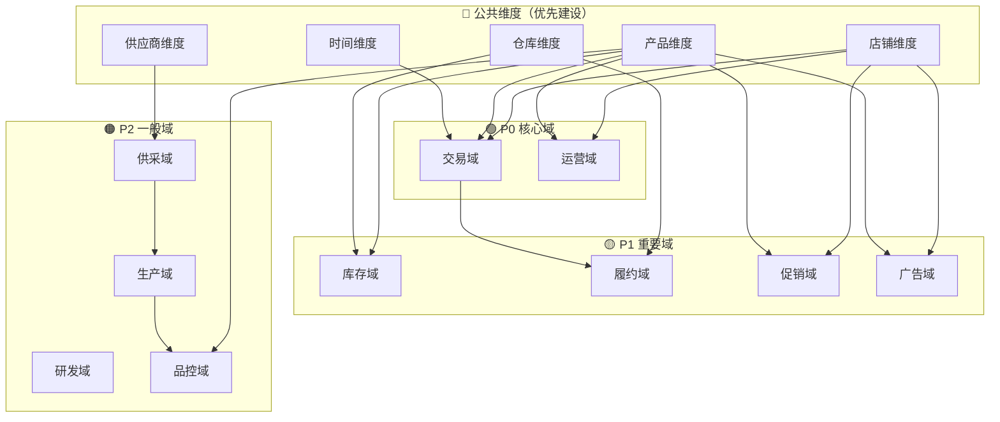

# 数据域建设路线图	

> **文档版本**: v1.0	
> **创建日期**: 2026-01-15	
> **依赖文件**: `01_总线矩阵_v1.0.md`, `1.1 数据域定义表.md`	

---

## 1. 路线图概述	

### 1.1 建设目标	

基于总线矩阵和业务优先级，规划16个数据域的分阶段建设路径，确保：	
1. **高价值优先**：优先建设业务需求最强烈的数据域	
2. **共享维度先行**：先建设被多个数据域共享的一致性维度	
3. **依赖顺序合理**：考虑数据域之间的依赖关系	
4. **资源可控**：每阶段工作量可控，风险可管理	

### 1.2 优先级依据	

| 评估维度 | 权重 | 说明 |	
|----------|------|------|	
| 业务需求覆盖 | 40% | 需求溯源表中覆盖的需求点数 |	
| 维度复用程度 | 30% | 总线矩阵中共享维度数量 |	
| 数据源就绪度 | 20% | 数据源现状分析中的覆盖率 |	
| 实施复杂度 | 10% | 实施难度和风险 |	

---

## 2. 分阶段建设计划	

### 2.1 阶段总览	

---

## 3. 阶段一：核心域建设 (P0)	

### 3.1 建设目标	

建立数据仓库核心基础，覆盖最高优先级业务需求。	

### 3.2 建设内容	

<table>
    <thead>
        <tr>
            <th>编号</th>
            <th>建设项</th>
            <th>序号</th>
            <th>具体内容</th>
            <th>工作量</th>
            <th>产出物</th>
        </tr>
    </thead>
    <tbody>
        <tr>
            <td rowspan="4">一</td>
            <td rowspan="4">公共维度</td>
            <td>1</td>
            <td>时间维度 (dim_base_date)</td>
            <td>3天</td>
            <td>日/周/月/季/年层级</td>
        </tr>
        <tr>
            <td>2</td>
            <td>产品维度 (dim_op_product)</td>
            <td>5天</td>
            <td>ASIN、SKU、类目层级</td>
        </tr>
        <tr>
            <td>3</td>
            <td>店铺维度 (dim_op_store)</td>
            <td>3天</td>
            <td>账号、店铺、站点</td>
        </tr>
        <tr>
            <td>4</td>
            <td>站点维度 (dim_op_marketplace)</td>
            <td>2天</td>
            <td>亚马逊各站点</td>
        </tr>
        <tr>
            <td rowspan="3">二</td>
            <td rowspan="3">交易域</td>
            <td>5</td>
            <td>订单事实表</td>
            <td>5天</td>
            <td>fct_trd_order</td>
        </tr>
        <tr>
            <td>6</td>
            <td>订单明细事实表</td>
            <td>5天</td>
            <td>fct_trd_order_detail</td>
        </tr>
        <tr>
            <td>7</td>
            <td>支付/结算事实表</td>
            <td>4天</td>
            <td>fct_trd_payment, fct_trd_settlement</td>
        </tr>
        <tr>
            <td rowspan="2">三</td>
            <td rowspan="2">运营域</td>
            <td>8</td>
            <td>流量日快照表</td>
            <td>4天</td>
            <td>fct_op_traffic_daily</td>
        </tr>
        <tr>
            <td>9</td>
            <td>链接上架事实表</td>
            <td>3天</td>
            <td>fct_op_listing</td>
        </tr>
    </tbody>
</table>

### 3.3 里程碑	

| 里程碑 | 预计完成时间 | 验收标准 |	
|--------|-------------|----------|	
| 公共维度上线 | 2026-02-15 | 4个公共维度表可查询 |	
| 交易域上线 | 2026-03-15 | 订单相关分析可进行 |	
| 运营域上线 | 2026-03-31 | 流量、链接分析可进行 |	

### 3.4 依赖与风险	

| 风险项 | 风险描述 | 应对措施 |	
|--------|----------|----------|	
| 亚马逊数据接入 | 亚马逊后台数据接入方式待定 | 先接入已有OMS数据，后续扩展 |	
| 产品主数据质量 | ASIN/SKU映射关系可能不完整 | 预留数据清洗和映射逻辑 |	

---

## 4. 阶段二：重要域建设 (P1)	

### 4.1 建设目标	

扩展运营分析能力，支持库存、履约、促销、广告等核心运营场景。	

### 4.2 建设内容	

<table>
    <thead>
        <tr>
            <th>编号</th>
            <th>数据域</th>
            <th>序号</th>
            <th>具体内容</th>
            <th>工作量</th>
            <th>前置依赖</th>
        </tr>
    </thead>
    <tbody>
        <tr>
            <td rowspan="3">一</td>
            <td rowspan="3">库存域</td>
            <td>1</td>
            <td>仓库维度</td>
            <td>2天</td>
            <td>无</td>
        </tr>
        <tr>
            <td>2</td>
            <td>库存日快照表</td>
            <td>5天</td>
            <td>产品维度、仓库维度</td>
        </tr>
        <tr>
            <td>3</td>
            <td>入出库事实表</td>
            <td>4天</td>
            <td>产品维度、仓库维度</td>
        </tr>
        <tr>
            <td rowspan="2">二</td>
            <td rowspan="2">履约域</td>
            <td>4</td>
            <td>发货/退货事实表</td>
            <td>5天</td>
            <td>仓库维度、交易域</td>
        </tr>
        <tr>
            <td>5</td>
            <td>FBA入仓事实表</td>
            <td>3天</td>
            <td>产品维度、仓库维度</td>
        </tr>
        <tr>
            <td rowspan="2">三</td>
            <td rowspan="2">促销域</td>
            <td>6</td>
            <td>促销类型维度</td>
            <td>1天</td>
            <td>无</td>
        </tr>
        <tr>
            <td>7</td>
            <td>促销销售/费用事实表</td>
            <td>5天</td>
            <td>产品维度、店铺维度</td>
        </tr>
        <tr>
            <td rowspan="3">四</td>
            <td rowspan="3">广告域</td>
            <td>8</td>
            <td>广告类型/匹配类型维度</td>
            <td>2天</td>
            <td>无</td>
        </tr>
        <tr>
            <td>9</td>
            <td>广告效果日快照</td>
            <td>5天</td>
            <td>产品维度、店铺维度</td>
        </tr>
        <tr>
            <td>10</td>
            <td>关键词效果日快照</td>
            <td>4天</td>
            <td>关键词维度</td>
        </tr>
    </tbody>
</table>

### 4.3 里程碑	

| 里程碑 | 预计完成时间 | 验收标准 |	
|--------|-------------|----------|	
| 库存域上线 | 2026-04-30 | 库存分析、库龄分析可进行 |	
| 履约域上线 | 2026-05-15 | 物流分析、退货分析可进行 |	
| 促销域上线 | 2026-05-31 | 促销效果分析可进行 |	
| 广告域上线 | 2026-06-15 | 广告ROI分析可进行 |	

---

## 5. 阶段三：一般域建设 (P2)	

### 5.1 建设目标	

覆盖供应链后端数据，支持成本分析和质量管控。	

### 5.2 建设内容	

| 数据域 | 建设内容 | 工作量 | 预计完成 |	
|--------|----------|--------|----------|	
| 研发域 | 产品迭代、BOM变更事实表 | 6天 | 2026-07-15 |	
| 供采域 | 供应商维度、采购订单事实表 | 8天 | 2026-08-15 |	
| 生产域 | 车间/设备维度、生产工单事实表 | 10天 | 2026-09-15 |	
| 品控域 | 检验类型维度、质检事实表 | 8天 | 2026-10-15 |	

---

## 6. 阶段四：辅助域建设 (P3)	

### 6.1 建设目标	

完善数据仓库覆盖范围，支持辅助分析场景。	

### 6.2 建设内容	

| 数据域 | 建设内容 | 工作量 | 预计完成 |	
|--------|----------|--------|----------|	
| 市场域 | 竞品监控、链接表现快照 | 6天 | 2026-11-15 |	
| 客服域 | 客诉类型维度、客诉事实表 | 5天 | 2026-11-30 |	
| 财务域 | 科目维度、利润月快照 | 8天 | 2026-12-31 |	
| 客户域 | 客群维度、客户行为事实表 | 5天 | 2027-01-15 |	
| 政策域 | 政策类型维度、政策变更事实表 | 3天 | 2027-01-31 |	
| 算法域 | 算法模型维度、特征事实表 | 4天 | 2027-02-15 |	

---

## 7. 建设路线图可视化	

### 7.1 甘特图	

### 7.2 数据域依赖关系	

---

## 8. 资源与预算估算	

### 8.1 人力资源	

| 阶段 | 工作量(人天) | 建议团队配置 | 周期 |	
|------|-------------|-------------|------|	
| 阶段一 (P0) | 34天 | 2人 | 6周 |	
| 阶段二 (P1) | 36天 | 2人 | 8周 |	
| 阶段三 (P2) | 32天 | 2人 | 8周 |	
| 阶段四 (P3) | 31天 | 1人 | 12周 |	
| **合计** | **133天** | - | **~10个月** |	

### 8.2 技术栈建议	

| 层次 | 技术选型 | 说明 |	
|------|----------|------|	
| 数据存储 | ClickHouse | 已有分析引擎，继续使用 |	
| ETL工具 | 待定 | 根据数据源确定 |	
| 调度系统 | 待定 | 日批/实时调度 |	
| 数据质量 | 待建设 | 数据质量监控规则 |	

---

## 9. 总结与建议	

### 9.1 关键成功因素	

1. **数据源就绪**：确保亚马逊后台数据接入方案尽早确定	
2. **产品主数据治理**：产品维度是核心，需优先保证数据质量	
3. **业务参与**：业务方持续参与需求确认和验收	
4. **迭代交付**：按阶段交付，快速见效	

### 9.2 下一步行动	

| 序号 | 行动项 | 负责方 | 截止时间 |	
|------|--------|--------|----------|	
| 1 | 确认亚马逊数据接入方案 | 技术部 | 1周内 |	
| 2 | 梳理产品主数据映射规则 | 运营部 | 2周内 |	
| 3 | 启动时间维度开发 | 数据部 | 立即 |	
| 4 | 启动产品维度开发 | 数据部 | 1周后 |	

---

## 更新记录	

| 日期 | 版本 | 更新内容 | 更新人 |	
|------|------|----------|--------|	
| 2026-01-15 | v1.0 | 初始版本，制定四阶段建设路线图 | AI架构师 |	
