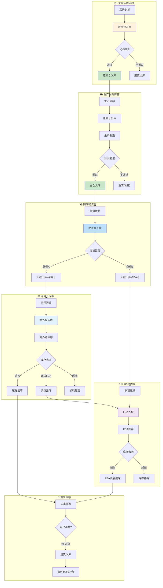

# 库存域完整梳理文档	

> **数据域**: 库存域 (inv)	
> **优先级**: P1（重要域）	
> **版本**: v2.2	
> **创建日期**: 2026-01-19	
> **更新日期**: 2026-01-20	
> **负责人**: 王苗苗	
> **分析部门**: 流通分析	

---

## 1. 域定义与业务全景	

### 1.1 域定义	

库存域覆盖**所有仓库类型**的库存全生命周期管理，包括入库、库存状态、库龄分析、出库、库存损耗等。核心职责是**记录货物在各仓库间的数量变动**。	

### 1.2 仓库分类	

```
仓库分类
├── 国内仓库（自有）
│   ├── 待检仓（采购物料暂存，待IQC检验）
│   ├── 原料仓（IQC通过的物料，供生产领用）
│   ├── 主仓（OQC通过的成品存放）
│   └── 物流仓（待发货成品，头程运输起点）
├── 海外仓库（自有，中转仓）
│   └── 只做中转，必须调拨到FBA仓
└── FBA仓库（亚马逊托管，销售终端）
    └── 亚马逊运营中心，直接发货给用户
```

### 1.3 业务范围	

```
库存域核心：货物在各类仓库中的存储状态与流动轨迹
├── 国内仓库存
│   ├── 采购收货（待检仓）
│   │   └── 采购到货 → 待检仓入库
│   ├── 原料管理（原料仓）
│   │   ├── IQC通过 → 原料仓入库
│   │   └── 生产领料 → 原料仓出库
│   ├── 成品管理（主仓）
│   │   ├── OQC通过 → 主仓入库
│   │   └── 物流转仓 → 主仓出库
│   └── 发货管理（物流仓）
│       ├── 转仓入库 → 物流仓入库
│       └── 头程出库 → 物流仓出库
├── 海外仓库存（自有，中转仓）
│   ├── 头程入库（从物流仓调拨）
│   ├── 库存盘点、库龄监控
│   └── 调拨出库（→FBA仓，必经路径）
└── FBA仓库存（亚马逊托管，销售终端）
    ├── FBA入仓（从物流仓/海外仓调拨）
    ├── FBA库存、FBA库龄
    ├── FBA代发货出库（→用户）
    └── 退货入库、库存移除
```

### 1.4 与其他域的边界澄清	

| 业务事件 | 库存域职责 | 其他域职责 |
|----------|-----------|-----------|
| 采购到货 | 记录待检仓入库 | 供采域负责采购订单管理 |
| IQC检验 | 记录待检仓→原料仓转移 | 品控域负责检验执行 |
| 生产领料 | 记录原料仓出库 | 生产域负责工单管理 |
| OQC检验 | 记录主仓入库 | 品控域负责检验执行 |
| 头程运输 | 记录物流仓出库+海外仓/FBA入库 | 履约域负责运输过程跟踪 |
| 仓间调拨 | 记录海外仓出库+FBA入库 | 履约域负责调拨运输跟踪 |
| 尾程配送 | 记录FBA出库 | 履约域负责配送跟踪 |
| 退货返仓 | 记录FBA入库 | 履约域负责退货物流处理 |

> **关键澄清**：库存域关注**库存数量变动**（入库/出库/盘点），其他域关注各自的业务过程（检验/生产/运输）。	

---

## 2. 业务流程图	



---

## 3. 业务过程定义	

### 3.1 业务流程→业务过程映射	

> **推导逻辑**：业务流程中的每个**可度量的关键事件节点**成为一个业务过程	

| 业务流程阶段 | 业务过程 | 英文名称 | 为什么是业务过程 |
|-------------|---------|----------|-----------------|
| 采购入库 | 待检入库 | pending_stock_in | 采购到货进入待检仓，是可度量事件 |
| IQC通过 | 原料入库 | material_stock_in | IQC通过后转入原料仓，是状态变更事件 |
| 生产领料 | 生产领料 | production_pick | 从原料仓领取物料，有明确数量和时间 |
| OQC通过 | 成品入库 | finished_stock_in | OQC通过后转入主仓，是关键质量节点 |
| 物流转仓 | 物流转仓 | logistics_transfer | 成品从主仓转至物流仓，是可度量事件 |
| 头程发货 | 头程出库 | first_mile_out | 物流仓发往海外仓/FBA，有头程单号 |
| 头程到货 | 头程入库 | first_mile_in | 海外仓/FBA接收入库，有签收记录 |
| 尾程发货 | 销售出库 | sales_stock_out | 海外仓/FBA发货给用户，有物流单号 |
| 退货入仓 | 退货入库 | return_stock_in | 用户退货入仓，有退货单号 |
| 库存监控 | 库存盘点 | stock_check | 周期性快照，记录某时点库存状态 |
| 库龄监控 | 库龄分析 | inventory_aging | 周期性快照，记录库龄分布 |
| 损耗处理 | 库存损耗 | stock_loss | 损耗是可度量事件，需记录原因和金额 |

### 3.2 业务过程详细定义	

<table>
    <thead>
        <tr>
            <th>序号</th>
            <th>业务过程</th>
            <th>英文名称</th>
            <th>描述</th>
            <th>事实表类型</th>
            <th>粒度声明</th>
            <th>主键组成</th>
        </tr>
    </thead>
    <tbody>
        <tr>
            <td>1</td>
            <td>待检入库</td>
            <td>pending_stock_in</td>
            <td>采购到货进入待检仓</td>
            <td>事务事实</td>
            <td>每一行代表一次采购入库单明细</td>
            <td>入库单号 + 行号</td>
        </tr>
        <tr>
            <td>2</td>
            <td>原料入库</td>
            <td>material_stock_in</td>
            <td>IQC通过后转入原料仓</td>
            <td>事务事实</td>
            <td>每一行代表一次IQC通过转仓明细</td>
            <td>转仓单号 + 行号</td>
        </tr>
        <tr>
            <td>3</td>
            <td>生产领料</td>
            <td>production_pick</td>
            <td>从原料仓领取物料用于生产</td>
            <td>事务事实</td>
            <td>每一行代表一次领料单明细</td>
            <td>领料单号 + 行号</td>
        </tr>
        <tr>
            <td>4</td>
            <td>成品入库</td>
            <td>finished_stock_in</td>
            <td>OQC通过后转入主仓</td>
            <td>事务事实</td>
            <td>每一行代表一次成品入库明细</td>
            <td>入库单号 + 行号</td>
        </tr>
        <tr>
            <td>5</td>
            <td>物流转仓</td>
            <td>logistics_transfer</td>
            <td>成品从主仓转至物流仓</td>
            <td>事务事实</td>
            <td>每一行代表一次转仓明细</td>
            <td>转仓单号 + 行号</td>
        </tr>
        <tr>
            <td>6</td>
            <td>头程出库</td>
            <td>first_mile_out</td>
            <td>物流仓发往海外仓/FBA仓</td>
            <td>事务事实</td>
            <td>每一行代表一次头程出库明细</td>
            <td>头程单号 + 行号</td>
        </tr>
        <tr>
            <td>7</td>
            <td>头程入库</td>
            <td>first_mile_in</td>
            <td>海外仓/FBA仓接收入库</td>
            <td>事务事实</td>
            <td>每一行代表一次头程入库明细</td>
            <td>头程单号 + 行号</td>
        </tr>
        <tr>
            <td>8</td>
            <td>销售出库</td>
            <td>sales_stock_out</td>
            <td>海外仓/FBA发货给用户</td>
            <td>事务事实</td>
            <td>每一行代表一次销售出库明细</td>
            <td>物流单号 + 行号</td>
        </tr>
        <tr>
            <td>9</td>
            <td>退货入库</td>
            <td>return_stock_in</td>
            <td>用户退货入仓</td>
            <td>事务事实</td>
            <td>每一行代表一次退货入库明细</td>
            <td>退货单号 + 行号</td>
        </tr>
        <tr>
            <td>10</td>
            <td>库存盘点</td>
            <td>stock_check</td>
            <td>定期盘点库存状态（所有仓库类型）</td>
            <td>周期快照</td>
            <td>每一行代表某仓库某商品某天的库存快照</td>
            <td>仓库ID + SKU + 日期</td>
        </tr>
        <tr>
            <td>11</td>
            <td>库龄分析</td>
            <td>inventory_aging</td>
            <td>分析库存周转和库龄分布</td>
            <td>周期快照</td>
            <td>每一行代表某仓库某商品某天的库龄分布</td>
            <td>仓库ID + SKU + 日期</td>
        </tr>
        <tr>
            <td>12</td>
            <td>库存损耗</td>
            <td>stock_loss</td>
            <td>记录库存损耗</td>
            <td>事务事实</td>
            <td>每一行代表一笔库存损耗记录</td>
            <td>损耗单号 + 行号</td>
        </tr>
    </tbody>
</table>

---

## 4. 维度设计	

### 4.1 维度推导逻辑	

> **推导原则**：维度来源于回答"谁/什么/何时/何地/为何"等分析问题	

| 分析问题 | 对应维度 | 维度类型 |
|----------|---------|----------|
| 什么时候入库/出库？ | 时间维度 | 公共维度 |
| 什么商品？ | 产品维度 | 公共维度 |
| 哪个仓库？ | 仓库维度 | 公共维度 |
| 什么类型的仓库？ | 仓库类型维度 | 专属维度 |
| 仓库什么功能？ | 仓库功能维度 | 专属维度 |
| 仓库位于哪个国家/地区？ | 仓库区域维度 | 专属维度 |
| 库存状态如何？ | 库存状态维度 | 专属维度 |
| 库龄多长？ | 库龄区间维度 | 专属维度 |
| 入库来源是什么？ | 入库类型维度 | 专属维度 |
| 出库去向是什么？ | 出库类型维度 | 专属维度 |
| 损耗原因是什么？ | 损耗原因维度 | 专属维度 |

### 4.2 维度清单	

#### 公共维度	

| 维度 | 英文名称 | 使用场景 |
|------|----------|----------|
| ✓ 时间维度 | dim_date | 所有业务过程 |
| ✓ 产品维度 | dim_product | 所有业务过程 |
| ✓ 变体维度 | dim_variant | 变体级库存管理 |
| ✓ 仓库维度 | dim_warehouse | 所有业务过程 |
| ✓ 供应商维度 | dim_supplier | 采购入库 |

#### 专属维度	

| 编号 | 维度名称 | 英文名称 | 主键 | 说明 |
|------|----------|----------|------|------|
| DIM-17 | 库龄区间维度 | dim_inventory_age | age_bucket_key | 0-30天、31-60天、61-90天、91-180天、181-270天、271+天 |
| DIM-18 | 库存状态维度 | dim_inventory_status | inv_status_key | 可售、不可售、待检、预留、在途、锁定 |
| DIM-19 | 仓库类型维度 | dim_warehouse_type | warehouse_type_key | 待检仓、原料仓、主仓、物流仓、海外仓、FBA仓 |
| DIM-20 | 仓库功能维度 | dim_warehouse_func | func_key | 存储、检验、发货 |
| DIM-21 | 仓库区域维度 | dim_warehouse_region | region_key | 中国、美国、欧洲、日本等 |
| DIM-22 | 入库类型维度 | dim_inbound_type | inbound_type_key | 采购入库(待检)、IQC通过入库、生产入库、头程入库、退货入库 |
| DIM-23 | 出库类型维度 | dim_outbound_type | outbound_type_key | 生产领料、物流转仓、头程出库、销售出库、损耗出库、退货出库(IQC不通过) |
| DIM-24 | 损耗原因维度 | dim_loss_reason | loss_reason_key | 库龄超期、破损、丢失、盘亏、质量不合格 |

---

## 5. 事实表设计	

### 5.1 事实表清单	

| 编号 | 事实表名称 | 英文表名 | 类型 | 更新频率 | 说明 |
|------|-----------|----------|------|----------|------|
| FCT-10 | 入库事实表 | fct_inv_stock_in | 事务事实 | 日 | 记录每笔入库事件（含待检入库、原料入库、成品入库、头程入库、退货入库） |
| FCT-11 | 出库事实表 | fct_inv_stock_out | 事务事实 | 日 | 记录每笔出库事件（含领料、转仓、头程出库、销售出库、损耗出库） |
| FCT-12 | 库存日快照表 | fct_inv_stock_daily | 周期快照 | 日 | 每日库存余额快照（分仓库类型） |
| FCT-13 | 库龄日快照表 | fct_inv_aging_daily | 周期快照 | 日 | 每日库龄分布快照（分仓库类型） |
| FCT-14 | 损耗事实表 | fct_inv_stock_loss | 事务事实 | 日 | 记录每笔损耗事件 |
| FCT-15 | 仓间调拨事实表 | fct_inv_transfer | 事务事实 | 日 | 记录仓库间调拨（含仓内转仓、头程调拨） |

### 5.2 度量指标	

| 指标名称 | 指标说明 | 聚合方式 | 来源事实表 |
|----------|----------|----------|-----------|
| 入库数量 | 入库商品总数 | SUM | fct_inv_stock_in |
| 入库金额 | 入库商品总金额 | SUM | fct_inv_stock_in |
| 待检入库数 | 采购到货进入待检仓数量 | SUM | fct_inv_stock_in |
| 原料入库数 | IQC通过转入原料仓数量 | SUM | fct_inv_stock_in |
| 成品入库数 | OQC通过转入主仓数量 | SUM | fct_inv_stock_in |
| 出库数量 | 出库商品总数 | SUM | fct_inv_stock_out |
| 出库金额 | 出库商品总金额 | SUM | fct_inv_stock_out |
| 领料数量 | 生产领料数量 | SUM | fct_inv_stock_out |
| 头程出库数 | 物流仓头程发货数量 | SUM | fct_inv_stock_out |
| 库存数量 | 期末库存数量（半可加） | SUM | fct_inv_stock_daily |
| 库存金额 | 期末库存金额（半可加） | SUM | fct_inv_stock_daily |
| 待检仓库存 | 待检仓库存数量 | SUM | fct_inv_stock_daily |
| 原料仓库存 | 原料仓库存数量 | SUM | fct_inv_stock_daily |
| 主仓库存 | 主仓库存数量 | SUM | fct_inv_stock_daily |
| 物流仓库存 | 物流仓库存数量 | SUM | fct_inv_stock_daily |
| 海外仓库存 | 海外仓库存数量 | SUM | fct_inv_stock_daily |
| FBA库存 | FBA仓库存数量 | SUM | fct_inv_stock_daily |
| 库龄天数 | 平均库龄天数 | AVG | fct_inv_aging_daily |
| 滞销率 | 滞销商品占比 | AVG | fct_inv_aging_daily |
| 损耗数量 | 损耗商品总数 | SUM | fct_inv_stock_loss |
| 损耗金额 | 损耗商品总金额 | SUM | fct_inv_stock_loss |
| 调拨数量 | 调拨商品总数 | SUM | fct_inv_transfer |

---

## 6. 总线矩阵	

### 6.1 库存域总线矩阵	

| 业务过程 | 时间 | 产品 | 仓库 | 仓库类型 | 仓库功能 | 仓库区域 | 库存状态 | 库龄区间 | 入库类型 | 出库类型 | 损耗原因 | 供应商 |
|----------|------|------|------|----------|----------|----------|----------|----------|----------|----------|----------|--------|
| 待检入库 | ✓ | ✓ | ✓ | ✓ | | ✓ | | | ✓ | | | ✓ |
| 原料入库 | ✓ | ✓ | ✓ | ✓ | | ✓ | | | ✓ | | | |
| 生产领料 | ✓ | ✓ | ✓ | ✓ | | ✓ | | | | ✓ | | |
| 成品入库 | ✓ | ✓ | ✓ | ✓ | | ✓ | | | ✓ | | | |
| 物流转仓 | ✓ | ✓ | ✓ | ✓ | ✓ | ✓ | | | | ✓ | | |
| 头程出库 | ✓ | ✓ | ✓ | ✓ | ✓ | ✓ | | | | ✓ | | |
| 头程入库 | ✓ | ✓ | ✓ | ✓ | ✓ | ✓ | | | ✓ | | | |
| 销售出库 | ✓ | ✓ | ✓ | ✓ | ✓ | ✓ | | | | ✓ | | |
| 退货入库 | ✓ | ✓ | ✓ | ✓ | | ✓ | | | ✓ | | | |
| 库存盘点 | ✓ | ✓ | ✓ | ✓ | ✓ | ✓ | ✓ | | | | | |
| 库龄分析 | ✓ | ✓ | ✓ | ✓ | ✓ | ✓ | | ✓ | | | | |
| 库存损耗 | ✓ | ✓ | ✓ | ✓ | | ✓ | | | | | ✓ | |

### 6.2 总线矩阵解读	

- **仓库类型维度**：核心分析维度，区分待检仓、原料仓、主仓、物流仓、海外仓、FBA仓	
- **仓库功能维度**：区分存储、检验、发货功能，用于分析仓库使用效率	
- **仓库区域维度**：区分不同国家/地区的仓库，支持区域库存分析	
- **入库类型维度**：区分采购入库(待检)、IQC通过入库、生产入库、头程入库、退货入库	
- **出库类型维度**：区分生产领料、物流转仓、头程出库、销售出库、损耗出库	

---

## 7. 跨域关联说明	

### 7.1 与供采域的关联	

| 库存域事件 | 关联供采域事件 | 关联方式 |
|-----------|---------------|----------|
| 待检入库 | 采购收货 | 采购订单号关联 |
| IQC不通过退货 | 供应商退货 | 采购订单号关联 |

### 7.2 与品控域的关联	

| 库存域事件 | 关联品控域事件 | 关联方式 |
|-----------|---------------|----------|
| 待检仓→原料仓 | IQC检验通过 | 检验单号关联 |
| 生产→主仓 | OQC检验通过 | 检验单号关联 |

### 7.3 与生产域的关联	

| 库存域事件 | 关联生产域事件 | 关联方式 |
|-----------|---------------|----------|
| 生产领料（原料仓出库） | 工单领料 | 工单号关联 |
| 成品入库（主仓） | 工单完工 | 工单号关联 |

### 7.4 与履约域的关联	

| 库存域事件 | 关联履约域事件 | 关联方式 |
|-----------|---------------|----------|
| 头程出库（物流仓） | 头程运输发货 | 头程单号关联 |
| 头程入库（海外仓/FBA仓） | 头程运输签收 | 头程单号/ShipmentID关联 |
| 销售出库 | 尾程发货 | 物流单号关联 |
| 退货入库 | 处理退货完成 | 退货单号关联 |

### 7.5 与交易域的关联	

| 库存域事件 | 关联交易域事件 | 关联方式 |
|-----------|---------------|----------|
| 销售出库 | 订单发货 | 订单号关联 |
| 库存预留 | 订单创建 | 订单号+SKU关联 |

---

## 更新记录	

| 版本 | 日期 | 更新内容 |
|------|------|----------|
| v2.0 | 2026-01-19 | 初始版本 |
| v2.1 | 2026-01-20 | 修正仓库分类：自有仓细分为国内仓和海外仓，新增仓库区域维度、出库类型维度，更新业务流程图 |
| v2.2 | 2026-01-20 | 重大更新：根据完整供应链流程修正仓库分类（待检仓、原料仓、主仓、物流仓），新增业务过程（待检入库、原料入库、生产领料、成品入库、物流转仓等），更新维度和总线矩阵 |
| v2.3 | 2026-01-20 | 修正海外仓定位：海外仓只做中转仓，必须调拨到FBA仓后由FBA发货给用户，FBA仓为唯一销售终端 |
