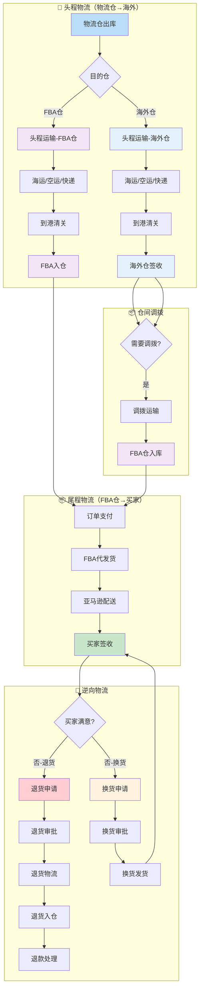

# 履约域完整梳理文档	

> **数据域**: 履约域 (fl)	
> **优先级**: P1（重要域）	
> **版本**: v2.2	
> **创建日期**: 2026-01-19	
> **更新日期**: 2026-01-20	
> **负责人**: 王苗苗	
> **分析部门**: 流通分析	

---

## 1. 域定义与业务全景	

### 1.1 域定义	

履约域覆盖订单从发货到签收的**物流运输全过程**，包括正向物流（头程运输+尾程配送）和逆向物流（退换货处理）。其核心职责是**物流过程跟踪**，而非库存状态管理。	

### 1.2 物流网络结构	

```
物流网络
├── 头程运输（物流仓→海外）
│   ├── 物流仓 → 海外仓（自有，中转仓）
│   └── 物流仓 → FBA仓（亚马逊托管）
├── 仓间调拨（必经路径）
│   └── 海外仓 → FBA仓（海外仓只做中转，必须调拨到FBA）
├── 尾程配送（FBA仓→买家）
│   └── FBA代发货 → 买家（亚马逊配送）
└── 逆向物流（买家→FBA仓）
    ├── 退货：买家 → FBA仓 → 退货处理
    └── 换货：FBA仓换发新商品
```

### 1.3 业务范围	

```
履约域核心：货物从物流仓到买家的运输过程
├── 头程物流（物流仓到海外仓库）
│   ├── 海运头程：物流仓 → 海外仓/FBA仓
│   ├── 空运头程：物流仓 → 海外仓/FBA仓
│   └── 快递头程：物流仓 → 海外仓/FBA仓
├── 仓间调拨（海外仓到FBA仓，必经路径）
│   └── 调拨运输：海外仓 → FBA仓（海外仓只做中转）
├── 尾程物流（FBA仓到买家）
│   └── FBA代发货：FBA仓 → 买家（亚马逊配送）
└── 逆向物流（买家到FBA仓）
    ├── 退货申请：买家发起退货
    ├── 退货物流：买家退回商品 → FBA仓
    ├── 退货处理：退货入仓、退款处理
    ├── 换货申请：买家发起换货
    └── 换货发货：FBA仓换发新商品
```

### 1.4 与库存域的边界澄清	

| 业务事件 | 履约域职责 | 库存域职责 |
|----------|-----------|-----------|
| 头程运输（物流仓→海外仓） | 跟踪运输状态（在途、到港、清关、签收） | 记录出库（物流仓）→入库（海外仓） |
| 头程运输（物流仓→FBA仓） | 跟踪运输状态（在途、到港、清关、接收） | 记录出库（物流仓）→入库（FBA仓） |
| 仓间调拨（海外仓→FBA仓） | 跟踪调拨运输状态（必经路径） | 记录出库（海外仓）→入库（FBA仓） |
| 尾程配送（FBA仓→买家） | 跟踪配送状态（亚马逊物流） | 记录销售出库（FBA仓） |
| 退货处理 | 跟踪退货物流、处理退款 | 记录入库（FBA仓） |

> **关键澄清**：履约域关注**运输过程**（时间、状态、物流商），库存域关注**库存变化**（数量、金额）。	

---

## 2. 业务流程图	



---

## 3. 业务过程定义	

### 3.1 业务流程→业务过程映射	

> **推导逻辑**：业务流程中的每个**可度量的关键物流事件节点**成为一个业务过程	

| 业务流程阶段 | 业务过程 | 英文名称 | 为什么是业务过程 |
|-------------|---------|----------|-----------------|
| 头程物流 | 头程运输 | first_mile | 头程是可跟踪的运输阶段，有明确的里程碑 |
| 仓间调拨 | 仓间调拨 | warehouse_transfer | 调拨是可度量事件，有调拨单号和运输记录 |
| 尾程物流-发货 | 发货配送 | ship_order | 发货是可度量事件，记录物流单号、发货时间 |
| 尾程物流-签收 | 物流履约 | delivery | 累积快照，跟踪从发货到签收的全过程 |
| 逆向物流-退货申请 | 退货申请 | request_return | 退货申请是可度量事件，有申请时间和原因 |
| 逆向物流-退货物流 | 退货物流 | return_shipping | 退货物流跟踪，有物流单号和状态 |
| 逆向物流-退货处理 | 退货处理 | process_return | 退货处理是可度量事件，有处理结果和退款 |
| 逆向物流-换货申请 | 换货申请 | request_exchange | 换货申请是可度量事件，有申请时间和原因 |
| 逆向物流-换货发货 | 换货发货 | exchange_shipping | 换货发货是可度量事件，有新发货单 |

### 3.2 业务过程详细定义	

<table>
    <thead>
        <tr>
            <th>序号</th>
            <th>业务过程</th>
            <th>英文名称</th>
            <th>描述</th>
            <th>事实表类型</th>
            <th>粒度声明</th>
            <th>主键组成</th>
        </tr>
    </thead>
    <tbody>
        <tr>
            <td>1</td>
            <td>头程运输</td>
            <td>first_mile</td>
            <td>头程运输（物流仓→海外仓/FBA仓）</td>
            <td>累积快照</td>
            <td>每一行代表一个头程运输任务</td>
            <td>头程单号/ShipmentID</td>
        </tr>
        <tr>
            <td>2</td>
            <td>仓间调拨</td>
            <td>warehouse_transfer</td>
            <td>海外仓→FBA仓的调拨运输</td>
            <td>事务事实</td>
            <td>每一行代表一个调拨任务</td>
            <td>调拨单号</td>
        </tr>
        <tr>
            <td>3</td>
            <td>发货配送</td>
            <td>ship_order</td>
            <td>订单发货（FBA代发货）</td>
            <td>事务事实</td>
            <td>每一行代表一个包裹的发货记录</td>
            <td>物流单号</td>
        </tr>
        <tr>
            <td>4</td>
            <td>物流履约</td>
            <td>delivery</td>
            <td>全程物流跟踪（发货→签收）</td>
            <td>累积快照</td>
            <td>每一行代表一个订单的履约全过程</td>
            <td>订单号</td>
        </tr>
        <tr>
            <td>5</td>
            <td>退货申请</td>
            <td>request_return</td>
            <td>用户发起退货申请</td>
            <td>事务事实</td>
            <td>每一行代表一笔退货申请</td>
            <td>退货申请单号</td>
        </tr>
        <tr>
            <td>6</td>
            <td>退货物流</td>
            <td>return_shipping</td>
            <td>退货商品运输跟踪</td>
            <td>累积快照</td>
            <td>每一行代表一笔退货物流跟踪</td>
            <td>退货物流单号</td>
        </tr>
        <tr>
            <td>7</td>
            <td>退货处理</td>
            <td>process_return</td>
            <td>退货入仓处理和退款</td>
            <td>事务事实</td>
            <td>每一行代表一笔退货处理记录</td>
            <td>退货单号</td>
        </tr>
        <tr>
            <td>8</td>
            <td>换货申请</td>
            <td>request_exchange</td>
            <td>用户发起换货申请</td>
            <td>事务事实</td>
            <td>每一行代表一笔换货申请</td>
            <td>换货申请单号</td>
        </tr>
        <tr>
            <td>9</td>
            <td>换货发货</td>
            <td>exchange_shipping</td>
            <td>换货商品重新发货</td>
            <td>事务事实</td>
            <td>每一行代表一笔换货发货记录</td>
            <td>换货物流单号</td>
        </tr>
    </tbody>
</table>

### 3.3 头程运输累积快照说明	

**头程运输里程碑**：	
```
出库 → 揽收 → 运输 → 到港 → 清关 → 签收
  │       │       │       │       │       │
  ↓       ↓       ↓       ↓       ↓       ↓
```
出库时间 揽收时间 在途时间 到港时间 清关时间 签收时间
```

### 3.4 尾程配送累积快照说明	

**尾程配送里程碑**：	

| 发货类型 | 里程碑节点 |
|---------|-----------|
| FBA代发货 | 发货 → 亚马逊配送 → 签收 |

### 3.5 退货物流累积快照说明	

**退货物流里程碑**：	
```
退货申请 → 审批 → 寄出 → 运输 → 入仓 → 退款
    │        │       │       │       │       │
    ↓        ↓       ↓       ↓       ↓       ↓
申请时间 审批时间 寄出时间 运输时间 入仓时间 退款时间
```

---

## 4. 维度设计	

### 4.1 维度推导逻辑	

| 分析问题 | 对应维度 | 维度类型 |
|----------|---------|----------|
| 什么时候发货/签收？ | 时间维度 | 公共维度 |
| 什么商品？ | 产品维度 | 公共维度 |
| 从哪个仓库发货？ | 仓库维度 | 公共维度 |
| 什么发货类型？ | 发货类型维度 | 专属维度 |
| 用什么物流渠道？ | 物流渠道维度 | 专属维度 |
| 当前物流状态？ | 物流状态维度 | 专属维度 |
| 使用哪家物流商？ | 物流商维度 | 专属维度 |
| 发往哪个国家？ | 目的国维度 | 专属维度 |
| 为什么退货？ | 退货原因维度 | 专属维度 |
| 退货当前状态？ | 退货状态维度 | 专属维度 |
| 为什么换货？ | 换货原因维度 | 专属维度 |

### 4.2 维度清单	

#### 公共维度	

| 维度 | 英文名称 | 使用场景 |
|------|----------|----------|
| ✓ 时间维度 | dim_date | 所有业务过程 |
| ✓ 产品维度 | dim_product | 发货、退换货 |
| ✓ 仓库维度 | dim_warehouse | 发货、头程运输 |

#### 专属维度	

| 编号 | 维度名称 | 英文名称 | 主键 | 说明 |
|------|----------|----------|------|------|
| DIM-24 | 发货类型维度 | dim_ship_type | ship_type_key | FBA代发货 |
| DIM-25 | 物流渠道维度 | dim_logistics_channel | channel_key | 头程（海运/空运/快递）、尾程（本地快递/亚马逊物流） |
| DIM-26 | 物流状态维度 | dim_shipment_status | status_key | 已发货、运输中、已到港、清关中、派送中、已签收 |
| DIM-27 | 物流商维度 | dim_carrier | carrier_key | DHL、UPS、FedEx、亚马逊物流、本地快递公司 |
| DIM-28 | 目的国维度 | dim_destination_country | country_key | 美国、英国、德国、日本等 |
| DIM-29 | 退货原因维度 | dim_return_reason | reason_key | 质量问题、尺寸不符、不想要了、描述不符、收到损坏 |
| DIM-30 | 退货状态维度 | dim_return_status | status_key | 申请中、已批准、运输中、已签收、已处理、已退款 |
| DIM-31 | 换货原因维度 | dim_exchange_reason | reason_key | 尺寸换货、颜色换货、商品损坏、发错商品 |

---

## 5. 事实表设计	

### 5.1 事实表清单	

| 编号 | 事实表名称 | 英文表名 | 类型 | 更新频率 | 说明 |
|------|-----------|----------|------|----------|------|
| FCT-16 | 头程运输事实表 | fct_fl_first_mile | 累积快照 | 日 | 跟踪头程运输里程碑（物流仓→海外仓/FBA仓） |
| FCT-17 | 仓间调拨事实表 | fct_fl_transfer | 事务事实 | 日 | 记录海外仓→FBA仓调拨 |
| FCT-18 | 发货事实表 | fct_fl_shipment | 事务事实 | 日 | 记录每笔发货事件（FBA发货） |
| FCT-19 | 物流履约事实表 | fct_fl_delivery | 累积快照 | 日 | 跟踪订单从发货到签收全流程 |
| FCT-20 | 退货申请事实表 | fct_fl_return_request | 事务事实 | 日 | 记录退货申请事件 |
| FCT-21 | 退货物流事实表 | fct_fl_return_shipping | 累积快照 | 日 | 跟踪退货物流里程碑 |
| FCT-22 | 退货处理事实表 | fct_fl_return_process | 事务事实 | 日 | 记录退货处理和退款 |
| FCT-23 | 换货申请事实表 | fct_fl_exchange_request | 事务事实 | 日 | 记录换货申请事件 |
| FCT-24 | 换货发货事实表 | fct_fl_exchange_shipping | 事务事实 | 日 | 记录换货发货事件 |

### 5.2 度量指标	

| 指标名称 | 指标说明 | 聚合方式 | 来源事实表 |
|----------|----------|----------|-----------|
| 头程单数 | 头程运输任务数 | SUM | fct_fl_first_mile |
| 头程时效 | 头程运输平均天数 | AVG | fct_fl_first_mile |
| 头程运费 | 头程物流费用 | SUM | fct_fl_first_mile |
| 调拨单数 | 仓间调拨任务数 | SUM | fct_fl_transfer |
| 发货数量 | 发货包裹总数 | SUM | fct_fl_shipment |
| FBA发货数 | FBA代发货包裹数 | SUM | fct_fl_shipment |
| 运费 | 物流费用总额 | SUM | fct_fl_shipment |
| 履约时效 | 从发货到签收的平均天数 | AVG | fct_fl_delivery |
| 妥投率 | 成功签收的订单占比 | AVG | fct_fl_delivery |
| 退货申请数 | 退货申请总数 | SUM | fct_fl_return_request |
| 退货率 | 退货订单占比 | AVG | fct_fl_return_request |
| 退货处理时效 | 退货处理平均天数 | AVG | fct_fl_return_process |
| 退款金额 | 退款总金额 | SUM | fct_fl_return_process |
| 换货申请数 | 换货申请总数 | SUM | fct_fl_exchange_request |
| 换货数量 | 换货商品总数 | SUM | fct_fl_exchange_shipping |

---

## 6. 总线矩阵	

### 6.1 履约域总线矩阵	

| 业务过程 | 时间 | 产品 | 仓库 | 发货类型 | 物流渠道 | 物流状态 | 物流商 | 目的国 | 退货原因 | 退货状态 | 换货原因 |
|----------|------|------|------|----------|----------|----------|--------|--------|----------|----------|----------|
| 头程运输 | ✓ | ✓ | ✓ | | ✓ | ✓ | ✓ | ✓ | | | |
| 仓间调拨 | ✓ | ✓ | ✓ | | ✓ | ✓ | ✓ | ✓ | | | |
| 发货配送 | ✓ | ✓ | ✓ | ✓ | ✓ | ✓ | ✓ | ✓ | | | |
| 物流履约 | ✓ | | ✓ | ✓ | ✓ | ✓ | ✓ | ✓ | | | |
| 退货申请 | ✓ | ✓ | | | | | | ✓ | ✓ | ✓ | |
| 退货物流 | ✓ | ✓ | ✓ | | | ✓ | ✓ | ✓ | ✓ | ✓ | |
| 退货处理 | ✓ | ✓ | ✓ | | | | | ✓ | ✓ | ✓ | |
| 换货申请 | ✓ | ✓ | | | | | | ✓ | | | ✓ |
| 换货发货 | ✓ | ✓ | ✓ | ✓ | ✓ | ✓ | ✓ | ✓ | | | ✓ |

### 6.2 总线矩阵解读	

- **发货类型维度**：核心分析维度，目前只有FBA代发货	
- **物流渠道维度**：区分头程（海运/空运/快递）和尾程（亚马逊物流）	
- **目的国维度**：区分不同国家/市场的物流表现	
- **物流商维度**：分析不同物流商的时效和成本	
- **退货原因/状态维度**：逆向物流核心维度，支持退货分析	
- **换货原因维度**：支持换货原因分析和产品改进	

---

## 7. 跨域关联说明	

### 7.1 与库存域的关联	

| 履约域事件 | 关联库存域事件 | 关联方式 |
|-----------|---------------|----------|
| 头程发货 | 物流仓头程出库 | 头程单号关联 |
| 头程签收（海外仓） | 海外仓头程入库 | 头程单号关联 |
| 头程签收（FBA仓） | FBA头程入库 | ShipmentID关联 |
| 仓间调拨发货 | 海外仓调拨出库 | 调拨单号关联 |
| 仓间调拨签收 | FBA调拨入库 | 调拨单号关联 |
| 尾程发货（FBA） | FBA销售出库 | 订单号关联 |
| 退货入仓 | FBA退货入库 | 退货单号关联 |

### 7.2 与交易域的关联	

| 履约域事件 | 关联交易域事件 | 关联方式 |
|-----------|---------------|----------|
| 物流履约签收 | 订单完成 | 订单号关联 |
| 退货处理 | 订单退款 | 订单号关联 |
| 换货发货 | 新订单创建（如有） | 原订单号关联 |

---

## 8. 仓库定位说明	

| 仓库类型 | 定位 | 说明 |
|----------|------|------|
| 物流仓 | 头程起点 | 国内仓库，成品发往海外的起点 |
| 海外仓 | 中转仓 | 自有海外仓，只做中转，必须调拨到FBA仓 |
| FBA仓 | 销售终端 | 亚马逊托管仓库，直接发货给用户 |

---

## 更新记录	

| 版本 | 日期 | 更新内容 |
|------|------|----------|
| v2.0 | 2026-01-19 | 初始版本 |
| v2.1 | 2026-01-20 | 修正物流网络结构：区分国内仓、海外仓(自有)、FBA仓(托管)三类仓库的物流流程，新增发货类型维度、目的国维度 |
| v2.2 | 2026-01-20 | 重大更新：明确物流仓为头程起点，完善逆向物流流程（退货申请、退货物流、退货处理、换货申请、换货发货），新增退货状态维度，更新事实表和总线矩阵 |
| v2.3 | 2026-01-20 | 修正海外仓定位：海外仓只做中转仓，必须调拨到FBA仓后由FBA发货给用户，移除海外仓直接发货路径 |
