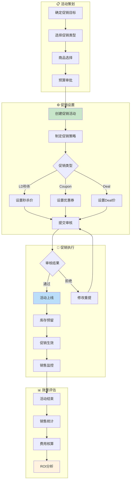

# 促销域完整梳理文档	

> **数据域**: 促销域 (prm)	
> **优先级**: P1（重要域）	
> **版本**: v2.0	
> **创建日期**: 2026-01-20	
> **负责人**: 徐恬	
> **分析部门**: 增长分析	

---

## 1. 域定义与业务全景	

### 1.1 域定义	

促销域覆盖亚马逊平台**各类促销活动的全流程数据**，包括活动创建、策略制定、销售表现和费用核算，是驱动销售增长的关键杠杆。	

### 1.2 业务范围	

```
促销域核心：促销活动的全生命周期管理
├── 活动策划
│   ├── 活动审批
│   ├── 活动预算
│   └── 商品选择
├── 促销类型
│   ├── Lightning Deal (LD秒杀)
│   ├── 7-Day Deal (7天促销)
│   ├── Best Deal (最优惠)
│   ├── Coupon (优惠券)
│   ├── Prime会员专享
│   └── 买赠活动
├── 促销执行
│   ├── 价格设置
│   ├── 库存预留
│   └── 活动上线
└── 效果评估
    ├── 销售表现
    ├── 费用核算
    └── ROI分析
```

### 1.3 与相关域的边界澄清	

| 业务场景 | 促销域职责 | 其他域职责 |
|----------|-----------|-----------|
| 促销订单 | 记录促销活动及优惠信息 | 交易域负责订单本身 |
| 促销流量 | 记录促销带来的流量增量 | 运营域负责总流量 |
| 促销库存 | 记录促销库存预留需求 | 库存域负责实际库存 |
| 促销结算 | 记录促销费用支出 | 财务域负责成本核算 |

> **关键澄清**：促销域关注**活动本身的运营和效果**，订单、库存、财务的具体处理由专属域负责。	

---

## 2. 业务流程图	



---

## 3. 业务过程定义	

### 3.1 业务流程→业务过程映射	

> **推导逻辑**：业务流程中的每个**可度量的关键事件节点**成为一个业务过程	

| 业务流程阶段 | 业务过程 | 英文名称 | 为什么是业务过程 |
|-------------|---------|----------|------------------|
| 活动策划 | 创建促销活动 | create_promotion | 活动创建是一个可度量事件，有唯一促销ID |
| 促销设置 | 制定促销策略 | set_promo_strategy | 每个商品的促销规则是可独立度量的 |
| 促销执行 | 记录促销销售 | track_promo_sales | 促销期间的销售是持续度量的 |
| 效果评估 | 核算促销费用 | calc_promo_cost | 费用是可度量的财务数据 |

### 3.2 业务过程详细定义	

<table>
    <thead>
        <tr>
            <th>序号</th>
            <th>业务过程</th>
            <th>英文名称</th>
            <th>描述</th>
            <th>事实表类型</th>
            <th>粒度声明</th>
            <th>主键组成</th>
        </tr>
    </thead>
    <tbody>
        <tr>
            <td>1</td>
            <td>创建促销活动</td>
            <td>create_promotion</td>
            <td>创建促销活动</td>
            <td>事务事实</td>
            <td>每一行代表一个促销活动的创建事件</td>
            <td>促销活动ID</td>
        </tr>
        <tr>
            <td>2</td>
            <td>制定促销策略</td>
            <td>set_promo_strategy</td>
            <td>制定促销价格和规则</td>
            <td>事务事实</td>
            <td>每一行代表一个促销活动中一个商品的价格规则</td>
            <td>促销活动ID + ASIN</td>
        </tr>
        <tr>
            <td>3</td>
            <td>记录促销销售</td>
            <td>track_promo_sales</td>
            <td>记录促销期间销售表现</td>
            <td>周期快照</td>
            <td>每一行代表某促销活动某天某商品的销售表现</td>
            <td>促销活动ID + ASIN + 日期</td>
        </tr>
        <tr>
            <td>4</td>
            <td>核算促销费用</td>
            <td>calc_promo_cost</td>
            <td>核算促销活动费用</td>
            <td>事务事实</td>
            <td>每一行代表某促销活动的费用记录</td>
            <td>促销活动ID + 费用类型</td>
        </tr>
    </tbody>
</table>

---

## 4. 维度设计	

### 4.1 维度推导逻辑	

> **推导原则**：维度来源于回答"谁/什么/何时/何地/为何"等分析问题	

| 分析问题 | 对应维度 | 维度类型 |
|----------|---------|----------|
| 什么时候促销？ | 时间维度 | 公共维度 |
| 什么产品促销？ | 产品维度 | 公共维度 |
| 哪个店铺促销？ | 店铺维度 | 公共维度 |
| 哪个站点促销？ | 站点维度 | 公共维度 |
| 什么类型促销？ | 促销类型维度 | 专属维度 |
| 促销状态如何？ | 促销状态维度 | 专属维度 |
| 什么费用？ | 费用类型维度 | 专属维度 |

### 4.2 维度清单	

#### 公共维度	

| 维度 | 英文名称 | 使用场景 |
|------|----------|----------|
| ✓ 时间维度 | dim_date | 所有业务过程 |
| ✓ 产品维度 | dim_product | 促销策略、促销销售 |
| ✓ 变体维度 | dim_variant | 促销商品明细 |
| ✓ 店铺维度 | dim_store | 促销活动 |
| ✓ 站点维度 | dim_marketplace | 促销活动 |
| ✓ 类目维度 | dim_category | 促销商品分类 |

#### 专属维度	

| 编号 | 维度名称 | 英文名称 | 主键 | 说明 |
|------|----------|----------|------|------|
| DIM-11 | 促销类型维度 | dim_promotion_type | promo_type_key | LD秒杀、7DD、Best Deal、Coupon、Prime Exclusive、买赠 |
| DIM-12 | 促销状态维度 | dim_promotion_status | promo_status_key | 待审核、已通过、进行中、已结束、已取消 |
| DIM-13 | 费用类型维度 | dim_promo_fee_type | promo_fee_type_key | 参与费、曝光费、折扣成本、优惠券成本 |
| DIM-14 | 折扣区间维度 | dim_discount_range | discount_range_key | 10%以下、10-20%、20-30%、30-50%、50%以上 |

---

## 5. 事实表设计	

### 5.1 事实表清单	

| 编号 | 事实表名称 | 英文表名 | 类型 | 更新频率 | 说明 |
|------|-----------|----------|------|----------|------|
| FCT-15 | 促销活动事实表 | fct_prm_promotion | 事务事实 | 日 | 记录促销活动创建及状态变更 |
| FCT-16 | 促销策略事实表 | fct_prm_strategy | 事务事实 | 日 | 记录促销商品定价规则 |
| FCT-17 | 促销销售日快照 | fct_prm_sales_daily | 周期快照 | 日 | 每日促销商品销售表现 |
| FCT-18 | 促销费用事实表 | fct_prm_cost | 事务事实 | 日 | 记录促销费用支出 |

### 5.2 度量指标	

| 指标名称 | 指标说明 | 聚合方式 | 来源事实表 |
|----------|----------|----------|-----------|
| 活动数 | 促销活动总数 | SUM | fct_prm_promotion |
| 参与商品数 | 促销商品总数 | SUM | fct_prm_strategy |
| 原价金额 | 促销前原价总额 | SUM | fct_prm_strategy |
| 促销价金额 | 促销价总额 | SUM | fct_prm_strategy |
| 折扣力度 | 平均折扣比例 | AVG | fct_prm_strategy |
| 促销销量 | 促销期间销售数量 | SUM | fct_prm_sales_daily |
| 促销销售额 | 促销期间销售金额 | SUM | fct_prm_sales_daily |
| 促销费用 | 促销活动费用总额 | SUM | fct_prm_cost |
| 促销ROI | 促销收益/促销投入 | CALC | 计算指标 |
| 促销提升率 | 促销期间销量/非促销期销量 - 1 | CALC | 计算指标 |

---

## 6. 总线矩阵	

### 6.1 总线矩阵推导逻辑	

> **推导过程**：对每个业务过程，判断哪些维度可以用于分析	

```
业务过程 + 维度 = 分析视角
例如：促销活动 + 促销类型 = 按类型分析活动数量
      促销销售 + 产品 = 按产品分析促销效果
      促销费用 + 费用类型 = 按费用类型分析支出结构
```

### 6.2 促销域总线矩阵	

| 业务过程 | 时间 | 产品 | 变体 | 店铺 | 站点 | 类目 | 促销类型 | 促销状态 | 费用类型 | 折扣区间 |
|----------|------|------|------|------|------|------|----------|----------|----------|----------|
| 创建促销活动 | ✓ | | | ✓ | ✓ | | ✓ | ✓ | | |
| 制定促销策略 | ✓ | ✓ | ✓ | ✓ | ✓ | ✓ | ✓ | | | ✓ |
| 记录促销销售 | ✓ | ✓ | ✓ | ✓ | ✓ | ✓ | ✓ | | | ✓ |
| 核算促销费用 | ✓ | | | ✓ | | | ✓ | | ✓ | |

### 6.3 总线矩阵解读	

- **时间维度**：所有业务过程都需要按时间分析（日/周/月/活动周期）	
- **促销类型维度**：核心分析维度，区分LD/Deal/Coupon等不同类型的效果	
- **产品维度**：用于策略和销售，分析不同产品的促销表现	
- **折扣区间维度**：分析不同折扣力度对销量的影响	
- **费用类型维度**：仅用于费用核算，分析成本结构	

---

## 7. 跨域关联说明	

### 7.1 与交易域的关联	

| 促销域事件 | 关联交易域事件 | 关联方式 |
|-----------|---------------|----------|
| 促销活动 | 订单促销信息 | 促销活动ID关联 |
| 促销策略 | 订单明细优惠 | ASIN + 促销价关联 |
| 促销销售 | 订单统计 | 促销期间订单过滤 |

### 7.2 与运营域的关联	

| 促销域事件 | 关联运营域事件 | 关联方式 |
|-----------|---------------|----------|
| 促销活动 | 流量变化 | ASIN + 时间关联 |
| 促销流量 | 会话数变化 | 活动期间对比 |

### 7.3 与库存域的关联	

| 促销域事件 | 关联库存域事件 | 关联方式 |
|-----------|---------------|----------|
| 促销策略 | 库存预留 | ASIN + 预留数量 |
| 促销结束 | 库存释放 | 未售出库存返还 |

### 7.4 与财务域的关联	

| 促销域事件 | 关联财务域事件 | 关联方式 |
|-----------|---------------|----------|
| 促销费用 | 营销费用 | 费用入账 |
| 促销折扣 | 收入减少 | 折扣成本核算 |

---

## 更新记录	

| 版本 | 日期 | 更新内容 |
|------|------|----------|
| v1.0 | 2026-01-15 | 初始版本，简单梳理 |
| v1.1 | 2026-01-16 | 合并业务过程清单与粒度定义表格，添加负责人信息 |
| v2.0 | 2026-01-20 | 完整梳理版本，新增业务全景、业务流程图、维度推导逻辑、总线矩阵解读、跨域关联说明 |
