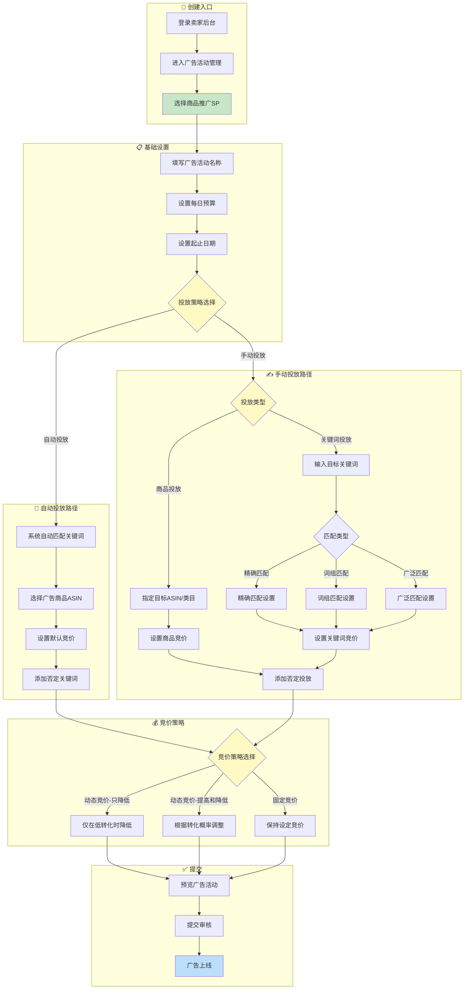
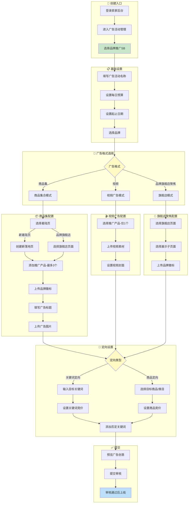
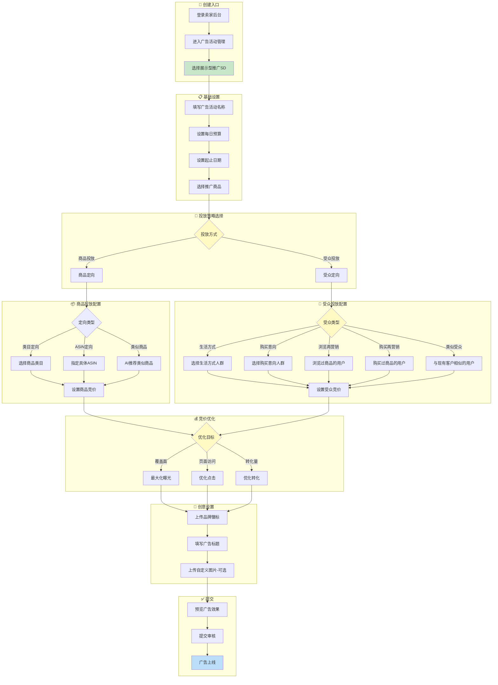
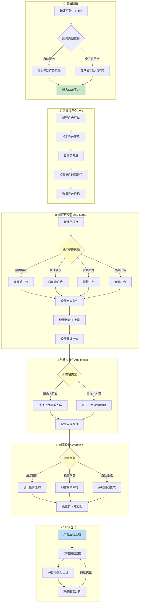
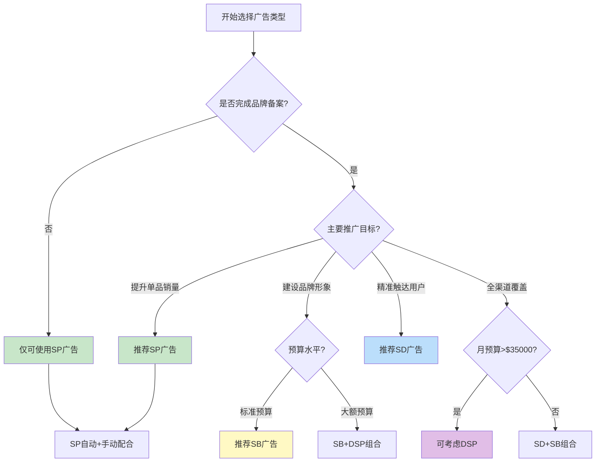

# 亚马逊广告类型标准流程	

> **所属数据域**: 广告域 (ads)	
> **版本**: v1.0	
> **创建日期**: 2026-01-22	
> **关联文档**: [06_P1_广告域完整梳理_v2.1.md](file:///d:/GoogleAntigravityProjects/datacenter%20document/output_LLM/数据域详情/数据域完整梳理_v2.0/06_P1_广告域完整梳理_v2.1.md)	

---

## 1. 广告类型概览	

亚马逊平台提供四种主要广告类型，分别针对不同的推广目标和营销场景：	

| 广告类型 | 英文全称             | 中文名称   | 核心目的             | 门槛要求          |
| -------- | -------------------- | ---------- | -------------------- | ----------------- |
| SP       | Sponsored Products   | 商品推广   | 提升单品曝光和销量   | 无特殊要求        |
| SB       | Sponsored Brands     | 品牌推广   | 品牌建设和多商品推广 | 需要品牌备案      |
| SD       | Sponsored Display    | 展示型推广 | 精准受众触达和再营销 | 需要品牌备案      |
| DSP      | Demand Side Platform | 需求方平台 | 全流域营销覆盖       | 需专业操作/高预算 |

---

## 2. SP商品推广 (Sponsored Products)	

### 2.1 SP广告特点	

- **目的**：推广单个商品，提升商品曝光和销量，特别适合新品推广	
- **展示位置**：搜索结果顶部/中间/底部、商品详情页（PC端和移动端）	
- **收费模式**：CPC（按点击付费）	
- **门槛**：无特殊要求，所有卖家可用	

### 2.2 SP广告创建流程图	

### 2.3 SP广告关键配置项	

<table>
    <thead>
        <tr>
            <th>配置阶段</th>
            <th>配置项</th>
            <th>说明</th>
            <th>建议值</th>
        </tr>
    </thead>
    <tbody>
        <tr>
            <td rowspan="3">基础设置</td>
            <td>活动名称</td>
            <td>广告活动标识</td>
            <td>采用"产品名_投放类型_日期"格式</td>
        </tr>
        <tr>
            <td>每日预算</td>
            <td>每日最大花费</td>
            <td>新品建议$10-50起步</td>
        </tr>
        <tr>
            <td>投放时间</td>
            <td>广告运行周期</td>
            <td>建议无结束日期持续投放</td>
        </tr>
        <tr>
            <td rowspan="3">投放设置</td>
            <td>投放策略</td>
            <td>自动/手动</td>
            <td>新品先自动后手动</td>
        </tr>
        <tr>
            <td>匹配类型</td>
            <td>关键词匹配方式</td>
            <td>精确>词组>广泛</td>
        </tr>
        <tr>
            <td>否定关键词</td>
            <td>排除不相关流量</td>
            <td>根据搜索词报告优化</td>
        </tr>
        <tr>
            <td rowspan="2">竞价设置</td>
            <td>默认竞价</td>
            <td>基础出价金额</td>
            <td>参考建议竞价范围</td>
        </tr>
        <tr>
            <td>广告位调整</td>
            <td>不同位置竞价调整</td>
            <td>搜索顶部可加价50-100%</td>
        </tr>
    </tbody>
</table>

---

## 3. SB品牌推广 (Sponsored Brands)	

### 3.1 SB广告特点	

- **目的**：提升品牌知名度、塑造品牌形象，推广整个产品线	
- **展示位置**：搜索结果页面顶部/旁边/中间，商品详情页	
- **展示内容**：品牌Logo、自定义标题、最多3个商品	
- **收费模式**：CPC（按点击付费）	
- **门槛**：需完成亚马逊品牌备案	

### 3.2 SB广告创建流程图	

### 3.3 SB广告格式对比	

| 广告格式       | 推广商品数 | 落地页          | 创意要求       | 适用场景          |
| -------------- | ---------- | --------------- | -------------- | ----------------- |
| 商品集         | 最多3个    | 新落地页/旗舰店 | 徽标+标题+图片 | 多商品联合推广    |
| 品牌旗舰店聚焦 | 旗舰店展示 | 品牌旗舰店      | 徽标           | 品牌形象建设      |
| 视频           | 仅1个      | 商品详情页      | 视频素材       | 产品演示/功能展示 |

---

## 4. SD展示型推广 (Sponsored Display)	

### 4.1 SD广告特点	

- **目的**：精准受众触达，支持再营销和站外投放	
- **展示位置**：站内（搜索结果、详情页、评论页）+ 站外渠道	
- **智能化**：利用AI分析用户购物行为进行精准投放	
- **收费模式**：CPC/CPM（按点击或展示付费）	
- **门槛**：需完成亚马逊品牌备案	

### 4.2 SD广告创建流程图	

### 4.3 SD受众类型详解	

<table>
    <thead>
        <tr>
            <th>编号</th>
            <th>受众类型</th>
            <th>英文名称</th>
            <th>定义</th>
            <th>适用场景</th>
        </tr>
    </thead>
    <tbody>
        <tr>
            <td>1</td>
            <td>生活方式</td>
            <td>Lifestyle</td>
            <td>基于兴趣和生活方式标签</td>
            <td>品牌知名度提升</td>
        </tr>
        <tr>
            <td>2</td>
            <td>购买意向</td>
            <td>In-market</td>
            <td>近期有购买意向的用户</td>
            <td>转化提升</td>
        </tr>
        <tr>
            <td>3</td>
            <td>浏览再营销</td>
            <td>Views Remarketing</td>
            <td>浏览过商品但未购买</td>
            <td>挽回流失客户</td>
        </tr>
        <tr>
            <td>4</td>
            <td>购买再营销</td>
            <td>Purchases Remarketing</td>
            <td>购买过商品的客户</td>
            <td>复购/交叉销售</td>
        </tr>
        <tr>
            <td>5</td>
            <td>类似受众</td>
            <td>Lookalike</td>
            <td>与现有客户画像相似</td>
            <td>拓展新客群</td>
        </tr>
    </tbody>
</table>

---

## 5. DSP需求方平台 (Amazon DSP)	

### 5.1 DSP广告特点	

- **目的**：全流域营销，覆盖站内外广泛受众	
- **展示位置**：亚马逊站内外、第三方网站、移动应用、视频平台	
- **技术特点**：程序化广告购买，千人千面展示	
- **收费模式**：CPM为主（按展示付费）	
- **门槛**：需专业操作或广告顾问，通常有最低预算要求（约$35,000+）	

### 5.2 DSP广告创建流程图	

### 5.3 DSP与其他广告类型差异	

| 对比维度   | SP/SB/SD             | DSP                   |
| ---------- | -------------------- | --------------------- |
| 操作平台   | 卖家后台广告控制台   | 独立DSP平台           |
| 购买方式   | 手动设置             | 程序化购买            |
| 投放范围   | 主要站内             | 站内+站外全渠道       |
| 定向精度   | 关键词/商品/基础受众 | 丰富的行为数据+AI定向 |
| 预算门槛   | 低（几美元起）       | 高（通常$35,000+）    |
| 操作复杂度 | 较低                 | 专业级                |
| 适用阶段   | 日常销售推广         | 品牌建设/大促营销     |

---

## 6. 四种广告类型综合对比	

### 6.1 核心差异对比表	

<table>
    <thead>
        <tr>
            <th>对比维度</th>
            <th>SP商品推广</th>
            <th>SB品牌推广</th>
            <th>SD展示型推广</th>
            <th>DSP</th>
        </tr>
    </thead>
    <tbody>
        <tr>
            <td>核心目的</td>
            <td>单品销量</td>
            <td>品牌曝光</td>
            <td>精准再营销</td>
            <td>全流域覆盖</td>
        </tr>
        <tr>
            <td>品牌备案</td>
            <td>不需要</td>
            <td>需要</td>
            <td>需要</td>
            <td>需要</td>
        </tr>
        <tr>
            <td>展示位置</td>
            <td>搜索结果+详情页</td>
            <td>搜索顶部+详情页</td>
            <td>站内+站外</td>
            <td>全渠道</td>
        </tr>
        <tr>
            <td>投放策略</td>
            <td>自动/手动关键词</td>
            <td>关键词/商品定向</td>
            <td>商品/受众定向</td>
            <td>程序化+AI</td>
        </tr>
        <tr>
            <td>收费模式</td>
            <td>CPC</td>
            <td>CPC</td>
            <td>CPC/CPM</td>
            <td>CPM为主</td>
        </tr>
        <tr>
            <td>预算门槛</td>
            <td>低</td>
            <td>中</td>
            <td>中</td>
            <td>高</td>
        </tr>
        <tr>
            <td>操作难度</td>
            <td>★☆☆☆☆</td>
            <td>★★☆☆☆</td>
            <td>★★★☆☆</td>
            <td>★★★★★</td>
        </tr>
        <tr>
            <td>适用阶段</td>
            <td>新品/日常</td>
            <td>品牌建设期</td>
            <td>精细化运营期</td>
            <td>成熟品牌</td>
        </tr>
    </tbody>
</table>

### 6.2 广告类型选择决策树	

### 6.3 流程步骤数量对比	

| 广告类型 | 核心步骤数 | 预计创建时间 | 审核时间   |
| -------- | ---------- | ------------ | ---------- |
| SP       | 5-7步      | 5-10分钟     | 通常即时   |
| SB       | 8-10步     | 15-20分钟    | 24-72小时  |
| SD       | 7-9步      | 10-15分钟    | 24-48小时  |
| DSP      | 10-15步    | 30分钟+      | 视情况而定 |

---

## 7. 最佳实践建议	

### 7.1 新卖家广告策略	

1. **起步阶段**：从SP自动广告开始，收集关键词数据	
2. **优化阶段**：根据搜索词报告，转移高效词到SP手动广告	
3. **扩展阶段**：完成品牌备案后，增加SB广告提升品牌曝光	
4. **进阶阶段**：使用SD广告进行精准再营销	

### 7.2 成熟卖家广告组合	

| 广告类型 | 预算占比建议  | 主要用途           |
| -------- | ------------- | ------------------ |
| SP       | 50-60%        | 日常销售主力       |
| SB       | 15-20%        | 品牌曝光和新客获取 |
| SD       | 15-20%        | 再营销和竞品防守   |
| DSP      | 5-10%（可选） | 大促期间全渠道覆盖 |

---

## 更新记录	

| 版本 | 日期       | 更新内容                                                           |
| ---- | ---------- | ------------------------------------------------------------------ |
| v1.0 | 2026-01-22 | 初始版本，按广告类型（SP/SB/SD/DSP）分别整理亚马逊后台标准广告流程 |
