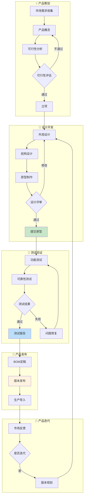

# 研发域完整梳理文档	

> **数据域**: 研发域 (rd)	
> **优先级**: P2（一般域）	
> **版本**: v2.0	
> **创建日期**: 2026-01-20	
> **负责人**: 王苗苗	
> **分析部门**: 流通分析	

---

## 1. 域定义与业务全景	

### 1.1 域定义	

研发域覆盖产品从**设计到迭代的全生命周期研发数据**，包括原型设计、测试验证、产品迭代和BOM管理，是产品创新的数据基础。	

### 1.2 业务范围	

```
研发域核心：产品研发全生命周期管理
├── 产品策划
│   ├── 市场需求分析
│   ├── 产品定义
│   └── 可行性评估
├── 设计开发
│   ├── 外观设计
│   ├── 结构设计
│   ├── 原型制作
│   └── 设计评审
├── 测试验证
│   ├── 功能测试
│   ├── 可靠性测试
│   ├── 认证测试
│   └── 用户测试
├── 产品迭代
│   ├── 版本发布
│   ├── 问题修复
│   └── 功能增强
└── BOM管理
    ├── BOM结构
    ├── 物料清单
    └── 版本控制
```

### 1.3 与相关域的边界澄清	

| 业务场景 | 研发域职责 | 其他域职责 |
|----------|-----------|-----------|
| 新品上架 | 完成产品设计和BOM | 运营域负责链接上架 |
| 采购物料 | 提供BOM物料清单 | 供采域负责采购执行 |
| 生产制造 | 提供工艺标准 | 生产域负责生产执行 |
| 质量问题 | 参与设计改进 | 品控域负责质量检验 |

> **关键澄清**：研发域关注**产品设计和技术规格**，后续的采购、生产、销售由专属域负责。	

---

## 2. 业务流程图	



---

## 3. 业务过程定义	

### 3.1 业务流程→业务过程映射	

> **推导逻辑**：业务流程中的每个**可度量的关键事件节点**成为一个业务过程	

| 业务流程阶段 | 业务过程 | 英文名称 | 为什么是业务过程 |
|-------------|---------|----------|------------------|
| 设计开发 | 提交原型设计 | submit_prototype | 原型提交是可度量事件，有唯一原型ID |
| 测试验证 | 执行测试验证 | run_test | 每次测试是可度量事件，有测试结果 |
| 产品发布 | 发布产品迭代 | release_iteration | 版本发布是可度量事件，有版本号 |
| BOM管理 | 维护BOM | maintain_bom | BOM变更是可度量事件，有版本记录 |

### 3.2 业务过程详细定义	

<table>
    <thead>
        <tr>
            <th>序号</th>
            <th>业务过程</th>
            <th>英文名称</th>
            <th>描述</th>
            <th>事实表类型</th>
            <th>粒度声明</th>
            <th>主键组成</th>
        </tr>
    </thead>
    <tbody>
        <tr>
            <td>1</td>
            <td>提交原型设计</td>
            <td>submit_prototype</td>
            <td>完成产品原型设计</td>
            <td>事务事实</td>
            <td>每一行代表一个产品原型的提交事件</td>
            <td>原型ID</td>
        </tr>
        <tr>
            <td>2</td>
            <td>执行测试验证</td>
            <td>run_test</td>
            <td>对产品进行测试验证</td>
            <td>事务事实</td>
            <td>每一行代表一次产品测试记录</td>
            <td>测试ID</td>
        </tr>
        <tr>
            <td>3</td>
            <td>发布产品迭代</td>
            <td>release_iteration</td>
            <td>发布产品新版本</td>
            <td>事务事实</td>
            <td>每一行代表一个产品迭代版本的发布</td>
            <td>产品ID + 版本号</td>
        </tr>
        <tr>
            <td>4</td>
            <td>维护BOM</td>
            <td>maintain_bom</td>
            <td>维护物料清单</td>
            <td>事务事实</td>
            <td>每一行代表一个物料在BOM中的记录</td>
            <td>BOM版本ID + 物料编码</td>
        </tr>
    </tbody>
</table>

---

## 4. 维度设计	

### 4.1 维度推导逻辑	

> **推导原则**：维度来源于回答"谁/什么/何时/何地/为何"等分析问题	

| 分析问题 | 对应维度 | 维度类型 |
|----------|---------|----------|
| 什么时候提交/测试/发布？ | 时间维度 | 公共维度 |
| 什么产品？ | 产品维度 | 公共维度 |
| 什么设计阶段？ | 设计阶段维度 | 专属维度 |
| 什么测试类型？ | 测试类型维度 | 专属维度 |
| 测试结果如何？ | 测试结果维度 | 专属维度 |
| 什么物料？ | 物料维度 | 专属维度 |

### 4.2 维度清单	

#### 公共维度	

| 维度 | 英文名称 | 使用场景 |
|------|----------|----------|
| ✓ 时间维度 | dim_date | 所有业务过程 |
| ✓ 产品维度 | dim_product | 产品迭代、BOM |
| ✓ 类目维度 | dim_category | 产品分类 |

#### 专属维度	

| 编号 | 维度名称 | 英文名称 | 主键 | 说明 |
|------|----------|----------|------|------|
| DIM-20 | 设计阶段维度 | dim_design_phase | design_phase_key | 概念、外观、结构、原型、量产 |
| DIM-21 | 测试类型维度 | dim_test_type | test_type_key | 功能测试、可靠性测试、认证测试、用户测试 |
| DIM-22 | 测试结果维度 | dim_test_result | test_result_key | 通过、失败、有条件通过 |
| DIM-23 | 物料类型维度 | dim_material_type | material_type_key | 原材料、零部件、包装材料、辅料 |

---

## 5. 事实表设计	

### 5.1 事实表清单	

| 编号 | 事实表名称 | 英文表名 | 类型 | 更新频率 | 说明 |
|------|-----------|----------|------|----------|------|
| FCT-26 | 原型设计事实表 | fct_rd_prototype | 事务事实 | 日 | 记录原型提交 |
| FCT-27 | 测试验证事实表 | fct_rd_test | 事务事实 | 日 | 记录测试执行 |
| FCT-28 | 产品迭代事实表 | fct_rd_iteration | 事务事实 | 周 | 记录版本发布 |
| FCT-29 | BOM变更事实表 | fct_rd_bom_change | 事务事实 | 日 | 记录BOM变更 |
| FCT-30 | BOM快照表 | fct_rd_bom_snapshot | 周期快照 | 月 | 每月BOM结构快照 |

### 5.2 度量指标	

| 指标名称 | 指标说明 | 聚合方式 | 来源事实表 |
|----------|----------|----------|-----------|
| 原型数 | 原型设计总数 | SUM | fct_rd_prototype |
| 设计周期 | 平均设计周期天数 | AVG | fct_rd_prototype |
| 测试数 | 测试执行总数 | SUM | fct_rd_test |
| 测试通过率 | 测试通过比例 | AVG | fct_rd_test |
| 一次通过率 | 首次测试通过比例 | AVG | fct_rd_test |
| 迭代数 | 产品迭代版本数 | SUM | fct_rd_iteration |
| 迭代周期 | 平均迭代周期天数 | AVG | fct_rd_iteration |
| BOM层级 | BOM平均层级深度 | AVG | fct_rd_bom_snapshot |
| 物料数 | BOM物料总数 | SUM | fct_rd_bom_snapshot |

---

## 6. 总线矩阵	

### 6.1 总线矩阵推导逻辑	

> **推导过程**：对每个业务过程，判断哪些维度可以用于分析	

### 6.2 研发域总线矩阵	

| 业务过程 | 时间 | 产品 | 类目 | 设计阶段 | 测试类型 | 测试结果 | 物料类型 |
|----------|------|------|------|----------|----------|----------|----------|
| 提交原型设计 | ✓ | ✓ | ✓ | ✓ | | | |
| 执行测试验证 | ✓ | ✓ | ✓ | | ✓ | ✓ | |
| 发布产品迭代 | ✓ | ✓ | ✓ | | | | |
| 维护BOM | ✓ | ✓ | | | | | ✓ |

### 6.3 总线矩阵解读	

- **时间维度**：所有业务过程都需要按时间分析研发进度	
- **产品维度**：核心分析维度，所有研发活动都围绕产品	
- **设计阶段维度**：用于原型设计，跟踪设计进度	
- **测试类型/结果维度**：用于测试验证，分析测试覆盖和通过情况	
- **物料类型维度**：用于BOM管理，分析物料构成	

---

## 7. 跨域关联说明	

### 7.1 与供采域的关联	

| 研发域事件 | 关联供采域事件 | 关联方式 |
|-----------|---------------|----------|
| BOM定稿 | 采购计划 | 物料清单传递 |
| BOM变更 | 采购调整 | 物料编码关联 |

### 7.2 与生产域的关联	

| 研发域事件 | 关联生产域事件 | 关联方式 |
|-----------|---------------|----------|
| 版本发布 | 工艺标准 | 产品ID + 版本号 |
| BOM定稿 | 生产准备 | BOM版本ID |

### 7.3 与品控域的关联	

| 研发域事件 | 关联品控域事件 | 关联方式 |
|-----------|---------------|----------|
| 测试报告 | 检验标准 | 产品规格传递 |
| 设计变更 | 检验调整 | 变更通知 |

---

## 更新记录	

| 版本 | 日期 | 更新内容 |
|------|------|----------|
| v1.0 | 2026-01-15 | 初始版本，简单梳理 |
| v1.1 | 2026-01-16 | 合并业务过程清单与粒度定义表格，添加负责人信息 |
| v2.0 | 2026-01-20 | 完整梳理版本，新增业务全景、业务流程图、维度推导逻辑、总线矩阵解读、跨域关联说明 |
