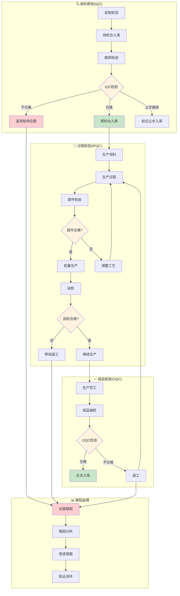

# 品控域完整梳理文档	

> **数据域**: 品控域 (qc)	
> **优先级**: P2（一般域）	
> **版本**: v2.1	
> **创建日期**: 2026-01-20	
> **更新日期**: 2026-01-20	
> **负责人**: 王苗苗	
> **分析部门**: 流通分析	

---

## 1. 域定义与业务全景	

### 1.1 域定义	

品控域覆盖**全链路质量管控的数据**，包括来料质检(IQC)、过程检验(IPQC)、成品检验(OQC)、缺陷追溯和质量成本核算。	

### 1.2 业务范围	

```
品控域核心：全链路质量管理
├── 来料质检(IQC) - 进货检验
│   ├── 触发位置：待检仓
│   ├── 通过后：转入原料仓
│   └── 不通过：退货给供应商
├── 过程检验(IPQC) - 生产过程质量检验
│   ├── 触发位置：生产线
│   ├── 通过后：继续生产
│   └── 不通过：返工/报废
├── 成品检验(OQC) - 出货前检验
│   ├── 触发位置：生产完工
│   ├── 通过后：转入主仓
│   └── 不通过：返工
├── 缺陷追溯 - 质量问题根因分析
└── 质量成本核算 - 质量相关成本统计
```

### 1.3 检验节点与仓库关联	

| 检验类型 | 触发位置 | 触发条件 | 通过后去向 | 不通过处理 |
|----------|---------|----------|-----------|-----------|
| IQC来料检验 | 待检仓 | 采购到货 | 原料仓 | 退货给供应商 |
| IPQC过程检验 | 生产线 | 生产过程中 | 继续生产 | 返工/报废 |
| OQC成品检验 | 质检区 | 生产完工 | 主仓 | 返工 |

### 1.4 与相关域的边界澄清	

| 业务场景 | 品控域职责 | 其他域职责 |
|----------|-----------|-----------|-
| 来料检验 | 执行IQC检验，记录检验结果 | 供采域通知收货，库存域记录仓库变动 |
| 过程检验 | 执行IPQC检验，记录检验结果 | 生产域触发检验需求 |
| 成品检验 | 执行OQC检验，记录检验结果 | 库存域记录主仓入库 |
| 质量问题处理 | 记录缺陷、追溯原因 | 研发域进行设计改进 |

---

## 2. 业务流程图	



---

## 3. 业务过程定义	

### 3.1 业务流程→业务过程映射	

> **推导逻辑**：业务流程中的每个**可度量的关键检验节点**成为一个业务过程	

| 业务流程阶段 | 业务过程 | 英文名称 | 为什么是业务过程 |
|-------------|---------|----------|-----------------|
| 来料检验 | 来料质检 | iqc_check | IQC是可度量事件，有检验单号和结果 |
| 过程检验 | 首件检验 | first_article | 首件检验是关键质量控制点 |
| 过程检验 | 巡回检验 | patrol_check | 巡检是周期性可度量事件 |
| 成品检验 | 成品检验 | oqc_check | OQC是可度量事件，有检验单号和结果 |
| 缺陷管理 | 缺陷追溯 | trace_defect | 缺陷追溯是可度量事件，有缺陷ID |
| 成本核算 | 核算质量成本 | calc_quality_cost | 周期性汇总质量相关成本 |

### 3.2 业务过程详细定义	

<table>
    <thead>
        <tr>
            <th>序号</th>
            <th>业务过程</th>
            <th>英文名称</th>
            <th>描述</th>
            <th>事实表类型</th>
            <th>粒度声明</th>
            <th>主键组成</th>
        </tr>
    </thead>
    <tbody>
        <tr>
            <td>1</td>
            <td>来料质检</td>
            <td>iqc_check</td>
            <td>对来料进行进货检验（待检仓→原料仓）</td>
            <td>事务事实</td>
            <td>一批来料的检验记录</td>
            <td>检验单号</td>
        </tr>
        <tr>
            <td>2</td>
            <td>首件检验</td>
            <td>first_article</td>
            <td>生产首件检验</td>
            <td>事务事实</td>
            <td>一次首件检验记录</td>
            <td>工单号 + 首件检验ID</td>
        </tr>
        <tr>
            <td>3</td>
            <td>巡回检验</td>
            <td>patrol_check</td>
            <td>生产过程中巡回质量检验</td>
            <td>事务事实</td>
            <td>一次巡检记录</td>
            <td>巡检单号</td>
        </tr>
        <tr>
            <td>4</td>
            <td>成品检验</td>
            <td>oqc_check</td>
            <td>成品出货前检验（生产→主仓）</td>
            <td>事务事实</td>
            <td>一批成品的出货检验记录</td>
            <td>检验单号</td>
        </tr>
        <tr>
            <td>5</td>
            <td>缺陷追溯</td>
            <td>trace_defect</td>
            <td>追溯质量缺陷原因</td>
            <td>事务事实</td>
            <td>一个质量缺陷的追溯记录</td>
            <td>缺陷ID</td>
        </tr>
        <tr>
            <td>6</td>
            <td>核算质量成本</td>
            <td>calc_quality_cost</td>
            <td>核算质量相关成本</td>
            <td>周期快照</td>
            <td>某月某产品线的质量成本</td>
            <td>产品线ID + 年月</td>
        </tr>
    </tbody>
</table>

---

## 4. 维度设计	

### 4.1 维度推导逻辑	

| 分析问题 | 对应维度 | 维度类型 |
|----------|---------|----------|
| 什么时候检验？ | 时间维度 | 公共维度 |
| 检验什么产品？ | 产品维度 | 公共维度 |
| 来料来自哪个供应商？ | 供应商维度 | 公共维度 |
| 什么类型的检验？ | 检验类型维度 | 专属维度 |
| 什么类型的缺陷？ | 缺陷类型维度 | 专属维度 |
| 质量等级如何？ | 质量等级维度 | 专属维度 |
| 检验结果如何？ | 检验结果维度 | 专属维度 |
| 在哪个仓库/产线？ | 检验位置维度 | 专属维度 |

#### 公共维度	

| 维度 | 英文名称 | 使用场景 |
|------|----------|----------|
| ✓ 时间维度 | dim_date | 所有业务过程 |
| ✓ 产品维度 | dim_product | 所有检验过程 |
| ✓ 供应商维度 | dim_supplier | 来料质检 |

#### 专属维度	

| 编号 | 维度名称 | 英文名称 | 主键 | 说明 |
|------|----------|----------|------|------|
| DIM-33 | 检验类型维度 | dim_inspection_type | type_key | IQC/IPQC首件/IPQC巡检/OQC |
| DIM-34 | 缺陷类型维度 | dim_defect_type | defect_type_key | 外观缺陷、尺寸超差、功能异常、包装破损等 |
| DIM-35 | 质量等级维度 | dim_quality_level | level_key | A级（优）、B级（良）、C级（合格）、D级（不合格） |
| DIM-36 | 检验结果维度 | dim_inspection_result | result_key | 合格、不合格、让步接收、待复检 |
| DIM-37 | 检验位置维度 | dim_inspection_location | location_key | 待检仓、生产线、质检区 |

---

## 5. 事实表设计	

### 5.1 事实表清单	

| 编号 | 事实表名称 | 英文表名 | 类型 | 更新频率 | 说明 |
|------|-----------|----------|------|----------|------|
| FCT-39 | 来料检验事实表 | fct_qc_iqc | 事务事实 | 日 | 记录IQC（待检仓→原料仓） |
| FCT-40 | 首件检验事实表 | fct_qc_first_article | 事务事实 | 日 | 记录首件检验 |
| FCT-41 | 巡回检验事实表 | fct_qc_patrol | 事务事实 | 日 | 记录巡检 |
| FCT-42 | 成品检验事实表 | fct_qc_oqc | 事务事实 | 日 | 记录OQC（生产→主仓） |
| FCT-43 | 缺陷追溯事实表 | fct_qc_defect | 事务事实 | 日 | 记录缺陷及追溯 |
| FCT-44 | 质量成本快照表 | fct_qc_cost_monthly | 周期快照 | 月 | 每月质量成本 |

### 5.2 度量指标	

| 指标名称 | 指标说明 | 聚合方式 | 来源事实表 |
|----------|----------|----------|-----------|
| IQC检验批次 | 来料检验批次数 | SUM | fct_qc_iqc |
| IQC合格率 | 来料合格批次占比 | AVG | fct_qc_iqc |
| IQC不良率 | 来料不良批次占比 | AVG | fct_qc_iqc |
| 首件合格率 | 首件检验一次通过率 | AVG | fct_qc_first_article |
| 巡检次数 | 巡回检验总次数 | SUM | fct_qc_patrol |
| 巡检异常率 | 巡检发现异常比例 | AVG | fct_qc_patrol |
| OQC检验批次 | 成品检验批次数 | SUM | fct_qc_oqc |
| OQC合格率 | 成品合格批次占比 | AVG | fct_qc_oqc |
| OQC不良率 | 成品不良批次占比 | AVG | fct_qc_oqc |
| 缺陷数 | 缺陷总数 | SUM | fct_qc_defect |
| 质量成本 | 质量相关成本总额 | SUM | fct_qc_cost_monthly |
| 返工成本 | 返工相关成本 | SUM | fct_qc_cost_monthly |

---

## 6. 总线矩阵	

### 6.1 品控域总线矩阵	

| 业务过程 | 时间 | 产品 | 供应商 | 检验类型 | 缺陷类型 | 质量等级 | 检验结果 | 检验位置 |
|----------|------|------|--------|----------|----------|----------|----------|----------|
| 来料质检 | ✓ | ✓ | ✓ | ✓ | ✓ | ✓ | ✓ | ✓ |
| 首件检验 | ✓ | ✓ | | ✓ | ✓ | | ✓ | ✓ |
| 巡回检验 | ✓ | ✓ | | ✓ | ✓ | | ✓ | ✓ |
| 成品检验 | ✓ | ✓ | | ✓ | ✓ | ✓ | ✓ | ✓ |
| 缺陷追溯 | ✓ | ✓ | ✓ | ✓ | ✓ | | | |
| 质量成本 | ✓ | ✓ | ✓ | | ✓ | | | |

### 6.2 总线矩阵解读	

- **检验类型维度**：核心分析维度，区分IQC/IPQC/OQC不同检验环节	
- **检验位置维度**：区分待检仓、生产线、质检区，支持位置相关分析	
- **缺陷类型维度**：支持缺陷分析和改进	
- **质量等级维度**：支持质量分级分析	

---

## 7. 跨域关联说明	

### 7.1 与供采域的关联	

| 品控域事件 | 关联供采域事件 | 关联方式 |
|-----------|---------------|----------|
| IQC检验 | 采购收货 | 收货单号关联 |
| IQC不合格退货 | 供应商退货 | 采购订单号关联 |
| 供应商质量评分 | 供应商评估 | 供应商ID关联 |

### 7.2 与库存域的关联	

| 品控域事件 | 关联库存域事件 | 关联方式 |
|-----------|---------------|----------|
| IQC合格 | 待检仓→原料仓 | 检验单号关联 |
| OQC合格 | 生产→主仓入库 | 检验单号关联 |
| IQC不合格 | 待检仓退货出库 | 检验单号关联 |

### 7.3 与生产域的关联	

| 品控域事件 | 关联生产域事件 | 关联方式 |
|-----------|---------------|----------|
| 首件检验 | 工单开工 | 工单号关联 |
| 巡回检验 | 工序执行 | 工单号+工序号关联 |
| OQC检验 | 工单完工 | 工单号关联 |
| IPQC不合格 | 工单返工 | 工单号关联 |

### 7.4 与研发域的关联	

| 品控域事件 | 关联研发域事件 | 关联方式 |
|-----------|---------------|----------|
| 缺陷分析 | 设计改进 | 产品ID关联 |
| 质量标准 | 产品规格 | 产品ID关联 |

---

## 更新记录	

| 版本 | 日期 | 更新内容 |
|------|------|----------|
| v1.0 | 2026-01-15 | 初始版本 |
| v1.1 | 2026-01-16 | 合并表格，添加负责人 |
| v2.0 | 2026-01-20 | 完整梳理版本 |
| v2.1 | 2026-01-20 | 明确检验节点位置：IQC在待检仓→原料仓环节，OQC在生产→主仓环节；新增检验位置维度、检验结果维度；细化IPQC为首件检验和巡回检验 |
