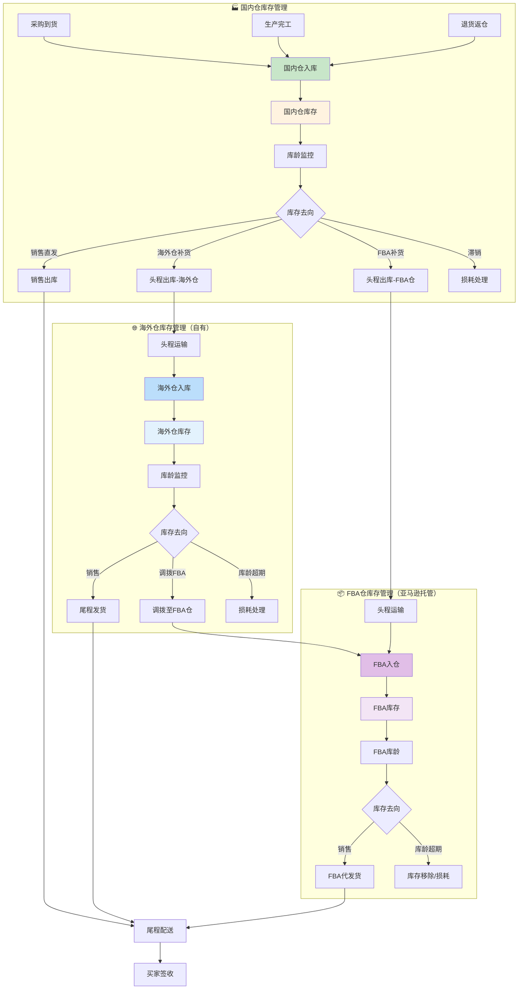

# 库存域完整梳理文档	

> **数据域**: 库存域 (inv)	
> **优先级**: P1（重要域）	
> **版本**: v2.1	
> **创建日期**: 2026-01-19	
> **更新日期**: 2026-01-20	
> **负责人**: 王苗苗	
> **分析部门**: 流通分析	

---

## 1. 域定义与业务全景	

### 1.1 域定义	

库存域覆盖**所有仓库类型**的库存全生命周期管理，包括入库、库存状态、库龄分析、出库、库存损耗等。	

### 1.2 仓库分类	

```
仓库分类
├── 自有仓（公司自主管理）
│   ├── 国内仓
│   │   ├── 工厂仓（生产成品存放）
│   │   └── 备货仓（采购物料/成品暂存）
│   └── 海外仓（海外自营仓库）
│       └── 自主管理的海外仓库
└── FBA仓（亚马逊托管仓库）
    └── 亚马逊运营中心，支付管理费
```

### 1.3 业务范围	

```
库存域核心：货物在各类仓库中的存储状态与流动轨迹
├── 国内仓库存
│   ├── 采购入库、生产入库
│   ├── 库存盘点、库龄监控
│   └── 销售出库、头程补货出库（→海外仓/FBA仓）
├── 海外仓库存（自有海外仓）
│   ├── 头程入库（从国内仓调拨）
│   ├── 库存盘点、库龄监控
│   └── 尾程发货出库（→买家）、调拨出库
└── FBA仓库存（亚马逊托管）
    ├── FBA入仓（从国内仓/海外仓调拨）
    ├── FBA库存、FBA库龄
    └── FBA代发货出库、库存移除
```

### 1.4 与履约域的边界澄清	

| 业务事件 | 库存域职责 | 履约域职责 |
|----------|-----------|-----------|
| 国内仓→海外仓 | 记录出库（国内仓）+ 入库（海外仓） | 头程运输过程跟踪 |
| 国内仓→FBA仓 | 记录出库（国内仓）+ 入库（FBA仓） | 头程运输过程跟踪 |
| 海外仓→FBA仓 | 记录出库（海外仓）+ 入库（FBA仓） | 调拨运输跟踪 |
| 海外仓→买家 | 记录出库（海外仓） | 尾程配送跟踪 |
| FBA仓→买家 | 记录出库（FBA仓） | 尾程配送（亚马逊配送） |
| 退货返仓 | 记录入库（目标仓） | 退货物流处理 |

> **关键澄清**：库存域关注**库存数量变动**（入库/出库/盘点），履约域关注**物流运输过程**（在途状态/时效）。	

---

## 2. 业务流程图	



---

## 3. 业务过程定义	

### 3.1 业务流程→业务过程映射	

> **推导逻辑**：业务流程中的每个**可度量的关键事件节点**成为一个业务过程	

| 业务流程阶段 | 业务过程 | 英文名称 | 为什么是业务过程 |
|-------------|---------|----------|-----------------|
| 入库管理 | 商品入库 | stock_in | 入库是一个可度量事件，有明确的时间点和数量 |
| 入库管理 | 海外仓入库 | overseas_inbound | 海外仓入库是入库的特殊类型，有头程单号关联 |
| 入库管理 | FBA入仓 | fba_inbound | FBA入仓有独特的属性（ShipmentID等） |
| 库存监控 | 库存盘点 | stock_check | 周期性快照，记录某时点的库存状态 |
| 库存监控 | 库龄分析 | inventory_aging | 周期性快照，记录库龄分布 |
| 出库管理 | 商品出库 | stock_out | 出库是一个可度量事件，有明确的时间点和数量 |
| 损耗管理 | 库存损耗 | stock_loss | 损耗是一个可度量事件，需要记录原因和金额 |

### 3.2 业务过程详细定义	

<table>
    <thead>
        <tr>
            <th>序号</th>
            <th>业务过程</th>
            <th>英文名称</th>
            <th>描述</th>
            <th>事实表类型</th>
            <th>粒度声明</th>
            <th>主键组成</th>
        </tr>
    </thead>
    <tbody>
        <tr>
            <td>1</td>
            <td>商品入库</td>
            <td>stock_in</td>
            <td>商品入库到仓库（含国内仓、海外仓、FBA仓）</td>
            <td>事务事实</td>
            <td>每一行代表一次入库单明细</td>
            <td>入库单号 + 行号</td>
        </tr>
        <tr>
            <td>2</td>
            <td>商品出库</td>
            <td>stock_out</td>
            <td>商品从仓库出库（含销售出库、调拨出库、头程补货）</td>
            <td>事务事实</td>
            <td>每一行代表一次出库单明细</td>
            <td>出库单号 + 行号</td>
        </tr>
        <tr>
            <td>3</td>
            <td>库存盘点</td>
            <td>stock_check</td>
            <td>定期盘点库存状态（所有仓库类型）</td>
            <td>周期快照</td>
            <td>每一行代表某仓库某商品某天的库存快照</td>
            <td>仓库ID + SKU + 日期</td>
        </tr>
        <tr>
            <td>4</td>
            <td>库龄分析</td>
            <td>inventory_aging</td>
            <td>分析库存周转和库龄分布</td>
            <td>周期快照</td>
            <td>每一行代表某仓库某商品某天的库龄分布</td>
            <td>仓库ID + SKU + 日期</td>
        </tr>
        <tr>
            <td>5</td>
            <td>库存损耗</td>
            <td>stock_loss</td>
            <td>记录库存损耗</td>
            <td>事务事实</td>
            <td>每一行代表一笔库存损耗记录</td>
            <td>损耗单号 + 行号</td>
        </tr>
    </tbody>
</table>

---

## 4. 维度设计	

### 4.1 维度推导逻辑	

> **推导原则**：维度来源于回答"谁/什么/何时/何地/为何"等分析问题	

| 分析问题 | 对应维度 | 维度类型 |
|----------|---------|----------|
| 什么时候入库/出库？ | 时间维度 | 公共维度 |
| 什么商品？ | 产品维度 | 公共维度 |
| 哪个仓库？ | 仓库维度 | 公共维度 |
| 什么类型的仓库？ | 仓库类型维度 | 专属维度 |
| 仓库位于哪个国家/地区？ | 仓库区域维度 | 专属维度 |
| 库存状态如何？ | 库存状态维度 | 专属维度 |
| 库龄多长？ | 库龄区间维度 | 专属维度 |
| 入库来源是什么？ | 入库类型维度 | 专属维度 |
| 出库去向是什么？ | 出库类型维度 | 专属维度 |
| 损耗原因是什么？ | 损耗原因维度 | 专属维度 |

### 4.2 维度清单	

#### 公共维度	

| 维度 | 英文名称 | 使用场景 |
|------|----------|----------|
| ✓ 时间维度 | dim_date | 所有业务过程 |
| ✓ 产品维度 | dim_product | 所有业务过程 |
| ✓ 变体维度 | dim_variant | 变体级库存管理 |
| ✓ 仓库维度 | dim_warehouse | 所有业务过程 |
| ✓ 供应商维度 | dim_supplier | 采购入库 |

#### 专属维度	

| 编号 | 维度名称 | 英文名称 | 主键 | 说明 |
|------|----------|----------|------|------|
| DIM-17 | 库龄区间维度 | dim_inventory_age | age_bucket_key | 0-30天、31-60天、61-90天、91-180天、181-270天、271+天 |
| DIM-18 | 库存状态维度 | dim_inventory_status | inv_status_key | 可售、不可售、预留、在途、锁定 |
| DIM-19 | 仓库类型维度 | dim_warehouse_type | warehouse_type_key | 国内仓、海外仓(自有)、FBA仓(托管)、第三方仓 |
| DIM-20 | 仓库区域维度 | dim_warehouse_region | region_key | 中国、美国、欧洲、日本等 |
| DIM-21 | 入库类型维度 | dim_inbound_type | inbound_type_key | 采购入库、生产入库、头程入库、调拨入库、退货返仓 |
| DIM-22 | 出库类型维度 | dim_outbound_type | outbound_type_key | 销售出库、头程补货、调拨出库、损耗出库 |
| DIM-23 | 损耗原因维度 | dim_loss_reason | loss_reason_key | 库龄超期、破损、丢失、盘亏 |

---

## 5. 事实表设计	

### 5.1 事实表清单	

| 编号 | 事实表名称 | 英文表名 | 类型 | 更新频率 | 说明 |
|------|-----------|----------|------|----------|------|
| FCT-10 | 入库事实表 | fct_inv_stock_in | 事务事实 | 日 | 记录每笔入库事件（含所有仓库类型） |
| FCT-11 | 出库事实表 | fct_inv_stock_out | 事务事实 | 日 | 记录每笔出库事件（含所有出库类型） |
| FCT-12 | 库存日快照表 | fct_inv_stock_daily | 周期快照 | 日 | 每日库存余额快照（分仓库） |
| FCT-13 | 库龄日快照表 | fct_inv_aging_daily | 周期快照 | 日 | 每日库龄分布快照（分仓库） |
| FCT-14 | 损耗事实表 | fct_inv_stock_loss | 事务事实 | 日 | 记录每笔损耗事件 |
| FCT-15 | 调拨事实表 | fct_inv_transfer | 事务事实 | 日 | 记录仓库间调拨（含头程补货） |

### 5.2 度量指标	

| 指标名称 | 指标说明 | 聚合方式 | 来源事实表 |
|----------|----------|----------|-----------|
| 入库数量 | 入库商品总数 | SUM | fct_inv_stock_in |
| 入库金额 | 入库商品总金额 | SUM | fct_inv_stock_in |
| 出库数量 | 出库商品总数 | SUM | fct_inv_stock_out |
| 出库金额 | 出库商品总金额 | SUM | fct_inv_stock_out |
| 库存数量 | 期末库存数量（半可加） | SUM | fct_inv_stock_daily |
| 库存金额 | 期末库存金额（半可加） | SUM | fct_inv_stock_daily |
| 国内仓库存 | 国内仓库存数量 | SUM | fct_inv_stock_daily |
| 海外仓库存 | 海外仓库存数量 | SUM | fct_inv_stock_daily |
| FBA库存 | FBA仓库存数量 | SUM | fct_inv_stock_daily |
| 库龄天数 | 平均库龄天数 | AVG | fct_inv_aging_daily |
| 滞销率 | 滞销商品占比 | AVG | fct_inv_aging_daily |
| 损耗数量 | 损耗商品总数 | SUM | fct_inv_stock_loss |
| 损耗金额 | 损耗商品总金额 | SUM | fct_inv_stock_loss |
| 调拨数量 | 调拨商品总数 | SUM | fct_inv_transfer |

---

## 6. 总线矩阵	

### 6.1 库存域总线矩阵	

| 业务过程 | 时间 | 产品 | 仓库 | 仓库类型 | 仓库区域 | 库存状态 | 库龄区间 | 入库类型 | 出库类型 | 损耗原因 | 供应商 |
|----------|------|------|------|----------|----------|----------|----------|----------|----------|----------|--------|
| 商品入库 | ✓ | ✓ | ✓ | ✓ | ✓ | | | ✓ | | | ✓ |
| 商品出库 | ✓ | ✓ | ✓ | ✓ | ✓ | | | | ✓ | | |
| 库存盘点 | ✓ | ✓ | ✓ | ✓ | ✓ | ✓ | | | | | |
| 库龄分析 | ✓ | ✓ | ✓ | ✓ | ✓ | | ✓ | | | | |
| 库存损耗 | ✓ | ✓ | ✓ | ✓ | ✓ | | | | | ✓ | |

### 6.2 总线矩阵解读	

- **仓库类型维度**：区分国内仓、海外仓(自有)、FBA仓(托管)，是核心分析维度	
- **仓库区域维度**：区分不同国家/地区的仓库，支持区域库存分析	
- **入库类型维度**：区分采购入库、生产入库、头程入库、调拨入库、退货返仓	
- **出库类型维度**：区分销售出库、头程补货、调拨出库、损耗出库	

---

## 7. 跨域关联说明	

### 7.1 与履约域的关联	

| 库存域事件 | 关联履约域事件 | 关联方式 |
|-----------|---------------|----------|
| 头程补货出库（国内仓） | 头程运输发货 | 头程单号关联 |
| 头程入库（海外仓/FBA仓） | 头程运输签收 | 头程单号/ShipmentID关联 |
| 销售出库 | 尾程发货 | 物流单号关联 |
| 退货入库 | 处理退货完成 | 退货单号关联 |

### 7.2 与交易域的关联	

| 库存域事件 | 关联交易域事件 | 关联方式 |
|-----------|---------------|----------|
| 销售出库 | 订单发货 | 订单号关联 |
| 库存预留 | 订单创建 | 订单号+SKU关联 |

---

## 更新记录	

| 版本 | 日期 | 更新内容 |
|------|------|----------|
| v2.0 | 2026-01-19 | 初始版本 |
| v2.1 | 2026-01-20 | 修正仓库分类：自有仓细分为国内仓和海外仓，新增仓库区域维度、出库类型维度，更新业务流程图 |
