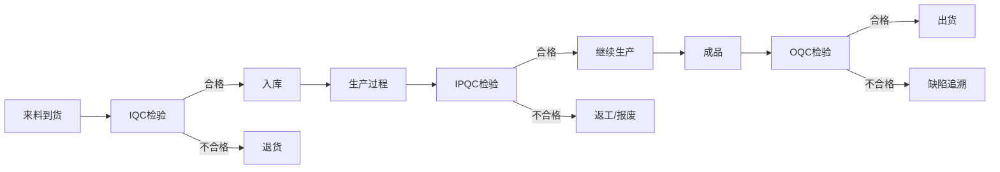

# 品控域完整梳理文档	

> **数据域**: 品控域 (qc)	
> **优先级**: P2（一般域）	
> **版本**: v2.0	
> **创建日期**: 2026-01-20	
> **负责人**: 王苗苗	
> **分析部门**: 流通分析	

---

## 1. 域定义与业务全景	

### 1.1 域定义	

品控域覆盖**全链路质量管控的数据**，包括来料质检(IQC)、过程检验(IPQC)、成品检验(OQC)、缺陷追溯和质量成本核算。	

### 1.2 业务范围	

```
品控域核心：全链路质量管理
├── 来料质检(IQC) - 进货检验
├── 过程检验(IPQC) - 生产过程质量检验
├── 成品检验(OQC) - 出货前检验
├── 缺陷追溯 - 质量问题根因分析
└── 质量成本核算 - 质量相关成本统计
```

### 1.3 与相关域的边界澄清	

| 业务场景 | 品控域职责 | 其他域职责 |
|----------|-----------|-----------|
| 来料检验 | 执行IQC检验 | 供采域通知收货 |
| 过程检验 | 执行IPQC检验 | 生产域触发检验需求 |
| 成品检验 | 执行OQC检验 | 库存域入库后状态 |

---

## 2. 业务流程图	



---

## 3. 业务过程定义	

<table>
    <thead>
        <tr><th>序号</th><th>业务过程</th><th>英文名称</th><th>描述</th><th>事实表类型</th><th>粒度声明</th><th>主键组成</th></tr>
    </thead>
    <tbody>
        <tr><td>1</td><td>来料质检</td><td>iqc_check</td><td>对来料进行进货检验</td><td>事务事实</td><td>一批来料的检验记录</td><td>检验单号</td></tr>
        <tr><td>2</td><td>过程检验</td><td>ipqc_check</td><td>生产过程中质量检验</td><td>事务事实</td><td>一次生产过程检验记录</td><td>检验单号</td></tr>
        <tr><td>3</td><td>成品检验</td><td>oqc_check</td><td>成品出货前检验</td><td>事务事实</td><td>一批成品的出货检验记录</td><td>检验单号</td></tr>
        <tr><td>4</td><td>缺陷追溯</td><td>trace_defect</td><td>追溯质量缺陷原因</td><td>事务事实</td><td>一个质量缺陷的追溯记录</td><td>缺陷ID</td></tr>
        <tr><td>5</td><td>核算质量成本</td><td>calc_quality_cost</td><td>核算质量相关成本</td><td>周期快照</td><td>某月某产品线的质量成本</td><td>产品线ID + 年月</td></tr>
    </tbody>
</table>

---

## 4. 维度设计	

#### 公共维度	
| 维度 | 英文名称 | 使用场景 |
|------|----------|----------|
| ✓ 时间维度 | dim_date | 所有业务过程 |
| ✓ 产品维度 | dim_product | 所有检验过程 |
| ✓ 供应商维度 | dim_supplier | 来料质检 |

#### 专属维度	
| 编号 | 维度名称 | 英文名称 | 说明 |
|------|----------|----------|------|
| DIM-33 | 检验类型维度 | dim_inspection_type | IQC/IPQC/OQC |
| DIM-34 | 缺陷类型维度 | dim_defect_type | 缺陷类型分类 |
| DIM-35 | 质量等级维度 | dim_quality_level | 质量等级(A/B/C) |

---

## 5. 事实表设计	

| 编号 | 事实表名称 | 英文表名 | 类型 | 说明 |
|------|-----------|----------|------|------|
| FCT-39 | 来料检验事实表 | fct_qc_iqc | 事务事实 | 记录IQC |
| FCT-40 | 过程检验事实表 | fct_qc_ipqc | 事务事实 | 记录IPQC |
| FCT-41 | 成品检验事实表 | fct_qc_oqc | 事务事实 | 记录OQC |
| FCT-42 | 缺陷追溯事实表 | fct_qc_defect | 事务事实 | 记录缺陷 |

### 度量指标	
| 指标名称 | 聚合方式 | 来源事实表 |
|----------|----------|-----------|
| 检验数量 | SUM | 各检验事实表 |
| 合格率 | AVG | 各检验事实表 |
| 不良率 | AVG | 各检验事实表 |
| 缺陷数 | SUM | fct_qc_defect |
| 质量成本 | SUM | 质量成本快照 |

---

## 6. 总线矩阵	

| 业务过程 | 时间 | 产品 | 供应商 | 检验类型 | 缺陷类型 | 质量等级 |
|----------|------|------|--------|----------|----------|----------|
| 来料质检 | ✓ | ✓ | ✓ | ✓ | ✓ | ✓ |
| 过程检验 | ✓ | ✓ | | ✓ | ✓ | ✓ |
| 成品检验 | ✓ | ✓ | | ✓ | ✓ | ✓ |
| 缺陷追溯 | ✓ | ✓ | ✓ | | ✓ | |

---

## 7. 跨域关联说明	

| 品控域事件 | 关联域 | 关联事件 | 关联方式 |
|-----------|-------|----------|----------|
| IQC检验 | 供采域 | 采购收货 | 收货单号 |
| IPQC检验 | 生产域 | 工序完成 | 工单号 |
| OQC检验 | 库存域 | 成品入库 | 入库单号 |
| 缺陷分析 | 研发域 | 设计改进 | 产品ID |

---

## 更新记录	

| 版本 | 日期 | 更新内容 |
|------|------|----------|
| v1.0 | 2026-01-15 | 初始版本 |
| v1.1 | 2026-01-16 | 合并表格，添加负责人 |
| v2.0 | 2026-01-20 | 完整梳理版本 |
