# ⛓️ 16个数据域完整梳理项目计划书	

> **项目目标**: 将16个数据域详情文档从简单版(v1.1)升级为完整梳理版(v2.0)	
> **参考样本**: 库存域完整梳理_v2.0.md、履约域完整梳理_v2.0.md	
> **版本**: v1.1	
> **创建日期**: 2026-01-19	

---

## 1. 产物目录结构 (File System)	

```text
output_LLM/数据域详情/
├── README_v1.2.md                    # 更新后的索引文档
├── 完整梳理_v2.0/                    # ★ 完整梳理文档统一存放
│   ├── 交易域完整梳理_v2.0.md        # P0
│   ├── 运营域完整梳理_v2.0.md        # P0
│   ├── 库存域完整梳理_v2.0.md        # P1（已完成，需迁移）
│   ├── 履约域完整梳理_v2.0.md        # P1（已完成，需迁移）
│   ├── 促销域完整梳理_v2.0.md        # P1
│   ├── 广告域完整梳理_v2.0.md        # P1
│   ├── 研发域完整梳理_v2.0.md        # P2
│   ├── 供采域完整梳理_v2.0.md        # P2
│   ├── 生产域完整梳理_v2.0.md        # P2
│   ├── 品控域完整梳理_v2.0.md        # P2
│   ├── 市场域完整梳理_v2.0.md        # P3
│   ├── 客服域完整梳理_v2.0.md        # P3
│   ├── 财务域完整梳理_v2.0.md        # P3
│   ├── 客户域完整梳理_v2.0.md        # P3
│   ├── 政策域完整梳理_v2.0.md        # P3
│   └── 算法域完整梳理_v2.0.md        # P3
├── 01_交易域_trd_v1.1.md             # 简单版（保留）
├── 02_运营域_op_v1.1.md
├── ...（其他v1.1文件）
└── 过期文件/                         # 历史版本归档
```

---

## 2. 产物依赖流 (Artifact Flow)	

```mermaid
graph TD
    subgraph 输入依赖
        A[1.1 数据域定义表.md]
        B[库存域完整梳理_v2.0.md]
        C[履约域完整梳理_v2.0.md]
        D[现有域详情文档v1.1]
    end
    subgraph P0核心域
        E[交易域完整梳理_v2.0.md]
        F[运营域完整梳理_v2.0.md]
    end
    subgraph P1重要域
        G[促销域完整梳理_v2.0.md]
        H[广告域完整梳理_v2.0.md]
    end
    subgraph P2一般域
        I[研发域完整梳理_v2.0.md]
        J[供采域完整梳理_v2.0.md]
        K[生产域完整梳理_v2.0.md]
        L[品控域完整梳理_v2.0.md]
    end
    subgraph P3辅助域
        M[市场域完整梳理_v2.0.md]
        N[客服域完整梳理_v2.0.md]
        O[财务域完整梳理_v2.0.md]
        P[客户域完整梳理_v2.0.md]
        Q[政策域完整梳理_v2.0.md]
        R[算法域完整梳理_v2.0.md]
    end
    subgraph 最终产物
        S[README_v1.2.md]
    end
    A --> E & F & G & H & I & J & K & L & M & N & O & P & Q & R
    B & C --> E & F & G & H & I & J & K & L & M & N & O & P & Q & R
    D --> E & F & G & H & I & J & K & L & M & N & O & P & Q & R
    E & F & G & H & I & J & K & L & M & N & O & P & Q & R --> S
    style B fill:#c8e6c9
    style C fill:#c8e6c9
    style E fill:#fff3e0
    style F fill:#fff3e0
```



---

## 3. 文档结构模板	

每个完整梳理文档必须包含以下章节（基于库存域/履约域样本）：	

```markdown
# XX域完整梳理文档

> **数据域**: XX域 (xxx)
> **优先级**: Px
> **版本**: v2.0
> **创建日期**: 2026-01-19
> **负责人**: xxx
> **分析部门**: xxx

---

## 1. 域定义与业务全景
### 1.1 域定义
### 1.2 业务范围
### 1.3 与相关域的边界澄清（如适用）

---

## 2. 业务流程图
（Mermaid flowchart）

---

## 3. 业务过程定义
### 3.1 业务流程→业务过程映射
### 3.2 业务过程详细定义（HTML表格）

---

## 4. 维度设计
### 4.1 维度推导逻辑
### 4.2 维度清单
#### 公共维度
#### 专属维度

---

## 5. 事实表设计
### 5.1 事实表清单
### 5.2 度量指标

---

## 6. 总线矩阵
### 6.1 总线矩阵推导逻辑
### 6.2 XX域总线矩阵
### 6.3 总线矩阵解读

---

## 7. 跨域关联说明
### 7.1 与XX域的关联
### 7.2 与XX域的关联

---

## 更新记录

| 版本 | 日期 | 更新内容 |
|------|------|----------|
| v2.0 | 2026-01-19 | 完整梳理版本 |
```

---

## 4. 分步执行链 (Execution Chain)	

### 🟢 阶段一：P0 核心域梳理	

> *最高优先级，电商业务的基础*	

- [ ] **Step 1.1: 交易域完整梳理**	
    - 📥 **Input (依赖)**:	
        - `权威资料/1 项目背景/1.1 数据域定义表.md` (域定义)	
        - `output_LLM/数据域详情/完整梳理_v2.0/库存域完整梳理_v2.0.md` (结构模板)	
        - `output_LLM/数据域详情/01_交易域_trd_v1.1.md` (现有内容)	
    - 📤 **Output (产出)**: `output_LLM/数据域详情/完整梳理_v2.0/交易域完整梳理_v2.0.md`	
    - 💡 **执行逻辑**: 基于交易域业务（订单、支付、结算、评价），完善7个章节	
    - > **🤖 AI指令**: 参考 `库存域完整梳理_v2.0.md` 的结构，读取 `01_交易域_trd_v1.1.md` 中的现有内容，将交易域升级为完整梳理文档。重点补充：业务全景、业务流程图(Mermaid)、业务过程推导逻辑、维度推导逻辑、总线矩阵解读、跨域关联说明。	

- [ ] **Step 1.2: 运营域完整梳理**	
    - 📥 **Input (依赖)**:	
        - `权威资料/1 项目背景/1.1 数据域定义表.md`	
        - `output_LLM/数据域详情/完整梳理_v2.0/库存域完整梳理_v2.0.md`	
        - `output_LLM/数据域详情/02_运营域_op_v1.1.md`	
    - 📤 **Output (产出)**: `output_LLM/数据域详情/完整梳理_v2.0/运营域完整梳理_v2.0.md`	
    - 💡 **执行逻辑**: 基于运营域业务（店铺管理、链接管理、流量分析），完善7个章节	
    - > **🤖 AI指令**: 同上，重点关注账号/店铺/变体/链接的层级关系和流量分析的业务过程	

---

### 🟡 阶段二：P1 重要域梳理	

> *库存域和履约域已完成，剩余促销域和广告域*	

- [x] **Step 2.1: 库存域完整梳理** ✅ 已完成	
- [x] **Step 2.2: 履约域完整梳理** ✅ 已完成	

- [ ] **Step 2.3: 促销域完整梳理**	
    - 📥 **Input (依赖)**:	
        - `权威资料/1 项目背景/1.1 数据域定义表.md`	
        - `output_LLM/数据域详情/完整梳理_v2.0/库存域完整梳理_v2.0.md`	
        - `output_LLM/数据域详情/05_促销域_prm_v1.1.md`	
    - 📤 **Output (产出)**: `output_LLM/数据域详情/完整梳理_v2.0/促销域完整梳理_v2.0.md`	
    - 💡 **执行逻辑**: 基于促销域业务（促销活动、促销策略、促销效果），完善7个章节	
    - > **🤖 AI指令**: 重点关注促销类型（秒杀、优惠券、满减等）、促销与订单的关联	

- [ ] **Step 2.4: 广告域完整梳理**	
    - 📥 **Input (依赖)**:	
        - `权威资料/1 项目背景/1.1 数据域定义表.md`	
        - `output_LLM/数据域详情/完整梳理_v2.0/库存域完整梳理_v2.0.md`	
        - `output_LLM/数据域详情/06_广告域_ads_v1.1.md`	
    - 📤 **Output (产出)**: `output_LLM/数据域详情/完整梳理_v2.0/广告域完整梳理_v2.0.md`	
    - 💡 **执行逻辑**: 基于广告域业务（广告投放、关键词、展示点击、ACOS），完善7个章节	
    - > **🤖 AI指令**: 重点关注SP/SB/SD广告类型、广告漏斗、广告与订单归因	

---

### 🟠 阶段三：P2 一般域梳理	

> *供应链和生产相关的数据域*	

- [ ] **Step 3.1: 研发域完整梳理**	
    - 📥 **Input (依赖)**: 同上模式	
    - 📤 **Output (产出)**: `output_LLM/数据域详情/完整梳理_v2.0/研发域完整梳理_v2.0.md`	
    - 💡 **执行逻辑**: 基于研发域业务（原型设计、测试验证、产品迭代、BOM管理）	

- [ ] **Step 3.2: 供采域完整梳理**	
    - 📤 **Output (产出)**: `output_LLM/数据域详情/完整梳理_v2.0/供采域完整梳理_v2.0.md`	
    - 💡 **执行逻辑**: 基于供采域业务（采购计划、采购订单、供应商管理）	

- [ ] **Step 3.3: 生产域完整梳理**	
    - 📤 **Output (产出)**: `output_LLM/数据域详情/完整梳理_v2.0/生产域完整梳理_v2.0.md`	
    - 💡 **执行逻辑**: 基于生产域业务（产能规划、生产排产、工单执行）	

- [ ] **Step 3.4: 品控域完整梳理**	
    - 📤 **Output (产出)**: `output_LLM/数据域详情/完整梳理_v2.0/品控域完整梳理_v2.0.md`	
    - 💡 **执行逻辑**: 基于品控域业务（来料质检、过程检验、成品检验、缺陷追溯）	

---

### 🔴 阶段四：P3 辅助域梳理	

> *支持决策和业务优化的辅助数据域*	

- [ ] **Step 4.1: 市场域完整梳理**	
    - 📤 **Output (产出)**: `output_LLM/数据域详情/完整梳理_v2.0/市场域完整梳理_v2.0.md`	
    - 💡 **执行逻辑**: 基于市场域业务（市场调研、竞品分析、消费者洞察）	

- [ ] **Step 4.2: 客服域完整梳理**	
    - 📤 **Output (产出)**: `output_LLM/数据域详情/完整梳理_v2.0/客服域完整梳理_v2.0.md`	
    - 💡 **执行逻辑**: 基于客服域业务（客户咨询、投诉处理、工单管理）	

- [ ] **Step 4.3: 财务域完整梳理**	
    - 📤 **Output (产出)**: `output_LLM/数据域详情/完整梳理_v2.0/财务域完整梳理_v2.0.md`	
    - 💡 **执行逻辑**: 基于财务域业务（应收应付、利润核算、税务申报）	

- [ ] **Step 4.4: 客户域完整梳理**	
    - 📤 **Output (产出)**: `output_LLM/数据域详情/完整梳理_v2.0/客户域完整梳理_v2.0.md`	
    - 💡 **执行逻辑**: 基于客户域业务（分群画像、行为分析、复购策略）	

- [ ] **Step 4.5: 政策域完整梳理**	
    - 📤 **Output (产出)**: `output_LLM/数据域详情/完整梳理_v2.0/政策域完整梳理_v2.0.md`	
    - 💡 **执行逻辑**: 基于政策域业务（政策解析、规则比对、版本追踪）	

- [ ] **Step 4.6: 算法域完整梳理**	
    - 📤 **Output (产出)**: `output_LLM/数据域详情/完整梳理_v2.0/算法域完整梳理_v2.0.md`	
    - 💡 **执行逻辑**: 基于算法域业务（算法元数据、特征数据、结果指标）	

---

### 🟣 阶段五：整合与交付	

- [ ] **Step 5.1: 更新README索引**	
    - 📥 **Input (依赖)**: 所有完整梳理文档	
    - 📤 **Output (产出)**: `output_LLM/数据域详情/README_v1.2.md`	
    - 💡 **执行逻辑**: 更新索引，链接到所有完整梳理文档	

- [ ] **Step 5.2: 归档旧版文件**	
    - 📤 **Output (产出)**: 将v1.1文件移动到`过期文件/`目录	

- [ ] **Step 5.3: 创建Walkthrough**	
    - 📤 **Output (产出)**: `walkthrough.md`	
    - 💡 **执行逻辑**: 记录完成情况和验证结果	

---

## 5. 执行顺序汇总	

| 阶段 | 序号 | 数据域 | 优先级 | 状态 |
|------|------|--------|--------|------|
| 一 | 1 | 交易域 | P0 | 待执行 |
| 一 | 2 | 运营域 | P0 | 待执行 |
| 二 | 3 | 库存域 | P1 | ✅ 已完成 |
| 二 | 4 | 履约域 | P1 | ✅ 已完成 |
| 二 | 5 | 促销域 | P1 | 待执行 |
| 二 | 6 | 广告域 | P1 | 待执行 |
| 三 | 7 | 研发域 | P2 | 待执行 |
| 三 | 8 | 供采域 | P2 | 待执行 |
| 三 | 9 | 生产域 | P2 | 待执行 |
| 三 | 10 | 品控域 | P2 | 待执行 |
| 四 | 11 | 市场域 | P3 | 待执行 |
| 四 | 12 | 客服域 | P3 | 待执行 |
| 四 | 13 | 财务域 | P3 | 待执行 |
| 四 | 14 | 客户域 | P3 | 待执行 |
| 四 | 15 | 政策域 | P3 | 待执行 |
| 四 | 16 | 算法域 | P3 | 待执行 |

---

## 6. 注意事项	

> [!IMPORTANT]	
> **版本管理规则**	
> - 新文件存放路径：`output_LLM/数据域详情/完整梳理_v2.0/`	
> - 新文件命名：`XX域完整梳理_v2.0.md`	
> - 旧版v1.1文件保留在原位置	
> - 每个文件底部需包含更新记录表	

> [!TIP]	
> **跨域关联提示**	
> - 交易域与履约域、库存域关联密切	
> - 广告域与交易域、运营域关联密切	
> - 供采域与库存域、生产域关联密切	

---

## 更新记录	

| 版本 | 日期 | 更新内容 |
|------|------|----------|
| v1.0 | 2026-01-19 | 初始版本，基于流程架构师模板创建 |
| v1.1 | 2026-01-19 | 调整目录结构，新增完整梳理_v2.0子文件夹 |
